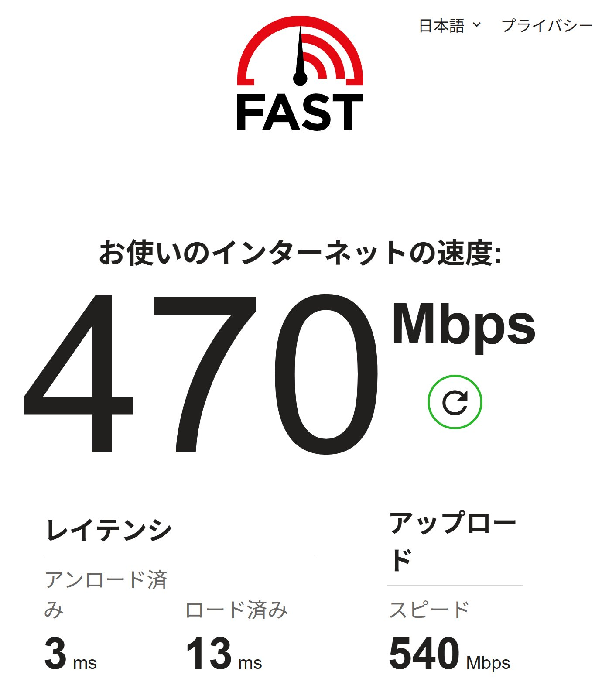
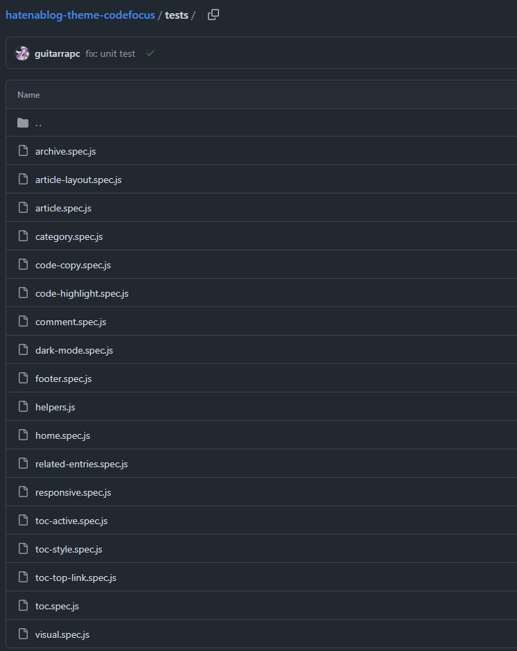

Kubernetesのダッシュボードは無数にありますが、Headlampというオープンソースのダッシュボードを触ってみて手触りよかったので紹介します。

EKSで使っているならCognito連携でOIDC認証もできて、Automodeで利用されているKarpneterの状態もプラグインで詳細に追いかけることができます。
また、イベントはPending Podが最優先で表示され、マップビューでクラスター全体のリソース展開状況を見たり、特定のノード、namespaceに絞り込めたり... これこれという感じなのが気に入りました。

きっかけは[Kubernetes公式ブログ](https://kubernetes.io/blog/2025/10/06/introducing-headlamp-plugin-for-karpenter/)でKarpenterプラグインの紹介記事を読んで興味を持ちました。公式ブログやXは割と面白いプロダクトを紹介してくれるので、気が向いたらチェックするとよいです。

[:contents]

## 誰向けのダッシュボード?

ダッシュボードと一口にいっても、対象ユーザーによって求められる機能は異なります。例えばKubernetes Adminはクラスター全体の状態を把握したい一方で、アプリケーション開発者は自分のアプリケーションに関連するリソースの管理だけに集中したいため欲しい情報の粒度が異なります。

HeadlampはKubernetesのリソース状態を詳細に追いかけたい開発者や運用担当者向けのダッシュボードです。
特に以下のようなニーズを持つユーザーに適していると感じます。

- Kubernetesのリソースを視覚的に管理したい開発者
- クラスターの状態をリアルタイムで監視したい運用担当者
- Podのイベントやログを迅速に確認したいエンジニア
- Karpenterなどのオートスケーリングツールの状態を詳細に把握したいユーザー

逆に、初心者向けのシンプルなダッシュボードを求めている場合や、特定のアプリケーションの監視に特化したダッシュボードを探している場合には、精細すぎるきらいがあります。
アプリケーションエンジニアに向いたダッシュボード的な存在としてArgoCDがあります。ArgoCDはアプリケーション単位でリソースをまとめてくれて、リソースの正常状態が確認でき、Deploymentのリスタートもできたりネットワーク的な図も見られるため、デプロイしたアプリケーション管理に特化したい場合にはこっちが適しています。

## Headlampの特徴

Headlampは以下のような特徴を持っています。

- Kubernetes-sigが管理しているオープンソースプロジェクト
- 利用形態を2種類から選択可能
  - デスクトップアプリケーションとしての利用
  - Kubernetesインクラスターでダッシュボードサーバーとして利用
- プラグインによる拡張性（Karpenterプラグインなど）
- リソースの詳細な表示と管理
- マップビューによるクラスター全体のリソース展開状況の可視化
- OIDC認証のサポート

特にさくっとルックアンドフィールで触りたいならデスクトップアプリケーション版がおすすめです。
公式サイトからダウンロードしてインストールするだけで、すぐにKubernetesクラスターに接続して利用できます。

## デスクトップアプリケーション版のHeadlamp

もし自分がKubernetesの閲覧可能なら、デスクトップ版Headlampを使うと何ができるかすぐにためすことができます。

### プラグインを利用する

https://github.com/headlamp-k8s/plugins/tree/main/karpenter

## インクラスター版のHeadlamp

インクラスター版はKubernetesクラスター内にHeadlampサーバーをデプロイして利用します。利用者各自がHeadlampをインストールせずとも利用できるので、チームでKubernetesクラスターを管理・利用している場合に便利です。

例を紹介するにあたり、EKSにてOIDC Provider ConfigurationでCognito連携させます。[^1]これでCognitoベースのOIDC認証が利用できます。OIDC認証のEKS構成時の要点は次の通りです。

- Cognitoユーザープールを作成
- Cognitoアプリクライアントを作成し、リダイレクトURIを設定
- Cognitoドメインを設定
- EKS OIDC用のIAMロールにOIDCプロバイダーを信頼するように設定
- EKSクラスターのOIDCプロバイダーにCognitoユーザープールのURLとIAMロールを紐づけ、Cognitoからemail/groups属性を取得可能に
- Headlamp Helmのvalues.yamlでoidc.configでOIDC設定
- HelmでHeadlampをデプロイする
- ClusterRoleBindingでCognitoグループあるいはCognitoユーザーと紐づけ
- Headlampログイン時にCognito認証画面が表示、ClusterRoleBinding紐づ権限でHeadlampからKubernetes操作

### Pulumiで構成する例

EKSのOIDC設定は公式ドキュメントや[Introducing OIDC identity provider authentication for Amazon EKS | AWS Blog](https://aws.amazon.com/jp/blogs/containers/introducing-oidc-identity-provider-authentication-amazon-eks/)が詳しく、大いに参考となります。以下はPulumiでEKSクラスターとCognito連携のOIDC認証を構成する例です。Terraformも同様なので、参考にしてください。

[公式をベース](https://headlamp.dev/docs/latest/installation/in-cluster/eks/)に、足りない箇所を補っています。

#### Cognitoユーザープールとアプリクライアントを作成する

```csharp
```


#### EKSクラスターのOIDCプロバイダー用IAMロールを作成する

```csharp
```

### EKSクラスターにOIDCプロバイダーを紐づける

```csharp
```


### HeadlampをHelmでデプロイする

https://artifacthub.io/packages/helm/headlamp/headlamp

```yaml
```

## Headlampクイックツアー


Signinを選ぶとOIDC認証画面が表示されます、Cognito連携しているならCognitoのログイン画面が出ます


## Pluginsで機能拡張

Headlampの最大の特徴はPluginsによる機能拡張です。[アーキテクチャ](https://headlamp.dev/docs/latest/development/architecture)の図にあるように、外部で動作させたNodeアプリケーションをプラグインとしてHeadlampから参照する仕組みになっています。

in-cluster版は、プラグインをクラスター内部で動作させる必要があるため、Helmのvalues.yamlでプラグインを指定します。

 <!-- image.png -->

デスクトップ版は、適当にPluginリポジトリをクローン、ローカルで`npm start`するが手っ取り早いです。

 <!-- image-1.png -->

ここではin-clusterでプラグインを導入する例を紹介しましょう。

### Helmのvalues.yamlでプラグインをインストールする

公式サイトの[Pluginページ](https://headlamp.dev/docs/latest/installation/in-cluster/#using-valuesyaml)を見ると、Helm Valuesでプラグインを指定する方法が紹介されています。
Pluginだけ別ファイルにしてHelm実行時に`cat`して割り当てる方法も載っていますが、ここではvalues.yamlに直接書き込む方法を紹介します。

利用できるプラグインは、Artifact Hubの[Headlamp Plugin](https://artifacthub.io/packages/search?kind=21&sort=relevance)で公開されています。
例えば、[Karpenter](https://artifacthub.io/packages/headlamp/karpenter-plugin/karpenter)プラグイン、[KEDA](https://artifacthub.io/packages/headlamp/headlamp-plugins/headlamp_keda)プラグイン、[Trivy](https://artifacthub.io/packages/headlamp/headlamp-trivy/headlamp_trivy)プラグイン、[AI Assistant](https://artifacthub.io/packages/headlamp/headlamp-plugins/headlamp_ai_assistant)プラグインを導入してみましょう。

```yaml
config:
  watchPlugins: true # ここをtrueにしないとプラグインが認識されない
pluginsManager:
  enabled: true
  # configFile: "plugin.yml"   # ここをコメントアウトしてconfigContentを使う
  configContent: |
    plugins:
      - name: karpenter
        source: https://artifacthub.io/packages/headlamp/headlamp-plugins/headlamp_karpenter
        version: 0.1.0
      - name: keda
        source: https://artifacthub.io/packages/headlamp/headlamp-plugins/headlamp_keda
        version: 0.1.1-beta
      - name: trivy
        source: https://artifacthub.io/packages/headlamp/headlamp-trivy/headlamp_trivy
        version: 0.3.1
      - name: ai-assistant
        source: https://artifacthub.io/packages/headlamp/headlamp-plugins/headlamp_ai_assistant
        version: 0.1.0-alpha
    installOptions:
      parallel: true
      maxConcurrent: 2
  baseImage: node:lts-alpine
  version: latest

  # これを追加しないと https://github.com/kubernetes-sigs/headlamp/issues/3999 のようにnpm permissionsエラーになる
  securityContext:
    runAsNonRoot: false
    readOnlyRootFilesystem: false
    runAsUser: 0

```

これでhelmインストールするとサイドカーコンテナ`headlamp-plugin`でプラグインがインストールされます。

```
headlamp-7d5f9d9f5-52jwn headlamp-plugin 5 packages are looking for funding
headlamp-7d5f9d9f5-52jwn headlamp-plugin   run `npm fund` for details
headlamp-7d5f9d9f5-52jwn headlamp-plugin npm notice
headlamp-7d5f9d9f5-52jwn headlamp-plugin npm notice New patch version of npm available! 11.6.1 -> 11.6.2
headlamp-78d487fbd8-597zf headlamp-plugin npm notice Changelog: https://github.com/npm/cli/releases/tag/v11.6.2
headlamp-78d487fbd8-597zf headlamp-plugin npm notice To update run: npm install -g npm@11.6.2
headlamp-78d487fbd8-597zf headlamp-plugin npm notice
headlamp-78d487fbd8-597zf headlamp-plugin Installed headlamp-plugin successfully.
headlamp-78d487fbd8-597zf headlamp-plugin Installing plugins from config...
headlamp-78d487fbd8-597zf headlamp {"level":"info","duration_ms":"2.45","source":"/headlamp/backend/cmd/headlamp.go","line":1390,"time":"2025-10-29T09:37:08Z","message":"Request completed successfully"}
headlamp-78d487fbd8-597zf headlamp-plugin
headlamp-78d487fbd8-597zf headlamp-plugin plugins:
headlamp-78d487fbd8-597zf headlamp {"level":"info","duration_ms":"12.84","source":"/headlamp/backend/cmd/headlamp.go","line":1390,"time":"2025-10-29T09:37:08Z","message":"Request completed successfully"}
headlamp-78d487fbd8-597zf headlamp-plugin   - name: karpenter
headlamp-78d487fbd8-597zf headlamp {"level":"info","duration_ms":"9.28","source":"/headlamp/backend/cmd/headlamp.go","line":1390,"time":"2025-10-29T09:37:09Z","message":"Request completed successfully"}
headlamp-78d487fbd8-597zf headlamp-plugin     source: https://artifacthub.io/packages/headlamp/headlamp-plugins/headlamp_karpenter
headlamp-78d487fbd8-597zf headlamp-plugin     version: 0.1.0
headlamp-78d487fbd8-597zf headlamp-plugin   - name: keda
headlamp-78d487fbd8-597zf headlamp-plugin     source: https://artifacthub.io/packages/headlamp/headlamp-plugins/headlamp_keda
headlamp-78d487fbd8-597zf headlamp-plugin     version: 0.1.1-beta
headlamp-78d487fbd8-597zf headlamp-plugin   - name: trivy
headlamp-78d487fbd8-597zf headlamp-plugin     source: https://artifacthub.io/packages/headlamp/headlamp-trivy/headlamp_trivy
headlamp-78d487fbd8-597zf headlamp-plugin     version: 0.3.1
headlamp-78d487fbd8-597zf headlamp-plugin   - name: ai-assistant
headlamp-78d487fbd8-597zf headlamp-plugin     source: https://artifacthub.io/packages/headlamp/headlamp-plugins/headlamp_ai_assistant
headlamp-78d487fbd8-597zf headlamp-plugin     version: 0.1.0-alpha
headlamp-78d487fbd8-597zf headlamp-plugin installOptions:
headlamp-78d487fbd8-597zf headlamp-plugin   parallel: true
headlamp-78d487fbd8-597zf headlamp-plugin   maxConcurrent: 2
headlamp-78d487fbd8-597zf headlamp-plugin info: Installing plugins from config: /config/plugin.yml
headlamp-78d487fbd8-597zf headlamp-plugin 1 of 4 (karpenter): info: Installing plugin karpenter
headlamp-78d487fbd8-597zf headlamp-plugin 1 of 4 (karpenter): info: Fetching Plugin Metadata
headlamp-78d487fbd8-597zf headlamp-plugin 2 of 4 (keda): info: Installing plugin keda
headlamp-78d487fbd8-597zf headlamp-plugin 2 of 4 (keda): info: Fetching Plugin Metadata
headlamp-78d487fbd8-597zf headlamp-plugin 2 of 4 (keda): info: Plugin Metadata Fetched
headlamp-78d487fbd8-597zf headlamp-plugin 2 of 4 (keda): info: Downloading Plugin
headlamp-78d487fbd8-597zf headlamp-plugin 1 of 4 (karpenter): info: Plugin Metadata Fetched
headlamp-78d487fbd8-597zf headlamp-plugin 1 of 4 (karpenter): info: Downloading Plugin
headlamp-78d487fbd8-597zf headlamp-plugin 1 of 4 (karpenter): info: Plugin Downloaded
headlamp-78d487fbd8-597zf headlamp-plugin 1 of 4 (karpenter): info: Extracting Plugin
headlamp-78d487fbd8-597zf headlamp-plugin 2 of 4 (keda): info: Plugin Downloaded
headlamp-78d487fbd8-597zf headlamp-plugin 2 of 4 (keda): info: Extracting Plugin
headlamp-78d487fbd8-597zf headlamp-plugin 2 of 4 (keda): info: Plugin Extracted
headlamp-78d487fbd8-597zf headlamp-plugin Moved directory from /tmp/headlamp-plugin-temp-iMEOnN/headlamp_keda to /headlamp/plugins/headlamp_keda
headlamp-78d487fbd8-597zf headlamp-plugin 2 of 4 (keda): success: Plugin Installed
headlamp-78d487fbd8-597zf headlamp-plugin 2 of 4 (keda): success: Plugin installed successfully
headlamp-78d487fbd8-597zf headlamp-plugin 1 of 4 (karpenter): info: Plugin Extracted
headlamp-78d487fbd8-597zf headlamp-plugin Moved directory from /tmp/headlamp-plugin-temp-ApkBDO/headlamp_karpenter to /headlamp/plugins/headlamp_karpenter
headlamp-78d487fbd8-597zf headlamp-plugin 1 of 4 (karpenter): success: Plugin Installed
headlamp-78d487fbd8-597zf headlamp-plugin 1 of 4 (karpenter): success: Plugin installed successfully
headlamp-78d487fbd8-597zf headlamp-plugin 3 of 4 (trivy): info: Installing plugin trivy
headlamp-78d487fbd8-597zf headlamp-plugin 3 of 4 (trivy): info: Fetching Plugin Metadata
headlamp-78d487fbd8-597zf headlamp-plugin 4 of 4 (ai-assistant): info: Installing plugin ai-assistant
headlamp-78d487fbd8-597zf headlamp-plugin 4 of 4 (ai-assistant): info: Fetching Plugin Metadata
headlamp-78d487fbd8-597zf headlamp-plugin 3 of 4 (trivy): info: Plugin Metadata Fetched
headlamp-78d487fbd8-597zf headlamp-plugin 3 of 4 (trivy): info: Downloading Plugin
headlamp-78d487fbd8-597zf headlamp-plugin 4 of 4 (ai-assistant): info: Plugin Metadata Fetched
headlamp-78d487fbd8-597zf headlamp-plugin 4 of 4 (ai-assistant): info: Downloading Plugin
headlamp-78d487fbd8-597zf headlamp-plugin 3 of 4 (trivy): info: Plugin Downloaded
headlamp-78d487fbd8-597zf headlamp-plugin 3 of 4 (trivy): info: Extracting Plugin
headlamp-78d487fbd8-597zf headlamp-plugin 4 of 4 (ai-assistant): info: Plugin Downloaded
headlamp-78d487fbd8-597zf headlamp-plugin 4 of 4 (ai-assistant): info: Extracting Plugin
headlamp-78d487fbd8-597zf headlamp-plugin 3 of 4 (trivy): info: Plugin Extracted
headlamp-78d487fbd8-597zf headlamp-plugin Moved directory from /tmp/headlamp-plugin-temp-NlAooa/headlamp_trivy to /headlamp/plugins/headlamp_trivy
headlamp-78d487fbd8-597zf headlamp-plugin 3 of 4 (trivy): success: Plugin Installed
headlamp-78d487fbd8-597zf headlamp-plugin 3 of 4 (trivy): success: Plugin installed successfully
headlamp-78d487fbd8-597zf headlamp-plugin 4 of 4 (ai-assistant): info: Plugin Extracted
headlamp-78d487fbd8-597zf headlamp-plugin Moved directory from /tmp/headlamp-plugin-temp-FlcHCb/headlamp_ai_assistant to /headlamp/plugins/headlamp_ai_assistant
headlamp-78d487fbd8-597zf headlamp-plugin 4 of 4 (ai-assistant): success: Plugin Installed
headlamp-78d487fbd8-597zf headlamp-plugin 4 of 4 (ai-assistant): success: Plugin installed successfully
headlamp-78d487fbd8-597zf headlamp-plugin info: Bulk installation completed: {"total":4,"failed":0,"skipped":0,"successful":4}
headlamp-78d487fbd8-597zf headlamp-plugin Watching /config/plugin.yml for changes...
```

### Headlampでプラグインを確認する

Headlampにプラグインをインストールすると、UIに変化が現れます。例えばKarpenter、Keda、Trivyプラグインをインストールすると左ペインにメニューが追加されます。

 <!-- image-2.png -->

導入しているプラグインは、Headlampの設定画面からも確認できます。Helm values.yamlで指定したプラグインが導入できたかはここを見るのがオススメです。私は、`config.watchPlugins: true`を指定しないとプラグイン認識しないことに気づかず時間を使いました。

 <!-- image-10.png -->

### Karpenterプラグイン

[Karpenterプラグイン](https://github.com/headlamp-k8s/plugins/tree/main/karpenter)を使うと、Karpenterで管理しているNodePoolや[EC2NodeClass](https://karpenter.sh/docs/concepts/nodeclasses/)をHeadlampから確認できます。Karpenterでスケーリングしているノードの状態を詳細に把握できるのは便利です。

ただ、EKS AutomodeはEC2NodeClassではなく[NodeClass](https://docs.aws.amazon.com/ja_jp/eks/latest/userguide/create-node-class.html)を使うため、HeadlampのKarpenterプラグインではNodeClassは表示されません。KarpenterプラグインがEC2NodeClassにしか対応していないのは残念なポイントです。

 <!-- image-14.png -->

Kubernetesを運用していて割とほしいのが、今のCPU、メモリに対してどれぐらい使っているかです。これはHeadlampのOverviewで表示されないので弱いなぁと感じるのですが、KarpenterプラグインのNode Pool一覧ではCPU、メモリ使用率が表示されるので便利です。

 <!-- image-15.png -->

運用していて気になるのがちゃんとPodはスケールアウトできているかです。これを確認する方法はPending Podイベントですが、Karpenterプラグインを入れると出るPending PodsタブでPodの状態をリアルタイムで把握できます。これこれ。

 <!-- image-18.png -->

Scaling ViewでNode Claimを見られるので、Karpenterでスケーリングしているノードの状態を詳細に把握できます。Zoneが出ているあたりがわかってる感じあります。


### KEDAプラグイン

[KEDAプラグイン](https://github.com/headlamp-k8s/plugins/tree/main/keda)を使うと、KEDAでスケーリングしているScaledObjectやTriggerAuthenticationリソースをHeadlampから確認できます。namespace横断でスケール対象を一括確認できるのは結構便利です。特にZero to ScaleをKEDAで行う場合、複数のnamespaceにアプリケーションやDeploymentが分散していても漏れにくくなるのは運用してて嬉しいポイントです。

 <!-- image-11.png -->

 <!-- image-12.png -->

 <!-- image-13.png -->

MapにもScaledObjectが表示されるので、KEDAでスケーリングしているアプリケーションの分布も把握できます。

 <!-- image-16.png -->

### AI Assistantプラグイン

[AI Assistantプラグイン](https://github.com/headlamp-k8s/plugins/tree/main/ai-assistant)を使うと、接続しているKubernetesクラスターについて質問できます。AI Assistantプラグインをインストールすると、右上にAIアイコンが表示され、チャット形式でKubernetesに関する質問ができるようになります。

 <!-- image-3.png -->

 <!-- image-4.png -->

AIの一覧はよくある感じです。OpenAIのモデルはGPT-4.1などでちょっと古いです。Azure OpenAIも選択できるので、ここでは軽くやり取りしてみましょう。

  <!-- image-6.png -->

 <!-- image-5.png -->

チャットは英語だけでなく日本語も行けます。例えば以下のような質問で英語同様の回答が返ってきていることがわかります。理由もKubernetes管理者ならある程度なるほどとなる情報ですが、ちょっと足りなくもあります。原因はPodが期待する`nodeSelector: arm64`を満たすノードに相当するNodeがないためです。解決にはKarpenterでNodePoolとしてarm64ノードを追加するなどの対応が必要ですが、この回答から一直線にはたどり着けないでしょう。ちなみにtaintが... という部分は適切で、この時のEKSクラスターはsystemノードのみが起動していたので、taintが原因でスケジューリングされなかったことがわかります。

```
User
Why my nginx deployment'pod won't be running?

AI Assistant
Based on the reported warnings for your main cluster, here are several reasons why your nginx deployment pod (nginx-698f5c6f78) isn’t running:

Service Account Not Found:

The deployment is trying to use service account test-app in the default namespace, but it does not exist. You’ll see an error like:
pods "nginx-698f5c6f78-" is forbidden: error looking up service account default/test-app: serviceaccount "test-app" not found

Node Scheduling Problems:

No suitable nodes are available for pod scheduling. Specifically:

0/1 nodes are available: 1 node(s) had untolerated taint {CriticalAddonsOnly: }. no new claims to deallocate...

Your only node, i-0647b9224fd6861a2, has a taint discouraging regular pods from being scheduled unless they tolerate it.

Image Filesystem Capacity Issues:

There’s a warning indicating invalid capacity (0) on the image filesystem. This can prevent pods from starting due to lack of space.
To resolve these issues, you should:

Create the test-app service account in the default namespace, or change your nginx deployment to use an existing service account.
Either remove or add a toleration for the {CriticalAddonsOnly:} taint in your pod spec.
Check node disk/volume availability.
```

```
You
nginx Deploymentのpodが起動してこないのはなぜですか?

AI Assistant
main クラスターの警告から、nginx Deployment の Pod が起動しない主な理由は以下の通りです。

ServiceAccount が存在しない

Pod 起動時「pods "nginx-698f5c6f78-" is forbidden: error looking up service account default/test-app: serviceaccount "test-app" not found」というエラーが出ています。これは、Deployment で指定している test-app サービスアカウントが default namespace に存在しないためです。
ノードに taint がありスケジューリングできない

「0/1 nodes are available: 1 node(s) had untolerated taint {CriticalAddonsOnly: }」という警告があり、ノード i-0647b9224fd6861a2 に taint が付いているため、Pod がスケジュールされません。Pod の spec に tolerations を追加する必要があります。
image filesystem 容量が無効

「invalid capacity 0 on image filesystem」という警告があり、ノードのディスク容量不足または設定が正しくない可能性があります。
この3つが主な原因です。対応策としては：

test-app サービスアカウントを作成するか、Deployment の serviceAccount 名を修正
Pod の spec に taint を許容する tolerations を追加
ノードのディスク容量を確認し、必要であればリソース追加
```

 <!-- image-7.png -->

例えばチャットからPodを削除させたり、Deploymentをリスタートさせることもできます。Get以外の操作をすると確認プロンプトが出ますが、結果がでないのはファンクションコールが足りない感じもあります。

```
You
Pod inflate-68c59b845-2phjgをterminateしてください。
```

 <!-- image-8.png -->

 <!-- image-9.png -->

この辺りの挙動はai assistantプラグインの実装を見るといいでしょう。基本的にkubectlのようなコマンドを実行するのではなく、Kubernetes APIを直接叩いて情報を取得しています。例えば、DeleteやUpdateなどの操作で[プロンプト制御](https://github.com/headlamp-k8s/plugins/blob/94ba05b4e20765e30ed450db55ab7923afb20c9b/ai-assistant/src/components/common/ApiConfirmationDialog.tsx)していることもわかります。

[ベースプロンプト](https://github.com/headlamp-k8s/plugins/blob/94ba05b4e20765e30ed450db55ab7923afb20c9b/ai-assistant/src/ai/prompts.ts)からも、AIアシスタントでどのようなユーザー体験をさせたいのかがわかります。デスクトップ版ではマルチクラスター管理していることも想定していることがわかります。

難点として、チャット履歴が残りません。つまり、Headlampのウェブページをリロードすると履歴が吹き飛びます、ひどい。細かな挙動やモデル更新、履歴保持など気になるところはあるので今後のアップデートに期待しつつも、MCPサーバーでローカルからKubernetes APIを叩いて情報を取得するよりも始めやすい感じはあります。

## まとめ

割と細かいところまでKubernetesリソースを追いかけられるダッシュボードとしてHeadlampは優秀です。特にプラグインによる拡張性が高く、KarpenterやKEDAなどのオートスケーリングツールの状態を詳細に把握できるのは便利です。

OIDC認証もHelmで完結できるのは割とちゃんと叩かれている感じがして好印象です。EKSでCognito連携しているなら、Headlampを使うことでKubernetesリソースの管理がより効率的になるでしょう。

kubectlでわかるも大事、ArgoCDでアプリケーションデプロイを管理できるのも大事、DatadogでKubernetesクラスター状態がわかるのも大事、でもHeadlampでそこにあるKubernetesクラスターを詳細に追いかけられるのも大事、という感じで、HeadlampはKubernetes管理の選択肢として十分に価値があります。

[^1]: 実運用を考えるとインクラスターで使うときは認証付きにせざるを得ないので、クラスター認証しておくとかせずOIDC認証できる程度の状態で試すのがおすすめです。細かいけど大事。
