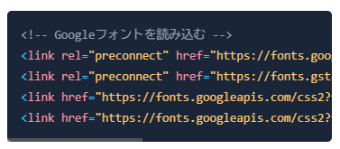

[:contents]

## はじめに

Kubernetesにおいて、問題になりやすいのがシークレットです。Kubernetes SecretsはただのBase64エンコードされた平文データなため、KuberentesマニフェストとしてGitリポジトリに保存するのは許容しがたいです。かといってシークレットをKNSや秘密鍵で暗号化してGitに保存するのも3rdパーティのSecretコントローラーが必要になるうえ、シークレット管理が煩雑になります。

そこで、ここ数年はクラウドの機密情報ストア(AWS Secrets Manager, Azure Key Vaultなど)にデータを保持しておき、Kubernetesからそれを読み取ってKubernetes SecretsやPodマウントにする手法が広く利用されてきました。コミュニティが提供しているコントローラーとしてExternal Secrets Operator(ESO)があり、Kubernetes公式のCSI Driverとして利用できる実装がSecrets Store CSI Driverです。Secrets Store CSI Driverは今回クラウドごとに実装があるのですが、今回紹介する`AWS Secrets Store CSI Driver provider`を使うとESOと同じくクラウドの機密情報ストアからシークレットを取得しPodにボリュームマウントできます。これらを使うことで、Gitやコンテナに直接シークレットを含めることなく機密情報ストアとシークレットを同期してPodに提供できるのがメリットです。

## External Secrets Operatorとは

[External Secrets Operator](https://github.com/external-secrets/external-secrets)は、AWS Secrets ManagerやSSM Parameter Store、Google Cloud、Azure KeyVault、HashiCorp Vaultなどの外部シークレット管理サービスからシークレットを取得し、Kubernetes SecretsとしてPodに提供するオープンソースのコントローラーです。ESOはKubernetes External Secretsからの移行先として提示されたこともあり広く利用されています。そして私自身、ESOを使ってシークレットをPodに渡すことが多いです。ESOはCRD(`External Secrets`/`SecretStore`)を介して、機密情報ストアを読み取ってKubernetes Secretsを生成します。ESOはクラウドを含む複数のシークレット管理サービスに対応しており、柔軟な認証方式をサポートしています。

そんなESOですが、プロジェクトの利用者に対してコア開発者の少なさが課題となっていることが、2025年アナウンスされています。いわゆるOSSで食っていけない状況が続いているようで、今後のメンテナンスも不安定になる可能性は否めません。

- 2022年11月3日、GoDaddy提供の[kubernetes-extenal-secrets](https://github.com/external-secrets/kubernetes-external-secrets)[^1]がメンテナンスされなくなり、同時期に登場した[External Secrets Operator](https://github.com/external-secrets/external-secrets)への移行をユーザーに[アナウンス](https://github.com/external-secrets/kubernetes-external-secrets/issues/864)
- 2025年8月13日、ユーザーの大きさに対してコアチームの人数不足の現状から、最低5人の長期コミュニティメンバーが揃うまでリリースを一時停止する[アナウンス](https://github.com/external-secrets/external-secrets/pull/5137)
- 2025年9月12日、リリースの一時停止に関する[アナウンスが削除](https://github.com/external-secrets/external-secrets/pull/5309)し、リリースが再開

ESOの状況に対して私個人としてできるのはコントリビュートやスポンサーですが、他方でリリースが止まった状況を踏まえると今後の代替手段を探す必要もあります。

## Secrets Store CSI Driverとは

KubernetesのContainer Storage Interface(CSI) Driverは、永続ストレージ(ブロックデバイスやファイルストレージ)をプラグイン方式で追加できるようにする仕組みです。実装例として`AWS EBS CSI Driver`、`Azure Disk CSI Driver`、`Google Compute Engine Persistent Disk CSI Driver`などがありストレージ(`PV/PVC`)を提供します。

一方で、`Secrets Store CSI Driver`はストレージではなく外部の機密情報ストアに保存された機密情報をCSIボリューム[^2]としてPodにマウントするためのドライバーです。AWSが公式に提供する[AWS Secrets Store CSI Driver provider](https://github.com/aws/secrets-store-csi-driver-provider-aws)はその実装例の1つで、AWS Secrets ManagerやAWS Systems Manager Parameter Storeに保存されているシークレットをPod内のファイルとしてマウントしたり、オプションでKubernetes Secretへ同期できます。

ESOと同じような使い方ができますがEKS実装にもかかわらずHelm Chartで導入する必要があり、あまり機能が変わらないとも言えます。このためESOを使っているなら、そこまで強い動機付けがありませんでした。しかし今回、EKS Addonに`AWS Secrets Store CSI Driver provider`が[加わった](https://aws.amazon.com/jp/about-aws/whats-new/2025/11/amazon-eks-add-ons-aws-secrets-store-csi-driver-provider/)ことで、導入や運用が以前より簡単になりました。何よりAWS公式がメンテナンスしている点が大きなメリットです。ここにきて、ESOの代替手段として十分に検討できるようになりました。

---


ボリュームマウントパターン (SecretProviderClassでsecretsObjectsを定義しない場合) だと....

- External Secrets Operatorと違って、CSI Secrets DriverだとSecretが生成されない
- Podへのファイルマウントは指定通りされている
- CSI DriverのAWS認証はPodの物が利用される。ESOみたいに、ESO Deploymentが権限管理するんじゃなくて、アプリPodが管理って感じ。なので、Pod IdentityやIRSAはPodに対して行うことになる

```
$ kubectl get po
kNAME                        READY   STATUS    RESTARTS   AGE
test-app-5989fbd45f-rzk2d   1/1     Running   0          3m38s
$ kubectl get secret
No resources found in default namespace.
$ kubectl exec -it test-app-5989fbd45f-rzk2d  -- /bin/bash
root@test-app-5989fbd45f-rzk2d:/# ls /mnt/secrets-store/
my-parameter  piyopiyo
root@test-app-5989fbd45f-rzk2d:/# cat /mnt/secrets-store/my-parameter
foobar-valueroot@test-app-5989fbd45f-rzk2d:/# cat /mnt/secrets-store/piyopiyo
```

---

デフォルトのEKS Addon構成だと、Secretsを作成するオプションsyncSecret: boolがfalse
ログでアクセスできないことがわかるのと、ClusterRoleに権限がついていない。

```sh
$ stern secrets-store-csi-driver
secrets-store-csi-driver-pqpxz secrets-store I1203 07:17:15.486011       1 reflector.go:424]"pkg/mod/k8s.io/client-go@v0.26.4/tools/cache/reflector.go:169: failed to list *v1.Secret: secrets is forbidden: User \"system:serviceaccount:aws-secrets-manager:secrets-store-csi-driver\" cannot list resource \"secrets\" in API group \"\" at the cluster scope\n"
secrets-store-csi-driver-pqpxz secrets-store E1203 07:17:15.486080       1 reflector.go:140]"pkg/mod/k8s.io/client-go@v0.26.4/tools/cache/reflector.go:169: Failed to watch *v1.Secret: failed to list *v1.Secret: secrets is forbidden: User \"system:serviceaccount:aws-secrets-manager:secrets-store-csi-driver\" cannot list resource \"secrets\" in API group \"\" at the cluster scope\n"
```

```sh
$ k get clusterrole aws-secrets-store-csi-driver-provider-cluster-role -o yaml  | k neat
apiVersion: rbac.authorization.k8s.io/v1
kind: ClusterRole
metadata:
  labels:
    app: aws-secrets-store-csi-driver-provider
    app.kubernetes.io/instance: aws-secrets-store-csi-driver-provider
    app.kubernetes.io/managed-by: Helm
    app.kubernetes.io/name: aws-secrets-store-csi-driver-provider
    helm.sh/chart: aws-secrets-store-csi-driver-provider-2.1.1
  name: aws-secrets-store-csi-driver-provider-cluster-role
rules:
- apiGroups:
  - ""
  resources:
  - serviceaccounts/token
  verbs:
  - create
- apiGroups:
  - ""
  resources:
  - serviceaccounts
  verbs:
  - get
- apiGroups:
  - ""
  resources:
  - pods
  verbs:
  - get
- apiGroups:
  - ""
  resources:
  - nodes
  verbs:
  - get

$ k get clusterrole secretproviderclasses-role -o yaml | k neat
apiVersion: rbac.authorization.k8s.io/v1
kind: ClusterRole
metadata:
  labels:
    app: secrets-store-csi-driver
    app.kubernetes.io/instance: aws-secrets-store-csi-driver-provider
    app.kubernetes.io/managed-by: Helm
    app.kubernetes.io/name: secrets-store-csi-driver
    app.kubernetes.io/version: 1.5.4
    helm.sh/chart: secrets-store-csi-driver-1.5.4
  name: secretproviderclasses-role
rules:
- apiGroups:
  - ""
  resources:
  - events
  verbs:
  - create
  - patch
- apiGroups:
  - ""
  resources:
  - pods
  verbs:
  - get
  - list
  - watch
- apiGroups:
  - secrets-store.csi.x-k8s.io
  resources:
  - secretproviderclasses
  verbs:
  - get
  - list
  - watch
- apiGroups:
  - secrets-store.csi.x-k8s.io
  resources:
  - secretproviderclasspodstatuses
  verbs:
  - create
  - delete
  - get
  - list
  - patch
  - update
  - watch
- apiGroups:
  - secrets-store.csi.x-k8s.io
  resources:
  - secretproviderclasspodstatuses/status
  verbs:
  - get
  - patch
  - update
- apiGroups:
  - storage.k8s.io
  resourceNames:
  - secrets-store.csi.k8s.io
  resources:
  - csidrivers
  verbs:
  - get
  - list
  - watch
```


定義を追加して

```json
{"secrets-store-csi-driver":{"syncSecret":{"enabled":true}}}
```





同期用のClusterRoleが作成 & ClusterRoleBindingsが作成された

```sh
$ k get clusterrole secretprovidersyncing-role -o yaml | k neat
apiVersion: rbac.authorization.k8s.io/v1
kind: ClusterRole
metadata:
  labels:
    app: secrets-store-csi-driver
    app.kubernetes.io/instance: aws-secrets-store-csi-driver-provider
    app.kubernetes.io/managed-by: Helm
    app.kubernetes.io/name: secrets-store-csi-driver
    app.kubernetes.io/version: 1.5.4
    helm.sh/chart: secrets-store-csi-driver-1.5.4
  name: secretprovidersyncing-role
rules:
- apiGroups:
  - ""
  resources:
  - secrets
  verbs:
  - create
  - delete
  - get
  - list
  - patch
  - update
  - watch

$ k get clusterrolebinding secretprovidersyncing-rolebinding -o yaml | k neat
apiVersion: rbac.authorization.k8s.io/v1
kind: ClusterRoleBinding
metadata:
  labels:
    app: secrets-store-csi-driver
    app.kubernetes.io/instance: aws-secrets-store-csi-driver-provider
    app.kubernetes.io/managed-by: Helm
    app.kubernetes.io/name: secrets-store-csi-driver
    app.kubernetes.io/version: 1.5.4
    helm.sh/chart: secrets-store-csi-driver-1.5.4
  name: secretprovidersyncing-rolebinding
roleRef:
  apiGroup: rbac.authorization.k8s.io
  kind: ClusterRole
  name: secretprovidersyncing-role
subjects:
- kind: ServiceAccount
  name: secrets-store-csi-driver
  namespace: aws-secrets-manager
```


Secretsも生成されるようになる。

```sh
$ k get secret
NAME              TYPE     DATA   AGE
test-app-secret   Opaque   2      3m51s

$ k get po
NAME                        READY   STATUS    RESTARTS   AGE
test-app-5c74d5fd8b-g2q9c   1/1     Running   0          5m11s

$ k get po test-app-5c74d5fd8b-g2q9c -o yaml | k neat
apiVersion: v1
kind: Pod
metadata:
  labels:
    app: test-app
    pod-template-hash: 5c74d5fd8b
  name: test-app-5c74d5fd8b-g2q9c
  namespace: default
spec:
  containers:
  - env:
    - name: PIYO
      valueFrom:
        secretKeyRef:
          key: PIYO
          name: test-app-secret
    - name: PARAMETER
      valueFrom:
        secretKeyRef:
          key: PARAMETER
          name: test-app-secret
    - name: AWS_STS_REGIONAL_ENDPOINTS
      value: regional
    - name: AWS_DEFAULT_REGION
      value: ap-northeast-1
    - name: AWS_REGION
      value: ap-northeast-1
    - name: AWS_CONTAINER_CREDENTIALS_FULL_URI
      value: http://169.254.170.23/v1/credentials
    - name: AWS_CONTAINER_AUTHORIZATION_TOKEN_FILE
      value: /var/run/secrets/pods.eks.amazonaws.com/serviceaccount/eks-pod-identity-token
    image: nginx:latest
    name: nginx
    ports:
    - containerPort: 80
      name: http
    resources:
      limits:
        cpu: 250m
        memory: 128Mi
    volumeMounts:
    - mountPath: /mnt/secrets-store
      name: secrets-store-inline
      readOnly: true
    - mountPath: /var/run/secrets/kubernetes.io/serviceaccount
      name: kube-api-access-kwk52
      readOnly: true
    - mountPath: /var/run/secrets/pods.eks.amazonaws.com/serviceaccount
      name: eks-pod-identity-token
      readOnly: true
  preemptionPolicy: PreemptLowerPriority
  priority: 0
  serviceAccountName: test-app
  tolerations:
  - effect: NoExecute
    key: node.kubernetes.io/not-ready
    operator: Exists
    tolerationSeconds: 300
  - effect: NoExecute
    key: node.kubernetes.io/unreachable
    operator: Exists
    tolerationSeconds: 300
  volumes:
  - name: eks-pod-identity-token
    projected:
      sources:
      - serviceAccountToken:
          audience: pods.eks.amazonaws.com
          expirationSeconds: 81586
          path: eks-pod-identity-token
  - csi:
      driver: secrets-store.csi.k8s.io
      readOnly: true
      volumeAttributes:
        secretProviderClass: test-app-secretstore
    name: secrets-store-inline
  - name: kube-api-access-kwk52
    projected:
      sources:
      - serviceAccountToken:
          expirationSeconds: 3607
          path: token
      - configMap:
          items:
          - key: ca.crt
            path: ca.crt
          name: kube-root-ca.crt
      - downwardAPI:
          items:
          - fieldRef:
              fieldPath: metadata.namespace
            path: namespace
```

この使い方はおおむねESOと同じような使い方。
定義 (SA除く)

```yaml
apiVersion: secrets-store.csi.x-k8s.io/v1
kind: SecretProviderClass
metadata:
  name: test-app-secretstore
  namespace: default
spec:
  provider: aws
  parameters:
    objects: |
      - objectName: "piyopiyo"
        objectType: "ssmparameter"
      - objectName: "foobar"
        objectType: "ssmparameter"
        objectAlias: "my-parameter"
    usePodIdentity: "true"
  secretObjects:
    - secretName: test-app-secret
      type: Opaque
      data:
        - objectName: "piyopiyo"
          key: "PIYO"
        - objectName: "my-parameter"
          key: "PARAMETER"
---
apiVersion: apps/v1
kind: Deployment
metadata:
  name: test-app
  namespace: default
  labels:
    app: test-app
spec:
  replicas: 1
  selector:
    matchLabels:
      app: test-app
  template:
    metadata:
      labels:
        app: test-app
    spec:
      serviceAccountName: test-app
      containers:
        - name: nginx
          image: nginx:latest
          ports:
            - containerPort: 80
              name: http
          resources:
            limits:
              memory: "128Mi"
              cpu: "250m"
            requests:
              memory: "128Mi"
              cpu: "250m"
          volumeMounts:
            - name: secrets-store-inline
              mountPath: "/mnt/secrets-store"
              readOnly: true
          env:
            - name: PIYO
              valueFrom:
                secretKeyRef:
                  name: test-app-secret
                  key: PIYO
            - name: PARAMETER
              valueFrom:
                secretKeyRef:
                  name: test-app-secret
                  key: PARAMETER
      volumes:
        - name: secrets-store-inline
          csi:
            driver: secrets-store.csi.k8s.io
            readOnly: true
            volumeAttributes:
              secretProviderClass: "test-app-secretstore"
```

```sh
$ kubectl exec -it test-app-5c74d5fd8b-g2q9c -- /bin/bash
root@test-app-5c74d5fd8b-g2q9c:/# cat /mnt/secrets-store/
my-parameter  piyopiyo
root@test-app-5c74d5fd8b-g2q9c:/# cat /mnt/secrets-store/my-parameter
foobar-valueroot@test-app-5c74d5fd8b-g2q9c:/# cat /mnt/secrets-store/piyopiyo
1234567root@test-app-5c74d5fd8b-g2q9c:/# env | grep PIYO
PIYO=1234567
root@test-app-5c74d5fd8b-g2q9c:/# env | grep PARAMETER
PARAMETER=foobar-value
```

---

aws-secrets-store-csi-driver-providerのEKS Addonですが、Helmで導入するよりこっちのほうがいい感じ。ESO使っている人も、aws-secrets-store-csi-driver-providerを検討でよさそう。
以下の追加コンフィグだけ設定すれば、OSS helm版やExternal Secrets Operatorでやりたいパターンが網羅できるので移行も可能でよさそう。

```json
{"secrets-store-csi-driver":{"syncSecret":{"enabled":true}}}
```

基本的な使い方は2つ... 1はESOのパターン、2はESOではできなかったパターンです。
1. Secretsが必要な時にSecretsを生成
2. Secretsが不要でPodに直マウントでいい

Secret同期の定義はこういう感じ。

```yaml
apiVersion: secrets-store.csi.x-k8s.io/v1
kind: SecretProviderClass
metadata:
  name: test-app-secretstore
  namespace: default
spec:
  provider: aws
  # 2のパターン (1でもこれは必須)
  parameters:
    objects: |
      - objectName: "piyopiyo"
        objectType: "ssmparameter"
      - objectName: "foobar"
        objectType: "ssmparameter"
        objectAlias: "my-parameter"
    usePodIdentity: "true"
  # 1のパターンが必要なら以下を足す
  secretObjects:
    - secretName: test-app-secret
      type: Opaque
      data:
        - objectName: "piyopiyo"
          key: "PIYO"
        - objectName: "my-parameter"
          key: "PARAMETER"
```

認証はPod IdentityとIRSAの両方に対応しているので、namespaceが決め打ちできるコントローラー系はPod IdentityでOK。ブランチ環境とかB/Gなどでnamespaceが固定できないアプリはIRSAで認証すればOK。
懸念は、コントローラー認証ではなくクライアント認証になるので、APIレートリミットに引っかかりやすくはなりそう。
変に抽象化せず、awsならaws用のSecrets CSI Driver、Google Cloudなら、Azureなら... と個別のクラウド別に別リポジトリで管理されているのもよさそうでした。
ESOからの移行が現実的にできそうなので、オススメって感じでした。

AWS的にはセキュアのシナリオでは、アプリから直接シークレット取りに行って、インメモリに保持しろ。というのはドキュメントにも明記されている


## 参考資料

- https://aws.amazon.com/jp/about-aws/whats-new/2025/11/amazon-eks-add-ons-aws-secrets-store-csi-driver-provider/
- https://docs.aws.amazon.com/ja_jp/systems-manager/latest/userguide/ascp-pod-identity-integration.html
- https://aws.amazon.com/jp/blogs/security/how-to-use-the-secrets-store-csi-driver-provider-amazon-eks-add-on-with-secrets-manager/
- https://aws.amazon.com/jp/blogs/news/amazon-eks-add-ons-advanced-configuration/
- https://github.com/kubernetes-sigs/aws-ebs-csi-driver/blob/master/docs/install.md
- https://github.com/aws/secrets-store-csi-driver-provider-aws/discussions/230
- https://github.com/vettom/Aws-Eks-SecretsManager/blob/main/nginx-pod.yaml
- https://github.com/aws/secrets-store-csi-driver-provider-aws
- https://github.com/aws/secrets-store-csi-driver-provider-aws/issues/286


[^1]: もともとkubernetes-extenal-secrets自体、[itscontained/secret-manager](https://github.com/itscontained/secret-manager)と[ContainerSolutions/externalsecret-operator](https://github.com/ContainerSolutions/externalsecret-operator)を統合するプロジェクトという[由来](https://github.com/external-secrets/kubernetes-external-secrets/issues/554#issuecomment-728984416)があります
[^2]: いわゆるinline volume
