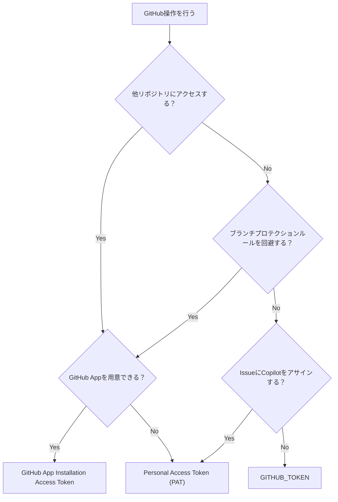
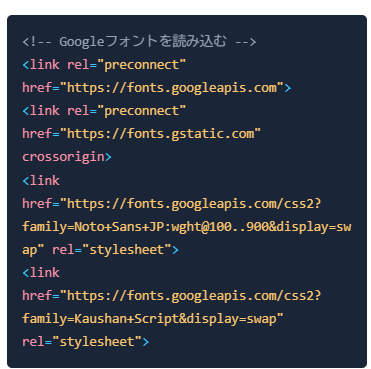
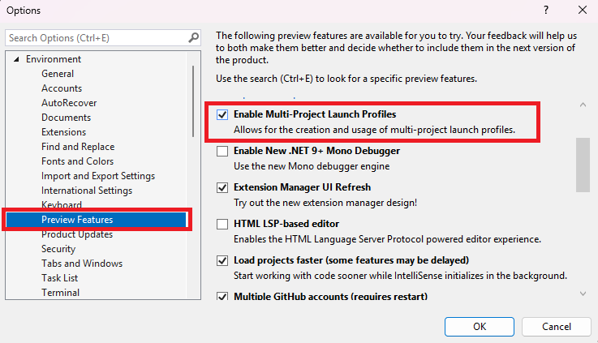
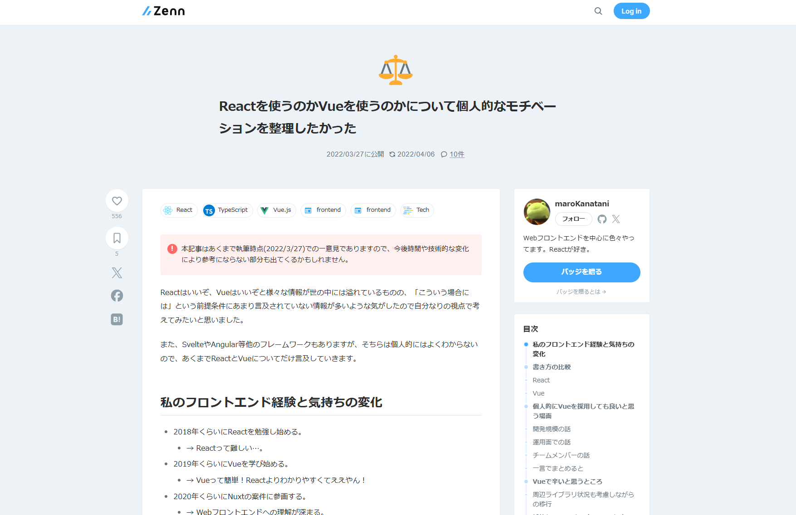

GitHub ActionsでPATを絶対使いたくないマンです。GitHub Appのインストールアクセストークンも使いたくなかったのですが、PATより100倍マシなので最近はこれを使うようにしています。
今回は、GitHub Actionsにおけるアクセストークンを整理し、GitHub Appのインストールアクセストークンを使う方法を説明します。

[:contents]

## PATの問題

GitHub ActionsからGitHub APIを叩くときに使うアクセストークンには、3つの選択肢があります。

- [GITHUB_TOKEN](https://docs.github.com/en/actions/tutorials/authenticate-with-github_token)
  - アクションごとに自動生成されるアクセストークン
- [PAT (Personal Access Token)](https://docs.github.com/en/authentication/keeping-your-account-and-data-secure/managing-your-personal-access-tokens)
  - ユーザー単位で手動生成するアクセストークン
  - `Finne-grained personal access token`
  - `Perosnal access token (classic)`[^1]
- [GitHub App Installation Access Token](https://docs.github.com/en/apps/creating-github-apps/authenticating-with-a-github-app/authenticating-as-a-github-app-installation)

通常は`GITHUB_TOKEN`を使うのがベストプラクティスですが、これには次の制約があります。

- 他のリポジトリにアクセスできない
- PRやPushに用いたとき、ワークフローをトリガーできない
- ブランチプロティションルールの除外ルールに設定できない
- Issueに`@Copilot`をアサインできない[^2]

上記制約はPATで回避できますが、PATには次のような問題があります。

- トークン発行が個人単位[^3]
- ブランチプロテクションの除外ルールも発行者を対象にする必要がある
- トークン発行者として処理が実行される[^4]
- トークンの期限が長く漏洩時のリスクが高い
- トークンの対象リポジトリ・権限が発行/編集時に固定される

割と扱いに組んですよね。。個人リポジトリならともかく、組織リポジトリでPATを使うのは避けたいところです。

## GitHub Appによる解決と使い分け

GitHub AppのインストールアクセストークンはPATの問題を解決できます。

- トークン発行がGitHub App単位で個人に依存しない
- ブランチプロテクションの除外ルールにGitHub Appを指定できる
- GitHub Appとして処理が実行できる
- トークンがアクションの実行事に発行、アクション終了で無効化される
- トークンの対象リポジトリ・権限をGitHub App、組織承認の2段階で管理できる

GitHub Appの用意とアクセストークンの発行処理が必要は面倒ですが、PATを使うよりは遥かにマシです。以上を踏まえて、GitHub ActionsでGitHub APIを叩くときは次の基準で使い分けています。

- 他リポジトリにアクセスしたいなら`GitHub App`
- ブランチプロテクションルールを回避したいなら`GitHub App`
- IssueにCopilotをアサインしたいなら`PAT`
- 上記に該当しないケースは`GITHUB_TOKEN`
  - `GitHub App`を用意できない場合は`PAT`

<details><summary>クリックでmermaidを表示</summary>



</details>



整理できたところで、GitHub Appのインストールアクセストークンを使う方法を見てみましょう。

## GitHub Appを使う

### GitHub Appを用意する


### SecretsにGitHub Appの情報を登録する

GitHub Appの`App ID`、`Private Key`を、Organization SecretsやリポジトリSecretsに登録します。

以下はダミーのGitHub App情報[^5]です。


Private Keyを生成するとダウンロードされるので、中身をSecretsに登録したらファイルは消しましょう。秘密鍵はすぐ消すに限ります。


これらを、GitHub Secretsに登録します。

```
ACTIONS_BOT_APPID: 上のAPP ID
ACTIONS_BOT_PRIVATE_KEY: 上のPrivate Keyの中身
```

### GitHub Appをインストールする

GitHub Appを対象のリポジトリや組織にインストールします。Organization単位でインストールする場合は、Organizationのオーナー権限が必要です。

インストールすると対象のリポジトリを選択できるので、ここで必要なリポジトリに絞り込むとよいでしょう。全部のリポジトリ、あるいはパブリックリポジトリ全部にしていると影響範囲を把握しづらくなります。


インストール後にGitHub Appの権限を変更した場合、組織のオーナーは変更を承認するか選択できます。

インストールしたアプリを削除もできます。



### GitHub Actionsでインストールアクセストークンを取得する

GitHub ActionsのワークフローでGitHub Appのインストールアクセストークンを取得しましょう。幸い、GitHub公式のアクション[actions/create-github-app-token](https://github.com/actions/create-github-app-token)があります。以前はサードパーティ製アクションを使う必要がありましたが、公式アクションができたのでこれを使いましょう。

以下はサンプルワークフローです。ジョブにはpull requestの権限を与えていません。GitHub Appのインストールアクセストークンを取得するときにpull-requestのread権限を与えています。

取得したトークンは、`steps.{id}.outputs.token`で参照できます。例では`actions/create-github-app-token`のidを`app-token`にしているので、`steps.app-token.outputs.token`です。

```yaml
name: github app token
on:
  pull_request:
    branches: [main]
  push:
    branches: [main]
  workflow_dispatch:

jobs:
  app-token:
    permissions:
      contents: read # no pull request permission
    runs-on: ubuntu-24.04
    timeout-minutes: 3
    steps:
      - uses: actions/create-github-app-token@29824e69f54612133e76f7eaac726eef6c875baf # v2.2.1
        id: app-token
        with:
          app-id: ${{ secrets.ACTIONS_BOT_APPID }}
          private-key: ${{ secrets.ACTIONS_BOT_PRIVATE_KEY }}
          permission-pull-requests: read # grant read access to pull requests
      - uses: actions/checkout@08c6903cd8c0fde910a37f88322edcfb5dd907a8 # v5.0.0
        with:
          persist-credentials: false
      - name: List open PRs
        run: gh pr list --state open --limit 5
        env:
          GH_TOKEN: ${{ steps.app-token.outputs.token }} # GitHub App token permission to read pull requests
          GH_REPO: ${{ github.repository }}
```

ワークフローを実行すると、GitHub Appのインストールアクセストークンが発行され、`gh`コマンドでPR一覧を取得できます。



### create-GitHub-app-tokenのコツ

GitHub Appのインストールアクセストークンを取得するコツです。

- permissions-`<resource>`で必要な権限だけ与える

この時取得できる権限は、GitHub Appへ与えられた権限に限られます。Appに与えられていない権限は取得できません。

```yaml
# pushが必要ならpermission-contents: writeを与える
- uses: actions/create-github-app-token@v2
  id: app-token
  with:
    app-id: ${{ secrets.ACTIONS_BOT_APPID }}
    private-key: ${{ secrets.ACTIONS_BOT_PRIVATE_KEY }}
    permission-contents: write
```

- 他のリポジトリにアクセスする場合は`owner`と`repositories`を指定する

```yaml
# ownerとrepositoriesを指定して他リポジトリにアクセスする
- uses: actions/create-github-app-token@v2
  id: app-token
  with:
    app-id: ${{ vars.APP_ID }}
    private-key: ${{ secrets.PRIVATE_KEY }}
    owner: ${{ github.repository_owner }}
    repositories: |
      repo1
      repo2
```

## まとめ

GitHub Appを用いると、ごく限定的なケースを除いてPATを排除できます。たとえマシンユーザーがあったとしても、PATよりはGitHub Appのほうが細かく管理できるので好ましいでしょう。

まずは`GITHUB_TOKEN`でできるか検討して、どうしても無理な場合にGitHub Appを用意するのがおすすめです。

## 参考

- [actions/create-github-app-token | GitHub](https://github.com/actions/create-github-app-token)
- [Making authenticated API requests with a GitHub App in a GitHub Actions workflow - GitHub Docs](https://docs.github.com/en/apps/creating-github-apps/authenticating-with-a-github-app/making-authenticated-api-requests-with-a-github-app-in-a-github-actions-workflow)
- [Managing your personal access tokens - GitHub Docs](https://docs.github.com/en/authentication/keeping-your-account-and-data-secure/managing-your-personal-access-tokens)
- [Use GITHUB_TOKEN for authentication in workflows - GitHub Docs](https://docs.github.com/en/actions/tutorials/authenticate-with-github_token)
- [Authenticating as a GitHub App installation - GitHub Docs](https://docs.github.com/en/apps/creating-github-apps/authenticating-with-a-github-app/authenticating-as-a-github-app-installation)


[^1]: コラボレーターとしてリポジトリにアクセスする場合は、`Personal access token (classic)`を使う必要がある
[^2]: CopilotのアサインにはCopilotライセンスが必要なためPATが必要。Copilot AgentをGitHub Actionsからghで割り当てるのにほしい。
[^3]: 組織単位で発行ができず、個人が退職した場合にトークン管理が困難になる。その割にマシンユーザーも非推奨
[^4]: ghコマンドでPRを作ると、トークン発行者がPR作成者になるなど
[^5]: すでに消しているので使おうとしても無駄です。
