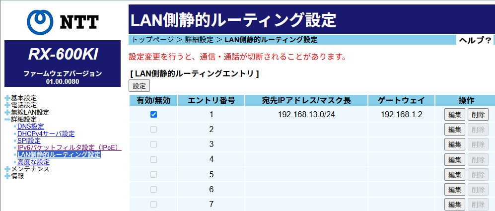
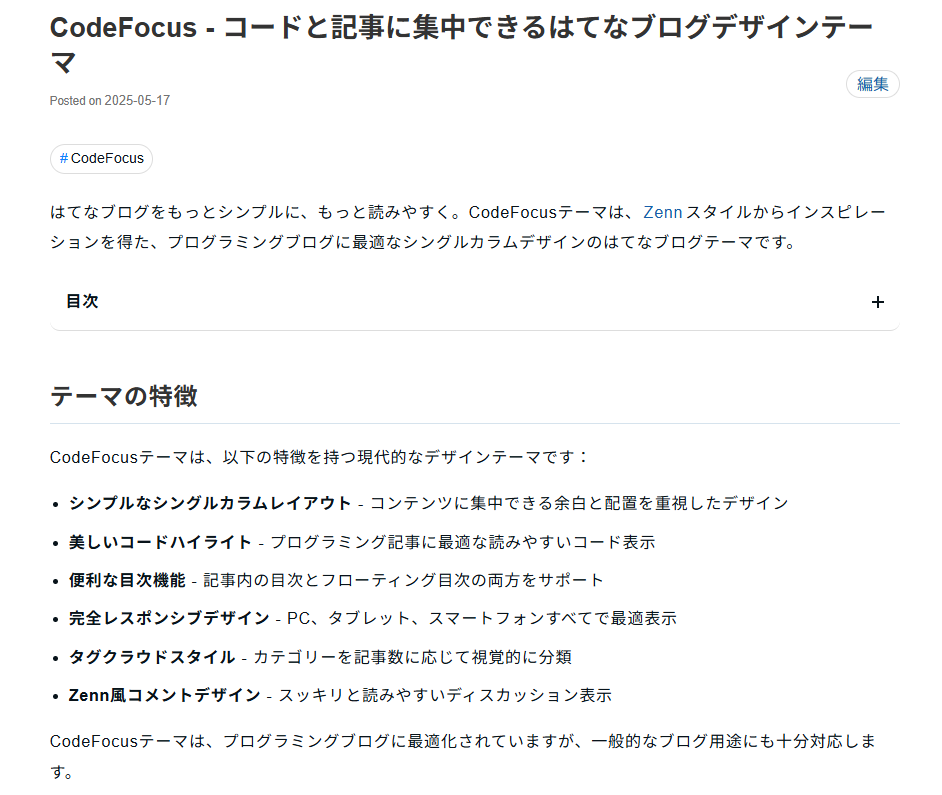

ふと周りの人と話していて、はじめてLLMを触るときにいいものが思いつかないという話がありました。
そこで、cronスケジュールはLLMを試しやすく検証しやすいのでオススメなのでは、ということでメモです。

[:contents]

## cron形式は難しい

現代においてもスケジュール設定の多くはcron形式が使われています。
cron形式は強力なんですが、人間には読みにくく書きにくいためc[rontab.guru](https://crontab.guru/)のようなツールで調べないと厳しいです。

cron形式を書く頻度は低く、人間には読み書きしにくいものの、LLMを試すのにちょうどよい題材です。

- 結果がすぐに検証できる（crontab.guruなどで確認可能）
- 正解が明確
- 日常的に使う機会があるが頻度は低い

## GitHub Actionsのcronスケジュール

GitHub Actionsではワークフローのスケジュールはcron形式で指定します。
以下は、1日1回午前3時に実行する例[^1]です。

```yaml
on:
  schedule:
    - cron: '0 3 * * *'
```

crontab.guruでcron文字列を調べると「At 03:00」と簡単に検証できます。

<!--image.png-->

## LLMにcronスケジュールを設定させる

エージェントでも、チャットでも、コンプリーションでもLLMは正確にcronスケジュールを生成できます。
例えば、以下のようなプロンプトを与えます。

```
次のスケジュールをcron形式で表現してください。
---
毎日午前3時に実行
```

Claude 4.5(Ask)なら次の回答が返ってきます。Agentでも同様にスケジュールを書き換えてくれます。

<!--image-1.png-->

また、コンプリーションでも同様に生成できます。

<!--image-2.png-->

## 例: 隔週2週間に一度を指定する

cronでパッと設定しにくいのが、一日おきとか隔週2週間に一度のようなスケジュールです。
隔週は14日に一度と解釈すればいいのですが、自分が調べるなら隔週・隔日に相当構文あるんじゃないかと調べたくなりませんか?

LLMにコメントを書きつつコンプリーションさせるといい感じに生成してくれます。GitHub Actionsのスケジュールで設定するなら、次のようにcron部分の上にコメント[^2]を書いておけばいいです。

<!--image-3.png-->

```yaml
on:
  schedule:
    # biweekly Sunday at midnight UTC
    - cron: "0 0 */14 * SUN"
```

## GitHub ActionsはUTCで動作

GitHub ActionsのHosted RunnerはUTCで動作しているため、日本時間の午前0時に実行したい場合は+9時間が必要です。

**失敗例**

先のコメントにちょっと情報を足すようにしたらどうでしょうか。残念ながら次のようなコメントだとうまく生成できません。

```yaml
# biweekly Sunday at midnight JST (9am UTC)
```

<!--image-5.png-->

**成功例**

次のように、UTCとしての時間を補足すると誤解なく通じます。日本語コメントなら`日本時間で毎週日曜日午前0時（UTC 土曜日15:00）`のように書くといいでしょう。

```yaml
on:
  schedule:
    # biweekly on Sunday at 9am JST (UTC 0am)
    - cron: '0 15 * * SAT'
```

プロンプトだと、例えば次のように指定します。

```
日本時間で隔週日曜日午前0時に実行するcron形式が欲しいです。ただし、cron実行環境はUTCです。
```

<!--image-4.png-->

## まとめ

LLMにやらせればいい、と言われても何をやらせればいい?ということは多いでしょう。
GitHub Actionsのcronスケジュールの設定は、LLMを試すのにちょうどよい題材です。

実際に使うときは次もコツとして覚えておくと良いでしょう。

- GitHub Actionsのスケジュールには意図する時刻をコメントで明記しておく
- UTCとJSTの変換が必要な場合は、両方の時刻を書いておく
- コメント明記するとCopilotレビューでスケジュールの妥当性を確認できる

チームでのメンテナンス性も上がり、LLMもうまく活用できるのでオススメです。

[^1]: GitHub Actionsのスケジュールは時刻ちょうどに実行する保証はありません
[^2]: 以前のCopilotは`# q:`のようなコメントがオススメでしたが、今はただのコメントで意図を汲んでくれます。
