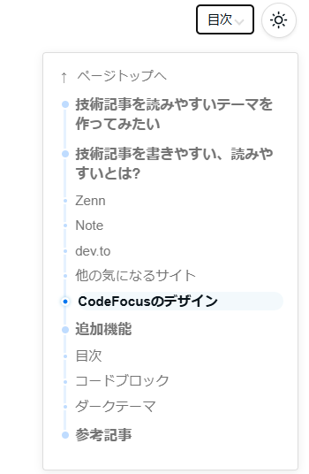
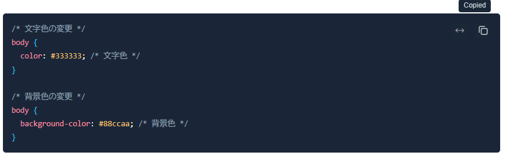

Riderのブレイクポイントログについての[記事](https://note.com/ohbashunsuke/n/n9ff12e7a1793)を読んだのですが、同様の機能がVisual Studioにもあるので紹介です。

Unityで開発していると、ログ追加のためDebug.Logを追加する、コンパイルが走る、数十秒待つ、思考が切れる、というのが日常的に発生します。
Visual Studioのトレースポイントを使うとRiderのブレークポイントログと同様に、「あ、ここ一瞬だけ値をみたいな」ができます。ブレイクポイントを置いたらログを設定するだけで簡単なので、ぜひお試しください。

[:contents]

## Visual Studioのトレースポイント

[Microsoft Learn](https://learn.microsoft.com/ja-jp/visualstudio/debugger/using-tracepoints?view=visualstudio)に、Visual Studioのトレースポイントについて説明があります。
本記事はVisual Studio 2026で、C#を用いて紹介します。本機能は、マネージド言語(C#、Visual Basic、F#)とネイティブコード、およびJavaScriptやPythonなどの言語でサポートされています。

## サンプルプログラム

ASP.NET Core Web APIのデフォルトプロジェクトをサンプルとして用いて「リクエストの時にデバッグしたい」という実ケースあるあるを想定しましょう。
プログラムは、`http://localhost:5000/weatherforecast`にアクセスすると、5日分の天気予報を返すものです。

```csharp
var builder = WebApplication.CreateBuilder(args);

var app = builder.Build();

// Configure the HTTP request pipeline.
var summaries = new[]
{
    "Freezing", "Bracing", "Chilly", "Cool", "Mild", "Warm", "Balmy", "Hot", "Sweltering", "Scorching"
};

app.MapGet("/weatherforecast", () =>
{
    var forecast = Enumerable.Range(1, 5).Select(index =>
        new WeatherForecast
        (
            DateOnly.FromDateTime(DateTime.Now.AddDays(index)),
            Random.Shared.Next(-20, 55),
            summaries[Random.Shared.Next(summaries.Length)]
        ))
        .ToArray();
    return forecast;
})
.WithName("GetWeatherForecast");

app.Run();

internal record WeatherForecast(DateOnly Date, int TemperatureC, string? Summary)
{
    public int TemperatureF => 32 + (int)(TemperatureC / 0.5556);
}
```

## Visual Studioで「コンパイルしないログ」を出す

やることはシンプルです。Riderの場合と同様に次の手順です。

- ブレークポイントを置く
- そのブレークポイントに ログ出力を設定
- デバッガを起動する

ブレイクポイントは普段から使っていることでしょう。このブレイクポイントにログを設定するだけです。
コードを書き換えず、Debug.Logも書かず、コンパイルも走りません。

やってみましょう。
まずは、ブレークポイントを置きます。


ブレークポイントの赤い丸にマウスホバーして、Settings (日本語なら**設定**)をクリックします。


いくつかチェックボックスがあります。Actions(アクション)をチェックボックスをオンにします。


**Continue code execution (コードの実行を続行)**はオンのままにします。


**Show a message on the Output Window: 出力メッセージ**にログ出力したい内容を記述します。



文字列だけでなく、調べたい変数も`{}`で囲むと展開されます。例えば、`forecast`変数を見たいなら`{forecast}`と書きます。
インテリセンスも効くので、割と自由に指定できます。


その後、F5キーでデバッガを起動します。

これで、出力ウィンドウ (Output Window)にログが出力されます。

## Unityでトレースポイントを出してみてほしい

UnityでVisual Studioを使っているときのトレースポイントの例を示します。

雑なスクリプトを用意します。

```csharp
using System.Collections;
using System.Collections.Generic;
using Unity.VisualScripting;
using UnityEngine;

public class Sample : MonoBehaviour
{
    // Start is called before the first frame update
    void Start()
    {
        int counter = 0;
        for (int i = 0; i <= 10; i++)
        {
            counter += 1;
        }
    }
}
```

先ほどの例同様にブレイクポイントを設定、ログメッセージを設定します。


Visual StudioのデバッガをUnityにアタッチしてから、Unityを再生モードにしましょう。


出力ウィンドウに設定したログが出力されます。コンパイル時間ゼロでログ出力できるようになりました。



## 出力ウィンドウが流れてしまう

出力ウィンドウには、デフォルトではスレッドIDが出力され、あっという間に流れてしまいます。


特に、Unityにデバッグしていると頻繁にスレッドログが流れて邪魔なので、トレースログを見るときは非表示にするといいでしょう。
出力ウィンドウで右クリックして、Thread Exit Messages(スレッド終了メッセージ)のチェックを外します。


出力ウィンドウの**時計アイコン**を有効にすると、出力時刻が表示されて便利なのでこちらもどうぞ


## まとめ

Visual Studioのトレースポイントを使うと、コードを書き換えずにログを出力できます。
Unityで開発しているときに、Debug.Logを追加してコンパイルが走る、待ち時間が発生して思考が途切れる、その間に話かけられたり話しかけたりで集中力が途切れる、というのはよくあることです。

Riderに限らずVisual Studioにも同様の機能があるので、ぜひ試してみてください。
