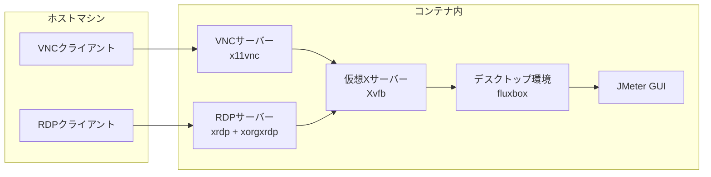

JMeterはJavaで動作する負荷試験ツールです。その特徴はGUIでシナリオを作成できることです。しかし、JMeter GUIを動作させるためにはJava環境が必要であり、セットアップが面倒ということでもあります。5年前、Dockerコンテナ上でJMeter GUIを動作させるコンテナイメージ[guitarrapc/docker-jmeter-gui](https://github.com/guitarrapc/docker-jmeter-gui)を公開しています。

今回、このdocker-jmeter-guiコンテナを通じて、コンテナのGUIをホストから操作する方法をいくつか構成したのでメモです。

[:contents]

## はじめに

コンテナのGUIをホストから操作する方法はいくつかあります。簡単にまとめると以下のようになります。

| 方法 | クロスプラットフォーム | 概要 |
| --- | --- | --- |
| X11転送 | × | ホストにXサーバーをインストールし、コンテナからX11プロトコルで接続する[^1] |
| VNC | ○ | コンテナ内にVNCサーバーをインストールし、ホストからVNCクライアントで接続する |
| RDP | ○ | コンテナ内にRDPサーバーをインストールし、ホストからRDPクライアントで接続する |
| ブラウザ経由 | ◎ | コンテナのVNCをWebSocket化して差分ビットマップを送信、ホストからブラウザで接続する |
| WebRTC経由 | ◎ | コンテナをWebRTC化して動画ストリーム配信、ホストからブラウザで接続する |

コンテナで提供するにあたり、ホストからなるべく使いやすいほうがいいです。このため、X11転送はなし。VNCやRDPはクライアントソフトが必要ですが、Windows(RDP)やmacOS(VNC)には標準でクライアントが付属しているため、比較的使いやすいです。ブラウザ経由やWebRTC経由はブラウザさえあればよいため、最も使いやすい方法です。

どこでコンテナを動作させるか考えると、WebRTCはGPUがないと体験が悪くなります。

VNC/RDPとブラウザ経由の2つを見ていきましょう。

## コンテナにVNC/RDPでアクセスできるようにする

ホストマシンから、RDP・VNCクライアントで接続する例を先に示します。。ホストマシンからRDPで接続するとX Severログイン画面が表示されるのでパスワード`root`を入力します。ホストマシンからVNCで接続するとVNCパスワード入力画面が表示されるのでパスワード`root`を入力します。

| 状態 | RDPクライアント | VNCクライアント |
| ---| --- | --- |
接続画面 | [f:id:guitarrapc_tech:20260112052615p:plain:alt=WindowsからRemote Desktop Connectionで接続する] <!--image.png--> | [f:id:guitarrapc_tech:20260112052622p:plain:alt=VNCで接続する] |
| ログイン画面 | [f:id:guitarrapc_tech:20260112052629p:plain:alt=XServerログイン画面] <!--image-1.png--> | [f:id:guitarrapc_tech:20260112052637p:plain:alt=VNCパスワードの入力] <!--image-3.png--> |

接続に成功するとJMeter GUIが表示されます。

[f:id:guitarrapc_tech:20260112052644p:plain:alt=JMeterの画面]

### Dockerfile

VNC/RDPでアクセスできるようにするには、コンテナ内にデスクトップ環境とVNCサーバーまたはRDPサーバーをインストールします。以下はdocker-jmeter-guiで構成していたDockerfileです。5年前はAlpineで構成していたのですが、現在のAlpine Linuxではxrdpを安定動作させられなかったため、Ubuntuベースに変更しています。


```dockerfile
FROM ubuntu:24.04

LABEL version="5.6.3"
LABEL description="An Ubuntu based docker image contains Apache JMeter GUI to configure scenario. Enable connect container with VNC and RDP."
LABEL maintainer="3856350+guitarrapc@users.noreply.github.com"

ENV DEBIAN_FRONTEND=noninteractive
ENV JMETER_VERSION="5.6.3"
ENV JMETER_HOME=/opt/apache-jmeter-${JMETER_VERSION}
ENV JMETER_BIN=${JMETER_HOME}/bin
ENV JMETER_PLUGINS_MANAGER_VERSION="1.10"
ENV PATH=${JMETER_BIN}:$PATH
ENV DISPLAY=":99" \
    RESOLUTION="1366x768x24" \
    PASS="root"

# Install minimal packages
RUN apt-get update \
    && apt-get install -y --no-install-recommends \
    wget ca-certificates \
    xvfb x11vnc \
    xrdp xorgxrdp \
    fluxbox xterm \
    openjdk-11-jre \
    && apt-get clean \
    && rm -rf /var/lib/apt/lists/*

# Download JMeter
RUN wget https://archive.apache.org/dist/jmeter/binaries/apache-jmeter-${JMETER_VERSION}.tgz -O /tmp/jmeter.tgz \
    && tar -xzf /tmp/jmeter.tgz -C /opt \
    && rm /tmp/jmeter.tgz \
    && rm -rf ${JMETER_HOME}/docs ${JMETER_HOME}/printable_docs
RUN wget https://repo1.maven.org/maven2/kg/apc/jmeter-plugins-manager/${JMETER_PLUGINS_MANAGER_VERSION}/jmeter-plugins-manager-${JMETER_PLUGINS_MANAGER_VERSION}.jar -O ${JMETER_HOME}/lib/ext/jmeter-plugins-manager.jar

# Configure VNC
RUN x11vnc -storepasswd ${PASS} /etc/x11vnc.pass

# Set root password for RDP login
RUN echo "root:${PASS}" | chpasswd

# Configure RDP
COPY xrdp.ini /etc/xrdp/xrdp.ini

EXPOSE 5900 3389

WORKDIR /root

CMD ["bash", "-c", "rm -f /tmp/.X99-lock /var/run/xrdp.pid /var/run/xrdp-sesman.pid \
    && /usr/bin/Xvfb ${DISPLAY} -screen 0 ${RESOLUTION} -ac +extension GLX +render -noreset & \
    sleep 3 \
    && fluxbox & \
    sleep 2 \
    && jmeter -Jjmeter.laf=CrossPlatform & \
    sleep 3 \
    && x11vnc -xkb -noxrecord -noxfixes -noxdamage -display ${DISPLAY} -forever -rfbport 5900 -rfbauth /etc/x11vnc.pass -shared & \
    sleep 2 \
    && xrdp-sesman & \
    sleep 1 \
    && xrdp --nodaemon"]
```

### xrdp.ini

xrdp.iniは以下の通りです。

```ini
[Globals]
bitmap_cache=true
bitmap_compression=true
autorun=jmeter
port=3389

[jmeter]
name=jmeter
lib=libvnc.so
ip=127.0.0.1
port=5900
username=na
password=ask
```

### コンテナのVNC/RDP接続フロー

ホストからコンテナへの接続フローです。
本Dockerfileでは、RDPクライアントから接続してもVNCで接続したときと同じJMeter GUIが表示させたいためxrdp.initで`libvnc.so`モジュールを利用しています。libvnc.soモジュールを使わずにxorgxrdpで直接Xvfbに接続も可能ですが、その場合、RDP接続時に別のセッションが作成され、VNC接続時とは異なるデスクトップ環境が表示されてしまいます。

`libvnc.so`モジュールはx11vncサーバーにRDPクライアントから接続するためのブリッジとして動作します。xrdp.iniでlibvnc.soを指定することで、RDPクライアントから接続してもx11vncサーバーが提供するXvfbの仮想ディスプレイにアクセスします。ただ、Alpine Linuxのxrdpではlibvnc.soモジュールがうまく動作しなかったため、Ubuntuベースに変更しました。

</details><summary>クリックでコンテナのVNC/RDP接続フローのMermaidを開く</summary>



</details>

[f:id:guitarrapc_tech:20260112052651p:plain:alt=VNC/RDP接続フロー]

### 使用しているパッケージ

次のパッケージを用いて、GUI環境を持たないDockerコンテナ内でJMeterのGUIを実行し、外部から接続できるようにしています。

**xvfb (X Virtual FrameBuffer)**

仮想ディスプレイを提供するXサーバーです。物理的なモニターがなくてもGUIアプリケーション(JMeter GUI)を動作させます。`DISPLAY=:99`で仮想ディスプレイを作成していますが、他の番号でも構いません。

**x11vnc**

Xサーバーの画面を外部に公開する、VNCサーバーです。VNCクライアントからの接続を受け付け、Xvfbの仮想ディスプレイをVNCプロトコルで提供します。
ポート5900で待ち受け、パスワード認証を設定しています。

**xrdp + xorgxrdp**

Xサーバーの画面を外部に公開する、RDP(Remote Desktop Protocol)サーバーです。RDPクライアントからの接続を受け付け、Xvfbの仮想ディスプレイをRDPプロトコルで提供します。xorgxrdpはXサーバーとxrdpを接続するドライバです。

ポート3389で待ち受け、ログイン時にユーザー認証します。

**fluxbox**

軽量なウィンドウマネージャーです。JMeterのウィンドウを管理・表示するために必要です。これがないとGUIウィンドウが正しく表示されません。

ウィンドウマネージャーはxfce4、lxde、mateなどがあり、好きなものを選択できます。以前は`xfce4`を使っていましたが、fluxboxのほうが軽量なので変更しました。

**xterm**

端末エミュレータです。RDPやVNC接続時にコマンドラインを使えるようにします。

端末エミュレータは他にもgnome-terminal、lxterminal、xfce4-terminalなどがあります。以前は、`xfce4-terminal`を使っていましたが、fluxboxに合わせて軽量なxtermに変更しました。

## コンテナにブラウザでアクセスできるようにする


[^1]: LinuxホストであればXサーバーは構成しやすいですが、WindowsやMac OSではXサーバーのセットアップが必要です。
