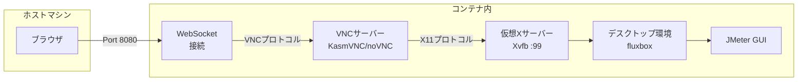

[前回の記事](https://tech.guitarrapc.com/entry/2026/01/07/230000)で、コンテナのGUIアプリケーションをホストからRDP/VNCで操作する方法を紹介しました。

今回は、それを一歩進めてブラウザ経由でコンテナのGUIアプリケーションにアクセスする方法を紹介します。

[:contents]

## はじめに

前回まとめたコンテナのGUIアプリケーションをホストから操作する方法のうち、ブラウザ経由で接続する方法が今回です。RDP/VNCと違ってブラウザだけでアクセスできるため、かなり手軽ですし迷わず使えるのが嬉しいです。

| 方法 | クロスプラットフォーム | GPU不要 | 概要 |
| --- | --- | --- | --- |
| X11転送 | X | O | ホストにXサーバーをインストールし、コンテナからX11プロトコルで接続する[^1] |
| VNC | O | O | コンテナ内にVNCサーバーをインストールし、ホストからVNCクライアントで接続する |
| RDP | O | O | コンテナ内にRDPサーバーをインストールし、ホストからRDPクライアントで接続する |
| ブラウザ経由 | O| O | コンテナのVNCをWebSocket化して差分ビットマップを送信、ホストからブラウザで接続する |
| WebRTC経由 | O | X | コンテナをWebRTC化して動画ストリーム配信、ホストからブラウザで接続する |

## コンテナにブラウザ経由でアクセスできるようにする

まず、ホストマシンからブラウザで接続する様子を示します。ホストマシンからブラウザで接続するとデスクトップが表示、操作できます。ほしいのはこれだった。

| Ubuntu 24.04 | Alpine |
| --- | --- |
| [f:id:guitarrapc_tech:20260113191341p:plain:alt=Ubuntu24.04コンテナへのアクセスの様子] <!--image.png-->| [f:id:guitarrapc_tech:20260113191350p:plain:alt=Alpine3.23コンテナへのアクセスの様子] <!--image-1.png--> |

## コンテナ構成

Ubuntu 24.04ベース(KasmVNC)とAlpine Linuxベース(noVNC)で異なる方法を用意しています。いずれもブラウザでアクセスできるようにする手法は同じで、VNCサーバーをWebSocket化しています[^1]。

構築して動かした感じだと、KasmVNCは起動時の依存が少なく動かしやすいため好みですが通信帯域が大きめです。そう意味ではnoVNCはもう少し軽量なのでよい感じもします。

イメージサイズは次の通りです。

```shell
$ docker image ls
REPOSITORY  TAG                 IMAGE ID       CREATED          SIZE
jmeter-gui  5.6.3-alpine3.23    73616f724564   4 minutes ago    1.31GB
jmeter-gui  5.6.3-ubuntu24.04   6f04998c4e51   12 minutes ago   1.45GB
alpine      3.23                865b95f46d98   3 weeks ago      26.5MB
ubuntu      24.04               c35e29c94501   2 months ago     257MB
```

### Ubuntu 24.04

Ubuntu 24.04ベースのコンテナは、KasmVNCを利用しています。ファイル配置は次の通りです。

```shell
$ tree
.
├── Dockerfile
└── kasmvnc.yaml
```

以下はdocker-jmeter-guiで構成しているDockerfileです。以下を考慮しています。

- JMeterのインストールをマルチステージで分離
- `linux/amd64`と`linux/arm64`のマルチアーキテクチャ対応
- バイナリダウンロード時にSHA512で整合性検証

```dockerfile
FROM ubuntu:24.04 AS builder

ARG TARGETARCH

ENV JMETER_VERSION="5.6.3"
ENV JMETER_HOME=/opt/apache-jmeter-${JMETER_VERSION}
ENV JMETER_PLUGINS_MANAGER_VERSION="1.10"
# SHA512 checksums for integrity verification
ENV JMETER_SHA512="5978a1a35edb5a7d428e270564ff49d2b1b257a65e17a759d259a9283fc17093e522fe46f474a043864aea6910683486340706d745fcdf3db1505fd71e689083"
ENV JMETER_PLUGINS_MANAGER_SHA512="38af806a7c78473c032ba93c7a2e522674871f01616985a0b0522483977d58afdc444d18bd5590b8036c344ccf11d2fe61be807501d5edb6d4bdebc9050c43ae"

RUN apt-get update \
    && apt-get install -y --no-install-recommends wget ca-certificates \
    # Download JMeter
    && wget https://archive.apache.org/dist/jmeter/binaries/apache-jmeter-${JMETER_VERSION}.tgz -O /tmp/jmeter.tgz \
    # Verify JMeter checksum
    && echo "${JMETER_SHA512}  /tmp/jmeter.tgz" | sha512sum -c - \
    && tar -xzf /tmp/jmeter.tgz -C /opt \
    # Download JMeter Plugins Manager
    && wget https://repo1.maven.org/maven2/kg/apc/jmeter-plugins-manager/${JMETER_PLUGINS_MANAGER_VERSION}/jmeter-plugins-manager-${JMETER_PLUGINS_MANAGER_VERSION}.jar -O ${JMETER_HOME}/lib/ext/jmeter-plugins-manager.jar \
    # Verify Plugins Manager checksum
    && echo "${JMETER_PLUGINS_MANAGER_SHA512}  ${JMETER_HOME}/lib/ext/jmeter-plugins-manager.jar" | sha512sum -c - \
    && rm -rf ${JMETER_HOME}/docs ${JMETER_HOME}/printable_docs /tmp/jmeter.tgz

FROM ubuntu:24.04

ARG TARGETARCH

LABEL version="5.6.3"
LABEL description="An Ubuntu based docker image contains Apache JMeter GUI to configure scenario. Enable connect container with browser."
LABEL maintainer="3856350+guitarrapc@users.noreply.github.com"

ENV DEBIAN_FRONTEND=noninteractive
ENV KASMVNC_VERSION="1.4.0"
ENV JMETER_VERSION="5.6.3"
ENV JMETER_HOME=/opt/apache-jmeter-${JMETER_VERSION}
ENV JMETER_BIN=${JMETER_HOME}/bin
ENV PATH=${JMETER_BIN}:$PATH
ENV DISPLAY=":99"

# Install minimal packages
RUN apt-get update \
    && apt-get install -y --no-install-recommends ca-certificates fluxbox xterm openjdk-11-jre wget \
    && apt-get clean \
    && rm -rf /var/lib/apt/lists/*

# Install KasmVNC
RUN wget https://github.com/kasmtech/KasmVNC/releases/download/v${KASMVNC_VERSION}/kasmvncserver_jammy_${KASMVNC_VERSION}_${TARGETARCH}.deb -O /tmp/kasmvnc.deb \
    && apt-get update \
    && apt-get install -y --no-install-recommends /tmp/kasmvnc.deb \
    && rm /tmp/kasmvnc.deb \
    && apt-get clean \
    && rm -rf /var/lib/apt/lists/*

COPY --from=builder /opt/apache-jmeter-${JMETER_VERSION} /opt/apache-jmeter-${JMETER_VERSION}

# Configure KasmVNC
RUN mkdir -p /root/.vnc \
    && echo '#!/bin/sh' > /root/.vnc/xstartup \
    && echo 'fluxbox &' >> /root/.vnc/xstartup \
    && echo 'jmeter -Jjmeter.laf=CrossPlatform' >> /root/.vnc/xstartup \
    && chmod +x /root/.vnc/xstartup

COPY kasmvnc.yaml /root/.vnc/kasmvnc.yaml

EXPOSE 8080

WORKDIR /root

CMD ["bash", "-c", "echo '2' | vncserver ${DISPLAY} -DisableBasicAuth -select-de manual -fg"]
```

kasmvnc.yamlは以下の通りです。コマンドライン引数で指定もできるのですが、設定ファイルでまとめておくと見通しがよく、利用時にオーバーライドしやすいのでいい感じです。

```yaml
desktop:
  resolution:
    width: 1366
    height: 768
  allow_resize: true
  pixel_depth: 24

network:
  interface: 0.0.0.0
  websocket_port: 8080
  ssl:
    pem_certificate:
    pem_key:
    require_ssl: false

encoding:
  max_frame_rate: 30
```

以下のコマンドでdockerイメージをビルドします。

```bash
docker buildx build --platform linux/amd64,linux/arm64 -t jmeter-gui:5.6.3-ubuntu24.04 .
```

以下のコマンドでコンテナを起動します。

```bash
docker run -it --rm -v ${PWD}/scenarios:/root/jmeter/ -p 8080:8080 jmeter-gui:5.6.3-ubuntu24.04
```

### Alpine Linux

Alpine Linuxベースのコンテナは、noVNCを利用しています。ファイル配置は次の通りです。こっちは依存が多いため、supervisordでプロセス管理しています。

```shellshell
$ tree
.
├── Dockerfile
└── supervisord.conf
```

以下はdocker-jmeter-guiで構成しているDockerfileです。以下を考慮しています。

- JMeterのインストールをマルチステージで分離
- `linux/amd64`と`linux/arm64`のマルチアーキテクチャ対応
- バイナリダウンロード時にSHA512で整合性検証
- supervisordでプロセス管理

```dockerfile
FROM alpine:3.23 AS builder

ARG TARGETARCH

ENV JMETER_VERSION="5.6.3"
ENV JMETER_HOME=/opt/apache-jmeter-${JMETER_VERSION}
ENV JMETER_PLUGINS_MANAGER_VERSION="1.10"
# SHA512 checksums for integrity verification
ENV JMETER_SHA512="5978a1a35edb5a7d428e270564ff49d2b1b257a65e17a759d259a9283fc17093e522fe46f474a043864aea6910683486340706d745fcdf3db1505fd71e689083"
ENV JMETER_PLUGINS_MANAGER_SHA512="38af806a7c78473c032ba93c7a2e522674871f01616985a0b0522483977d58afdc444d18bd5590b8036c344ccf11d2fe61be807501d5edb6d4bdebc9050c43ae"

RUN apk add --no-cache curl \
    # Download JMeter
    && curl -L https://archive.apache.org/dist/jmeter/binaries/apache-jmeter-${JMETER_VERSION}.tgz -o /tmp/jmeter.tgz \
    # Verify JMeter checksum
    && echo "${JMETER_SHA512}  /tmp/jmeter.tgz" | sha512sum -c - \
    && tar -xvf /tmp/jmeter.tgz -C /opt \
    # Download JMeter Plugins Manager
    && curl -L https://repo1.maven.org/maven2/kg/apc/jmeter-plugins-manager/${JMETER_PLUGINS_MANAGER_VERSION}/jmeter-plugins-manager-${JMETER_PLUGINS_MANAGER_VERSION}.jar -o ${JMETER_HOME}/lib/ext/jmeter-plugins-manager.jar \
    # Verify Plugins Manager checksum
    && echo "${JMETER_PLUGINS_MANAGER_SHA512}  ${JMETER_HOME}/lib/ext/jmeter-plugins-manager.jar" | sha512sum -c - \
    && rm -rf ${JMETER_HOME}/docs ${JMETER_HOME}/printable_docs /tmp/jmeter.tgz

FROM alpine:3.23

ARG TARGETARCH

LABEL version="5.6.3"
LABEL description="An Alpine based docker image contains Apache JMeter GUI to configure scenario. Enable connect container with browser."
LABEL maintainer="3856350+guitarrapc@users.noreply.github.com"

ENV JMETER_VERSION="5.6.3"
ENV JMETER_HOME=/opt/apache-jmeter-${JMETER_VERSION}
ENV JMETER_BIN=${JMETER_HOME}/bin
ENV PATH=${JMETER_BIN}:$PATH
ENV DISPLAY=":99"

# Install minimal packages
RUN apk add --no-cache \
    ca-certificates bash fluxbox xterm x11vnc xvfb ttf-dejavu supervisor openjdk11-jre novnc \
    && ln -s /usr/share/novnc/vnc.html /usr/share/novnc/index.html \
    && rm -rf /var/cache/apk/*

COPY --from=builder /opt/apache-jmeter-${JMETER_VERSION} /opt/apache-jmeter-${JMETER_VERSION}

# Configure VNC
RUN mkdir -p /root/.vnc \
    && echo '#!/bin/sh' > /root/.vnc/xstartup \
    && echo 'fluxbox &' >> /root/.vnc/xstartup \
    && echo 'jmeter -Jjmeter.laf=CrossPlatform' >> /root/.vnc/xstartup \
    && chmod +x /root/.vnc/xstartup

# Configure supervisord
RUN mkdir -p /var/log/supervisor
COPY supervisord.conf /etc/supervisor/conf.d/supervisord.conf

EXPOSE 8080

WORKDIR /root

CMD ["/usr/bin/supervisord", "-c", "/etc/supervisor/conf.d/supervisord.conf"]
```

supervisord.confは以下の通りです。

```ini
[supervisord]
nodaemon=true
logfile=/var/log/supervisor/supervisord.log
pidfile=/var/run/supervisord.pid
user=root

[program:xvfb]
command=/usr/bin/Xvfb :99 -screen 0 1280x1024x24 -ac +extension GLX +render -noreset
autorestart=true
priority=10
stdout_logfile=/var/log/supervisor/xvfb.log
stderr_logfile=/var/log/supervisor/xvfb.err
startretries=3

[program:x11vnc]
command=/usr/bin/x11vnc -display :99 -forever -shared -nopw -wait 5
autorestart=true
priority=20
stdout_logfile=/var/log/supervisor/x11vnc.log
stderr_logfile=/var/log/supervisor/x11vnc.err
startretries=3

[program:novnc]
command=/usr/bin/novnc_server --vnc localhost:5900 --listen 8080
autorestart=true
priority=30
stdout_logfile=/var/log/supervisor/novnc.log
stderr_logfile=/var/log/supervisor/novnc.err
startretries=3

[program:fluxbox]
command=/usr/bin/fluxbox
environment=DISPLAY=":99"
autorestart=true
priority=40
stdout_logfile=/var/log/supervisor/fluxbox.log
stderr_logfile=/var/log/supervisor/fluxbox.err
startretries=3

[program:jmeter]
command=/opt/apache-jmeter-5.6.3/bin/jmeter -Jjmeter.laf=CrossPlatform
environment=DISPLAY=":99"
autorestart=false
priority=50
stdout_logfile=/var/log/supervisor/jmeter.log
stderr_logfile=/var/log/supervisor/jmeter.err
startretries=0
```

以下のコマンドでdockerイメージをビルドします。

```bash
docker buildx build --platform linux/amd64,linux/arm64 -t jmeter-gui:5.6.3-alpine3.23 .
```

以下のコマンドでコンテナを起動します。

```bash
docker run -it --rm -v ${PWD}/scenarios:/root/jmeter/ -p 8080:8080 jmeter-gui:5.6.3-alpine3.23
```

## コンテナへの接続フロー

ホストからコンテナへの接続フローは次の通りです。前回のVNC接続のフローの前にWebSocket変換ブリッジが入っただけですが、これが体験に大きな差をもたらします。ブラウザアクセスは本当に手軽です。

<details><summary>クリックで接続フローのMermaidを開く</summary>



</details>

[f:id:guitarrapc_tech:20260113191358p:plain:alt=ブラウザ接続フロー] <!--image-2.png-->

## パッケージ一覧

Dockerfileで使用しているパッケージ一覧を説明します。これらを使い、GUI環境を持たないDockerコンテナ内でJMeterのGUIを実行し、外部から接続を受け付けています。記載以外のパッケージは、[前回の記事](https://tech.guitarrapc.com/entry/2026/01/07/230000)で説明しています。

**[KasmVNC](https://github.com/kasmtech/KasmVNC)**

Ubuntu 24.04ベースのコンテナで利用しています。VNCサーバー機能に加え、VNCをWebSocket化する機能も持っています。

**[novnc](https://github.com/novnc/noVNC)**

Alpine Linuxベースのコンテナで利用しています。VNCをWebSocket化する機能を持っています。

**supervisord**

AlpineでnoVNCを動かす際に利用しています。起動時にXvfb、x11vnc、noVNCサーバー、デスクトップ環境、JMeterを起動するのですが、それぞれに依存関係があるためCMDでは扱いきれません。supervisordでプロセス管理することで、起動順序や再起動ポリシーを人間が扱える程度に整理できます。

## まとめ

コンテナのGUIをホストから操作する方法として、ブラウザで接続する方法を紹介しました。この方法には、クロスプラットフォームで動作する、GPU不要である、ブラウザだけでアクセスできるといった利点があります。

2026年現在、GUIコンテナと一緒に提供するならブラウザ経由なのは当然という感じがあります。イメージサイズが膨れがちなのは微妙ですが、マルチアーキテクチャでも提供できますし、利便性を考えると十分に許容範囲内です。

次にやりたくなるのはWebRTCって感じですが、これはまた別の機会にまとめます。

## 参考

- [guitarrapc/docker-jmeter-gui | GitHub](https://github.com/guitarrapc/docker-jmeter-gui)
- [kasmtech/KasmVNC | GitHub](https://github.com/kasmtech/KasmVNC)
- [novnc/noVNC | GitHub](https://github.com/novnc/noVNC)

[^1]: WebRTCベースだとさらに低遅延で動画ストリームを配信できますが、低遅延は不要なので選択していません。
