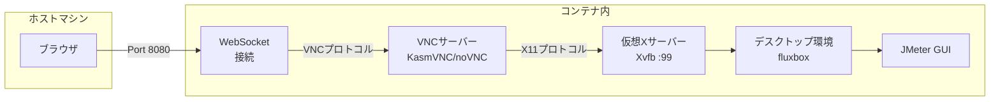

[前回の記事](https://tech.guitarrapc.com/entry/2026/01/07/230000)で、コンテナのGUIアプリケーションをホストからRDP/VNCでアクセスする構成を紹介しました。今回は、それを一歩進めてブラウザ経由でコンテナのGUIアプリケーションにアクセスする方法を紹介します。
RDP/VNCと違って、ブラウザだけでアクセスできるため、かなり手軽ですし直感的に使えます。

[:contents]

## はじめに

前回まとめたコンテナのGUIアプリケーションをホストから操作する方法のうち、ブラウザ経由で接続する方法が今回です。

| 方法 | クロスプラットフォーム | GPU不要 | 概要 |
| --- | --- | --- | --- |
| X11転送 | X | O | ホストにXサーバーをインストールし、コンテナからX11プロトコルで接続する[^1] |
| VNC | O | O | コンテナ内にVNCサーバーをインストールし、ホストからVNCクライアントで接続する |
| RDP | O | O | コンテナ内にRDPサーバーをインストールし、ホストからRDPクライアントで接続する |
| ブラウザ経由 | O| O | コンテナのVNCをWebSocket化して差分ビットマップを送信、ホストからブラウザで接続する |
| WebRTC経由 | O | X | コンテナをWebRTC化して動画ストリーム配信、ホストからブラウザで接続する |

## コンテナにブラウザ経由でアクセスできるようにする

まず、ホストマシンからブラウザで接続する様子を示します。ホストマシンからブラウザで接続するとデスクトップが表示、操作できます。ほしいのはこれだった。

本構成は、Ubuntu 24.04ベース(KasmVNC)とAlpine Linuxベース(noVNC)の2種類を用意しました。

| Ubuntu 24.04 | Alpine |
| --- | --- |
| | |

## コンテナ構成

UbuntuとAlpineでそれぞれ構成が異なります。

## Ubuntu 24.04

Ubuntu 24.04ベースのコンテナは、KasmVNCを利用しています。ファイル配置は次の通りです。

```shell
$ tree
.
├── Dockerfile
└── kasmvnc.yaml
```


## Alpine Linux

Alpine Linuxベースのコンテナは、noVNCを利用しています。ファイル配置は次の通りです。こっちは依存が多いため、supervisordでプロセス管理しています。

```shellshell
$ tree
.
├── Dockerfile
└── supervisord.conf
```

## コンテナへの接続フロー

ホストからコンテナへの接続フローは次の通りです。

<details><summary>クリックで接続フローのMermaidを開く</summary>



</details>

## パッケージ一覧


## まとめ


## 参考
