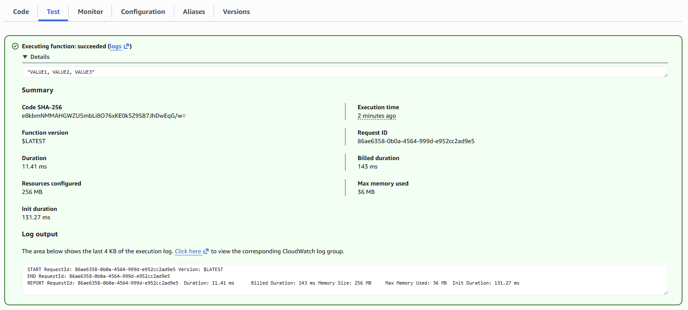

[前回記事](https://tech.guitarrapc.com/entry/2026/01/16/230000)で、OSS開発者としてSBOMとSLSAの状況を見ました。
今回は、C#/NuGetでSBOMやSLSAはいい感じに使えるのかという点を見ていきます。

結論から言うと、NuGetでSBOMは対応可能ですが、SLSAは現状では機能しません。特にNuGetの署名の仕組みが障壁になっています。具体的に見ていきましょう。

[:contents]

## NuGetのSBOM対応

NuGetのSBOM対応はいい感じです。SBOMで紹介したsbom-toolと同じリポジトリから提供されている[Microsoft.Sbom.Targets](https://www.nuget.org/packages/Microsoft.Sbom.Targets/)NuGetパッケージを組み込んでSBOMを有効にすれば、`dotnet pack`で自動的にsbomをnupkgに埋め込みます。

```shell
dotnet add package Microsoft.Sbom.Targets
```

### 基本的な設定方法

参考までに、SkiaSharp.QrCodeで[SBOM対応](https://github.com/guitarrapc/SkiaSharp.QrCode/pull/287)しています。

`Microsoft.Sbom.Targets`は内部的には`Microsoft.SbomTool`を用いて、SPDXフォーマットでSBOMを生成します。NuGetパッケージ追加後、SBOM生成を有効にするには`csproj`に`<GenerateSBOM>true</GenerateSBOM>`を設定します。おすすめ設定は次の通りですが、事実上`<GenerateSBOM>true</GenerateSBOM>`だけで十分です。

```xml
<Project Sdk="Microsoft.NET.Sdk">
  <PropertyGroup>
    <TargetFramework>net10.0</TargetFramework>

    <!-- 👇 これを追加 -->
    <GenerateSBOM>true</GenerateSBOM>
    <!-- 👇 以下はバグで機能しない -->
    <SbomGenerationFetchLicenseInformation>true</SbomGenerationFetchLicenseInformation>
    <SbomGenerationEnablePackageMetadataParsing>true</SbomGenerationEnablePackageMetadataParsing>
    <!-- 👇 指定しなければ2.2なのでそれでもいい。3.0は時期尚早 -->
    <SbomGenerationManifestInfo>SPDX:2.2</SbomGenerationManifestInfo>
  </PropertyGroup>

  <ItemGroup>
    <PackageVersion Include="Microsoft.Sbom.Targets" Version="4.1.5" />
  </ItemGroup>
</Project>
```

`.csproj`には様々な[SBOM生成オプション](https://github.com/microsoft/sbom-tool/tree/eda0965faedd9ebe1f9d2cc265af0e48ff37133a/src/Microsoft.Sbom.Targets)を設定できます。

`dotnet pack`でnuget用のパッケージを生成すると、.nupkgにSBOMが含まれます。デフォルトなら、`_manifest/spdx_2.2/manifest.spdx.json`にSBOMマニフェストが含まれているはずです[^1]。

```shell
$ dotnet pack -c Release
$ ls -l src/SkiaSharp.QrCode/bin/Release
total 592
-rw-rw-r--    1 guitarrapc guitarrapc    174157 Jan 20 00:23 SkiaSharp.QrCode.1.0.0.nupkg
-rw-rw-r--    1 guitarrapc guitarrapc    123261 Jan 18 19:07 SkiaSharp.QrCode.1.0.0.snupkg
drwxrwxr-x    2 guitarrapc guitarrapc         0 Jan 18 19:07 net10.0
drwxrwxr-x    2 guitarrapc guitarrapc         0 Jan 18 19:07 net8.0
drwxrwxr-x    2 guitarrapc guitarrapc         0 Jan 18 19:07 netstandard2.0
drwxrwxr-x    2 guitarrapc guitarrapc         0 Jan 18 19:07 netstandard2.1

$ unzip -l src/SkiaSharp.QrCode/bin/Release/SkiaSharp.QrCode.1.0.0.nupkg |   Length      Date    Time    Name
---------  ---------- -----   ----
    33143  15/01/2026 08:33   README.md
     2212  18/01/2026 19:07   SkiaSharp.QrCode.nuspec
      527  18/01/2026 19:07   [Content_Types].xml
      510  18/01/2026 19:07   _rels/.rels
    85504  18/01/2026 10:07   lib/net10.0/SkiaSharp.QrCode.dll
    86016  18/01/2026 10:07   lib/net8.0/SkiaSharp.QrCode.dll
    91648  18/01/2026 10:07   lib/netstandard2.0/SkiaSharp.QrCode.dll
    87552  18/01/2026 10:07   lib/netstandard2.1/SkiaSharp.QrCode.dll
    19578  20/01/2026 00:23   _manifest/spdx_2.2/manifest.spdx.json
       64  20/01/2026 00:23   _manifest/spdx_2.2/manifest.spdx.json.sha256
      694  18/01/2026 19:07   package/services/metadata/core-properties/4056208419134658ab90d43eda3a51e4.psmdcp
---------                     -------
   407448                     11 files
```

中身は次のようになっています。一部要素を省略していますが、全文は折りたたんでおくので、必要があれば展開してください。

<details><summary>SBOMの中身全文（クリックで展開）</summary>

```json
{
  "files": [
    {
      "fileName": "./lib/net8.0/SkiaSharp.QrCode.dll",
      "SPDXID": "SPDXRef-File--lib-net8.0-SkiaSharp.QrCode.dll-A1F20BD93B1A73FE0D4F34E57FE5E83CF16E748C",
      "checksums": [
        {
          "algorithm": "SHA256",
          "checksumValue": "64884baa46df69ae1eed437e8a47e271399ffe215dad7577eb7106f0a429010f"
        },
        {
          "algorithm": "SHA1",
          "checksumValue": "a1f20bd93b1a73fe0d4f34e57fe5e83cf16e748c"
        }
      ],
      "licenseConcluded": "NOASSERTION",
      "licenseInfoInFiles": [
        "NOASSERTION"
      ],
      "copyrightText": "NOASSERTION"
    },
    {
      "fileName": "./lib/netstandard2.1/SkiaSharp.QrCode.dll",
      "SPDXID": "SPDXRef-File--lib-netstandard2.1-SkiaSharp.QrCode.dll-0442B620957CC8FE998F26BD186AF7DBB6478C4A",
      "checksums": [
        {
          "algorithm": "SHA256",
          "checksumValue": "26c0489039142d6afd6fc6d65361f1d4b2160762571ed4f9283c311d02776069"
        },
        {
          "algorithm": "SHA1",
          "checksumValue": "0442b620957cc8fe998f26bd186af7dbb6478c4a"
        }
      ],
      "licenseConcluded": "NOASSERTION",
      "licenseInfoInFiles": [
        "NOASSERTION"
      ],
      "copyrightText": "NOASSERTION"
    },
    {
      "fileName": "./SkiaSharp.QrCode.nuspec",
      "SPDXID": "SPDXRef-File--SkiaSharp.QrCode.nuspec-E7ABF4725060CDB3E4F6D0F981A6D650D559A7A7",
      "checksums": [
        {
          "algorithm": "SHA256",
          "checksumValue": "7b6eb335fcda9fed0857249bad273623f420cdaa14fb888a215275663544b8f6"
        },
        {
          "algorithm": "SHA1",
          "checksumValue": "e7abf4725060cdb3e4f6d0f981a6d650d559a7a7"
        }
      ],
      "licenseConcluded": "NOASSERTION",
      "licenseInfoInFiles": [
        "NOASSERTION"
      ],
      "copyrightText": "NOASSERTION"
    },
    {
      "fileName": "./lib/netstandard2.0/SkiaSharp.QrCode.dll",
      "SPDXID": "SPDXRef-File--lib-netstandard2.0-SkiaSharp.QrCode.dll-C1454A9087D55424B935EF97EA7128FBE6144C36",
      "checksums": [
        {
          "algorithm": "SHA256",
          "checksumValue": "5906d89879bdc064f05f6d8bcfbc1fe71ad09c7e063f96cef46d442aa8c3eeea"
        },
        {
          "algorithm": "SHA1",
          "checksumValue": "c1454a9087d55424b935ef97ea7128fbe6144c36"
        }
      ],
      "licenseConcluded": "NOASSERTION",
      "licenseInfoInFiles": [
        "NOASSERTION"
      ],
      "copyrightText": "NOASSERTION"
    },
    {
      "fileName": "./_rels/.rels",
      "SPDXID": "SPDXRef-File---rels-.rels-9D0981B47DA2D0B8488D17207B3F4CC3F2C99E91",
      "checksums": [
        {
          "algorithm": "SHA256",
          "checksumValue": "a6a9610719dbe9bd2ef2283df0e4c54e71b65003c5a0a2940d54936dc99c78d9"
        },
        {
          "algorithm": "SHA1",
          "checksumValue": "9d0981b47da2d0b8488d17207b3f4cc3f2c99e91"
        }
      ],
      "licenseConcluded": "NOASSERTION",
      "licenseInfoInFiles": [
        "NOASSERTION"
      ],
      "copyrightText": "NOASSERTION"
    },
    {
      "fileName": "./README.md",
      "SPDXID": "SPDXRef-File--README.md-41D1013908E6838C84BB5B113F0BAAEE042E1346",
      "checksums": [
        {
          "algorithm": "SHA256",
          "checksumValue": "de4b28cb1a9f33a300652715220e5eee98796cae1aef6447f01d286664307bf9"
        },
        {
          "algorithm": "SHA1",
          "checksumValue": "41d1013908e6838c84bb5b113f0baaee042e1346"
        }
      ],
      "licenseConcluded": "NOASSERTION",
      "licenseInfoInFiles": [
        "NOASSERTION"
      ],
      "copyrightText": "NOASSERTION"
    },
    {
      "fileName": "./lib/net10.0/SkiaSharp.QrCode.dll",
      "SPDXID": "SPDXRef-File--lib-net10.0-SkiaSharp.QrCode.dll-99204E5B36AA5D3E01AB797497A43D3DE479B2A6",
      "checksums": [
        {
          "algorithm": "SHA256",
          "checksumValue": "d05d2cc4445c0d521993ccede87b1bacf3998defc3a2f24133895cdac132a890"
        },
        {
          "algorithm": "SHA1",
          "checksumValue": "99204e5b36aa5d3e01ab797497a43d3de479b2a6"
        }
      ],
      "licenseConcluded": "NOASSERTION",
      "licenseInfoInFiles": [
        "NOASSERTION"
      ],
      "copyrightText": "NOASSERTION"
    },
    {
      "fileName": "./package/services/metadata/core-properties/c74095c9b98b496db5bfeb7f0ec286d6.psmdcp",
      "SPDXID": "SPDXRef-File--package-services-metadata-core-properties-c74095c9b98b496db5bfeb7f0ec286d6.psmdcp-F931762800D5440480186EB37E0469B74BF2C8AF",
      "checksums": [
        {
          "algorithm": "SHA256",
          "checksumValue": "0f530c34dffec3ae38de28b1549202ac49e08ff22e9ad4b6a6c83c350c8e8ca9"
        },
        {
          "algorithm": "SHA1",
          "checksumValue": "f931762800d5440480186eb37e0469b74bf2c8af"
        }
      ],
      "licenseConcluded": "NOASSERTION",
      "licenseInfoInFiles": [
        "NOASSERTION"
      ],
      "copyrightText": "NOASSERTION"
    },
    {
      "fileName": "./[Content_Types].xml",
      "SPDXID": "SPDXRef-File---Content-Types-.xml-231C3DFEA27B519CD97D24A63F7B8C8B99AD464E",
      "checksums": [
        {
          "algorithm": "SHA256",
          "checksumValue": "778a7d54d9a1c7caf79ab7002592349d933aae8edf8385f1fc56178d7a069143"
        },
        {
          "algorithm": "SHA1",
          "checksumValue": "231c3dfea27b519cd97d24a63f7b8c8b99ad464e"
        }
      ],
      "licenseConcluded": "NOASSERTION",
      "licenseInfoInFiles": [
        "NOASSERTION"
      ],
      "copyrightText": "NOASSERTION"
    }
  ],
  "packages": [
    {
      "name": "SkiaSharp.QrCode",
      "SPDXID": "SPDXRef-Package-E36A5F0F0B31C3EA820F73BD5612ECBB45B859A2CFBC28719CDA2F76CC599F45",
      "downloadLocation": "NOASSERTION",
      "filesAnalyzed": false,
      "licenseConcluded": "NOASSERTION",
      "licenseDeclared": "NOASSERTION",
      "copyrightText": "NOASSERTION",
      "versionInfo": "1.0.0",
      "externalRefs": [
        {
          "referenceCategory": "PACKAGE-MANAGER",
          "referenceType": "purl",
          "referenceLocator": "pkg:nuget/SkiaSharp.QrCode@1.0.0"
        }
      ],
      "supplier": "Organization: guitarrapc"
    },
    {
      "name": "Microsoft.NETCore.Platforms",
      "SPDXID": "SPDXRef-Package-846C7B671CE0E884005EF626B209AD4D24EBA1FF032B6BA0242D62EC1793AA97",
      "downloadLocation": "NOASSERTION",
      "filesAnalyzed": false,
      "licenseConcluded": "NOASSERTION",
      "licenseDeclared": "NOASSERTION",
      "copyrightText": "NOASSERTION",
      "versionInfo": "1.1.0",
      "externalRefs": [
        {
          "referenceCategory": "PACKAGE-MANAGER",
          "referenceType": "purl",
          "referenceLocator": "pkg:nuget/Microsoft.NETCore.Platforms@1.1.0"
        }
      ],
      "supplier": "NOASSERTION"
    },
    {
      "name": "PolySharp",
      "SPDXID": "SPDXRef-Package-E27E4A39B1271EC6E0119F8F3C1165DDB0F5493D9EB9DBC79586516D68EF6D27",
      "downloadLocation": "NOASSERTION",
      "filesAnalyzed": false,
      "licenseConcluded": "NOASSERTION",
      "licenseDeclared": "NOASSERTION",
      "copyrightText": "NOASSERTION",
      "versionInfo": "1.15.0",
      "externalRefs": [
        {
          "referenceCategory": "PACKAGE-MANAGER",
          "referenceType": "purl",
          "referenceLocator": "pkg:nuget/PolySharp@1.15.0"
        }
      ],
      "supplier": "NOASSERTION"
    },
    {
      "name": "System.Runtime.CompilerServices.Unsafe",
      "SPDXID": "SPDXRef-Package-C924E25709BAC7772763FD535719B02BFD9AE676EB73B3DA4C7058E9A501DC30",
      "downloadLocation": "NOASSERTION",
      "filesAnalyzed": false,
      "licenseConcluded": "NOASSERTION",
      "licenseDeclared": "NOASSERTION",
      "copyrightText": "NOASSERTION",
      "versionInfo": "4.5.3",
      "externalRefs": [
        {
          "referenceCategory": "PACKAGE-MANAGER",
          "referenceType": "purl",
          "referenceLocator": "pkg:nuget/System.Runtime.CompilerServices.Unsafe@4.5.3"
        }
      ],
      "supplier": "NOASSERTION"
    },
    {
      "name": "System.Numerics.Vectors",
      "SPDXID": "SPDXRef-Package-A3FB7F39F2BD82992BF718EC7C174635F4F24789BA41C19787B833205839923D",
      "downloadLocation": "NOASSERTION",
      "filesAnalyzed": false,
      "licenseConcluded": "NOASSERTION",
      "licenseDeclared": "NOASSERTION",
      "copyrightText": "NOASSERTION",
      "versionInfo": "4.4.0",
      "externalRefs": [
        {
          "referenceCategory": "PACKAGE-MANAGER",
          "referenceType": "purl",
          "referenceLocator": "pkg:nuget/System.Numerics.Vectors@4.4.0"
        }
      ],
      "supplier": "NOASSERTION"
    },
    {
      "name": "Microsoft.Sbom.Targets",
      "SPDXID": "SPDXRef-Package-187EFE2F1CB79DC28F70C62C1D8E0B6D840AF97A56D8D381EC4C4E7A968129CB",
      "downloadLocation": "NOASSERTION",
      "filesAnalyzed": false,
      "licenseConcluded": "NOASSERTION",
      "licenseDeclared": "NOASSERTION",
      "copyrightText": "NOASSERTION",
      "versionInfo": "4.1.5",
      "externalRefs": [
        {
          "referenceCategory": "PACKAGE-MANAGER",
          "referenceType": "purl",
          "referenceLocator": "pkg:nuget/Microsoft.Sbom.Targets@4.1.5"
        }
      ],
      "supplier": "NOASSERTION"
    },
    {
      "name": "System.Memory",
      "SPDXID": "SPDXRef-Package-A2645140C49BA822DFA302147B90231A2DD8246C825B2E5561535F2BFFD43192",
      "downloadLocation": "NOASSERTION",
      "filesAnalyzed": false,
      "licenseConcluded": "NOASSERTION",
      "licenseDeclared": "NOASSERTION",
      "copyrightText": "NOASSERTION",
      "versionInfo": "4.5.5",
      "externalRefs": [
        {
          "referenceCategory": "PACKAGE-MANAGER",
          "referenceType": "purl",
          "referenceLocator": "pkg:nuget/System.Memory@4.5.5"
        }
      ],
      "supplier": "NOASSERTION"
    },
    {
      "name": "SkiaSharp.NativeAssets.Win32",
      "SPDXID": "SPDXRef-Package-2B4D1AA306B3CA8ABA7A05C4A7C904C5E5001C8925991DA65BCC1D72239E7257",
      "downloadLocation": "NOASSERTION",
      "filesAnalyzed": false,
      "licenseConcluded": "NOASSERTION",
      "licenseDeclared": "NOASSERTION",
      "copyrightText": "NOASSERTION",
      "versionInfo": "3.119.1",
      "externalRefs": [
        {
          "referenceCategory": "PACKAGE-MANAGER",
          "referenceType": "purl",
          "referenceLocator": "pkg:nuget/SkiaSharp.NativeAssets.Win32@3.119.1"
        }
      ],
      "supplier": "NOASSERTION"
    },
    {
      "name": "SkiaSharp",
      "SPDXID": "SPDXRef-Package-B4E80DA3E23BEEE3B1AAC22F912F2F4FF044AC3CF7DB457719854D84E12E9CB6",
      "downloadLocation": "NOASSERTION",
      "filesAnalyzed": false,
      "licenseConcluded": "NOASSERTION",
      "licenseDeclared": "NOASSERTION",
      "copyrightText": "NOASSERTION",
      "versionInfo": "3.119.1",
      "externalRefs": [
        {
          "referenceCategory": "PACKAGE-MANAGER",
          "referenceType": "purl",
          "referenceLocator": "pkg:nuget/SkiaSharp@3.119.1"
        }
      ],
      "supplier": "NOASSERTION"
    },
    {
      "name": "System.Buffers",
      "SPDXID": "SPDXRef-Package-CB3E43ED2FAAF926BACC8A3E5A5219246BD37049F5C72FD776C3144C1DBAB0A3",
      "downloadLocation": "NOASSERTION",
      "filesAnalyzed": false,
      "licenseConcluded": "NOASSERTION",
      "licenseDeclared": "NOASSERTION",
      "copyrightText": "NOASSERTION",
      "versionInfo": "4.5.1",
      "externalRefs": [
        {
          "referenceCategory": "PACKAGE-MANAGER",
          "referenceType": "purl",
          "referenceLocator": "pkg:nuget/System.Buffers@4.5.1"
        }
      ],
      "supplier": "NOASSERTION"
    },
    {
      "name": "NETStandard.Library",
      "SPDXID": "SPDXRef-Package-7FB8593FF8500851C8134780E1D4FFFA51D20C3770D3B4BBE0CE4C31BA6A9CE0",
      "downloadLocation": "NOASSERTION",
      "filesAnalyzed": false,
      "licenseConcluded": "NOASSERTION",
      "licenseDeclared": "NOASSERTION",
      "copyrightText": "NOASSERTION",
      "versionInfo": "2.0.3",
      "externalRefs": [
        {
          "referenceCategory": "PACKAGE-MANAGER",
          "referenceType": "purl",
          "referenceLocator": "pkg:nuget/NETStandard.Library@2.0.3"
        }
      ],
      "supplier": "NOASSERTION"
    },
    {
      "name": "SkiaSharp.NativeAssets.macOS",
      "SPDXID": "SPDXRef-Package-7337C35C8B5D91C470B5BE65044F09AEEB0C686397B7DDD632D96214A8BB0E77",
      "downloadLocation": "NOASSERTION",
      "filesAnalyzed": false,
      "licenseConcluded": "NOASSERTION",
      "licenseDeclared": "NOASSERTION",
      "copyrightText": "NOASSERTION",
      "versionInfo": "3.119.1",
      "externalRefs": [
        {
          "referenceCategory": "PACKAGE-MANAGER",
          "referenceType": "purl",
          "referenceLocator": "pkg:nuget/SkiaSharp.NativeAssets.macOS@3.119.1"
        }
      ],
      "supplier": "NOASSERTION"
    },
    {
      "name": "SkiaSharp.QrCode",
      "SPDXID": "SPDXRef-RootPackage",
      "downloadLocation": "NOASSERTION",
      "packageVerificationCode": {
        "packageVerificationCodeValue": "7d8ab491469685618111f6c2a9d6a3cf51efcc6a"
      },
      "filesAnalyzed": true,
      "licenseConcluded": "NOASSERTION",
      "licenseInfoFromFiles": [
        "NOASSERTION"
      ],
      "licenseDeclared": "NOASSERTION",
      "copyrightText": "NOASSERTION",
      "versionInfo": "1.0.0",
      "externalRefs": [
        {
          "referenceCategory": "PACKAGE-MANAGER",
          "referenceType": "purl",
          "referenceLocator": "pkg:swid/guitarrapc/spdx.org/SkiaSharp.QrCode@1.0.0?tag_id=bae17d65-a7f6-4eee-b220-1671b3afb182"
        }
      ],
      "supplier": "Organization: guitarrapc",
      "hasFiles": [
        "SPDXRef-File--lib-net10.0-SkiaSharp.QrCode.dll-99204E5B36AA5D3E01AB797497A43D3DE479B2A6",
        "SPDXRef-File---rels-.rels-9D0981B47DA2D0B8488D17207B3F4CC3F2C99E91",
        "SPDXRef-File--SkiaSharp.QrCode.nuspec-E7ABF4725060CDB3E4F6D0F981A6D650D559A7A7",
        "SPDXRef-File--lib-net8.0-SkiaSharp.QrCode.dll-A1F20BD93B1A73FE0D4F34E57FE5E83CF16E748C",
        "SPDXRef-File---Content-Types-.xml-231C3DFEA27B519CD97D24A63F7B8C8B99AD464E",
        "SPDXRef-File--README.md-41D1013908E6838C84BB5B113F0BAAEE042E1346",
        "SPDXRef-File--lib-netstandard2.1-SkiaSharp.QrCode.dll-0442B620957CC8FE998F26BD186AF7DBB6478C4A",
        "SPDXRef-File--package-services-metadata-core-properties-c74095c9b98b496db5bfeb7f0ec286d6.psmdcp-F931762800D5440480186EB37E0469B74BF2C8AF",
        "SPDXRef-File--lib-netstandard2.0-SkiaSharp.QrCode.dll-C1454A9087D55424B935EF97EA7128FBE6144C36"
      ]
    }
  ],
  "externalDocumentRefs": [],
  "relationships": [
    {
      "relationshipType": "DEPENDS_ON",
      "relatedSpdxElement": "SPDXRef-Package-2B4D1AA306B3CA8ABA7A05C4A7C904C5E5001C8925991DA65BCC1D72239E7257",
      "spdxElementId": "SPDXRef-Package-B4E80DA3E23BEEE3B1AAC22F912F2F4FF044AC3CF7DB457719854D84E12E9CB6"
    },
    {
      "relationshipType": "DESCRIBES",
      "relatedSpdxElement": "SPDXRef-RootPackage",
      "spdxElementId": "SPDXRef-DOCUMENT"
    },
    {
      "relationshipType": "DEPENDS_ON",
      "relatedSpdxElement": "SPDXRef-Package-7337C35C8B5D91C470B5BE65044F09AEEB0C686397B7DDD632D96214A8BB0E77",
      "spdxElementId": "SPDXRef-Package-B4E80DA3E23BEEE3B1AAC22F912F2F4FF044AC3CF7DB457719854D84E12E9CB6"
    },
    {
      "relationshipType": "DEPENDS_ON",
      "relatedSpdxElement": "SPDXRef-Package-A2645140C49BA822DFA302147B90231A2DD8246C825B2E5561535F2BFFD43192",
      "spdxElementId": "SPDXRef-Package-B4E80DA3E23BEEE3B1AAC22F912F2F4FF044AC3CF7DB457719854D84E12E9CB6"
    },
    {
      "relationshipType": "DEPENDS_ON",
      "relatedSpdxElement": "SPDXRef-Package-7FB8593FF8500851C8134780E1D4FFFA51D20C3770D3B4BBE0CE4C31BA6A9CE0",
      "spdxElementId": "SPDXRef-RootPackage"
    },
    {
      "relationshipType": "DEPENDS_ON",
      "relatedSpdxElement": "SPDXRef-Package-187EFE2F1CB79DC28F70C62C1D8E0B6D840AF97A56D8D381EC4C4E7A968129CB",
      "spdxElementId": "SPDXRef-RootPackage"
    },
    {
      "relationshipType": "DEPENDS_ON",
      "relatedSpdxElement": "SPDXRef-Package-A3FB7F39F2BD82992BF718EC7C174635F4F24789BA41C19787B833205839923D",
      "spdxElementId": "SPDXRef-Package-B4E80DA3E23BEEE3B1AAC22F912F2F4FF044AC3CF7DB457719854D84E12E9CB6"
    },
    {
      "relationshipType": "DEPENDS_ON",
      "relatedSpdxElement": "SPDXRef-Package-A3FB7F39F2BD82992BF718EC7C174635F4F24789BA41C19787B833205839923D",
      "spdxElementId": "SPDXRef-Package-A2645140C49BA822DFA302147B90231A2DD8246C825B2E5561535F2BFFD43192"
    },
    {
      "relationshipType": "DEPENDS_ON",
      "relatedSpdxElement": "SPDXRef-Package-C924E25709BAC7772763FD535719B02BFD9AE676EB73B3DA4C7058E9A501DC30",
      "spdxElementId": "SPDXRef-Package-B4E80DA3E23BEEE3B1AAC22F912F2F4FF044AC3CF7DB457719854D84E12E9CB6"
    },
    {
      "relationshipType": "DEPENDS_ON",
      "relatedSpdxElement": "SPDXRef-Package-C924E25709BAC7772763FD535719B02BFD9AE676EB73B3DA4C7058E9A501DC30",
      "spdxElementId": "SPDXRef-Package-A2645140C49BA822DFA302147B90231A2DD8246C825B2E5561535F2BFFD43192"
    },
    {
      "relationshipType": "DEPENDS_ON",
      "relatedSpdxElement": "SPDXRef-Package-E27E4A39B1271EC6E0119F8F3C1165DDB0F5493D9EB9DBC79586516D68EF6D27",
      "spdxElementId": "SPDXRef-RootPackage"
    },
    {
      "relationshipType": "DEPENDS_ON",
      "relatedSpdxElement": "SPDXRef-Package-B4E80DA3E23BEEE3B1AAC22F912F2F4FF044AC3CF7DB457719854D84E12E9CB6",
      "spdxElementId": "SPDXRef-RootPackage"
    },
    {
      "relationshipType": "DEPENDS_ON",
      "relatedSpdxElement": "SPDXRef-Package-846C7B671CE0E884005EF626B209AD4D24EBA1FF032B6BA0242D62EC1793AA97",
      "spdxElementId": "SPDXRef-Package-7FB8593FF8500851C8134780E1D4FFFA51D20C3770D3B4BBE0CE4C31BA6A9CE0"
    },
    {
      "relationshipType": "DEPENDS_ON",
      "relatedSpdxElement": "SPDXRef-Package-CB3E43ED2FAAF926BACC8A3E5A5219246BD37049F5C72FD776C3144C1DBAB0A3",
      "spdxElementId": "SPDXRef-Package-B4E80DA3E23BEEE3B1AAC22F912F2F4FF044AC3CF7DB457719854D84E12E9CB6"
    },
    {
      "relationshipType": "DEPENDS_ON",
      "relatedSpdxElement": "SPDXRef-Package-CB3E43ED2FAAF926BACC8A3E5A5219246BD37049F5C72FD776C3144C1DBAB0A3",
      "spdxElementId": "SPDXRef-Package-A2645140C49BA822DFA302147B90231A2DD8246C825B2E5561535F2BFFD43192"
    },
    {
      "relationshipType": "DEPENDS_ON",
      "relatedSpdxElement": "SPDXRef-Package-E36A5F0F0B31C3EA820F73BD5612ECBB45B859A2CFBC28719CDA2F76CC599F45",
      "spdxElementId": "SPDXRef-RootPackage"
    }
  ],
  "spdxVersion": "SPDX-2.2",
  "dataLicense": "CC0-1.0",
  "SPDXID": "SPDXRef-DOCUMENT",
  "name": "SkiaSharp.QrCode 1.0.0",
  "documentNamespace": "http://spdx.org/spdxdocs/SkiaSharp.QrCode/SkiaSharp.QrCode/1.0.0/JuLWYucADEOK3MtH3Acl-Q",
  "creationInfo": {
    "created": "2026-01-15T09:03:53Z",
    "creators": [
      "Organization: guitarrapc",
      "Tool: Microsoft.SBOMTool-4.1.5"
    ]
  },
  "documentDescribes": [
    "SPDXRef-RootPackage"
  ]
}
```

</details>

```json
{
  "files": [
    {
      "fileName": "./lib/net8.0/SkiaSharp.QrCode.dll",
      "SPDXID": "SPDXRef-File--lib-net8.0-SkiaSharp.QrCode.dll-A1F20BD93B1A73FE0D4F34E57FE5E83CF16E748C",
      "checksums": [
        {
          "algorithm": "SHA256",
          "checksumValue": "64884baa46df69ae1eed437e8a47e271399ffe215dad7577eb7106f0a429010f"
        },
        {
          "algorithm": "SHA1",
          "checksumValue": "a1f20bd93b1a73fe0d4f34e57fe5e83cf16e748c"
        }
      ],
      "licenseConcluded": "NOASSERTION",
      "licenseInfoInFiles": [
        "NOASSERTION"
      ],
      "copyrightText": "NOASSERTION"
    },
    {
      "fileName": "./lib/netstandard2.1/SkiaSharp.QrCode.dll",
      "SPDXID": "SPDXRef-File--lib-netstandard2.1-SkiaSharp.QrCode.dll-0442B620957CC8FE998F26BD186AF7DBB6478C4A",
      "checksums": [
        {
          "algorithm": "SHA256",
          "checksumValue": "26c0489039142d6afd6fc6d65361f1d4b2160762571ed4f9283c311d02776069"
        },
        {
          "algorithm": "SHA1",
          "checksumValue": "0442b620957cc8fe998f26bd186af7dbb6478c4a"
        }
      ],
      "licenseConcluded": "NOASSERTION",
      "licenseInfoInFiles": [
        "NOASSERTION"
      ],
      "copyrightText": "NOASSERTION"
    },
    // ... 省略
  ],
  "packages": [
    {
      "name": "SkiaSharp.QrCode",
      "SPDXID": "SPDXRef-Package-E36A5F0F0B31C3EA820F73BD5612ECBB45B859A2CFBC28719CDA2F76CC599F45",
      "downloadLocation": "NOASSERTION",
      "filesAnalyzed": false,
      "licenseConcluded": "NOASSERTION",
      "licenseDeclared": "NOASSERTION",
      "copyrightText": "NOASSERTION",
      "versionInfo": "1.0.0",
      "externalRefs": [
        {
          "referenceCategory": "PACKAGE-MANAGER",
          "referenceType": "purl",
          "referenceLocator": "pkg:nuget/SkiaSharp.QrCode@1.0.0"
        }
      ],
      "supplier": "Organization: guitarrapc"
    },
    // ... 省略
    {
      "name": "SkiaSharp",
      "SPDXID": "SPDXRef-Package-B4E80DA3E23BEEE3B1AAC22F912F2F4FF044AC3CF7DB457719854D84E12E9CB6",
      "downloadLocation": "NOASSERTION",
      "filesAnalyzed": false,
      "licenseConcluded": "NOASSERTION",
      "licenseDeclared": "NOASSERTION",
      "copyrightText": "NOASSERTION",
      "versionInfo": "3.119.1",
      "externalRefs": [
        {
          "referenceCategory": "PACKAGE-MANAGER",
          "referenceType": "purl",
          "referenceLocator": "pkg:nuget/SkiaSharp@3.119.1"
        }
      ],
      "supplier": "NOASSERTION"
    },
    // ... 省略
    {
      "name": "SkiaSharp.QrCode",
      "SPDXID": "SPDXRef-RootPackage",
      "downloadLocation": "NOASSERTION",
      "packageVerificationCode": {
        "packageVerificationCodeValue": "7d8ab491469685618111f6c2a9d6a3cf51efcc6a"
      },
      "filesAnalyzed": true,
      "licenseConcluded": "NOASSERTION",
      "licenseInfoFromFiles": [
        "NOASSERTION"
      ],
      "licenseDeclared": "NOASSERTION",
      "copyrightText": "NOASSERTION",
      "versionInfo": "1.0.0",
      "externalRefs": [
        {
          "referenceCategory": "PACKAGE-MANAGER",
          "referenceType": "purl",
          "referenceLocator": "pkg:swid/guitarrapc/spdx.org/SkiaSharp.QrCode@1.0.0?tag_id=bae17d65-a7f6-4eee-b220-1671b3afb182"
        }
      ],
      "supplier": "Organization: guitarrapc",
      "hasFiles": [
        "SPDXRef-File--lib-net10.0-SkiaSharp.QrCode.dll-99204E5B36AA5D3E01AB797497A43D3DE479B2A6",
        "SPDXRef-File---rels-.rels-9D0981B47DA2D0B8488D17207B3F4CC3F2C99E91",
        "SPDXRef-File--SkiaSharp.QrCode.nuspec-E7ABF4725060CDB3E4F6D0F981A6D650D559A7A7",
        "SPDXRef-File--lib-net8.0-SkiaSharp.QrCode.dll-A1F20BD93B1A73FE0D4F34E57FE5E83CF16E748C",
        "SPDXRef-File---Content-Types-.xml-231C3DFEA27B519CD97D24A63F7B8C8B99AD464E",
        "SPDXRef-File--README.md-41D1013908E6838C84BB5B113F0BAAEE042E1346",
        "SPDXRef-File--lib-netstandard2.1-SkiaSharp.QrCode.dll-0442B620957CC8FE998F26BD186AF7DBB6478C4A",
        "SPDXRef-File--package-services-metadata-core-properties-c74095c9b98b496db5bfeb7f0ec286d6.psmdcp-F931762800D5440480186EB37E0469B74BF2C8AF",
        "SPDXRef-File--lib-netstandard2.0-SkiaSharp.QrCode.dll-C1454A9087D55424B935EF97EA7128FBE6144C36"
      ]
    }
  ],
  "externalDocumentRefs": [],
  "relationships": [
    {
      "relationshipType": "DEPENDS_ON",
      "relatedSpdxElement": "SPDXRef-Package-2B4D1AA306B3CA8ABA7A05C4A7C904C5E5001C8925991DA65BCC1D72239E7257",
      "spdxElementId": "SPDXRef-Package-B4E80DA3E23BEEE3B1AAC22F912F2F4FF044AC3CF7DB457719854D84E12E9CB6"
    },
    {
      "relationshipType": "DESCRIBES",
      "relatedSpdxElement": "SPDXRef-RootPackage",
      "spdxElementId": "SPDXRef-DOCUMENT"
    },
    // ... 省略
  ],
  "spdxVersion": "SPDX-2.2",
  "dataLicense": "CC0-1.0",
  "SPDXID": "SPDXRef-DOCUMENT",
  "name": "SkiaSharp.QrCode 1.0.0",
  "documentNamespace": "http://spdx.org/spdxdocs/SkiaSharp.QrCode/SkiaSharp.QrCode/1.0.0/JuLWYucADEOK3MtH3Acl-Q",
  "creationInfo": {
    "created": "2026-01-15T09:03:53Z",
    "creators": [
      "Organization: guitarrapc",
      "Tool: Microsoft.SBOMTool-4.1.5"
    ]
  },
  "documentDescribes": [
    "SPDXRef-RootPackage"
  ]
}
```

### 既知の問題

SBOM生成してみて分かっている問題をまとめておきます。

#### Microsoft.Sbom.Targetsは外部コントリビュータを受け付けない

Microsoft.Sbom.Targetsは、セキュリティ的な理由から、外部コントリビュータを受け付けていないことが[明言](https://github.com/microsoft/sbom-tool/pull/1235)されています。

> This project does not accept open-source contributions due to the sensitive, regulatory nature of SBOMs. If you are external to Microsoft and need modifications to the tool, you are welcome to fork and maintain a version of the tool.

#### Microsoft.Sbom.Targetsでライセンス情報を含められない

Microsoft.Sbom.Targetsは4.1.5時点では、NuGetパッケージのライセンス情報をSBOMに含めることができません。

本来、`<SbomGenerationFetchLicenseInformation>`と`SbomGenerationEnablePackageMetadataParsing`を`true`に設定すると、NuGetパッケージのライセンス情報をSBOMに含めることができます。ただ、現在この2つのオプションは[パラメーターを渡し忘れている](https://github.com/microsoft/sbom-tool/blob/c83b43dee2dd70b4d6ba16a97cde6b43f971d9c3/src/Microsoft.Sbom.Targets/Microsoft.Sbom.Targets.targets#L28)ようでうまく動作していません。[修正PR](https://github.com/microsoft/sbom-tool/pull/1384)を作ったものの、前述の通り外部コントリビュータを受け付けないため、リポジトリオーナーの[Issue](https://github.com/microsoft/sbom-tool/issues/718)修正対応待ちです。

ちなみにCLIである`sbom-tool`ではライセンス情報が出るので、最悪CLIで生成して`dotnet pack`で含まれるようにするのも手です。`sbom-tool`をインストールして実行してみましょう。

まずはインストールします。

```shell
# Homebrew
$ brew install sbom-tool
# winget
$ winget install Microsoft.SbomTool
# dotnet tool
$ dotnet tool install -g Microsoft.Sbom.Tool
```

dotnetビルドしてから、そのパスに対して実行します。`-li true`でライセンス情報を含め、`-pm true`でパッケージメタデータを解析します。これでライセンス情報が含まれたSBOMが生成されます。

```shell
$ sbom-tool generate -b .\src\SkiaSharp.QrCode\bin\Release\net10.0 -bc . -pn SkiaSharp.QrCode -pv 0.13.0 -ps guitarrapc -li true -pm true
                                                   Detection Summary
┌─────────────────────────────┬─────────────────────────────┬─────────────────────────────┬────────────────────────────┐
│ Component Detector Id       │ Detection Time              │ # Components Found          │ # Explicitly Referenced    │
├─────────────────────────────┼─────────────────────────────┼─────────────────────────────┼────────────────────────────┤
│ CocoaPods                   │ 0.067 seconds               │ 0                           │ 0                          │
│ ConanLock                   │ 0.047 seconds               │ 0                           │ 0                          │
│ DotNet                      │ 1.1 seconds                 │ 11                          │ 0                          │
│ Go                          │ 0.066 seconds               │ 0                           │ 0                          │
│ Gradle                      │ 0.066 seconds               │ 0                           │ 0                          │
│ Ivy (Beta)                  │ 0.065 seconds               │ 0                           │ 0                          │
│ Linux                       │ 0.0019 seconds              │ 0                           │ 0                          │
│ LinuxApplicationLayer       │ 0.0019 seconds              │ 0                           │ 0                          │
│ (Beta)                      │                             │                             │                            │
│ MvnCli                      │ 0.046 seconds               │ 0                           │ 0                          │
│ Npm                         │ 0.047 seconds               │ 0                           │ 0                          │
│ NpmLockfile3                │ 0.047 seconds               │ 0                           │ 0                          │
│ NpmWithRoots                │ 0.047 seconds               │ 0                           │ 0                          │
│ NuGet                       │ 0.052 seconds               │ 1                           │ 0                          │
│ NuGetPackagesConfig         │ 0.047 seconds               │ 0                           │ 0                          │
│ NuGetProjectCentric         │ 0.41 seconds                │ 143                         │ 37                         │
│ PipReport                   │ 0.77 seconds                │ 0                           │ 0                          │
│ Pnpm                        │ 0.047 seconds               │ 0                           │ 0                          │
│ Poetry (Beta)               │ 0.047 seconds               │ 0                           │ 0                          │
│ Ruby                        │ 0.047 seconds               │ 0                           │ 0                          │
│ RustSbom                    │ 0.048 seconds               │ 0                           │ 0                          │
│ SPDX22SBOM                  │ 0.046 seconds               │ 0                           │ 0                          │
│ UvLock (Beta)               │ 0.047 seconds               │ 0                           │ 0                          │
│ Vcpkg                       │ 0.047 seconds               │ 0                           │ 0                          │
│ Yarn                        │ 0.047 seconds               │ 0                           │ 0                          │
│ ─────────────────────────── │ ─────────────────────────── │ ─────────────────────────── │ ────────────────────────── │
│ Total                       │ 1.1 seconds                 │ 155                         │ 37                         │
└─────────────────────────────┴─────────────────────────────┴─────────────────────────────┴────────────────────────────┘

$ ls -l ./src/SkiaSharp.QrCode/bin/Release/net10.0/_manifest/spdx_2.2
total 200
-rw-rw-r--    1 guitarrapc guitarrapc    199815 Jan 20 00:45 manifest.spdx.json
-rw-rw-r--    1 guitarrapc guitarrapc        64 Jan 20 00:45 manifest.spdx.json.sha256
```

生成された`manifest.spdx.json`のpackagesを確認すると、ライブラリのライセンス情報が含まれています。

```json
{
  "files": [
    // ... 省略
  ],
  "packages": [
    {
      "name": "Microsoft.DotNet.ILCompiler",
      "SPDXID": "SPDXRef-Package-EC2544D7D5F9A1A227AAE004E2FFF4112D97161B3D683BEC01A80C8BE6AE3AB2",
      "downloadLocation": "NOASSERTION",
      "filesAnalyzed": false,
      "licenseConcluded": "MIT", // <- ライセンス情報が含まれている
      "licenseDeclared": "MIT",  // <- ライセンス情報が含まれている
      "copyrightText": "NOASSERTION",
      "versionInfo": "10.0.1",
      "externalRefs": [
        {
          "referenceCategory": "PACKAGE-MANAGER",
          "referenceType": "purl",
          "referenceLocator": "pkg:nuget/Microsoft.DotNet.ILCompiler@10.0.1"
        }
      ],
      "supplier": "Organization: Microsoft"
    },
    {
      "name": "Microsoft.NET.ILLink.Tasks",
      "SPDXID": "SPDXRef-Package-4AA951B851143838491BE4038EAF79448F24E4A0D7870538FDCB0652BF421C54",
      "downloadLocation": "NOASSERTION",
      "filesAnalyzed": false,
      "licenseConcluded": "MIT", // <- ライセンス情報が含まれている
      "licenseDeclared": "MIT",  // <- ライセンス情報が含まれている
      "copyrightText": "NOASSERTION",
      "versionInfo": "10.0.1",
      "externalRefs": [
        {
          "referenceCategory": "PACKAGE-MANAGER",
          "referenceType": "purl",
          "referenceLocator": "pkg:nuget/Microsoft.NET.ILLink.Tasks@10.0.1"
        }
      ],
      "supplier": "Organization: Microsoft"
    },
    // ... 省略
  ],
  // ... 省略
}
```

## NuGetのSLSA対応状況

NuGetのSLLSA対応は、まだ未着手のようです。[Issue](https://github.com/NuGet/Home/issues/13581)は立っているのですが、2026年1月時点では着手されていません。このため、NuGetパッケージ更新中にSLSA検証はしてくれません。

GitHub自身はSLSAに対応しているので、GitHub Actionsでビルドしているならアテステーションは生成できます。ただ、後述するNuGetがnupkgに署名追加する問題を考えると、SLSAは今やっても特にメリットが生まれにくい状況です。

### GitHubのSLSAを有効にする

参考までに、SkiaSharp.QrCodeで[SLSA対応](https://github.com/guitarrapc/SkiaSharp.QrCode/pull/288)しています。リリース用のワークフローが整備されているなら、`permissions`とattestation生成ステップを追加するだけです。

 <!--image.png-->

Workflow全文も出します。私は`build-dotnet`ジョブでパッケージ生成 & アテステーション生成、`create-release`ジョブでNuGetへのアップロード & GitHubリリース作成を行うようにしています。

```yaml
name: release

on:
  push:
    tags:
      - "[0-9]+.[0-9]+.[0-9]+*" # only tag

jobs:
  build-dotnet:
    permissions:
      attestations: write
      contents: read
      id-token: write
    runs-on: ubuntu-24.04
    timeout-minutes: 15
    steps:
      - uses: actions/checkout@8e8c483db84b4bee98b60c0593521ed34d9990e8 # v6.0.1
        with:
          persist-credentials: false
      - uses: guitarrapc/actions/.github/actions/setup-dotnet@main
        with:
          restore-wasm-workload: true
          dotnet-version: |
            10.0.x
            8.0.x
      # build
      - run: dotnet build -c Release -p:Version="${GIT_TAG}"
        env:
          GIT_TAG: ${{ github.ref_name }}
      # pack
      - run: dotnet pack -c Release -p:Version="${GIT_TAG}" -o ./publish
        env:
          GIT_TAG: ${{ github.ref_name }}
      # attestations
      - name: Generate artifact attestation
        uses: actions/attest-build-provenance@977bb373ede98d70efdf65b84cb5f73e068dcc2a # v3.0.0
        with:
          subject-path: "./publish/*.nupkg"
      - uses: actions/upload-artifact@b7c566a772e6b6bfb58ed0dc250532a479d7789f # v6.0.0
        with:
          name: nuget
          path: ./publish/
          retention-days: 1
          if-no-files-found: error

  create-release:
    needs: [build-dotnet]
    permissions:
      contents: write
      id-token: write # for NuGet Trusted Publish
    runs-on: ubuntu-24.04
    timeout-minutes: 5
    steps:
      - uses: guitarrapc/actions/.github/actions/setup-dotnet@main
      # nuget
      - name: NuGet login (OIDC → temp API key)
        uses: NuGet/login@d22cc5f58ff5b88bf9bd452535b4335137e24544 # v1.1.0
        id: login
        with:
          user: ${{ secrets.SYNCED_NUGET_USER }}
      - uses: actions/download-artifact@37930b1c2abaa49bbe596cd826c3c89aef350131 # v7.0.0
        with:
          name: nuget
          path: ./nuget
      - name: List Nuget
        run: ls -al ./nuget
      # release
      - name: Create Release
        uses: guitarrapc/actions/.github/actions/create-release@main
        with:
          tag: ${{ github.ref_name }}
          title: ${{ github.ref_name }}
          gh-token: ${{ secrets.GITHUB_TOKEN }}
      # upload nuget
      - run: dotnet nuget push "./nuget/*.nupkg" --skip-duplicate -s https://api.nuget.org/v3/index.json -k "${NUGET_KEY}"
        env:
          NUGET_KEY: ${{ steps.login.outputs.NUGET_API_KEY }}
```

具体的に説明します。

`build-dotnet`ジョブに`id-token: write`権限を与えて署名、`attestations: write`権限を与えてアテステーションを生成します。もし、Reusable Workflowsを使っているなら、呼び出し側ワークフローと、Reusable Workflow両方で権限を設定してください。

```yaml
jobs:
  build-dotnet:
    permissions:
      attestations: write
      contents: read
      id-token: write
```

パッケージ改ざんされていないことを保証するため、`dotnet pack`直後に`actions/attest-build-provenance`アクションでアテステーションを生成しています。`.nupkg`のパスをグロブ指定できるので、この辺りはやりやすいです。

```yaml
# attestations
- name: Generate artifact attestation
  uses: actions/attest-build-provenance@977bb373ede98d70efdf65b84cb5f73e068dcc2a # v3.0.0
  with:
    subject-path: "./publish/*.nupkg"
```

あとは、GitHubがアテステーションを生成して、いい感じにしてくれます。GitHub ActionsのステップサマリにAttestationへのリンクが表示されます。

 <!--image-1.png-->

また、アクション一覧ページからもAttestationsへのリンクが表示されます。

<!--image-2.png-->

アテステーションは[次](https://github.com/guitarrapc/SkiaSharp.QrCode/attestations/16831484)の表示です。

<!--image-3.png-->

ダウンロードするとJSON形式で取得できます。

```json
{
  "mediaType": "application/vnd.dev.sigstore.bundle.v0.3+json",
  "verificationMaterial": {
    "tlogEntries": [
      {
        "logIndex": "835217970",
        "logId": {
          "keyId": "wNI9atQGlz+VWfO6LRygH4QUfY/8W4RFwiT5i5WRgB0="
        },
        "kindVersion": {
          "kind": "dsse",
          "version": "0.0.1"
        },
        "integratedTime": "1768840664",
        "inclusionPromise": {
          "signedEntryTimestamp": "MEYCIQCWAvjFytP+rZXykjvnDsvfTCYZ3eg4WY60TX2EouvptwIhAOArdsnifSjU4BWzC1PwSVFytCk1zcsF6csOZ1FGJhNp"
        },
        "inclusionProof": {
          "logIndex": "713313708",
          "rootHash": "C+YXcG3cfQl9Nt5NhgJb9/a+STS3CQpNGClct3Eg7s0=",
          "treeSize": "713313726",
          "hashes": [
            "isMZTB4pijmD9DhEMUNnGx7LrUX4/3xE22jlto9feQk=",
            "YFb8sqG+Xxbtj3RnT9JWSUweX/30likZ1dhVACCFurU=",
            "D5KzRFYiGngedRCyw2X6YkRI3LmCNLjQH+O1l1sIYJE=",
            "vs1Uz3jRDfkBxuy6zMgRYab9PcDg7++K9iNNHauUlFQ=",
            "0ZzQ4h4W64Ag0vIijb5LPEhhAa7SL8ymU8Lrk0Zj9XM=",
            "NTlN3nIekisb3pmZCH8rrM460Rs1bcJQH1JpdPGmG2o=",
            "3JqUIuWn4UBv2aMZw5lUXv8g6CUqPxu7KWUcBvzAl1s=",
            "RwTGvP9HH06LMfaBZeMYp1fIGDGMg0dbGaZvyt1L0/Y=",
            "EjIUBtrmRy2IqbdKc5Ke7PZKXF3jsG1NMZffwO/GNcw=",
            "ShqwFMnR5RIJ0f9oW9JBTNns25EHyq+5HGjupP/P2Rg=",
            "FdXCR6D6osRQQrTQbKq2kg4TCNotPROY6hrjqR3oFJE=",
            "Da7pWtfttPyV5553iZ/1ojqTqxzHV1f8OS/kCXEaSIc=",
            "vk+Sc7c1laTnH9uCSqZ0Un3rutG4UGrLDkm3cECOZUU=",
            "WFmkMhmL2tOzDi6lp4zGgaCzwux2vGOM44v1vr1wuDs=",
            "F9MSQ5SmoFr+hoADclpdFY52/TLfHDnNPYb9ZNYO5gI=",
            "T4DqWD42hAtN+vX8jKCWqoC4meE4JekI9LxYGCcPy1M="
          ],
          "checkpoint": {
            "envelope": "rekor.sigstore.dev - 1193050959916656506\n713313726\nC+YXcG3cfQl9Nt5NhgJb9/a+STS3CQpNGClct3Eg7s0=\n\n— rekor.sigstore.dev wNI9ajBFAiADtpkKBajYEBDRCC5GyLd3P9mEhPXGSx27O9n8YVrVrgIhAIV0oFk+yvFnoQxLtmaVkZhKMJPg1HnKGJr6Xj04IWfg\n"
          }
        },
        "canonicalizedBody": "eyJhcGlWZXJzaW9uIjoiMC4wLjEiLCJraW5kIjoiZHNzZSIsInNwZWMiOnsiZW52ZWxvcGVIYXNoIjp7ImFsZ29yaXRobSI6InNoYTI1NiIsInZhbHVlIjoiYjI4OGVmY2NhODVkZjFhZjhhZThiNjU5MzI1NjFlZjIzOTVmM2UxNWNmNWM1NjNkNDEwM2QxMjQ5Njg0OGM1MSJ9LCJwYXlsb2FkSGFzaCI6eyJhbGdvcml0aG0iOiJzaGEyNTYiLCJ2YWx1ZSI6ImQzYjlkNjg4ZTNjM2EwMjdlYmFjZDk3ZjJjMTIwMTFkOWNkMTFiOTI1OWVjYjAwMDFlZWM5NzE2OTBhYzE3MzIifSwic2lnbmF0dXJlcyI6W3sic2lnbmF0dXJlIjoiTUVRQ0lETGpQK0RuYnhiajVZem1rWXpGZ2hGcktNQ3NIRVAxamNTZnNBL3B1WXdZQWlCVGxGVlRhcVZreFBXZjJvMkNNUTZwaGJ0MDJ5TVh1cERkTlBsTHFhc2Nzdz09IiwidmVyaWZpZXIiOiJMUzB0TFMxQ1JVZEpUaUJEUlZKVVNVWkpRMEZVUlMwdExTMHRDazFKU1VjdlZFTkRRbTlUWjBGM1NVSkJaMGxWUTNNd1NtMU1LeTl3ZHpGcGIwZHlUR2h5UVhCQmEzSmhZemRaZDBObldVbExiMXBKZW1vd1JVRjNUWGNLVG5wRlZrMUNUVWRCTVZWRlEyaE5UV015Ykc1ak0xSjJZMjFWZFZwSFZqSk5ValIzU0VGWlJGWlJVVVJGZUZaNllWZGtlbVJIT1hsYVV6RndZbTVTYkFwamJURnNXa2RzYUdSSFZYZElhR05PVFdwWmQwMVVSVFZOVkZsNlRucFJNRmRvWTA1TmFsbDNUVlJGTlUxVVdUQk9lbEV3VjJwQlFVMUdhM2RGZDFsSUNrdHZXa2w2YWpCRFFWRlpTVXR2V2tsNmFqQkVRVkZqUkZGblFVVnNWR2xLSzFFeFYwRlBXVEZLVFVwWlpHZHNlRWQwT0dZeWRFMTVRVGhzT0dWcGN6UUtiV1ZKYzNWaVNtNU1PWGhFUldSQ2VtMDVURkZMWkhOb2MxWTFhR0ZLU21GTGJGa3JUblZFYTI5a016RnhOMFpCSzJGUFEwSmhUWGRuWjFkbVRVRTBSd3BCTVZWa1JIZEZRaTkzVVVWQmQwbElaMFJCVkVKblRsWklVMVZGUkVSQlMwSm5aM0pDWjBWR1FsRmpSRUY2UVdSQ1owNVdTRkUwUlVablVWVkRURlF3Q2k5S1JYRXhkVTFCWkc5dUx5OUZXR3RuVlVOcFZYUkpkMGgzV1VSV1VqQnFRa0puZDBadlFWVXpPVkJ3ZWpGWmEwVmFZalZ4VG1wd1MwWlhhWGhwTkZrS1drUTRkMkYzV1VSV1VqQlNRVkZJTDBKSFJYZFlORnBrWVVoU01HTklUVFpNZVRsdVlWaFNiMlJYU1hWWk1qbDBUREprTVdGWVVtaGpia3BvWTBkTmRncFZNblJ3V1ZaT2IxbFlTbmRNYkVaNVVUSTVhMXBUT0hWYU1td3dZVWhXYVV3elpIWmpiWFJ0WWtjNU0yTjVPWGxhVjNoc1dWaE9iRXh1YkdoaVYzaEJDbU50Vm0xamVUbHZXbGRHYTJONU9YUlpWMngxVFVSclIwTnBjMGRCVVZGQ1p6YzRkMEZSUlVWTE1tZ3daRWhDZWs5cE9IWmtSemx5V2xjMGRWbFhUakFLWVZjNWRXTjVOVzVoV0ZKdlpGZEtNV015Vm5sWk1qbDFaRWRXZFdSRE5XcGlNakIzU0hkWlMwdDNXVUpDUVVkRWRucEJRa0ZuVVZKa01qbDVZVEphY3dwaU0yUm1Xa2RzZW1OSFJqQlpNbWQzVG1kWlMwdDNXVUpDUVVkRWRucEJRa0YzVVc5YWFrRXpUbFJXYTAxRVVYbFBWMFUxVFVSa2EwNXFXVE5QVjFsNkNscFhVWGxOZWxGNFRYcG9hRTlIV1hoWmVtUnNUVVJqZWxsVVFWWkNaMjl5UW1kRlJVRlpUeTlOUVVWRlFrRmtlVnBYZUd4WldFNXNUVU5yUjBOcGMwY0tRVkZSUW1jM09IZEJVVlZGUnpKa01XRllVbWhqYmtwb1kwZE5kbFV5ZEhCWlZrNXZXVmhLZDB4c1JubFJNamxyV2xSQlpFSm5iM0pDWjBWRlFWbFBMd3BOUVVWSFFrRTVlVnBYV25wTU1taHNXVmRTZWt3eU1XaGhWelIzVDNkWlMwdDNXVUpDUVVkRWRucEJRa05CVVhSRVEzUnZaRWhTZDJONmIzWk1NMUoyQ21FeVZuVk1iVVpxWkVkc2RtSnVUWFZhTW13d1lVaFdhV1JZVG14amJVNTJZbTVTYkdKdVVYVlpNamwwVFVjd1IwTnBjMGRCVVZGQ1p6YzRkMEZSYTBVS1dIZDRaR0ZJVWpCalNFMDJUSGs1Ym1GWVVtOWtWMGwxV1RJNWRFd3laREZoV0ZKb1kyNUthR05IVFhaVk1uUndXVlpPYjFsWVNuZE1iRVo1VVRJNWF3cGFVemgxV2pKc01HRklWbWxNTTJSMlkyMTBiV0pIT1ROamVUbDVXbGQ0YkZsWVRteE1ibXhvWWxkNFFXTnRWbTFqZVRsdldsZEdhMk41T1hSWlYyeDFDazFFWjBkRGFYTkhRVkZSUW1jM09IZEJVVzlGUzJkM2IxcHFRVE5PVkZaclRVUlJlVTlYUlRWTlJHUnJUbXBaTTA5WFdYcGFWMUY1VFhwUmVFMTZhR2dLVDBkWmVGbDZaR3hOUkdONldWUkJaRUpuYjNKQ1owVkZRVmxQTDAxQlJVeENRVGhOUkZka2NHUkhhREZaYVRGdllqTk9NRnBYVVhkUVoxbExTM2RaUWdwQ1FVZEVkbnBCUWtSQlVYZEVRelZ2WkVoU2QyTjZiM1pNTW1Sd1pFZG9NVmxwTldwaU1qQjJXak5XY0dSSFJubGpiVVozV1hrNVZHRXliR2hWTW1ob0NtTnVRWFZWV0VwRVlqSlNiRTFFWjBkRGFYTkhRVkZSUW1jM09IZEJVVEJGUzJkM2IxcHFRVE5PVkZaclRVUlJlVTlYUlRWTlJHUnJUbXBaTTA5WFdYb0tXbGRSZVUxNlVYaE5lbWhvVDBkWmVGbDZaR3hOUkdONldWUkJaa0puYjNKQ1owVkZRVmxQTDAxQlJVOUNRa1ZOUkROS2JGcHVUWFpoUjFab1draE5kZ3BpVjBad1ltcEJXa0puYjNKQ1owVkZRVmxQTDAxQlJWQkNRWE5OUTFSRk1rNXFRWGxQVkdNeFRYcEJkRUpuYjNKQ1owVkZRVmxQTDAxQlJWRkNRamhOQ2toWGFEQmtTRUo2VDJrNGRsb3liREJoU0ZacFRHMU9kbUpUT1c1a1Yyd3dXVmhLZVZsWVFtcE5RbU5IUTJselIwRlJVVUpuTnpoM1FWSkZSVU5SZDBnS1RYcG5NVTVxVFRGTlJFSjBRbWR2Y2tKblJVVkJXVTh2VFVGRlUwSkdPRTFZVjJnd1pFaENlazlwT0haYU1td3dZVWhXYVV4dFRuWmlVemx1WkZkc01BcFpXRXA1V1ZoQ2Frd3hUbkpoVjBaVVlVZEdlV05ETlZKamEwNTJXa2RWZGt4dFpIQmtSMmd4V1drNU0ySXpTbkphYlhoMlpETk5kbU50Vm5OYVYwWjZDbHBUTlRWWlZ6RnpVVWhLYkZwdVRYWmhSMVpvV2toTmRtSlhSbkJpYWtFMFFtZHZja0puUlVWQldVOHZUVUZGVkVKRGIwMUxSMWwzVG5wVk1WcEVRVEFLVFdwc2FFOVVRVE5hUkZreVRucHNiVTB5Vm10TmFrMHdUVlJOTkZsVWFHMU5WMDB6V2xSQk0wMHlSWGRKVVZsTFMzZFpRa0pCUjBSMmVrRkNSa0ZSVkFwRVFrWXpZak5LY2xwdGVIWmtNVGxyWVZoT2QxbFlVbXBoUkVKcFFtZHZja0puUlVWQldVOHZUVUZGVmtKR1VVMVZiV2d3WkVoQ2VrOXBPSFphTW13d0NtRklWbWxNYlU1MllsTTVibVJYYkRCWldFcDVXVmhDYWt3eFRuSmhWMFpVWVVkR2VXTkROVkpqYTA1MldrZFZkbGxYVGpCaFZ6bDFZM2s1ZVdSWE5Yb0tUSHBKZUUxVVVURk5SRkY0VDFSRmVVd3lSakJrUjFaMFkwaFNla3g2UlhkR1oxbExTM2RaUWtKQlIwUjJla0ZDUm1kUlNVUkJXbmRrVjBwellWZE5kd3BuV1c5SFEybHpSMEZSVVVJeGJtdERRa0ZKUldaQlVqWkJTR2RCWkdkRVpGQlVRbkY0YzJOU1RXMU5Xa2hvZVZwYWVtTkRiMnR3WlhWT05EaHlaaXRJQ21sdVMwRk1lVzUxYW1kQlFVRmFkbGhJY0ZrMlFVRkJSVUYzUWtoTlJWVkRTVUl3T1ZoTGVGSnFjVEp4UldVck9HOWtWV1ZsWkVOT2RXRm9VV0pZV2s4S00xRk5UVmxIYkRSWGFHNVpRV2xGUVRSUWRFVlBiRkZKYmtoRmRGSnBUVVozUzFsRVdVeE1Nemd3VVcxak9XVkhNWFUzY0M5S01VTllSemgzUTJkWlNRcExiMXBKZW1vd1JVRjNUVVJhZDBGM1drRkpkME5MZURoaGRtdExjbFpXVFdKWWNGTk9TbU5NYzNGdllsRkNPUzlTTm5jNGJqaDVSeXRNTkZGRWMySlZDbGsxWkN0blkweHlSV3hQVjFWSVRXcG1kRXBSUVdwQlFuWmpaMlZhWkc1alJrMWljVGM0VERkYVRqazBiSEVyZFhkc2IxSnViV1JyWlROclEwOVVRbFlLUzJwT1RVWjFaMGx5WVhrdmFVWTViM0ZyTkdabWR6UTlDaTB0TFMwdFJVNUVJRU5GVWxSSlJrbERRVlJGTFMwdExTMEsifV19fQ=="
      }
    ],
    "timestampVerificationData": {},
    "certificate": {
      "rawBytes": "MIIG/TCCBoSgAwIBAgIUCs0JmL+/pw1ioGrLhrApAkrac7YwCgYIKoZIzj0EAwMwNzEVMBMGA1UEChMMc2lnc3RvcmUuZGV2MR4wHAYDVQQDExVzaWdzdG9yZS1pbnRlcm1lZGlhdGUwHhcNMjYwMTE5MTYzNzQ0WhcNMjYwMTE5MTY0NzQ0WjAAMFkwEwYHKoZIzj0CAQYIKoZIzj0DAQcDQgAElTiJ+Q1WAOY1JMJYdglxGt8f2tMyA8l8eis4meIsubJnL9xDEdBzm9LQKdshsV5haJJaKlY+NuDkod31q7FA+aOCBaMwggWfMA4GA1UdDwEB/wQEAwIHgDATBgNVHSUEDDAKBggrBgEFBQcDAzAdBgNVHQ4EFgQUCLT0/JEq1uMAdon//EXkgUCiUtIwHwYDVR0jBBgwFoAU39Ppz1YkEZb5qNjpKFWixi4YZD8wawYDVR0RAQH/BGEwX4ZdaHR0cHM6Ly9naXRodWIuY29tL2d1aXRhcnJhcGMvU2tpYVNoYXJwLlFyQ29kZS8uZ2l0aHViL3dvcmtmbG93cy9yZWxlYXNlLnlhbWxAcmVmcy9oZWFkcy9tYWluMDkGCisGAQQBg78wAQEEK2h0dHBzOi8vdG9rZW4uYWN0aW9ucy5naXRodWJ1c2VyY29udGVudC5jb20wHwYKKwYBBAGDvzABAgQRd29ya2Zsb3dfZGlzcGF0Y2gwNgYKKwYBBAGDvzABAwQoZjA3NTVkMDQyOWE5MDdkNjY3OWYzZWQyMzQxMzhhOGYxYzdlMDczYTAVBgorBgEEAYO/MAEEBAdyZWxlYXNlMCkGCisGAQQBg78wAQUEG2d1aXRhcnJhcGMvU2tpYVNoYXJwLlFyQ29kZTAdBgorBgEEAYO/MAEGBA9yZWZzL2hlYWRzL21haW4wOwYKKwYBBAGDvzABCAQtDCtodHRwczovL3Rva2VuLmFjdGlvbnMuZ2l0aHVidXNlcmNvbnRlbnQuY29tMG0GCisGAQQBg78wAQkEXwxdaHR0cHM6Ly9naXRodWIuY29tL2d1aXRhcnJhcGMvU2tpYVNoYXJwLlFyQ29kZS8uZ2l0aHViL3dvcmtmbG93cy9yZWxlYXNlLnlhbWxAcmVmcy9oZWFkcy9tYWluMDgGCisGAQQBg78wAQoEKgwoZjA3NTVkMDQyOWE5MDdkNjY3OWYzZWQyMzQxMzhhOGYxYzdlMDczYTAdBgorBgEEAYO/MAELBA8MDWdpdGh1Yi1ob3N0ZWQwPgYKKwYBBAGDvzABDAQwDC5odHRwczovL2dpdGh1Yi5jb20vZ3VpdGFycmFwYy9Ta2lhU2hhcnAuUXJDb2RlMDgGCisGAQQBg78wAQ0EKgwoZjA3NTVkMDQyOWE5MDdkNjY3OWYzZWQyMzQxMzhhOGYxYzdlMDczYTAfBgorBgEEAYO/MAEOBBEMD3JlZnMvaGVhZHMvbWFpbjAZBgorBgEEAYO/MAEPBAsMCTE2NjAyOTc1MzAtBgorBgEEAYO/MAEQBB8MHWh0dHBzOi8vZ2l0aHViLmNvbS9ndWl0YXJyYXBjMBcGCisGAQQBg78wAREECQwHMzg1NjM1MDBtBgorBgEEAYO/MAESBF8MXWh0dHBzOi8vZ2l0aHViLmNvbS9ndWl0YXJyYXBjL1NraWFTaGFycC5RckNvZGUvLmdpdGh1Yi93b3JrZmxvd3MvcmVsZWFzZS55YW1sQHJlZnMvaGVhZHMvbWFpbjA4BgorBgEEAYO/MAETBCoMKGYwNzU1ZDA0MjlhOTA3ZDY2NzlmM2VkMjM0MTM4YThmMWM3ZTA3M2EwIQYKKwYBBAGDvzABFAQTDBF3b3JrZmxvd19kaXNwYXRjaDBiBgorBgEEAYO/MAEVBFQMUmh0dHBzOi8vZ2l0aHViLmNvbS9ndWl0YXJyYXBjL1NraWFTaGFycC5RckNvZGUvYWN0aW9ucy9ydW5zLzIxMTQ1MDQxOTEyL2F0dGVtcHRzLzEwFgYKKwYBBAGDvzABFgQIDAZwdWJsaWMwgYoGCisGAQQB1nkCBAIEfAR6AHgAdgDdPTBqxscRMmMZHhyZZzcCokpeuN48rf+HinKALynujgAAAZvXHpY6AAAEAwBHMEUCIB09XKxRjq2qEe+8odUeedCNuahQbXZO3QMMYGl4WhnYAiEA4PtEOlQInHEtRiMFwKYDYLL380Qmc9eG1u7p/J1CXG8wCgYIKoZIzj0EAwMDZwAwZAIwCKx8avkKrVVMbXpSNJcLsqobQB9/R6w8n8yG+L4QDsbUY5d+gcLrElOWUHMjftJQAjABvcgeZdncFMbq78L7ZN94lq+uwloRnmdke3kCOTBVKjNMFugIray/iF9oqk4ffw4="
    }
  },
  "dsseEnvelope": {
    "payload": "eyJfdHlwZSI6Imh0dHBzOi8vaW4tdG90by5pby9TdGF0ZW1lbnQvdjEiLCJzdWJqZWN0IjpbeyJuYW1lIjoiU2tpYVNoYXJwLlFyQ29kZS4wLjAuMC1kZXYubnVwa2ciLCJkaWdlc3QiOnsic2hhMjU2IjoiZGQzNDEyZWVhZTM2MzgwOGViM2M0YTNmOGZkMzI2YThmMTM2ZDE5NGM4YzZmYmU0NDU1OTc1Yjc3NGQ4OWU3ZiJ9fV0sInByZWRpY2F0ZVR5cGUiOiJodHRwczovL3Nsc2EuZGV2L3Byb3ZlbmFuY2UvdjEiLCJwcmVkaWNhdGUiOnsiYnVpbGREZWZpbml0aW9uIjp7ImJ1aWxkVHlwZSI6Imh0dHBzOi8vYWN0aW9ucy5naXRodWIuaW8vYnVpbGR0eXBlcy93b3JrZmxvdy92MSIsImV4dGVybmFsUGFyYW1ldGVycyI6eyJ3b3JrZmxvdyI6eyJyZWYiOiJyZWZzL2hlYWRzL21haW4iLCJyZXBvc2l0b3J5IjoiaHR0cHM6Ly9naXRodWIuY29tL2d1aXRhcnJhcGMvU2tpYVNoYXJwLlFyQ29kZSIsInBhdGgiOiIuZ2l0aHViL3dvcmtmbG93cy9yZWxlYXNlLnlhbWwifX0sImludGVybmFsUGFyYW1ldGVycyI6eyJnaXRodWIiOnsiZXZlbnRfbmFtZSI6IndvcmtmbG93X2Rpc3BhdGNoIiwicmVwb3NpdG9yeV9pZCI6IjE2NjAyOTc1MyIsInJlcG9zaXRvcnlfb3duZXJfaWQiOiIzODU2MzUwIiwicnVubmVyX2Vudmlyb25tZW50IjoiZ2l0aHViLWhvc3RlZCJ9fSwicmVzb2x2ZWREZXBlbmRlbmNpZXMiOlt7InVyaSI6ImdpdCtodHRwczovL2dpdGh1Yi5jb20vZ3VpdGFycmFwYy9Ta2lhU2hhcnAuUXJDb2RlQHJlZnMvaGVhZHMvbWFpbiIsImRpZ2VzdCI6eyJnaXRDb21taXQiOiJmMDc1NWQwNDI5YTkwN2Q2Njc5ZjNlZDIzNDEzOGE4ZjFjN2UwNzNhIn19XX0sInJ1bkRldGFpbHMiOnsiYnVpbGRlciI6eyJpZCI6Imh0dHBzOi8vZ2l0aHViLmNvbS9ndWl0YXJyYXBjL1NraWFTaGFycC5RckNvZGUvLmdpdGh1Yi93b3JrZmxvd3MvcmVsZWFzZS55YW1sQHJlZnMvaGVhZHMvbWFpbiJ9LCJtZXRhZGF0YSI6eyJpbnZvY2F0aW9uSWQiOiJodHRwczovL2dpdGh1Yi5jb20vZ3VpdGFycmFwYy9Ta2lhU2hhcnAuUXJDb2RlL2FjdGlvbnMvcnVucy8yMTE0NTA0MTkxMi9hdHRlbXB0cy8xIn19fX0=",
    "payloadType": "application/vnd.in-toto+json",
    "signatures": [
      {
        "sig": "MEQCIDLjP+Dnbxbj5YzmkYzFghFrKMCsHEP1jcSfsA/puYwYAiBTlFVTaqVkxPWf2o2CMQ6phbt02yMXupDdNPlLqascsw=="
      }
    ]
  }
}
```

### nupkgのSLSAを検証する

SLSAの検証を確認しましょう。slsa-verifierなどありますが、[gh](https://github.com/cli/cli)を使うのが一番簡単でしょう。ghの場合、`gh attestation verify`[コマンド](https://cli.github.com/manual/gh_attestation_verify)で検証できます。

```shell
gh attestation verify <path/to/artifact/to/verify> -R <org/repo>
```

例えば、SkiaSharp.QrCodeのdevパッケージをGitHub Actionsで生成、生成したnupkgをダウンロードして検証してみましょう。

```shell
$ gh attestation verify --repo guitarrapc/SkiaSharp.QrCode "SkiaSharp.QrCode.0.0.0-dev.nupkg"
Loaded digest sha256:dd3412eeae363808eb3c4a3f8fd326a8f136d194c8c6fbe4455975b774d89e7f for file://SkiaSharp.QrCode.0.0.0-dev.nupkg
Loaded 1 attestation from GitHub API

The following policy criteria will be enforced:
- Predicate type must match:................ https://slsa.dev/provenance/v1
- Source Repository Owner URI must match:... https://github.com/guitarrapc
- Source Repository URI must match:......... https://github.com/guitarrapc/SkiaSharp.QrCode
- Subject Alternative Name must match regex: (?i)^https://github.com/guitarrapc/SkiaSharp.QrCode/
- OIDC Issuer must match:................... https://token.actions.githubusercontent.com

✓ Verification succeeded!

The following 1 attestation matched the policy criteria

- Attestation #1
  - Build repo:..... guitarrapc/SkiaSharp.QrCode
  - Build workflow:. .github/workflows/release.yaml@refs/heads/main
  - Signer repo:.... guitarrapc/SkiaSharp.QrCode
  - Signer workflow: .github/workflows/release.yaml@refs/heads/main
```

GitHub Actionsで生成したものなので、アテステーションと一致しており検証が成功しました。

もしローカルのnupkgを検証すると該当するアテステーションが失敗します。これで、ローカルでビルドしたnupkgをあたかもリリースパッケージのように見せかけても、SLSA検証に失敗することがわかります。

```shell
$ gh attestation verify --repo guitarrapc/SkiaSharp.QrCode "./src/SkiaSharp.QrCode/bin/Release/SkiaSharp.QrCode.1.0.0.nupkg"
Loaded digest sha256:aa2f5f3c67d7b5f09839a388cff25da7c5a22e3ecf68cb22d4d4f190198c70e0 for file://src\SkiaSharp.QrCode\bin\Release\SkiaSharp.QrCode.1.0.0.nupkg
✗ Loading attestations from GitHub API failed

Error: failed to fetch attestations from guitarrapc/SkiaSharp.QrCode: HTTP 404: Not Found (https://api.github.com/repos/guitarrapc/SkiaSharp.QrCode/attestations/sha256:aa2f5f3c67d7b5f09839a388cff25da7c5a22e3ecf68cb22d4d4f190198c70e0?per_page=30)
```

### NuGetがnupkgに署名する問題

せっかく作ったGitHub SLSAですが、NuGetはアップロードされたパッケージに対して署名する[^2]ためアップロードしたnupkgファイルとNuGetサーバーからダウンロードしたnupkgファイルは異なります。ということは、ビルド用に生成したSLSA Attestationと一致せず`gh attestation verify`検証が失敗します。

NuGetサーバーからダウンロードしたnupkgファイルの中身を確認してみましょう。中に`.signature.p7s`が含まれているのがわかります。

```shell
$ curl -L -o SkiaSharp.QrCode.0.12.0.nupkg "https://www.nuget.org/api/v2/package/SkiaSharp.QrCode/0.12.0"
$ unzip -l skiasharp.qrcode.0.12.0.nupkg
Archive:  skiasharp.qrcode.0.12.0.nupkg
  Length      Date    Time    Name
---------  ---------- -----   ----
      506  28/11/2025 14:24   _rels/.rels
     2176  28/11/2025 14:24   SkiaSharp.QrCode.nuspec
    85504  28/11/2025 14:24   lib/net10.0/SkiaSharp.QrCode.dll
    86016  28/11/2025 14:24   lib/net8.0/SkiaSharp.QrCode.dll
    91648  28/11/2025 14:24   lib/netstandard2.0/SkiaSharp.QrCode.dll
    87552  28/11/2025 14:24   lib/netstandard2.1/SkiaSharp.QrCode.dll
    33143  28/11/2025 14:23   README.md
      520  28/11/2025 14:24   [Content_Types].xml
      687  28/11/2025 14:24   package/services/metadata/core-properties/d303c5891bb440bba97102727f1ff08b.psmdcp
    12984  28/11/2025 06:27   .signature.p7s
---------                     -------
   400736                     10 files
```

dotnet packで生成したnupkgファイルには`.signature.p7s`は含まれていません。

```shell
unzip -l SkiaSharp.QrCode.0.0.0-dev.nupkg
Archive:  SkiaSharp.QrCode.0.0.0-dev.nupkg
  Length      Date    Time    Name
---------  ---------- -----   ----
      520  19/01/2026 16:37   [Content_Types].xml
     2179  19/01/2026 16:37   SkiaSharp.QrCode.nuspec
    33143  19/01/2026 16:36   README.md
      506  19/01/2026 16:37   _rels/.rels
    86016  19/01/2026 16:37   lib/net8.0/SkiaSharp.QrCode.dll
    87552  19/01/2026 16:37   lib/netstandard2.1/SkiaSharp.QrCode.dll
    91648  19/01/2026 16:37   lib/netstandard2.0/SkiaSharp.QrCode.dll
    85504  19/01/2026 16:37   lib/net10.0/SkiaSharp.QrCode.dll
    19077  19/01/2026 16:37   _manifest/spdx_2.2/manifest.spdx.json
       64  19/01/2026 16:37   _manifest/spdx_2.2/manifest.spdx.json.sha256
      690  19/01/2026 16:37   package/services/metadata/core-properties/be58e68591294e81841f7c0e290b7f4f.psmdcp
---------                     -------
   406899                     11 files
```

この問題は[Issue](https://github.com/NuGet/NuGetGallery/issues/10026)で報告されていますが、NuGet側の対応はちょっとどうするのか読めない状況です。

ワークアラウンドしては、NuGetサーバーからダウンロードしたnupkgファイルの`.signature.p7s`を削除してからSLSA検証します。これは[NixOS](https://github.com/NixOS/nixpkgs/pull/326785)がやっている方法です。

```nix
    runCommand src.name
      {
        inherit src;
        nativeBuildInputs = [ zip ];
      }
      ''
        zip "$src" --temp-path "$TMPDIR" --output-file "$out" --delete .signature.p7s || {
          (( $? == 12 ))
          install -Dm644 "$src" "$out"
        }
      '';
```

コマンドでやるなら次のようになります。

```shell
# まだリリースされていないですが...
$ curl -L -o SkiaSharp.QrCode.0.0.13.nupkg "https://www.nuget.org/api/v2/package/SkiaSharp.QrCode/0.13.0"
$ zip -d SkiaSharp.QrCode.0.0.13.nupkg .signature.p7s

# その後でSLSA検証
$ gh attestation verify --owner guitarrapc "SkiaSharp.QrCode.0.0.13.nupkg"
```

いずれにしても、NuGetクライアントのワークフロー的にはSLSA検証は機能しないですし、この署名は根深そうに見えます。

正直、アップロードされたnupkgに署名ファイルを追加しているのはちょっと危なそうにも見えます。これ、署名ファイルだけで信頼されてしまうと、nupkgのアップロード過程を攻撃されると、悪意のあるコードを含むnupkgが署名付きで配布されてしまうリスクがあります。SLSAのようなビルドの信頼性を確保する仕組みと矛盾してしまう可能性があります。

## Unity

[ディスカッション](https://discussions.unity.com/t/software-bill-of-materials-sbom/931476)は上がっていますが、Unityは特にSBOMやSLSAには対応していません。

Unity 6.3以降、[tarballに署名して組織で共有](https://docs.unity3d.com/6000.3/Documentation/Manual/cus-export.html)できるようになりますが、これはSBOM/SLSAとは別の仕組みです。

## まとめ

個人的には、SBOMだけでも今から対応しておくこととよさそうです。

**C#**

SBOMは対応可能、SLSAはNuGetが対応しておらず機能しないでしょう。

SBOMは組み込んでもいいでしょう。`Microsoft.Sbom.Targets`を入れるとnupkgにsbom含められるので意識せずに担保できます。今は、ライセンス出力周りが機能していないので修正待ちです。

SLSAは今やっても特にメリットが生まれにくい状況です。NuGetの対応を待つのが賢明です。GitHubのアテステーションは生成できますが、実用性は低いです。

**Unity**

SBOM・SLSA共に仕組みとして何もないのでやりようがないです、無視でOK。

## 参考

対応参考

- [chore: Adds SBOM generation by guitarrapc · Pull Request #287 · guitarrapc/SkiaSharp.QrCode](https://github.com/guitarrapc/SkiaSharp.QrCode/pull/287)
- [ci: Adds SLSA provenance attestation by guitarrapc · Pull Request #288 | guitarrapc/SkiaSharp.QrCode](https://github.com/guitarrapc/SkiaSharp.QrCode/pull/288)

NuGet/Unity Issue

- [[EPIC] Build Provenance for NuGet · Issue #13581 | NuGet/Home](https://github.com/NuGet/Home/issues/13581)
- [[NuGet.org Bug]: NuGet.org tampers with the uploaded package, making attestation difficult · Issue #10026 · NuGet/NuGetGallery](https://github.com/NuGet/NuGetGallery/issues/10026)
- [Software Bill of Materials (SBOM) - News & General Discussion - Unity Discussions](https://discussions.unity.com/t/software-bill-of-materials-sbom/931476)


GitHub

- [sbom-tool/src/Microsoft.Sbom.Targetsオプション一覧 | microsoft/sbom-tool](https://github.com/microsoft/sbom-tool/tree/eda0965faedd9ebe1f9d2cc265af0e48ff37133a/src/Microsoft.Sbom.Targets)
- [Update readme to reflect new contribution policy by alisonlomaka · Pull Request #1235 | microsoft/sbom-tool](https://github.com/microsoft/sbom-tool/pull/1235)
- [fix: MSBuildTask ignores props passing to CLI args by guitarrapc · Pull Request #1384 | microsoft/sbom-tool](https://github.com/microsoft/sbom-tool/pull/1384)
- [[Microsoft.Sbom.Targets] License detection properties have no effect · Issue #718 | microsoft/sbom-tool](https://github.com/microsoft/sbom-tool/issues/718)
- [cli/cli | GitHub](https://github.com/cli/cli)
- [GitHub CLI | Take GitHub to the command line](https://cli.github.com/manual/gh_attestation_verify)
- [[NuGet.org Bug]: NuGet.org tampers with the uploaded package, making attestation difficult · Issue #10026 | NuGet/NuGetGallery](https://github.com/NuGet/NuGetGallery/issues/10026)
- [dotnet: strip signature files from NuGet by Smaug123 · Pull Request #326785 | NixOS/nixpkgs](https://github.com/NixOS/nixpkgs/pull/326785)

NuGet

- [NuGet Gallery | Microsoft.Sbom.Targets](https://www.nuget.org/packages/Microsoft.Sbom.Targets/)

Blog

- [Generating SBOM for NuGet packages | Meziantou's blog](https://www.meziantou.net/generating-sbom-for-nuget-packages.htm)
- [Creating provenance attestations for NuGet packages in GitHub Actions](https://andrewlock.net/creating-provenance-attestations-for-nuget-packages-in-github-actions/)


[^1]: デフォルトのSPDXバージョンが2.2なのでパスは`spdx_2.2`ですが、3.0に変更するとパスは`spdx_3.0`になります。
[^2]: この署名はNuGetクライアントがパッケージの整合性を検証するために使われます。
