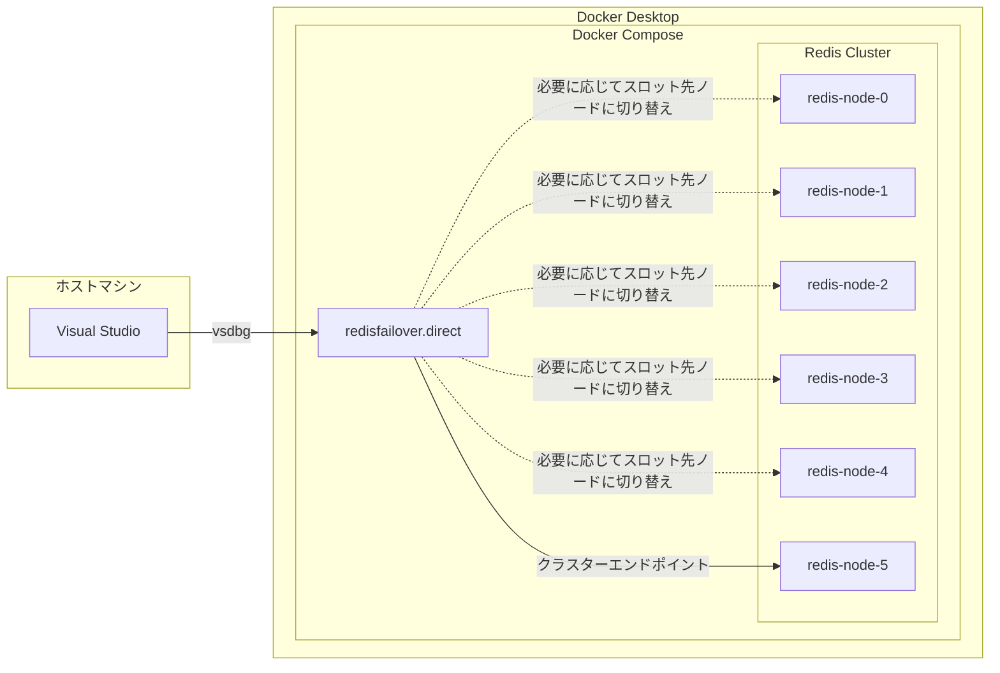

[以前の記事](https://tech.guitarrapc.com/entry/2023/05/16/000000)で、Docker Composeを使ってローカルマシンにRedis Clusterを構築しました。
今回は少し発展させて、Visual Studioで同Docker Composeにアプリケーションをコンテナ起動 & デバッグ実行する方法を紹介します。

[:contents]

# 接続図

ちょっと何を言っているかよくわからないってなりそうなので、まずはどのような接続をしたいのかを説明します。

Docker Composeを使ってRedis ClusterとVisual Studioのアプリケーションをコンテナ起動します。Visual StudioのDocker Compose統合でコンテナ実行したアプリケーションをデバッグ実行できるという寸法です。
Docker Composeのファイル的には次のようなイメージです。

```yaml
services:
  # Visual Studoでデバッグ実行するアプリケーション
  redisfailover.direct:
    image: ${DOCKER_REGISTRY-}redisfailoverdirect
    build:
      context: src/Redis/RedisFailover.Direct
      dockerfile: Dockerfile

  # Redis Cluster
  redis-node-0:
    image: docker.io/bitnami/redis-cluster:7.2
    environment:
      - 'REDIS_PASSWORD=bitnami'
      - 'REDIS_NODES=redis-node-0 redis-node-1 redis-node-2 redis-node-3 redis-node-4 redis-node-5'

  redis-node-1:
    image: docker.io/bitnami/redis-cluster:7.2
    environment:
      - 'REDIS_PASSWORD=bitnami'
      - 'REDIS_NODES=redis-node-0 redis-node-1 redis-node-2 redis-node-3 redis-node-4 redis-node-5'

  redis-node-2:
    image: docker.io/bitnami/redis-cluster:7.2
    environment:
      - 'REDIS_PASSWORD=bitnami'
      - 'REDIS_NODES=redis-node-0 redis-node-1 redis-node-2 redis-node-3 redis-node-4 redis-node-5'

  redis-node-3:
    image: docker.io/bitnami/redis-cluster:7.2
    environment:
      - 'REDIS_PASSWORD=bitnami'
      - 'REDIS_NODES=redis-node-0 redis-node-1 redis-node-2 redis-node-3 redis-node-4 redis-node-5'

  redis-node-4:
    image: docker.io/bitnami/redis-cluster:7.2
    environment:
      - 'REDIS_PASSWORD=bitnami'
      - 'REDIS_NODES=redis-node-0 redis-node-1 redis-node-2 redis-node-3 redis-node-4 redis-node-5'

  redis-node-5:
    image: docker.io/bitnami/redis-cluster:7.2
    depends_on:
      - redis-node-0
      - redis-node-1
      - redis-node-2
      - redis-node-3
      - redis-node-4
    environment:
      - 'REDIS_PASSWORD=bitnami'
      - 'REDISCLI_AUTH=bitnami'
      - 'REDIS_CLUSTER_REPLICAS=1'
      - 'REDIS_NODES=redis-node-0 redis-node-1 redis-node-2 redis-node-3 redis-node-4 redis-node-5'
      - 'REDIS_CLUSTER_CREATOR=yes'
    ports:
      - 6379:6379
```

図にすると次のような構成です。ポイントは「ホストからRedis Clusterの各ノードにはホスト名で直接接続できない」制約です。Docker Compose内で解決される各ホスト名を使ってRedis Clusterの各ノードをつないでいるため、スロット先の接続先がこのホスト名になります。このホスト名はホストマシンからは解決できないので、ホストマシンからRedis Clusterのエンドポイントに接続しても、スロットが別ノードの場合にホストからそのノードへの接続名[^1]が解決できません。

そこで、Visual StudioのDocker Compose統合を使って、アプリケーションを同Docker Composeにコンテナ起動します。Visual Studioは同コンテナ上のアプリケーションにデバッガーをさした状態になるというわけです。ホストから繋げないことは別に問題ではなく、Visual Studioでデバッグできればいいでしょ?という考え方です。




# Visual StudioのDocker Compose統合

Visual Studioにはコンテナオーケストレーションサポートがあります。csprojを右クリック > Add > Container Orchestrator Support... でDocker Composeを追加できます。


追加するとslnと同じパスに以下のファイルができます。

* docker-compose.dcproj
* docker-compose.override.yml
* docker-compose.yml
* .dockerignore

見慣れない`docker-compose.dcproj`はVisual StudioのDocker Compose統合の象徴で、このファイルがVisual Studioで認識されると、Visual Studioに`Docker Compose`プロファイルができて、指定したcsprojのアプリケーションをコンテナビルド & Docker Composeで実行します。


docker-compose.yamlには右クリックしたcsprojのコンテナ定義が書かれており、docker-compose.override.ymlにはデバッグ実行用のオーバーライド設定が書かれています。ASP.NET Coreのロガーやエンドポイント指定されているのがわかりますね。

```yaml
# docker-compose.yaml
services:
  redisfailover.direct:
    image: ${DOCKER_REGISTRY-}redisfailoverdirect
    build:
      context: src/Redis/RedisFailover.Direct
      dockerfile: Dockerfile

# docker-compose.override.yml
services:
  redisfailover.direct:
    environment:
      - ASPNETCORE_ENVIRONMENT=Development
      - ASPNETCORE_HTTP_PORTS=8080
    ports:
      - "8080"
```

このdocker-compose.yamlを見ると、ほかのコンテナと名前解決できる状態で起動できそうですね?次節でRedis Clusterを追加します。

# Redis ClusterをDocker Composeに追加

Visual StudioのDocker Compose統合で追加された`docker-compose.yml`にRedis Clusterを追加します。これでVisual StudioのDocker Composeプロファイルでデバッグ実行すると、Redis Clusterとアプリケーションが同じDocker Composeで起動されます。

```yaml
services:
  redisfailover.direct:
    image: ${DOCKER_REGISTRY-}redisfailoverdirect
    build:
      context: src/Redis/RedisFailover.Direct
      dockerfile: Dockerfile

  redis-node-0:
    image: docker.io/bitnami/redis-cluster:7.2
    environment:
      - 'REDIS_PASSWORD=bitnami'
      - 'REDIS_NODES=redis-node-0 redis-node-1 redis-node-2 redis-node-3 redis-node-4 redis-node-5'

  redis-node-1:
    image: docker.io/bitnami/redis-cluster:7.2
    environment:
      - 'REDIS_PASSWORD=bitnami'
      - 'REDIS_NODES=redis-node-0 redis-node-1 redis-node-2 redis-node-3 redis-node-4 redis-node-5'

  redis-node-2:
    image: docker.io/bitnami/redis-cluster:7.2
    environment:
      - 'REDIS_PASSWORD=bitnami'
      - 'REDIS_NODES=redis-node-0 redis-node-1 redis-node-2 redis-node-3 redis-node-4 redis-node-5'

  redis-node-3:
    image: docker.io/bitnami/redis-cluster:7.2
    environment:
      - 'REDIS_PASSWORD=bitnami'
      - 'REDIS_NODES=redis-node-0 redis-node-1 redis-node-2 redis-node-3 redis-node-4 redis-node-5'

  redis-node-4:
    image: docker.io/bitnami/redis-cluster:7.2
    environment:
      - 'REDIS_PASSWORD=bitnami'
      - 'REDIS_NODES=redis-node-0 redis-node-1 redis-node-2 redis-node-3 redis-node-4 redis-node-5'

  redis-node-5:
    image: docker.io/bitnami/redis-cluster:7.2
    depends_on:
      - redis-node-0
      - redis-node-1
      - redis-node-2
      - redis-node-3
      - redis-node-4
    environment:
      - 'REDIS_PASSWORD=bitnami'
      - 'REDISCLI_AUTH=bitnami'
      - 'REDIS_CLUSTER_REPLICAS=1'
      - 'REDIS_NODES=redis-node-0 redis-node-1 redis-node-2 redis-node-3 redis-node-4 redis-node-5'
      - 'REDIS_CLUSTER_CREATOR=yes'
    ports:
      - 6379:6379
```

もう1つ、アプリケーションの`appsettings.json`にDocker Composeで起動したRedis Clusterへの接続情報を書いておきましょう。

```json
{
  "ConnectionStrings": {
    "Redis1": "redis-node-5:6379,ssl=false,keepAlive=60,password=bitnami",
    "Redis2": "redis-node-5:6379,ssl=false,keepAlive=60,password=bitnami"
  }
}
```

用意完了です。簡単ですね。

# デバッグ実行

Docker Composeプロファイルでデバッグ実行しましょう。


Containers Windowを見ると、dockercomposeとしてRedis Clusterの各ノードとアプリケーションコンテナがまとめて起動しているのがわかります。


Containers WindowのLogsをみると、Redis Clusterの各ノードが起動しているのがわかります。


このアプリケーションはSwagger統合しているASP.NET Coreアプリケーションなので、デバッグ実行したことでコンテナのSwagger UIが自動的に起動します。


RedisへのSetStringを実行すると無事に実行でき、ログにはRedis Cluster接続も確認できます。


```
RedisFailover.Direct | info: RedisFailover.Direct.Infrastructures.ElastiCacheConnectionContext[0]
RedisFailover.Direct |       Connecting to redis: ElastiCache/Unspecified/redis-node-5:6379
```

このアプリケーションは、[以前の記事](https://tech.guitarrapc.com/entry/2025/01/25/235900)で紹介したフェイルオーバー処理が入っています。そこで、アプリケーションが接続していたRedis-node-05を終了させてみましょう。ログから接続切断イベントを拾って別ノードとつながって自動復旧しているのがわかります。


ちなみに複数ノードをストップさせることで、CLUSTER DOWNを再現したり、そこからノードを起動してコネクションが自動復旧することも確認できます。

# ローカルRedis Clusterを組んでもフェイルオーバー処理の確認は難しい

この簡易的な仕組みはRedis Clusterの中に6シャード(0-5)を起動しています。しかしレプリカは存在しません。このため、ElastiCacheやMemoryDBに期待するようなレプリカのフェイルオーバー処理を組むのは困難です。

このため、フェイルオーバー処理を確認するなら、基本的な接続切断回りまではこの仕組みで動作確認しつつ、フェイルオーバー挙動自体はElastiCacheやMemoryDBを用いて確認したほうがいいでしょう。

# まとめ

Redis ClusterとVisual Studioを連携させて、アプリケーションのデバッグ実行をできることを示しました。コンテナを使うメリットはホストマシンにアプリケーションを構築せず、こういった検証が簡単にできることです。また、Visual StudioのDocker Compose統合はコンテナのデバッグ実行を簡単にできるので、ぜひ使ってみてください。

Redis Clusterの仕組みは軽くしか触れていないので、Redis Clusterの仕組みを理解したい方は[Redis cluster specification | Docs | Redis](https://redis.io/docs/latest/operate/oss_and_stack/reference/cluster-spec/)を参照してください。Redis Clusterを知るいいチャンスです。

[^1]: クライアントに通知されるスロット先のノード接続先は、Redis Clusterにノード参加時のホスト名になるため。
