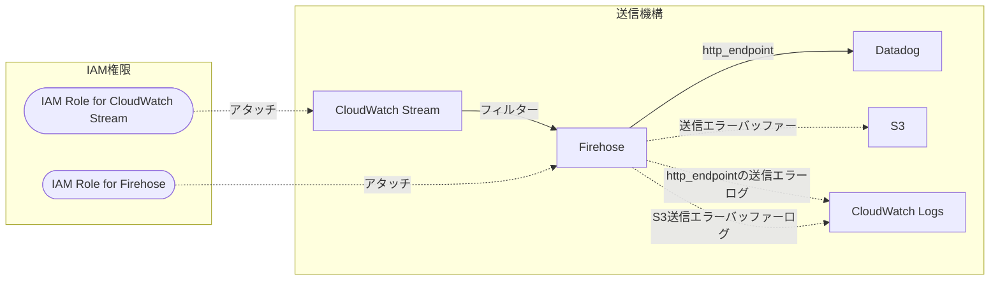

前回の[記事](https://tech.guitarrapc.com/entry/2025/02/23/235900)でDatadogにCloudWatch Metric Streamを使ってメトリクスを送信するCloudFormation StackをPulumi/Terraformから呼び出す方法を書きました。今回は、CloudFormation StackでやっていることをPulumi C#にポートします。

[:contents]

# なぜポートするのか

そもそもCloudFormation Stackで何も問題ないならポートする必要はありません。しかし、現状のCloudFormation Stackはそのまま使うのを躊躇う理由が2つあります。

* CloudWatch Stream用のCloudFormation StackをPulumi/Terraformから呼び出すとParameterに毎回diffが出る
* CloudFormation Stackで作ったリソースの権限エラーが出ると対応が面倒

毎回diffが出るのは地味にいやですし、IgnoreChangesで無視するにもDatadogApiKeyで発生するので避けたいところです。CloudFormationが他のIaCより面倒なのがテンプレートのUrl参照していると対処がシームレスにできないことです。テンプレートを修正したくても手間で気が進まいないのは、IaCの共有基盤としては難しいものがあります。コードでかかれていたり、テンプレートYAMLが直接書かれている[^1]なら一瞬なのに!!

幸いベースとなるCloudFormationに大きな変更が入ることは考えにくいため、CloudFormation由来のわずらわしさを回避すべくPulumiにポートしてしまおうというのが今回の動機です。

# Pulumi C#でどう書き進めるか

少し前なら自分で書け一択でしたが、今なら生成AIにCloudFormationからPulumiコードに変換させてもいいでしょう。[^2]ただ、CloudFormation Stackでできたリソースやコードを参考に手で書くことで、CloudWatch StreamからHttp Endpointにどうやって送るか理解できるので、今回は手でポートしましょう。

コードを書く前に、構築するAWSリソースの全体像を先に把握しましょう。

CloudFormation Stackで作成されるリソースは以下の通りです。


Templateの図だとこうですね。


Mermaidで構成を起こすと次のようになります。

<details><summary>Mermaidコード</summary>



</details>


# PulumiでDatadogへのメトリクス送信を書く

CloudFormation Stackをベースに、Pulumiへポートしつつ書きます。普段、私は自前のComponentを使ってIAMやS3は簡単にかけるようにしているのですが、今回はすべてのコードをフラットに書き並べます。

```csharp
using Pulumi;
using Pulumi.Aws.CloudWatch;
using Pulumi.Aws.CloudWatch.Inputs;
using Pulumi.Aws.Iam;
using Pulumi.Aws.Iam.Inputs;
using Pulumi.Aws.Kinesis;
using Pulumi.Aws.Kinesis.Inputs;
using Pulumi.Aws.S3;
using Pulumi.Aws.S3.Inputs;

// わかりやすさのため雑クラスを用意していますが、実際にはComponentクラスとして用意するほうがいいです。
public static class DatadogMetricStream
{
    public static void Create(string name, DatadogMetricStreamArgs args)
    {
        var accountId = Output.Create(Pulumi.Aws.GetCallerIdentity.InvokeAsync()).Apply(x => x.AccountId);
        var bucketNamePrefix = $"{name}-backup";

        args.Validate();

        // iam
        var firehoseIam = CreateIamRole($"{name}-firehose-role", new CustomResourceOptions(), ["firehose.amazonaws.com"], Output.Create($$"""
        {
            "Version": "2012-10-17",
            "Statement": [
            {
                "Effect": "Allow",
                "Action": [
                    "s3:AbortMultipartUpload",
                    "s3:GetBucketLocation",
                    "s3:GetObject",
                    "s3:ListBucket",
                    "s3:ListBucketMultipartUploads",
                    "s3:PutObject"
                ],
                "Resource": [
                    "arn:aws:s3:::{{bucketNamePrefix}}-*",
                    "arn:aws:s3:::{{bucketNamePrefix}}-*/*"
                ]
            }
            ]
        }
        """));
        var metricStreamIam = CreateIamRole($"{name}-metricstream-role", new CustomResourceOptions(), ["streams.metrics.cloudwatch.amazonaws.com"], accountId.Apply(x => $$"""
        {
          "Version": "2012-10-17",
          "Statement": [
            {
                "Effect": "Allow",
                "Action": [
                  "firehose:PutRecord",
                  "firehose:PutRecordBatch"
                ],
                "Resource": [
                  "arn:aws:firehose:*:{{x}}:deliverystream/{{name}}"
                ]
            }
          ]
        }
        """));

        // this region
        {
            var opt = new CustomResourceOptions();
            var region = Output.Create(Pulumi.Aws.GetRegion.InvokeAsync()).Apply(x => x.Id);
            CreateResource(name, accountId, region, "", firehoseIam.Arn, metricStreamIam.Arn, bucketNamePrefix, opt, args);
        }

        // Additional region
        foreach (var (region, provider) in args.AdditionalProviders)
        {
            var opt = new CustomResourceOptions { Provider = provider };
            CreateResource(name, accountId, Output.Create(region), $"-{region}", firehoseIam.Arn, metricStreamIam.Arn, bucketNamePrefix, opt, args);
        }
    }

    private static Role CreateIamRole(string name, CustomResourceOptions opt, IReadOnlyList<string> serviceIdentifiers, Output<string> policyJson)
    {
        var role = new Role(name, new()
        {
            Name = name,
            Description = $"Datadog Metric Stream Role for {name}",
            AssumeRolePolicy = Output.Create(Pulumi.Aws.Iam.GetPolicyDocument.InvokeAsync(new GetPolicyDocumentArgs
            {
                Version = "2012-10-17",
                Statements = [
                    new ()
                    {
                        Effect = "Allow",
                        Actions = ["sts:AssumeRole"],
                        Principals = [
                            new ()
                            {
                                Type = "Service",
                                Identifiers = [.. serviceIdentifiers],
                            },
                        ],
                    },
                ],
            })).Apply(x => x.Json),
            InlinePolicies = [
                new RoleInlinePolicyArgs
                {
                    Name = $"{name}-policy",
                    Policy = policyJson,
                },
            ],
        }, opt);
        return role;
    }

    private static void CreateResource(
        string name,
        Output<string> accountId,
        Output<string> region,
        string regionSuffix,
        Output<string> firehoseIamRoleArn,
        Output<string> metricstreamIamRoleArn,
        string bucketNamePrefix,
        CustomResourceOptions opt,
        DatadogMetricStreamArgs args
    )
    {
        // loggroup for firehose
        var cloudwatchLogGroup = new LogGroup($"{name}-loggroup{regionSuffix}", new()
        {
            Name = $"{name}-loggroup",
            RetentionInDays = 14,
        }, opt);
        var endpointLogStream = new LogStream($"{name}-endpoint-logstream{regionSuffix}", new()
        {
            LogGroupName = cloudwatchLogGroup.Name,
            Name = "http_endpoint_delivery",
        }, opt);
        var s3BackuperrorLogStream = new LogStream($"{name}-s3backuperror-logstream{regionSuffix}", new()
        {
            LogGroupName = cloudwatchLogGroup.Name,
            Name = "s3_backup",
        }, opt);

        // s3 for firehose
        var bucket = new BucketV2($"{name}-s3-bucket{regionSuffix}", new()
        {
            Bucket = Output.Tuple(accountId, region).Apply(x => $"{bucketNamePrefix}-{x.Item1}-{x.Item2}"),
            ForceDestroy = true,
        }, opt);
        _ = new BucketOwnershipControls($"{name}-ownershipcontrol{regionSuffix}", new()
        {
            Bucket = bucket.Id,
            Rule = new BucketOwnershipControlsRuleArgs
            {
                ObjectOwnership = "BucketOwnerPreferred"
            },
        }, opt);
        _ = new BucketServerSideEncryptionConfigurationV2($"{name}-sse{regionSuffix}", new()
        {
            Bucket = bucket.Id,
            Rules =
           [
               new BucketServerSideEncryptionConfigurationV2RuleArgs
                {
                    ApplyServerSideEncryptionByDefault = new BucketServerSideEncryptionConfigurationV2RuleApplyServerSideEncryptionByDefaultArgs
                    {
                        SseAlgorithm = "AES256",
                    },
                    BucketKeyEnabled = true,
                }
            ],
        }, opt);

        // firehose
        var firhose = new FirehoseDeliveryStream($"{name}-delivery{regionSuffix}", new()
        {
            Name = name,
            Destination = "http_endpoint",
            HttpEndpointConfiguration = new FirehoseDeliveryStreamHttpEndpointConfigurationArgs
            {
                Name = "Event intake",
                // Destination settings
                Url = $"https://awsmetrics-intake.{args.DdSite}/api/v2/awsmetrics?dd-protocol=aws-kinesis-firehose",
                AccessKey = args.DatadogApiKey,
                RetryDuration = 60, // 60s
                BufferingSize = 4, // 4MiB
                BufferingInterval = 60, // 60s
                RequestConfiguration = new FirehoseDeliveryStreamHttpEndpointConfigurationRequestConfigurationArgs
                {
                    ContentEncoding = "NONE", // not a gzip
                },
                // Backup settings
                S3BackupMode = "FailedDataOnly",
                S3Configuration = new FirehoseDeliveryStreamHttpEndpointConfigurationS3ConfigurationArgs
                {
                    BucketArn = bucket.Arn,
                    ErrorOutputPrefix = "datadog_stream",
                    BufferingSize = 4,
                    BufferingInterval = 60,
                    CompressionFormat = "GZIP",
                    RoleArn = firehoseIamRoleArn,
                    CloudwatchLoggingOptions = new FirehoseDeliveryStreamHttpEndpointConfigurationS3ConfigurationCloudwatchLoggingOptionsArgs
                    {
                        Enabled = true,
                        LogGroupName = cloudwatchLogGroup.Name,
                        LogStreamName = s3BackuperrorLogStream.Name,
                    },
                },
                CloudwatchLoggingOptions = new FirehoseDeliveryStreamHttpEndpointConfigurationCloudwatchLoggingOptionsArgs
                {
                    Enabled = true,
                    LogGroupName = cloudwatchLogGroup.Name,
                    LogStreamName = endpointLogStream.Name,
                },
                RoleArn = firehoseIamRoleArn,
            },
        }, opt);

        // cloudwatch metric streams
        var metricstreamArgs = new MetricStreamArgs()
        {
            Name = name,
            FirehoseArn = firhose.Arn,
            RoleArn = metricstreamIamRoleArn,
            OutputFormat = "opentelemetry0.7", // 0.7にしか対応していない
            StatisticsConfigurations = GetStatisticsConfigurations(args.AdditionalMetrics),
        };
        if (args.IncludeFilters.Any())
        {
            metricstreamArgs.IncludeFilters = args.IncludeFilters.Select(x => new MetricStreamIncludeFilterArgs
            {
                MetricNames = x.MetricName,
                Namespace = x.Namespace,
            })
            .ToList();
        }
        if (args.ExcludeFilters.Any())
        {
            metricstreamArgs.ExcludeFilters = args.ExcludeFilters.Select(x => new MetricStreamExcludeFilterArgs
            {
                MetricNames = x.MetricName,
                Namespace = x.Namespace,
            })
            .ToList();
        }
        var cloudwatchStreams = new MetricStream($"{name}-stream{regionSuffix}", metricstreamArgs, opt);
    }

    private static InputList<MetricStreamStatisticsConfigurationArgs> GetStatisticsConfigurations(DatadogMetricStreamArgs.AdditionalMetric metrics)
    {
        var configs = new InputList<MetricStreamStatisticsConfigurationArgs>();
        // has Elb
        if ((metrics & DatadogMetricStreamArgs.AdditionalMetric.Elb) != DatadogMetricStreamArgs.AdditionalMetric.None)
        {
            configs.AddRange([
                new MetricStreamStatisticsConfigurationArgs
            {
                IncludeMetrics = [
                    new MetricStreamStatisticsConfigurationIncludeMetricArgs
                    {
                        MetricName = "TargetResponseTime",
                        Namespace = "AWS/ApplicationELB",
                    }
                ],
                AdditionalStatistics = ["p50", "p90", "p95", "p99"],
            },
            new MetricStreamStatisticsConfigurationArgs
            {
                IncludeMetrics = [
                    new MetricStreamStatisticsConfigurationIncludeMetricArgs
                    {
                        MetricName = "Latency",
                        Namespace = "AWS/ELB",
                    },
                    new MetricStreamStatisticsConfigurationIncludeMetricArgs
                    {
                        MetricName = "TargetResponseTime",
                        Namespace = "AWS/ELB",
                    }
                ],
                AdditionalStatistics = ["p95", "p99"],
            }]);
        }
        // has S3
        if ((metrics & DatadogMetricStreamArgs.AdditionalMetric.S3) != DatadogMetricStreamArgs.AdditionalMetric.None)
        {
            configs.Add(new MetricStreamStatisticsConfigurationArgs
            {
                IncludeMetrics = [
                    new MetricStreamStatisticsConfigurationIncludeMetricArgs
                {
                    MetricName = "FirstByteLatency",
                    Namespace = "AWS/S3",
                },
                new MetricStreamStatisticsConfigurationIncludeMetricArgs
                {
                    MetricName = "TotalRequestLatency",
                    Namespace = "AWS/S3",
                }
                ],
                AdditionalStatistics = ["p50", "p90", "p95", "p99", "p99.9"],
            });
        }
        // has ApiGateway
        if ((metrics & DatadogMetricStreamArgs.AdditionalMetric.ApiGateway) != DatadogMetricStreamArgs.AdditionalMetric.None)
        {
            configs.Add(new MetricStreamStatisticsConfigurationArgs
            {
                IncludeMetrics = [
                    new MetricStreamStatisticsConfigurationIncludeMetricArgs
                {
                    MetricName = "IntegrationLatency",
                    Namespace = "AWS/ApiGateway",
                },
                new MetricStreamStatisticsConfigurationIncludeMetricArgs
                {
                    MetricName = "Latency",
                    Namespace = "AWS/ApiGateway",
                }
                ],
                AdditionalStatistics = ["p90", "p95", "p99"],
            });
        }
        // has Lambda
        if ((metrics & DatadogMetricStreamArgs.AdditionalMetric.Lambda) != DatadogMetricStreamArgs.AdditionalMetric.None)
        {
            configs.AddRange([
                new MetricStreamStatisticsConfigurationArgs
            {
                IncludeMetrics = [
                    new MetricStreamStatisticsConfigurationIncludeMetricArgs
                    {
                        MetricName = "ExecutionTime",
                        Namespace = "AWS/States",
                    },
                    new MetricStreamStatisticsConfigurationIncludeMetricArgs
                    {
                        MetricName = "LambdaFunctionRunTime",
                        Namespace = "AWS/States",
                    },
                    new MetricStreamStatisticsConfigurationIncludeMetricArgs
                    {
                        MetricName = "LambdaFunctionScheduleTime",
                        Namespace = "AWS/States",
                    },
                    new MetricStreamStatisticsConfigurationIncludeMetricArgs
                    {
                        MetricName = "LambdaFunctionTime",
                        Namespace = "AWS/States",
                    },
                    new MetricStreamStatisticsConfigurationIncludeMetricArgs
                    {
                        MetricName = "ActivityRunTime",
                        Namespace = "AWS/States",
                    },
                    new MetricStreamStatisticsConfigurationIncludeMetricArgs
                    {
                        MetricName = "ActivityScheduleTime",
                        Namespace = "AWS/States",
                    },
                    new MetricStreamStatisticsConfigurationIncludeMetricArgs
                    {
                        MetricName = "ActivityTime",
                        Namespace = "AWS/States",
                    },
                ],
                AdditionalStatistics = ["p95", "p99"],
            },
            new MetricStreamStatisticsConfigurationArgs
            {
                IncludeMetrics = [
                    new MetricStreamStatisticsConfigurationIncludeMetricArgs
                    {
                        MetricName = "Duration",
                        Namespace = "AWS/Lambda",
                    },
                ],
                AdditionalStatistics = ["p50", "p90", "p95", "p99", "p99.9"],
            },
            new MetricStreamStatisticsConfigurationArgs
            {
                IncludeMetrics = [
                    new MetricStreamStatisticsConfigurationIncludeMetricArgs
                    {
                        MetricName = "PostRuntimeExtensionsDuration",
                        Namespace = "AWS/Lambda",
                    },
                ],
                AdditionalStatistics = ["p50","p99"],
            },
        ]);
        }
        // has AppSync
        if ((metrics & DatadogMetricStreamArgs.AdditionalMetric.AppSync) != DatadogMetricStreamArgs.AdditionalMetric.None)
        {
            configs.Add(new MetricStreamStatisticsConfigurationArgs
            {
                IncludeMetrics = [
                        new MetricStreamStatisticsConfigurationIncludeMetricArgs
                    {
                        MetricName = "Latency",
                        Namespace = "AWS/AppSync",
                    },
                ],
                AdditionalStatistics = ["p50", "p99"],
            });
        }
        // has AppRunner
        if ((metrics & DatadogMetricStreamArgs.AdditionalMetric.AppRunner) != DatadogMetricStreamArgs.AdditionalMetric.None)
        {
            configs.Add(new MetricStreamStatisticsConfigurationArgs
            {
                IncludeMetrics = [
                        new MetricStreamStatisticsConfigurationIncludeMetricArgs
                    {
                        MetricName = "RequestLatency",
                        Namespace = "AWS/AppRunner",
                    },
                ],
                AdditionalStatistics = ["p50", "p95", "p99"],
            });
        }

        return configs;
    }
}

public record DatadogMetricStreamArgs
{
    /// <summary>
    /// Datadog API Keyを指定します。
    /// </summary>
    public required Output<string> DatadogApiKey { get; init; }
    /// <summary>
    /// Datadogのサイトを指定します。デフォルトは datadoghq.com です。
    /// </summary>
    public string DdSite { get; init; } = "datadoghq.com";
    /// <summary>
    /// USリージョンに作成する必要があるため、プロバイダーを指定します。
    /// </summary>
    public required IReadOnlyList<(string region, Pulumi.Aws.Provider provider)> AdditionalProviders { get; init; }
    /// <summary>
    /// CloudWatch MetricStreamで追加するメトリクス種別を指定します。デフォルトは<see cref="AdditionalMetric.All"/>
    /// </summary>
    public AdditionalMetric AdditionalMetrics { get; init; } = AdditionalMetric.All;
    /// <summary>
    /// メトリクスの除外フィルタリング条件を指定します。<see cref="IncludeFilters"/>と同時に指定できません。
    /// </summary>
    public IReadOnlyList<MetricsFilterItem> ExcludeFilters { get; init; } = [];
    /// <summary>
    /// メトリクスの絞り込みフィルタリング条件を指定します。<see cref="ExcludeFilters"/>と同時に指定できません。
    /// </summary>
    public IReadOnlyList<MetricsFilterItem> IncludeFilters { get; init; } = [];

    public void Validate()
    {
        if (ExcludeFilters.Any() && IncludeFilters.Any())
        {
            throw new ArgumentException("ExcludeFilters and IncludeFilters cannot be set at the same time. Please specify one of them.");
        }
    }

    /// <summary>
    /// メトリクスのフィルタリング条件を指定します。
    /// </summary>
    public record MetricsFilterItem
    {
        /// <summary>
        /// メトリクスの名前空間を指定ます。
        /// </summary>
        public required string Namespace { get; init; }
        /// <summary>
        /// メトリクスの名前を指定します。
        /// </summary>
        public required string MetricName { get; init; }
    }

    [Flags]
    public enum AdditionalMetric
    {
        /// <summary>
        /// 何も追加しません。
        /// </summary>
        None = 0,
        /// <summary>
        /// ELBのメトリクスを追加します。
        /// </summary>
        Elb = 1 << 0,
        /// <summary>
        /// S3のメトリクスを追加します。
        /// </summary>
        S3 = 1 << 1,
        /// <summary>
        /// API Gatewayのメトリクスを追加します。
        /// </summary>
        ApiGateway = 1 << 2,
        /// <summary>
        /// Lambdaのメトリクスを追加します。
        /// </summary>
        Lambda = 1 << 3,
        /// <summary>
        /// AppSyncのメトリクスを追加します。
        /// </summary>
        AppSync = 1 << 4,
        /// <summary>
        /// AppRunnerのメトリクスを追加します。
        /// </summary>
        AppRunner = 1 << 5,
        /// <summary>
        /// すべてのメトリクスを追加します
        /// </summary>
        All = Elb | S3 | ApiGateway | Lambda | AppSync | AppRunner,
    }
}
```

早速AWSリソースを構築してみましょう。ap-northeast-1リージョンとus-east-1リージョンで作成するように呼び出します。

```cs
using Pulumi;
using Pulumi.Aws;

return await Pulumi.Deployment.RunAsync(() =>
{
  var config = new Pulumi.Config();
  var datadogApiKey = config.RequireSecret("datadogApiKeyのコンフィグキー");

  DatadogMetricStream.Create("datadog-metric-stream", new DatadogMetricStreamArgs
  {
      DatadogApiKey = datadogApiKey,
      AdditionalProviders = [
        ("us-east-1", new Pulumi.Aws.Provider("us-east-1", new(){ Region = "us-east-1", }))
      ],
      AdditionalMetrics = DatadogMetricStreamArgs.AdditionalMetric.S3 | DatadogMetricStreamArgs.AdditionalMetric.Lambda | DatadogMetricStreamArgs.AdditionalMetric.Elb, // 追加メトリクスを絞り込み
  });
});
```

`pulumi up`でリソースを作成すると、CloudFormation Stackと同様にFirehoseやCloudWatch Metric Streamが作られたことを確認できます。

| リソース名 | 状態 |
| --- | --- |
| CloudWatch Metric Stream |  |
| Firhose |  |

DatadogでもCloudWatch Metric Streamからメトリクスが送信されていることが確認できます。


# まとめ

ポートした時のコード量を考えると悩ましいところです。ただ、仕組みに対して完全に制御下におけるのはおいしく、CloudWatch Metric Streamのフィルターも自在にかけるのでやるだけの価値はあります。

CloudFormation Stackあるあるですが、最終的に自分のIaCに落とし込むと、運用が楽になるのはあるあるです。こういう時、CloudFormationの使い勝手の悪さに疲れてCDK/Pulumi/Terraformを使ったほうがベターだと思考が流れやすいと自覚しています。

[^1]: 埋め込みテンプレートは文字数制限があるので主流になりえない。
[^2]: もし生成AIの利用に支障がないなら一番楽、ほぼ動作するコードを期待できます。
