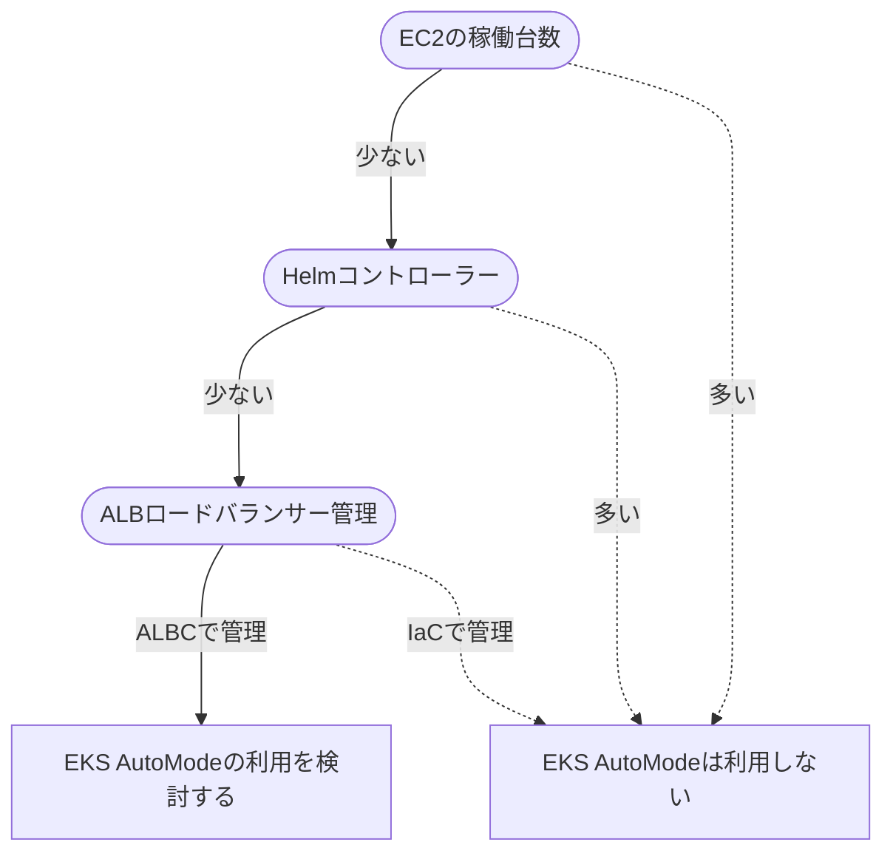

2024/12/1にre:Inventで[発表](https://aws.amazon.com/jp/about-aws/whats-new/2024/12/amazon-eks-auto-mode/)されたEKS AutoModeと通常モードの違いについてまとめます。
AWSとしては、EKS AutoModeを今後EKSを構築する時のスタンダードにしていきたいんだろうなと感じます。ただ、AutoModeはEKS AddonやKarpenterをはじめ、組み込みコンポーネントが隠蔽されており違いを知っておかないと戸惑う感じがあります。

本記事ではEKS AutoModeを構築、通常モードで組むようなKarpenter操作を加えて違いを見ていきます。

[:contents]

# EKS AutoModeのコンセプト

EKS AutoModeの[コンセプト](https://aws.amazon.com/jp/blogs/containers/getting-started-with-amazon-eks-auto-mode/)を見ると、クラスター管理をAWSにオフロードしてアプリケーション開発へフォーカスできることを狙っているようです。その例として、次の図が示されています。

これまでのEKSではAddOnsやEC2インスタンスをユーザー管理していたのに対して、Auto Modeはストレージ/コンピュート/ロードバランサー管理をAWSが担保しEC2にも関与するようになっています。

> Before Auto Mode
>
> 

> After Auto Mode
>
> 

# コンセプトから受ける印象と実情

コンセプト図から、EKS AutoModeは次のような印象を抱きます。

* EKS AddonsはAWSが管理するためユーザーは導入不要になった
* EC2のオートスケールはAWSに完全お任せできる
* IngressからLB作成や管理、TargetGroup紐づけも任せられる
* 作成されたALBやEBS、EC2は引き続きユーザーが関与できる

実際使ってみると、期待に近いものの従来のEKS管理から見るとそこまで楽になったかは悩ましい側面もあります。また、以下2点はコンセプトから読み解けないでしょう。

* Helmはどうなるのか
* Podの水平スケールがどうなるのか

それぞれ見ていきましょう。

## EKS AddonsはAWSが管理するためユーザーは導入不要になった

これは受けた印象そのままです。EKS Addonを追加不要、Podも見えなくなったのでマネージドだなという印象と実感が揃っています。ユーザーが追加したEKS Addonは従来通りPodが見えるため違和感はありません。

* ✔️: これまでEKSクラスターで必須といってもよかったCoreDNS、kube-proxy、VPC CNIはAutoModeでは導入不要
* ✔️: Node LocalDNSも組み込みになった
* ✔️: AWS EBS CSI Driverも組み込みになった
* ✔️: EKSPod Identityt Agentも組み込みになった
* ✔️: 組み込まれたコンポーネントのPod等はkubectlで見えずNodeも利用しない
* ⚠️: サードパーティEKS Addonの新Kubernetesバージョン対応は引き続き待つ必要がある
* ⚠️: Mertics Serverは組み込まれておらず、組み込みじゃないEKS Addonを追加するとPodが起動、Nodeも起動する

組み込みになったEKS AddonやコンポーネントはEKSで必須でしたがこれまでは手当が全然なくてつらかったので、AutoModeで組み込まれたことは非常に好ましいです。
組み込みリソースはPodが見えないだけじゃなく、これらのリソース用はNodeが存在しないのに動作するのが不思議な感覚です。

とはいえ、ユーザーが追加したEKS AddonはPodなどリソースが見えますし、Nodeも必要になります。贅沢をいうなら、Metrics ServerはHPAでもKEDAでも必須なので組み込んでほしいものです。

EKS Addonの注意点として、3rdパーティのEKS Addonが利用できるかはEKSのKubernetesに依存します。例えば、現在EKS 1.32が最新ですが3rdパーティEKS Addonの多くは対応していません。各Addon提供者の意欲に依存しているので、EKSアップグレードの可否がEKS Addonに左右されうるのは嫌だなと感じます。

## EC2のオートスケールはAWSに完全お任せできる

完全お任せにはできませんが、限定的なシーンではお任せできます。

* ✔️: EKS AutoModeはKarpenterコントローラーを組み込みで持っている
* ✔️: 任せる場合に使われる`general-purpose`ノードプールは、SPOTは使わない、amd64でしかアプリケーションを動作しない、ストレージサイズは80GB固定、インスタンスタイプもある程度限定される
* ⚠️: 上を1つでも変えたい場合、自分でKarpenterのNodeClass[^1]、NodePool定義を書く必要がある
* ⚠️: AMIは常に最新が利用される(自動パッチ)
* ⚠️: EKS AutoMode管理のKarpenterで作られたEC2は追加料金がかかる(+11-12％程度)

EKS AutoModeのノード水平スケールはKarpenterなので、Karpenter 1.2以上を使っている人なら戸惑うことなく自分のNodeClassやNodePool定義を書くことができます。AutoModeのKarpenterはOSS版Karpenterと全く一緒ではなく、NodeClassとNodePoolのフィールドキーにカスタマイズが入っています。特に注意が必要なのはNodeClassです。EC2NodeClassの代わりに用いるのですが、`amiSelector`がなくなったことでAMIを指定せずとも最新AMIが使われます。AMIを固定できなくなっているので、Linux系のセキュリティインシデント時の対応時に注意が必要そうです。

気になる点はコストです。EKS AutoModeの組み込みKarpenterで起動したEC2インスタンスは追加料金が11-12％程度かかります。オンデマンド・スポットにかかわらず固定金額かかるので、単純にEKS AutoModeにするとコストが12％程度上がると考えても差支えないでしょう[^2]。また、組み込みノードプールはSpotが利用されないので、どのみち自分で書くことになります。

**EC2コスト増加分の個人的所感**

Karpenterコントローラー・従来EKS AddonのPodが見えないことから、EC2コスト追加料金はこれらの稼働分としてかかっているのかなと感じます。しかし、自前で動かしてもKarpenterコントローラーで2Pod動作、EKSAddon各種で6-10pod程度増える程度です。これに対して、全EC2ノードに11-12％コスト上乗せするのはちょっと納得感ありません。

SPやRI、スポットでも1台当たり追加料金は変わらないので、費用低減策をしているほど重くなりますよね。

## IngressからLB作成や管理、TargetGroup紐づけも任せられる

完全お任せにはできませんが、限定的なシーンでお任せできます。TargetGroupBindingは使えないので、ALBはIaCで作って万が一消えないようにしているという人は注意しましょう。

* ✔️: EKS AutoModeはElastic Load Balancingを管理するコントローラーを組み込みで持っている
* ✔️: ALBやNLBをIngress/Serviceで管理する場合は任せられる
* ⚠️: 既存のALBをEKS AutoModeに直接マイグレートできない
* 🆖: [TargetGroupBindingに対応していない](https://github.com/aws/containers-roadmap/issues/2508)

EKS AutoModeではAWS LoadBalancer Controllerを組み込みで持っていると言及しておらず、annotationsではなくIngressClassParamsで構成調整に代わり、フィールド名も異なっているので独自の仕組みになってそうです。

もしもAWS LoadBalancer Controllerを使っている既存EKSクラスターをAuto Modeに変更する場合、[ドキュメント](https://docs.aws.amazon.com/eks/latest/userguide/migrate-auto.html)に沿って、DNSベースのトラフィックシフト(Route53の加重ルーティング)を使うのがいいでしょう。[^3]

## 作成されたALBやEBS、EC2は引き続きユーザーが関与できる

組み込みKarpenterで作られたEC2(AutoMode管理ノード)は、ユーザーの関与が可能な側面とできなくなった側面があります。EC2を直接消せなくなったのは安全ですが、一方で夜間停止などのアプローチ方法が1つ減りました。[^4]

* ✔️: EKS AutoModeで作成されたEC2、ALB、NLB、EBS等はAWSコンソールなど従来通り確認できる
* ⚠️: AutoMode管理のノード(EC2)はユーザーが消せない、ソフトウェア追加できない、SSHできない
* ⚠️: AutoMode管理のノードは最大21日寿命でPDBを使った制御が必須

マネージドインスタンスの[ドキュメント](https://docs.aws.amazon.com/eks/latest/userguide/automode-learn-instances.html)にある通り、EKS AutoModeで起動したEC2はEKS管理下になるため、パッチあて、ソフトウェアインストール、sshはできなくなっています。

特に最大21日寿命なのはワークロードを選びます。ゲームサーバーでよくある「インメモリにデータを持つサーバー」は、時にワールドサーバーと呼ばれる大量常時接続をさばき、長時間起動しっぱなしにするケースがあります。このケースではワールドサーバーの停止はゲームの停止を意味するため、サーバーの入れ替えもタイミングを選ぶことになります。そう、寿命日数とハードリミットされるのと致命的に相性が悪いんですね。
また、寿命があるということは起動タイミングをユーザーが気にしない以上は、PodがいつNodeから追い出されるかタイミングが読めないことを意味します。このため、PDBを使ってPodがどのように入れ替わるか制御する必要があります。PDBを指定しない場合、Podがいつの間にか0のタイミングができます。

## Helmはどうなるのか

AutoModeになっても、Helmは引き続きユーザー管理です。それはそう。そして、EKSで一番つらいのはHelmでもあるので難しさは解消しません。Helmアップグレードは地獄安定。

* ⚠️: EKS AutoModeでもユーザーが自分で導入したHelmは自分で管理が必要

利用するHelmをすべて3rdパーティEKS Addonにすれば楽になる、と考えてしまいそうですが、EKS AddoごとにKubernetesバージョン対応を待つ必要があります。Kubernetes 1.32への対応が3/15時点でもあまり進んでない現状からすると、引き続き自前Helmで導入を選ばざるを得ないケースが多いでしょう。がんばりましょう。

とはいえ、Karpenter、AWS LoadBalancer Controller、EBS CSI Driver、Pod Identity Agent、Node LocalDNSの導入が省けるので多少は楽になりますね。コスト増加と見合ってるとは言い難いですが。

## Podの水平スケールがどうなるのか

EKS AutoModeはNodeの水平スケールは管理しますが、Podの水平スケールは関与しません。

* ⚠️: EKS AutoModeはHPAが利用できる。KEDAを使うなら自前Helm導入が必要

HPAはその単純さから、Kubernetes標準で提供されるPod水平スケールとしては悪くないと考えています。しかし、実際のワークロードはCPU/Memoryではなくキュー残数やリクエスト処理時間などアプリケーションメトリクスをベースにスケール判定することが多いでしょう。また、時間制御、0台制御、一時的なmin増加でのスケールアウトなどを考えると、HPAでは不十分です。

この意味でEKS AutoModeはあくまでもノードレベルの水平スケールまでは管理するが、Podはアプリケーションがやるべきという切り分けが見えます。それはそう、とはいえKEDAぐらいは入れてほしかった。HPAは厳しい。

# EKS AutoModeは使えるのか

あまり手をかけることがない小規模な環境(開発や検証環境含む)でEKS AutoModeは使いやすいと感じます。一方で、大規模な環境(本番環境など)でEKS AutoModeはコスト面から説得力は持ちにくそうです。特に、開発でEKS AutoMode、本番でEKS AutoModeとしてもコントローラーや定義の管理からすると共通化できず嬉しくないのもペインポイントです。

* ✔️: 小規模な環境 (追加Helmがない、EC2台数が少ない)
* ⚠️: 中～大規模な環境 (追加Helmが多い、EC2台数が多い)

EKS AutoModeのコストさえ説得力を持たせられればいいのですが、現時点の料金体系では大規模環境でEKS AutoModeを採用する動機付けは難しいと感じます。また、小規模な環境なら、ECS FargateやLambdaで組んでしまってよいケースは多く、EKSを使う環境で小規模とはというのも難しいです。

AWSコンテナ系アプリケーションで見たときに、クラスターバージョン含めた管理の楽さで`ECS Fargate > ECS EC2 >> EKS AutoMode > EKS`、コスト面で`ECS EC2 > EKS > EKS AutoScale > ECS Fargate`[^5]という感触です。

## EKS AutoModeが実現していること

EKSはマネージドKubernetesと言いつつコントロールプレーン・AWS-Kubernetesアクセス管理・ログ回りなのでは…というこれまでを考えると、EKS AutoModeはよりAWS統合が強くなっています。

必須EKS Addonは考慮不要になりました。Node水平スケールアウトも組み込みKarpenterに任せることができ、EC2の自動更新もしてくれます。ALB/NLBとの統合も任せることができます。EBSマウントもサクッとできますし、Pod Identityもさくっと利用できます。お任せ度が高まっているのは事実です。

## EKS AutoModeのペインポイント

コストとこれまでの運用との差異が見受けられるので、そこに合致するとつらさがあります。EKS AutoMode管理のEC2は一台あたりコストが+11-12％上がります。ALBの安定保持のためIaCでALBを作ってアプリケーションとTargetGroupBindingでつなぐ安全策が取れません。EC2は最大21日寿命で入れ替えタイミングは制御困難です。

また、ユーザー自身がExternalDNSやExternalSecretsのような各種コントローラーをHelmで導入している場合、Helm更新時の手間は軽減していません。PodスケールアウトはPDBしか持っていないため、時間スケールや0 replicasなどが必要ならKEDAを入れざるを得ません。これらは日常的な運用であるため、EKS AutoModeといっても運用が完全に任せられるわけじゃないです。

## EKS AutoModeの採用基準

KubernetesとAWS統合部分が楽になった一方でコストが上がるため、大量のEC2が必要なワークロードではコスト増加が受け入れられるかはカギになるでしょう。また、従来KarpenterやAWS LoadBalancer Controller(ALBC)をはじめとして複数Helmコントローラーを利用していたチームにとっては、Karpenter/ALBCの管理が不要になっても他のHelm管理は残るため楽になったとは感じられない[^6]のが正直なところです。

導入を検討するフローはこういうかんじでしょうか。

<details><summary>フローチャート</summary>



</details>


# EKS AutoModeを使いつつ違いを見る

この記事でEKS AutoModeなるほど、とならず実際に触って感触を確かめてみましょう。EKS AutoModeが従来と決定的に違うのは次のポイントです。

1. 組み込みコンポーネントがある
2. 組み込みノードグループがある
3. 組み込みKarpenterで動作させるEC2は追加料金がかかる
4. 求められるIAMポリシーが異なる
5. EKS Nodeの最大Pod数が110に制限されている
6. Pod SecurityGroupが非サポート
7. カスタムネットワーキングが非サポート

一方で、通常モードとAutoModeで共通しているのは次のポイントです。

* EKSの認証方法は変わらない
* KEDAのようなPodオートスケールは組み込まれていない

順番に見ていきましょう。

## EKS AutoModeが従来と違うポイント

EKS AutoModeを追加EKS Addonがない状態で構築して、そこから状態を見ていきましょう。

### 組み込みコンポーネントがある

EKS AutoModeで何もEKS Addonを追加していない状態でも、EKS AutoModeには組み込みコンポーネントがあります。


組み込まれているのは従来EKS Addonで入れていたものや、Karpenterを含めたAWS連携部分に関わるコントローラーです。EKS AutoModeの組み込みコンポーネントは[次の通り](https://docs.aws.amazon.com/eks/latest/userguide/auto-upgrade.html)です。

* 必須EKS Addonだったkube-proxy/CoreDNS/Amazon VPC CNIが組み込みインストールされ、Podは隠蔽されている
* Karpenterが組み込みインストールされており、Karpenterコントローラーは隠蔽されている
* AWS LoadBalancer Controllerが組み込みインストールされており、ALB Ingress Controllerは隠蔽されている
* AWS EBS CSI Driverが組み込みインストールされている
* EKS Pod Identity Agentが各ノードでインストールされている

一方で、自分でインストールしたHelmやアプリケーションはこれまで通り自分で管理します。自分でEKS Addonから追加したコントローラーも自分で管理します。

組み込みコンポーネントの面白いところは、EKS AutoModeで起動してEKS Addonやアプリケーションを何もデプロイしていない状態でPodを見ると何も起動していないことです。特にPodを起動していないと、NodeClassやNodePoolも見えないのが興味深いです。[^7]

```sh
$ kubectl get po -A
No resources found
$ kubectl get nodeclass
No resources found
$ kubectl get nodepool
```

### 組み込みノードグループがある

EKS AutoModeは`system`と`general-purpose`という組み込みNodeGroupがあります。従来のNodeGroupとは異なり名前が決められており、使うかどうかは任意です。


組み込みノードグループの定義を見てみましょう。組み込みノードグループはKarpenterで動作しており、組み込みノードグループのKarpenter定義は変更できません。

組み込みノードグループは、NodeClass `default`を共通利用してしています。NodeClassは、Karpenterでいうところの[EC2NodeClass](https://karpenter.sh/v1.3/concepts/nodeclasses/)に相当し、NodePoolで起動するEC2のスペックを定義します。EC2のスペックはEKS AutoModeで建てたクラスターと同じセキュリティグループ、サブネットグループになっているのが特徴です。Karpenterではセキュリティグループ、サブネットグループともにタグで検索させるのが主流だったので、これは組み込みの性質を強く感じます。また、KarpenterのEC2NodeClassでは`amiSelector`でAMIバージョンを都度指定する必要がありましたが、NodeClassで指定はできず最新AMIが使われます。

組み込みノードグループの`NodePool`はKaprneterの[NodePool](https://karpenter.sh/v1.3/concepts/nodepools/)と同じスペックですが、`requirements`の一部フィールドがEKS [AutoMode独自](https://docs.aws.amazon.com/ja_jp/eks/latest/userguide/create-node-pool.html)になっています。


それぞれの定義を見てみましょう。

<details><summary>NodeClass `default`</summary>

```sh
$ kubetl get nodeclass default -o yaml | kubetl neat
apiVersion: eks.amazonaws.com/v1
kind: NodeClass
metadata:
  annotations:
    eks.amazonaws.com/nodeclass-hash: "3399735243323253970"
    eks.amazonaws.com/nodeclass-hash-version: v1
  labels:
    app.kubernetes.io/managed-by: eks
  name: default
spec:
  ephemeralStorage:
    iops: 3000
    size: 80Gi
    throughput: 125
  networkPolicy: DefaultAllow
  networkPolicyEventLogs: Disabled
  role: automode-eks-AmazonEKSAutoNodeRole
  securityGroupSelectorTerms:
  - id: sg-1234567890
  snatPolicy: Random
  subnetSelectorTerms:
  - id: subnet-1234567890123
  - id: subnet-1234567890234
```

</details>

<details><summary>NodePool `system`</summary>

`general-purpose`と違い、traintsに`CriticalAddonsOnly`があり、arm64アーキテクチャにも対応しています。CoreDNSなど多くのEKS Addonがこのtaintsをもっているので、EKS Addon専用のNodePoolを指向していることがわかります。

```sh
$ kubectl get nodepool system -o yaml | kubectl neat
apiVersion: karpenter.sh/v1
kind: NodePool
metadata:
  annotations:
    karpenter.sh/nodepool-hash: "4982684901400657622"
    karpenter.sh/nodepool-hash-version: v3
  labels:
    app.kubernetes.io/managed-by: eks
  name: system
spec:
  disruption:
    budgets:
    - nodes: 10%
    consolidateAfter: 30s
    consolidationPolicy: WhenEmptyOrUnderutilized
  template:
    spec:
      expireAfter: 336h
      nodeClassRef:
        group: eks.amazonaws.com
        kind: NodeClass
        name: default
      requirements:
      - key: karpenter.sh/capacity-type
        operator: In
        values:
        - on-demand
      - key: eks.amazonaws.com/instance-category
        operator: In
        values:
        - c
        - m
        - r
      - key: eks.amazonaws.com/instance-generation
        operator: Gt
        values:
        - "4"
      - key: kubernetes.io/arch
        operator: In
        values:
        - amd64
        - arm64
      - key: kubernetes.io/os
        operator: In
        values:
        - linux
      taints:
      - effect: NoSchedule
        key: CriticalAddonsOnly
      terminationGracePeriod: 24h0m0s
```

</details>

<details><summary>NodePool `general-purpose`</summary>

systemと異なりtaintsはなく、amd64アーキテクチャのみ対応しています。オンデマンドでしか起動しません。

特に制約がないため、AutoModeで適当にPodを起動すると、`general-purpose`NodePoolでノードが作成されます。

```sh
$ kubectl get nodepool general-purpose -o yaml | kubectl neat
apiVersion: karpenter.sh/v1
kind: NodePool
metadata:
  annotations:
    karpenter.sh/nodepool-hash: "4012513481623584108"
    karpenter.sh/nodepool-hash-version: v3
  labels:
    app.kubernetes.io/managed-by: eks
  name: general-purpose
spec:
  disruption:
    budgets:
    - nodes: 10%
    consolidateAfter: 30s
    consolidationPolicy: WhenEmptyOrUnderutilized
  template:
    spec:
      expireAfter: 336h
      nodeClassRef:
        group: eks.amazonaws.com
        kind: NodeClass
        name: default
      requirements:
      - key: karpenter.sh/capacity-type
        operator: In
        values:
        - on-demand
      - key: eks.amazonaws.com/instance-category
        operator: In
        values:
        - c
        - m
        - r
      - key: eks.amazonaws.com/instance-generation
        operator: Gt
        values:
        - "4"
      - key: kubernetes.io/arch
        operator: In
        values:
        - amd64
      - key: kubernetes.io/os
        operator: In
        values:
        - linux
      terminationGracePeriod: 24h0m0s
```

</details>

### 組み込みKarpenterで動作させるEC2は追加料金がかかる

EKS AutoModeが管理するNode(=EC2)に対して追加料金がかかります。

> Amazon EKS Auto Mode の料金は、EKS Auto Mode によって起動および管理される Amazon EC2 インスタンスの期間とタイプに基づいてお支払いいただきます。以下の Amazon EKS Auto Mode の料金は、EC2 インスタンス自体を対象とする Amazon EC2 インスタンス料金に加えて請求されます。EC2 インスタンス料金と同様に、EKS Auto Mode の料金は 1 秒単位で課金され、1 分間分の最低料金がかかります。オンデマンド、1 年および 3 年のリザーブドインスタンス、Compute Savings Plans、スポットインスタンスなど、EKS Auto Mode では Amazon EC2 インスタンス購入オプションをすべて利用できますが、EKS Auto Mode の料金は EC2 インスタンス購入オプションとは無関係です。
>
> 引用: https://aws.amazon.com/jp/eks/pricing/

まとめると次のようになります。

| 起動タイプ | 追加コストが必要 |
| --- | --- |
| EKS AutoModeのBuilt-in node poolsで起動したEC2 | 必要 |
| EKS AutoModeで自前Node ClassとNodePoolで起動したEC2 | 必要 |
| EKS AutoModeにOSS Karpenterを入れてEC2NodeClassとNodePoolで起動したEC2 | 不要 |

EKS AutoMode管理のNodeClassを避けて独自NodeClassを作ってもAutoMode管理のノードとカウントされるので抜け穴はなさそうです。なお、追加分のコストはCost Explorer > API operationでEKSAutoUsageとして表示されます。(Service分類は`Elastic Container Service for Kubernetes`)

**AutoMode管理のノードか判別する**

EKS AutoModeが管理しているNodeどうかを識別するには、EC2インスタンスなら`Managed`にTrueがついているか、Nodeなら`eks.amazonaws.com/compute-type: auto`ラベルがあるかで判別できます。


Nodeにラベルがあるので、nodeSelectorやtains/tolerationsで制御はできますね。

```yaml
nodeSelectcor:
  eks.amazonaws.com/compute-type: auto
```

**追加料金の試算**

例えばEKS AutoModeのBuilt-in node pools`system`が有効な状態で、EKS Addonの`Metrics Server`をインストールすると`c6g.large`が2台[^8]起動します。東京リージョンで起動した場合、EKS AutoModeで起動した`c6g.large`のコストは`$0.0856 (EC2オンデマンド料金) + $0.01027 (EKS AutoMode追加分) = $0.09587/h`と元の価格から見て119.9％です。

AWSの例示する料金例を見ても、おおむね+11-12％程度の追加EC2料金になると見込むことになりそうです。


### 求められるIAMポリシーが異なる

通常のEKSクラスターとAutoMode EKSクラスターで「EKSクラスター用IAMロール」「ノード用IAMロール」の必要ポリシーが異なります。詳細は[ドキュメント](https://docs.aws.amazon.com/ja_jp/eks/latest/userguide/auto-learn-iam.html#tag-prop)を見るといいのですが、組み込みコンポーネントで必要なIAMポリシーが追加された感じです。

| IAM Role | 通常のEKSクラスター | AutoMode EKSクラスター |
| --- | --- | --- |
| EKSクラスター用IAMロール | `arn:aws:iam::aws:policy/AmazonEKSClusterPolicy`<br/>`arn:aws:iam::aws:policy/AmazonEKSVPCResourceController` | `arn:aws:iam::aws:policy/AmazonEKSClusterPolicy`<br/>`arn:aws:iam::aws:policy/AmazonEKSComputePolicy`<br/>`arn:aws:iam::aws:policy/AmazonEKSBlockStoragePolicy`<br/>`arn:aws:iam::aws:policy/AmazonEKSLoadBalancingPolicy`<br/>`arn:aws:iam::aws:policy/AmazonEKSNetworkingPolicy`<br/>`arn:aws:iam::aws:policy/AmazonEKSVPCResourceController`<br/> + 下記のタグ用追加カスタムポリシー |
| ノード用IAMロール | `arn:aws:iam::aws:policy/AmazonEKSWorkerNodePolicy`<br/>`arn:aws:iam::aws:policy/AmazonEC2ContainerRegistryPullOnly` | `arn:aws:iam::aws:policy/AmazonEKSWorkerNodeMinimalPolicy`<br/>`arn:aws:iam::aws:policy/AmazonEC2ContainerRegistryPullOnly` |

EKS AutoModeのNodeClassで追加タグを設定する場合、AutoModeのEKSクラスター用IAM Roleに以下のカスタムポリシーを追加する必要があります。このポリシーは、KarpenterであればKarpenterコントローラー用のポリシーに[相当](https://karpenter.sh/docs/reference/cloudformation/#karpenternoderole)しています。

```json
{
    "Version": "2012-10-17",
    "Statement": [
        {
            "Sid": "Compute",
            "Effect": "Allow",
            "Action": [
                "ec2:CreateFleet",
                "ec2:RunInstances",
                "ec2:CreateLaunchTemplate"
            ],
            "Resource": "*",
            "Condition": {
                "StringEquals": {
                    "aws:RequestTag/eks:eks-cluster-name": "{{ClusterName}}"
                },
                "StringLike": {
                    "aws:RequestTag/eks:kubernetes-node-class-name": "*",
                    "aws:RequestTag/eks:kubernetes-node-pool-name": "*"
                }
            }
        },
        {
            "Sid": "Storage",
            "Effect": "Allow",
            "Action": [
                "ec2:CreateVolume",
                "ec2:CreateSnapshot"
            ],
            "Resource": [
                "arn:aws:ec2:*:*:volume/*",
                "arn:aws:ec2:*:*:snapshot/*"
            ],
            "Condition": {
                "StringEquals": {
                    "aws:RequestTag/eks:eks-cluster-name": "{{ClusterName}}"
                }
            }
        },
        {
            "Sid": "Networking",
            "Effect": "Allow",
            "Action": "ec2:CreateNetworkInterface",
            "Resource": "*",
            "Condition": {
                "StringEquals": {
                    "aws:RequestTag/eks:eks-cluster-name": "{{ClusterName}}"
                },
                "StringLike": {
                    "aws:RequestTag/eks:kubernetes-cni-node-name": "*"
                }
            }
        },
        {
            "Sid": "LoadBalancer",
            "Effect": "Allow",
            "Action": [
                "elasticloadbalancing:CreateLoadBalancer",
                "elasticloadbalancing:CreateTargetGroup",
                "elasticloadbalancing:CreateListener",
                "elasticloadbalancing:CreateRule",
                "ec2:CreateSecurityGroup"
            ],
            "Resource": "*",
            "Condition": {
                "StringEquals": {
                    "aws:RequestTag/eks:eks-cluster-name": "{{ClusterName}}"
                }
            }
        },
        {
            "Sid": "ShieldProtection",
            "Effect": "Allow",
            "Action": [
                "shield:CreateProtection"
            ],
            "Resource": "*",
            "Condition": {
                "StringEquals": {
                    "aws:RequestTag/eks:eks-cluster-name": "{{ClusterName}}"
                }
            }
        },
        {
            "Sid": "ShieldTagResource",
            "Effect": "Allow",
            "Action": [
                "shield:TagResource"
            ],
            "Resource": "arn:aws:shield::*:protection/*",
            "Condition": {
                "StringEquals": {
                    "aws:RequestTag/eks:eks-cluster-name": "{{ClusterName}}"
                }
            }
        }
    ]
}
```


### EKS Nodeの最大Pod数が110に制限されている

AutoModeはEKSの最大Pod数が[「ハードリミットの110」か「ノードの最大ポッド数」の低い方に制限](https://docs.aws.amazon.com/ja_jp/eks/latest/userguide/choosing-instance-type.html)されています。

従来、VPC CNIを用いたEKSにおいてNodeごとに起動できるPodの数はENIに依存していました。この時、インスタンスファミリーごとの起動可能なPod数一覧は[GitHubで公開](https://github.com/aws/amazon-vpc-cni-k8s/blob/master/misc/eni-max-pods.txt)されています。このため、インスタンスタイプによっては110を超えて起動できたのですが、AutoModeでは110というハードリミットが設けられていることに注意が必要です。

### 組み込みAWS LoadBalancer Controller

https://docs.aws.amazon.com/eks/latest/userguide/auto-networking.html

networking.ingress.ipBlock仕様内のフィールドはTargetGroupBindingサポートされていません。

### 組み込みAWS EBS CSI Driver


## EKS Nodeの最大Pod数は110台制限

ハードリミットな制限になっています。

https://docs.aws.amazon.com/eks/latest/userguide/choosing-instance-type.html

##

EKS Auto ModeのNodeClassリソース`default`を利用するいくつかの制約がでます。特にこの辺りは注意です。

* Pod SecurityGroupをサポートしていない
* カスタムネットワーキングをサポートしていない
* conntrackのカスタマイズ(デフォルト300秒)

EKS Auto ModeのポッドとノードのIPアドレスは「同じCIDRブロックからのもの」である必要があります。[カスタムネットワーキング](https://docs.aws.amazon.com/ja_jp/eks/latest/userguide/cni-custom-network.html)をサポートしていないということは、運用中にVPCへ追加CIDRを設定、サブネットを切ってPodを起動させるということができません。カスタムネットワーキングはIPv4でしかサポートされてなかった機能とはいえ、ちょっと困りますね。

**ワークアラウンド**

カスタムネットワーキングが利用できない制約は、EKS Auto ModeのNodeClassがEKSクラスターと同じSubnetIdを固定参照していることに起因しています。
このため、カスタムでEC2NodeClassを作成して`タグでサブネットを探索`させればこの制約は回避できます。


# EKS AutoModeの動作を試す

## Auto Modeが管理するEC2はコンソールから消せない

Terminate Instanceしようとしても実行失敗します。


```
Failed to terminate (delete) an instance: You are not authorized to perform this operation. User: arn:aws:sts::1234567801234:assumed-role/foo-role/bar is not authorized to perform: ec2:TerminateInstances on resource: arn:aws:ec2:ap-northeast-1:1234567801234:instance/i-04df53f6f7a5bc3d0 with an explicit deny in a resource-based policy. Encoded authorization failure message: ppuIku-省略...
```

kubectlからnodeを消すとEC2も連動して消えます。

```sh
$ kubectl delete node i-04df53f6f7a5bc3d0
node "i-04df53f6f7a5bc3d0" deleted
```


通常のEKSでは、KarpenterでEC2を起動したままEKSクラスターを消すとEC2が残ってしまいましたが、AutoModeではEC2も連動して消えるので安心です。


## カスタムNodeClassとNodePoolを展開する

EC2にNameタグがつきません。Karpenterの場合、Nameタグにインスタンスの`IP name` (この例なら`ip-10-100-21-142.ap-northeast-1.compute.internal`)が設定されますが、EKS AutoModeの場合はNameタグ自体が設定されません。


EBSサイズが20GiBになっていますね。


## EKS AccessEntryの注意

Built-in NodeGroupを作っていると、IAM access entriesにNodeGroupで指定したNode用のIAM RoleArn(通常はAmazonEKSAutoNodeRole)が追加されます。


しかしBuilt-in NodeGroupを作らない場合、カスタムNodeClassを展開するまではIAM access entriesにAmazonEKSAutoNodeRoleが追加されません。
一見自分で追加しないといけないのか!? となりますが、カスタムNodePoolを展開すると10-15分程度で自動追加されます。
早まってIaCで追加しないようにしましょう。

## NodeClassの注意

**spec.roleは64文字未満である必要がある**

spec.roleのIAM Role名は64文字未満である必要があります。

```sh
$ kubectl apply -f ./k8s/test/automode_nodepool.yaml
The NodeClass "custom-class" is invalid:
* spec.role: Too long: may not be more than 64 bytes
* <nil>: Invalid value: "null": some validation rules were not checked because the object was invalid; correct the existing errors to complete validation
```

[ドキュメント](https://docs.aws.amazon.com/eks/latest/userguide/create-node-class.html)がIAM Role ARNになっているのでびっくりしますが、実際は名前なのでセーフです。

```yaml
spec:
  # ×: ドキュメントはIAM Role ARN表記になっている
  role: arn:aws:iam::123456789012:role/MyNodeRole
  # 〇: 実際はIAM Role NAmeでOK。OSS Karpenterと同じ
  role: MyNodeRole
```

**追加タグを設定するには追加権限が必要**

NodeClaimが展開出来ずdescribeすると次の表示になっていることがあります。

```sh
$ kubectl describe nodeclaim xxxxx

Status:
  Conditions:
    Last Transition Time:  2025-03-12T09:48:38Z
    Message:               object is awaiting reconciliation
    Observed Generation:   1
    Reason:                AwaitingReconciliation
    Status:                Unknown
    Type:                  Initialized
    Last Transition Time:  2025-03-12T09:48:38Z
    Message:               Error getting launch template configs: User is not authorized to perform this operation because no identity-based policy allows it
    Observed Generation:   1
    Reason:                Unauthorized
    Status:                Unknown
    Type:                  Launched
    Last Transition Time:  2025-03-12T09:48:38Z
    Message:               Node not registered with cluster
    Observed Generation:   1
    Reason:                NodeNotFound
    Status:                Unknown
    Type:                  Registered
    Last Transition Time:  2025-03-12T09:48:38Z
    Message:               Initialized=Unknown, Launched=Unknown, Registered=Unknown
    Observed Generation:   1
    Reason:                ReconcilingDependents
    Status:                Unknown
    Type:                  Ready
Events:                    <none>
```

原因は、NodeClassで追加タグを設定していることです。この場合、[追加権限](https://docs.aws.amazon.com/eks/latest/userguide/auto-learn-iam.html#tag-prop)がEKS AutoModeクラスターのIAM Roleに必要です。

```yaml
apiVersion: eks.amazonaws.com/v1
kind: NodeClass
metadata:
  name: foo
spec:
  # 省略
  tags:
    environment: custom
```

設定すれば無事にNodeClaimが展開されて、EC2が起動、Podがスケジュールされます。

## NodePoolの注意

**expireAfterにNeverは設定できない**

spec.template.spec.expireAfterにNeverを設定するとエラーになります。

```sh
$ kubectl apply -f ./k8s/test/automode_nodepool.yaml
Error from server (Invalid): error when creating "./k8s/test/automode_nodepool.yaml": NodePool.karpenter.sh "custom-pool" is invalid: [spec.template.spec: Invalid value: "object": type conversion error from 'string' to 'google.protobuf.Duration' evaluating rule: the sum of expireAfter and terminationGracePeriod may not exceed 21 days, spec.template.spec: Invalid value: "object": expireAfter may not be set to Never]
```

## 起動時点のPod状態

EKS Addonを何も導入していない状態だとpodが存在しません。

```sh
$ kubectl get po -A
No resources found
$ kubectl get nodeclass
No resources found
$ kubectl get nodepool
```

## 追加EKS Addonをインストールする

追加EKS Addonをインストールすると、組み込みNodeGroupの`system`が利用されます。

# 参考

* [Amazon EKS Auto Mode の発表 | AWS](https://aws.amazon.com/jp/about-aws/whats-new/2024/12/amazon-eks-auto-mode/)
* [EKS Auto Mode | Spearker Deck](https://speakerdeck.com/kashinoki38/eks-auto-mode)
* https://medium.com/@kazioyazi/nodeclaim-has-error-error-getting-launch-template-configs-in-eks-auto-mode-46edca067fba

[^1]: KarpenterのEC2NodeClassに相当しますが、EKS AutoModeでは設定できるフィールドに制限があります
[^2]: ECSもFargateだとお高くなりがちなのと似ていますが、ECS EC2では追加コストないので非対称な価格設定です。
[^3]: 自分で[LCUを設定できる](https://docs.aws.amazon.com/elasticloadbalancing/latest/application/capacity-unit-reservation.html)ようになってよかったよかった。
[^4]: Managed NodeGroupを0台にして、Karpenterで起動したEC2を強制的にTerminateすることで簡単に夜間停止を用意できたのが不可能になった
[^5]: EKS with Fargateはコスト面で最も悪いですが同軸には適さないので除外
[^6]: そもそもHelmコントローラーの更新がつらいので0にしたい
[^7]: Karpenterコントローラーを自分で使う場合、先にEC2NodeClass、NodePoolリソースを展開しておくのでPodがいなくても見えるはず。ないということは、Pod作成をトリガーにNodeClassやNodePoolを作っていると推察される。
[^8]: 2台起動するのは、Metrics ServerのpodAntiAffinityで`affinity.podAntiAffinity.preferredDuringSchedulingIgnoredDuringExecution`にて`"topologyKey": "kubernetes.io/hostname"`が設定されているため同一Nodeでスケジュールされないため

[^10]: https://docs.aws.amazon.com/eks/latest/userguide/auto-networking.html


https://dev.classmethod.jp/articles/create-eks-auto-mode-cluster-by-terraform/
https://github.com/terraform-aws-modules/terraform-aws-eks/blob/master/main.tf
https://docs.aws.amazon.com/ja_jp/eks/latest/userguide/create-node-pool.html
https://docs.aws.amazon.com/ja_jp/eks/latest/userguide/automode-get-started-console.html


https://docs.aws.amazon.com/eks/latest/userguide/automode-learn-instances.html
https://aws.amazon.com/jp/ec2/instance-types/
https://docs.aws.amazon.com/eks/latest/userguide/auto-learn-iam.html#tag-prop
https://docs.aws.amazon.com/eks/latest/userguide/auto-networking.html
https://karpenter.sh/docs/concepts/nodeclasses/
https://docs.aws.amazon.com/eks/latest/userguide/automode-workload.html
https://docs.aws.amazon.com/eks/latest/userguide/choosing-instance-type.html
https://dev.classmethod.jp/articles/eks-auto-mode-custom-node-pool/
https://zenn.dev/fy0323/articles/4d64ebd5195cdd
https://speakerdeck.com/kashinoki38/eks-auto-mode?slide=47
https://karpenter.sh/docs/concepts/nodeclasses/
https://docs.aws.amazon.com/eks/latest/userguide/community-addons.html
https://github.com/aws/containers-roadmap/issues/2508
https://docs.aws.amazon.com/eks/latest/userguide/automode-learn-instances.html
