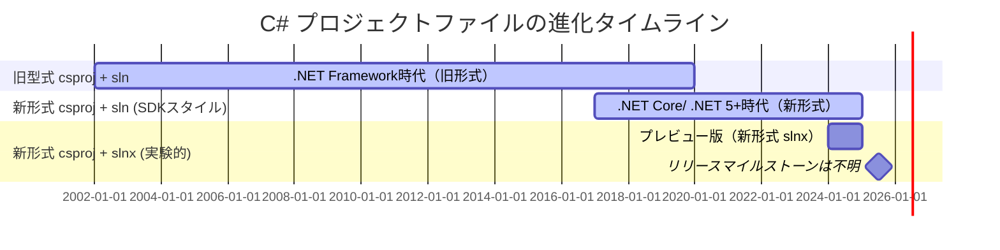

C#のプロジェクト構成といえば、プロジェクトファイル(.csrpoj)とそれを束ねるソリューションファイル(.sln)が定番です。
.NET SDK 9.0.200からSLNXと呼ばれる新ソリューションファイルフォーマットが利用しやすくなったので、それを触っていきましょう。

[:contents]

# C#のプロジェクト構成の変遷

はじめにC#のプロジェクト構成は何があるか復習です。

C#のプロジェクト構成は3パターンがあります。SLNX形式は2025年3月現在、プレビュー版として提供されています。

* 旧型式csproj+sln: .NET Framework～.NET Core 3.1、Unityや一部プロジェクトタイプで現在も利用
* SDK-Style新形式csproj+sln: .NET Core (2017年)～現在まで主流
* SDK-Style新形式csproj+新形式slnx: 2024年～プレビュー提供中

それぞれの利用時系列は以下のようになります。

<details><summary>Mermaid定義</summary>



</details>


## プロジェクトファイル

プロジェクトファイルは拡張子`.csproj`で、プロジェクトの設定やビルド設定を記述します。.NET Coreで[SDK-Style](https://learn.microsoft.com/en-us/dotnet/core/project-sdk/overview)と呼ばれるフォーマットが導入されて、.NET Frameworkのころに比べてシンプルかつ扱いやすくなりました。

**SDK Styleのプロジェクトファイル**

SDK Styleプロジェクトは、プロジェクトタイプごとにSdkが変えることで、一見同じようなcsprojですがプロジェクトに応じたライブラリの自動ロードを提供できます。例えばクラスライプラリプロジェクトなら、以下のように`Microsoft.NET.Sdk`を参照しています。

```xml
<Project Sdk="Microsoft.NET.Sdk">

  <PropertyGroup>
    <TargetFramework>net9.0</TargetFramework>
    <ImplicitUsings>enable</ImplicitUsings>
    <Nullable>enable</Nullable>
  </PropertyGroup>

</Project>
```

ASP.NET Coreのプロジェクトなら以下のように`Microsoft.NET.Sdk.Web`を参照しています。ASP.NET CoreでUserSecretsやcsproj Docker定義が使えるのは、Sdkの違いにあります。

```xml
<Project Sdk="Microsoft.NET.Sdk.Web">

  <PropertyGroup>
    <TargetFramework>net9.0</TargetFramework>
    <Nullable>enable</Nullable>
    <ImplicitUsings>enable</ImplicitUsings>
  </PropertyGroup>

</Project>
```

これに対して旧型式のプロジェクトファイルは以下のようになります。VS拡張などSDK Styleに移行できていないプロジェクトで現在でも利用されています。SDK Styleがとてもシンプルな定義になったことがよくわかります。

```xml
<?xml version="1.0" encoding="utf-8"?>
<Project ToolsVersion="15.0" DefaultTargets="Build" xmlns="http://schemas.microsoft.com/developer/msbuild/2003">
  <PropertyGroup>
    <MinimumVisualStudioVersion>17.0</MinimumVisualStudioVersion>
    <VSToolsPath Condition="'$(VSToolsPath)' == ''">$(MSBuildExtensionsPath32)\Microsoft\VisualStudio\v$(VisualStudioVersion)</VSToolsPath>
  </PropertyGroup>
  <Import Project="$(MSBuildExtensionsPath)\$(MSBuildToolsVersion)\Microsoft.Common.props" Condition="Exists('$(MSBuildExtensionsPath)\$(MSBuildToolsVersion)\Microsoft.Common.props')" />
  <PropertyGroup>
    <Configuration Condition=" '$(Configuration)' == '' ">Debug</Configuration>
    <Platform Condition=" '$(Platform)' == '' ">AnyCPU</Platform>
    <SchemaVersion>2.0</SchemaVersion>
    <ProjectTypeGuids>{82b43b9b-a64c-4715-b499-d71e9ca2bd60};{FAE04EC0-301F-11D3-BF4B-00C04F79EFBC}</ProjectTypeGuids>
    <ProjectGuid>{7B19A132-E890-4BEF-864B-30C1E968D6EE}</ProjectGuid>
    <OutputType>Library</OutputType>
    <AppDesignerFolder>Properties</AppDesignerFolder>
    <RootNamespace>VSIXProject1</RootNamespace>
    <AssemblyName>VSIXProject1</AssemblyName>
    <TargetFrameworkVersion>v4.7.2</TargetFrameworkVersion>
    <GeneratePkgDefFile>false</GeneratePkgDefFile>
    <IncludeAssemblyInVSIXContainer>false</IncludeAssemblyInVSIXContainer>
    <IncludeDebugSymbolsInVSIXContainer>false</IncludeDebugSymbolsInVSIXContainer>
    <IncludeDebugSymbolsInLocalVSIXDeployment>false</IncludeDebugSymbolsInLocalVSIXDeployment>
    <CopyBuildOutputToOutputDirectory>false</CopyBuildOutputToOutputDirectory>
    <CopyOutputSymbolsToOutputDirectory>false</CopyOutputSymbolsToOutputDirectory>
    <StartAction>Program</StartAction>
    <StartProgram Condition="'$(DevEnvDir)' != ''">$(DevEnvDir)devenv.exe</StartProgram>
    <StartArguments>/rootsuffix Exp</StartArguments>
  </PropertyGroup>
  <PropertyGroup Condition=" '$(Configuration)|$(Platform)' == 'Debug|AnyCPU' ">
    <DebugSymbols>true</DebugSymbols>
    <DebugType>full</DebugType>
    <Optimize>false</Optimize>
    <OutputPath>bin\Debug\</OutputPath>
    <DefineConstants>DEBUG;TRACE</DefineConstants>
    <ErrorReport>prompt</ErrorReport>
    <WarningLevel>4</WarningLevel>
  </PropertyGroup>
  <PropertyGroup Condition=" '$(Configuration)|$(Platform)' == 'Release|AnyCPU' ">
    <DebugType>pdbonly</DebugType>
    <Optimize>true</Optimize>
    <OutputPath>bin\Release\</OutputPath>
    <DefineConstants>TRACE</DefineConstants>
    <ErrorReport>prompt</ErrorReport>
    <WarningLevel>4</WarningLevel>
  </PropertyGroup>
  <ItemGroup>
    <Compile Include="Properties\AssemblyInfo.cs" />
  </ItemGroup>
  <ItemGroup>
    <None Include="source.extension.vsixmanifest">
      <SubType>Designer</SubType>
    </None>
  </ItemGroup>
  <ItemGroup>
    <PackageReference Include="Microsoft.VisualStudio.SDK" Version="17.0.32112.339" ExcludeAssets="runtime" NoWarn="NU1604" />
    <PackageReference Include="Microsoft.VSSDK.BuildTools" Version="17.13.2127" NoWarn="NU1604" />
  </ItemGroup>
  <Import Project="$(MSBuildToolsPath)\Microsoft.CSharp.targets" />
  <Import Project="$(VSToolsPath)\VSSDK\Microsoft.VsSDK.targets" Condition="'$(VSToolsPath)' != ''" />
  <!-- To modify your build process, add your task inside one of the targets below and uncomment it.
       Other similar extension points exist, see Microsoft.Common.targets.
  <Target Name="BeforeBuild">
  </Target>
  <Target Name="AfterBuild">
  </Target>
  -->
</Project>
```

**ソリューションファイル**

.NET Coreになっても.slnが利用されてきましたが、SLNX形式も長らくプレビュー提供されています。とはいえ、SLNX形式はまだGAが見えておらずVisual Studioでもダブルクリックで使えるような代物になっていないことに注意してください。


.slnはGUIDで各.csprojファイルを認識しており人の手で触ることが想定されているとは思い難いものでした。
