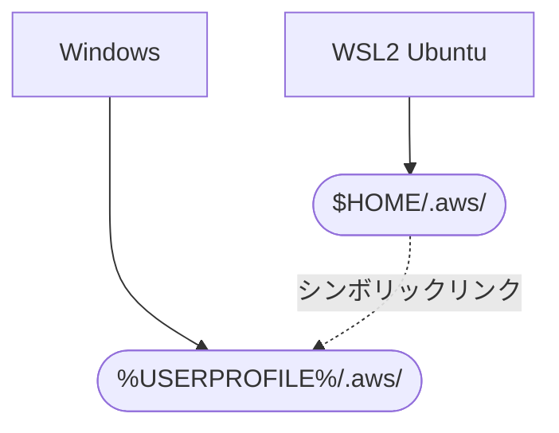

前々からWindowsとWSL2 Ubuntuのどちらかで認証すればどちらでも使えるようにしていたのですが、ここ最近アップデートしたのでメモです。

[:contents]

# AWS CLIの認証情報の保存場所

WindowsとWSL2 UbuntuでAWS CLIの認証情報はそれぞれ以下の場所に保存されます。

- Windows: `%USERPROFILE%/.aws/`
- WSL2 Ubuntu: `$HOME/.aws/`

幸いにして、OSが変わっても同フォルダ以下の構成は変わりません。また、configやcredentialsの改行コードが`CRLF`でもWSL2で問題ありませんし、`LF`でもWindowsで問題ありません。
ということはどちらの環境でAWS認証しても再利用できるということです。

これを利用して、WSL2かWindowsで一度認証を取ったら両方で利用できるようにします。

# 構成

Windowsに大本の.aws/フォルダと`credentials`や`config`ファイルを配置し、WSL2 UbuntuからWindowsの同フォルダをシンボリックリンクで参照します。Windowsにファイルを配置しているのは、WSLは簡単にすてられるため大本の設定を置きにくい一方、それに比べるとWindows環境は保持されるためです。[^1]

<details><summary>Mermaid定義</summary>



</details>

[f:id:guitarrapc_tech:20250409194541p:plain:alt=構成の概要]

# Ansibleで構成と自動化

WSL2 Ubuntuは`/mnt`経由でWindowsのフォルダを直接参照できます。これを利用して、Ansibleでシンボリックリンクを作成します。

Ansible処理は次のようにします。

```yaml
# ../include_role/ubuntu/credentials_aws.yaml
- name: ".aws - check src Win path {{ args.win_path }} exists"
  ansible.builtin.stat:
    path: "{{ args.win_path }}"
  register: win_aws_stat_result

- name: ".aws - check Linux path {{ args.linux_path }} is link"
  ansible.builtin.stat:
    path: "{{ ansible_home }}/{{ args.linux_path }}"
  register: linux_aws_link

- name: ".aws - delete linux default folder"
  ansible.builtin.file:
    path: "{{ ansible_home }}/{{ args.linux_path }}"
    state: absent
  when: (win_aws_stat_result.stat.exists) and (linux_aws_link.stat.exists) and (not linux_aws_link.stat.islnk)

- name: ".aws - create symlinks with Win path"
  ansible.builtin.file:
    src: "{{ args.win_path }}"
    dest: "{{ ansible_home }}/{{ args.linux_path }}"
    state: link
  when: win_aws_stat_result.stat.exists
```

変数を定義しておきます。

```yaml
# roles/aws/vars/main.yaml
aws_config:
  - linux_path: .aws
    win_path: "/mnt/c/Users/{{ ansible_user_id }}/.aws"
```

あとは、処理を呼び出せばOKです。

```yaml
# roles/aws/tasks/main.yaml
- name: "Link .aws credential"
  ansible.builtin.include_tasks: ../include_role/ubuntu/credentials_aws.yaml
  with_items: "{{ aws_config }}"
  loop_control:
    loop_var: args
```

自動化するにあたり、いろいろな環境で使えるように1つだけお約束を設けています。

* WindowsとWSL2 Ubuntuのユーザー名は同じにする

もしユーザー名を決め打つなら適当に書き換えてください。

# シンボリックリンクの対象で制御を分ける

今回は`.aws`フォルダをシンボリックリンクしましたが、AWS CLIの認証情報である`~/.aws/config`と`~/.aws/credentials`の2つだけシンボリックリンクにすることで、AWS SSOを利用している場合Windows/WSL2 Ubuntuの認証情報で認証セッションを分けることもできます。AWS SSOだけ挙動が変わるのは、認証トークンは`sso_start_url`に基づいたファイル名を使用して、`~/.aws/sso/cache`ディレクトリの下のディスクにキャッシュされるためです。

| シンボリックリンク対象 | 認証共有状況(IAM User) | 認証共有(SSO)
| --- | --- | --- |
| `~/.aws/` | 認証情報を共有 | 認証情報を共有 |
| `~/.aws/config`<br/>`~/.aws/credentials` | 認証情報を共有 | 個別に認証が必要 |

この辺りは、AWS CLIの[ドキュメント](https://docs.aws.amazon.com/ja_jp/cli/latest/userguide/cli-configure-sso.html)を参照してください。

# まとめ

WindowsとWSL2 Ubuntuを併用していて、両方で同じようなコマンドを実行する人も多いでしょう。ちょっとした工夫で、AWS CLIの認証情報を手抜きしつつ二重管理せずに済むので割とオススメです。数年やってるのですが、IAM User/AWS SSOに関わらず意識せず使えるのはよいことです。

# 参考

- [AWS CLI を使用した IAM アイデンティティセンター認証の設定](https://docs.aws.amazon.com/ja_jp/cli/latest/userguide/cli-configure-sso.html)


[^1]: 設定のバックアップはパスワードマネージャーで管理するといいでしょう
