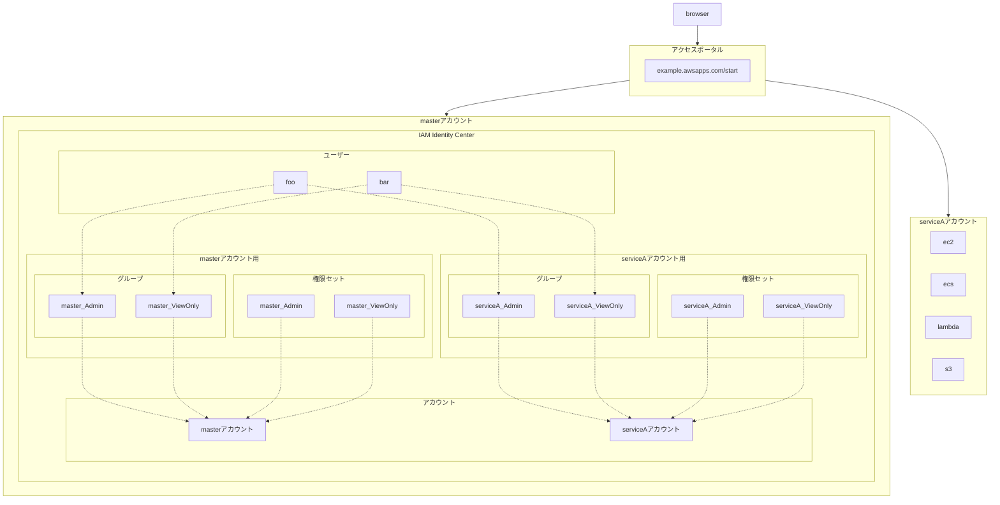

AWS IAM Identity CenterをTerraformで構成するときは[aws-ia/terraform-aws-iam-identity-center](https://github.com/aws-ia/terraform-aws-iam-identity-center)が便利です。
同様にPulumiでも構成してみましょうという回です。

[:contents]

# どのような構成にするのか

AWS IAM Identity CenterはAWSのSSO機能です。SSOの連携IdPとしてGoogle IdPやMicrosoft Entra IDなどいろいろ選べます。
今回は簡単のため、SSOなしでIAM Identity Center単独ディレクトリとして構成します。

全体像は次の通りです。これでアクセスポータルにアクセスした際、ログインしたユーザーごとに任意のアカウントへ任意の権限でアクセスできるようになります。

* アカウントはmaster、serviceAの2つがある
* masterアカウントでIAM Identity Centerを構成する
* IAM Identity Centerは、アカウントごとにグループと権限セットを構成する
* 権限セットはAdminとViewOnlyの2つ
* グループと権限セットの命名はともに`アカウント名_権限名`とする
* 全ユーザーは必要な権限ごとにグループへ紐づける

mermaidコード

[f:id:guitarrapc_tech:20250415043556p:plain:alt=全体構成図]
