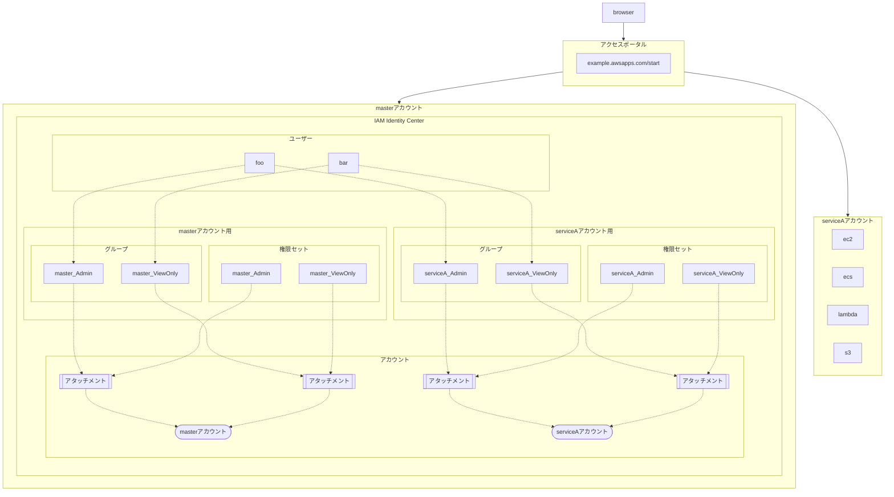

AWS IAM Identity CenterをTerraformで構成するときは[aws-ia/terraform-aws-iam-identity-center](https://github.com/aws-ia/terraform-aws-iam-identity-center)が便利です。
同様にPulumiでも構成してみましょうという回です。

[:contents]

# どのような構成にするのか

AWS IAM Identity CenterはAWSのSSO機能です。SSOの連携IdPとしてGoogle IdPやMicrosoft Entra IDなどいろいろ選べます。今回は簡単のため、SSOなしでIAM Identity Center単独ディレクトリとして構成します。

アクセスポータルにアクセスした際、ログインしたユーザーごとに任意のアカウントへ任意の権限でアクセスできるようにするため、全体像は次の通りとします。

* アカウントはmaster、serviceAの2つがある
* masterアカウントでIAM Identity Centerを構成する
* IAM Identity Centerは、アカウントごとにグループと権限セットを構成する
* 権限セットはAdminとViewOnlyの2つ
* グループと権限セットの命名はともに`アカウント名_権限名`とする
* 全ユーザーは必要な権限ごとにグループへ紐づける


<details>
<summary>mermaidコード</summary>



</details>

[f:id:guitarrapc_tech:20250415043556p:plain:alt=全体構成図]

## グループと権限セットはアカウントごとに分ける

私は[TODO: 参考URLを貼る]()を参考に、グループと権限セットをアカウントごとに分けています。

アカウントごとに権限セットを調整しつつ、ユーザーの紐づけを管理しやすいようように、`アカウントx権限セット`ごとにグループを設けています。単一グループで複数アカウントに紐づけルと、アカウントによってどのような権限なのかグループから推測できなくなるためです。

同様に権限セットも`アカウントx権限セット`ごとに設けています。AdminやViewOnlyという権限セットだけ用意しても、アカウントごとに紐づける権限が変わったときに困るためです。

## 管理アカウントで一括管理

Organizationの管理アカウントでIAM Identity Centerを構成してメンバーアカウントにも展開するため、Organizationのサービスアクセスで`sso.amazonaws.com`を有効にしておきます。

```cs
// organization
var org = new Organization($"organization", new()
{
    FeatureSet = "ALL",
    AwsServiceAccessPrincipals = [
        "sso.amazonaws.com", // これ!
        // 省略
    ],
    EnabledPolicyTypes = [
        // 省略
    ],
});
```


# Pulumiで構成する

Pulumi C#でIdentity Centerを構成してみましょう。
今回は簡単のため`ユーザー名=Email`とします。

```cs
using Pulumi;
using Pulumi.Aws.IdentityStore;
using Pulumi.Aws.IdentityStore.Inputs;
using Pulumi.Aws.SsoAdmin;

return await Pulumi.Deployment.RunAsync(() =>
{
    var opt = new CustomResourceOptions();

    var instance = Output.Create(Pulumi.Aws.SsoAdmin.GetInstances.InvokeAsync(new()));
    var instanceId = instance.Apply(x => x.IdentityStoreIds[0]);
    var instanceArn = instance.Apply(x => x.Arns[0]);

    // アカウント/ユーザー定義
    var ssoType = IdentityCenterSsoType.Internal;
    IReadOnlyList<(string AccountName, string AccountId, IReadOnlyList<IdentityCenterPermission> Permissions)> accountDefinitions = [
        ("master", "11111111", [IdentityCenterPermission.Admin, IdentityCenterPermission.ViewOnly]),
        ("serviceA", "22222222", [IdentityCenterPermission.Admin, IdentityCenterPermission.ViewOnly]),
    ];

IReadOnlyList<(string Email, string FamilyName, string GivenName, IReadOnlyList<(string AccountName, IReadOnlyList<IdentityCenterPermission> Permissions)> GroupMembership)> userDefinitions = [
            ("foo@example.com", "Foo", "Example", [
                ("master", [IdentityCenterPermission.Admin]),
                ("serviceA", [IdentityCenterPermission.Admin]),
            ]),
            ("bar@example.com", "Bar", "Baz", [
                ("master", [IdentityCenterPermission.ViewOnly]),
                ("serviceA", [IdentityCenterPermission.ViewOnly]),
            ]),
        ];

    var name = "sample";

    // groups
    var groups = new Dictionary<string, Group>();
    foreach (var accountDetail in accountDefinitions)
    {
        foreach (var permission in accountDetail.Permissions)
        {
            var groupName = GetGroupName(accountDetail.AccountName, permission);
            var group = new Group($"{name}-{groupName}-group", new()
            {
                DisplayName = groupName,
                Description = $"{accountDetail.AccountName}'s {permission} IAM Identity Center Group",
                IdentityStoreId = instanceId,
            }, opt);
            groups.Add(groupName, group);
        }
    }

    // users
    foreach (var userDetail in userDefinitions)
    {
        var user = new User($"{name}-{userDetail.Email}-user", new()
        {
            UserName = userDetail.Email,
            Emails = new UserEmailsArgs
            {
                Primary = true,
                Value = userDetail.Email,
            },
            Name = new UserNameArgs
            {
                FamilyName = userDetail.FamilyName,
                GivenName = userDetail.GivenName,
            },
            DisplayName = $"{userDetail.GivenName} {userDetail.FamilyName}",
            IdentityStoreId = instanceId,
        }, opt);

        foreach (var membership in userDetail.GroupMembership)
        {
            foreach (var permission in membership.Permissions)
            {
                var membershipName = GetGroupName(membership.AccountName, permission);
                var group = groups[membershipName];
                _ = new GroupMembership($"{name}-{userDetail.Email}-{membershipName}-membership", new()
                {
                    MemberId = user.UserId,
                    GroupId = group.GroupId,
                    IdentityStoreId = instanceId,
                }, opt);
            }
        }
    }

    // permissionSets
    var permissionSets = new Dictionary<string, PermissionSet>();
    foreach (var accountDetail in accountDefinitions)
    {
        foreach (var permission in accountDetail.Permissions)
        {
            if (!PermissionSetPrefix.PermissionMapping.TryGetValue(permission, out var permissionSetDetail))
                continue;

            // GroupNameと同じ名前にする
            var permissionSetName = GetGroupName(accountDetail.AccountName, permission);

            var permissionSet = new PermissionSet($"{name}-{permissionSetName}-permissionset", new()
            {
                InstanceArn = instanceArn,
                Name = permissionSetName,
                Description = permissionSetDetail.Description,
                SessionDuration = permissionSetDetail.SessionDuration,
            }, opt);

            // AWS Managed policy attachment
            for (var i = 0; i < permissionSetDetail.ManagedPolicySets.Count; i++)
            {
                var attachment = new ManagedPolicyAttachment($"{name}-{permissionSetName}-{i}-attachment", new()
                {
                    InstanceArn = instanceArn,
                    PermissionSetArn = permissionSet.Arn,
                    ManagedPolicyArn = permissionSetDetail.ManagedPolicySets[i],
                }, opt);
            }

            permissionSets.Add(permissionSetName, permissionSet);
        }
    }

    // Account assignment
    foreach (var accountDetail in accountDefinitions)
    {
        foreach (var permission in accountDetail.Permissions)
        {
            var groupName = GetGroupName(accountDetail.AccountName, permission);
            var group = groups[groupName];
            var permissionSet = permissionSets[groupName];

            switch (ssoType)
            {
                case IdentityCenterSsoType.Internal:
                    var assignment = new AccountAssignment($"{name}-{groupName}-assignment", new()
                    {
                        InstanceArn = instanceArn,
                        PermissionSetArn = permissionSet.Arn,
                        PrincipalId = group.GroupId,
                        PrincipalType = "GROUP", // 外部IdP SSOじゃないのでアカウントに対してグループで紐づける
                        TargetId = accountDetail.AccountId,
                        TargetType = "AWS_ACCOUNT", // 外部IdP SSOじゃない
                    }, opt);
                    break;
                default:
                    throw new NotImplementedException($"SsoType {ssoType} is not implemented.");
            }
        }
    }

    // PermissionSet、Groupで同じ名前にするルールを強制するためのヘルパー
    static string GetGroupName(string account, IdentityCenterPermission identityPermission)
        => $"{account}_{identityPermission}";
});

public enum IdentityCenterPermission
{
    /// <summary>
    /// そのアカウントにおけるAdministrator権限
    /// </summary>
    Admin,
    /// <summary>
    /// そのアカウントにおけるReadOnly権限
    /// </summary>
    ViewOnly
    // 他に権限が必要になったら追加したり...
}

/// <summary>
/// IAM Identity CenterのSSO種別。InternalはIAM Identity Center自身でユーザーを管理するモード。サンプルではInternalのみ利用
/// </summary>
public enum IdentityCenterSsoType
{
    /// <summary>
    /// IAM Identity Center自身でユーザーを管理するモード
    /// </summary>
    Internal,
    /// <summary>
    /// Google WorkspaceやOktaなどのIDPを利用する場合に使うといいでしょう
    /// </summary>
    ExternalGoogleIdP,
}


/// <summary>
/// IAM Identity Centerの権限セットを事前定義する。
/// カスタム権限が欲しくなったらここに追加 + ポリシーセットの作成とグループ紐づけが必要になる。(例ではマネージドポリシーのみ)
/// </summary>
record PermissionSetPrefix
{
    public static Dictionary<IdentityCenterPermission, PermissionSetPrefix> PermissionMapping = new()
    {
        {
            IdentityCenterPermission.Admin, new()
            {
                Description = "Provides AWS full access permissions.",
                SessionDuration = "PT8H",
                ManagedPolicySets = ["arn:aws:iam::aws:policy/AdministratorAccess"]
            }
        },
        {
            IdentityCenterPermission.ViewOnly, new()
            {
                Description = "Provides AWS view only permissions.",
                SessionDuration = "PT8H",
                ManagedPolicySets = ["arn:aws:iam::aws:policy/job-function/ViewOnlyAccess"]
            }
        },
    };

    public required string Description { get; init; }
    public required string SessionDuration { get; init; }
    public required IReadOnlyList<string> ManagedPolicySets { get; set; }
}
```

# まとめ

AWS IAM Identity Centerは割とご茶つきやすいのですが、Pulumi C#ならすんなり組むことができます。

# 参考
