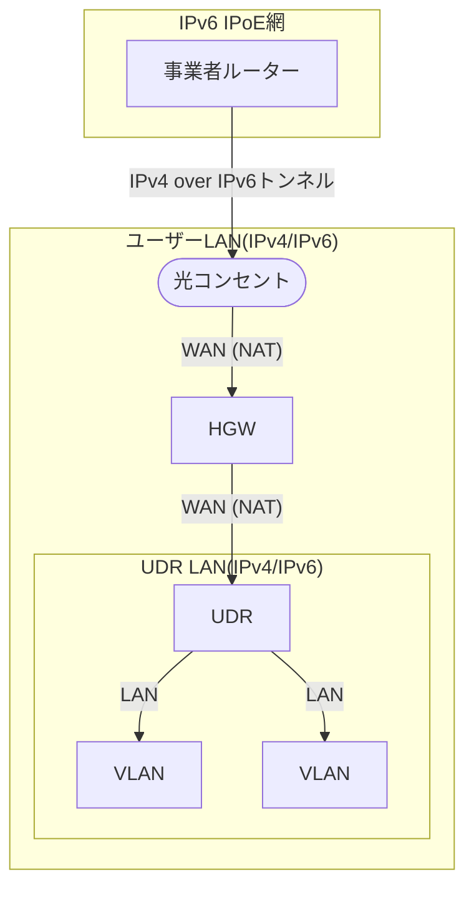
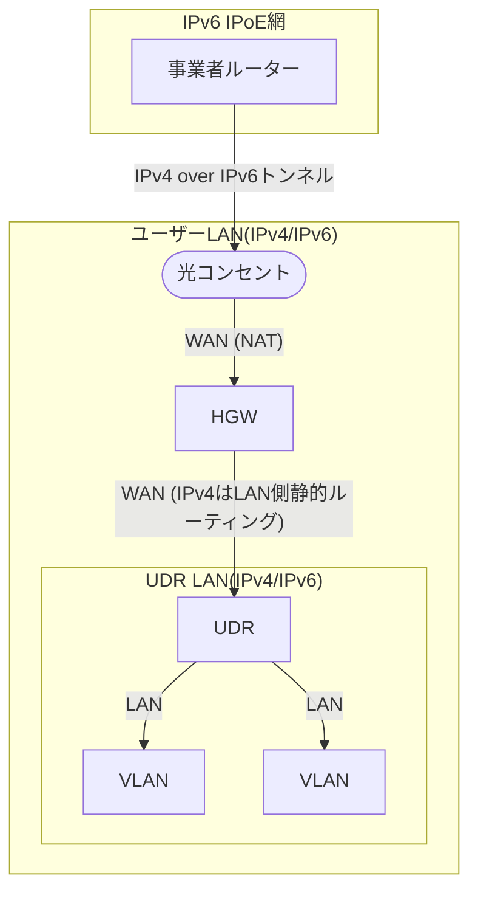

以前、MAP-E方式のIPv4 over IPv6を[UniFi Dream Router](https://tech.guitarrapc.com/entry/2022/12/02/080727)や[UniFi Dream Machine](https://tech.guitarrapc.com/entry/2020/10/17/044555)で利用する方法を紹介しましたが、いずれもホームゲートウェイ(HGW)と組み合わせる際にデュアルNATとなっていました。2024年7月リリースのファームウェア[Network Appklication 8.3](https://community.ui.com/releases/UniFi-Network-Application-8-3-32/54f3b506-afcf-4a7c-aba6-01a884dd9003)でUDR/UDMのNATを無効にできるようになりました。

早速デュアルNATを回避することで速度はよくなるのか、何かトラブルが起こらないのか見てみました。

[:contents]

# 環境

次の環境で行います。

* HGW: [RX-600KI](https://web116.jp/shop/hikari_r/600ki/600ki_00.html)
* Router: [UniFi Dream Router(UDR)](https://jp.store.ui.com/jp/ja/products/udr)
* UniFi OS: 4.1.22
* Network Application: 9.0.114
* IPv4 over IPv6: MAP-E

## 構成図

デュアルNATの構成は次のようになります。

<details><summary>Mermaidコード</summary>



</details>


[f:id:guitarrapc_tech:20250418211845p:plain:alt=デュアルNATの構成]

UDRのNATを無効にした構成は次のようになります。

<details><summary>Mermaidコード</summary>



</details>

[f:id:guitarrapc_tech:20250418211853p:plain:alt=UDRのNATを無効にした構成]

# UDRのNATを無効にする

UDRのNATはネットワークごとに有効/無効を選択できます。そこで従来のネットワークとは別にNATを無効にするネットワーク(及びVLAN)を切り、専用のSSIDも作成します。これでWi-Fiを切り替えるだけで動作を検証できます。従来のWi-FiはデュアルNATのままなので、万が一トラブルがあっても元のWi-Fiにつながっている端末に影響出ません。

手順は次の通りです。

1. (UDR) NATを切るネットワーク`NoNAT`を用意する
2. (UDR) NATを切るネットワークにつなげるSSIDを用意する
3. (UDR) NATのNAT設定で除外ネットワークへ`NoNAT`を指定する
4. (HGW) NATを切るネットワークのCIDR/UDRのWAN側IPアドレスを静的ルーティングする

順番に見ていきましょう。

**(UDR) NATを切るネットワーク`NoNAT`を用意する**

UDRのWeb UIにアクセスし`Settings -> Networks`を開きます。いい感じでネットワークを切ってください。特にこだわるポイントはありません。CIDRは`192.168.13.0/24`とします。

[f:id:guitarrapc_tech:20250418211900p:plain:alt=UDRでネットワークを切る]

**(UDR) NATを切るネットワークにつなげるSSIDを用意する**

作成したネットワークをさくっと試すならWi-Fiがベストです。私が宅内をWi-Fiで統一している理由の1つです。

`Settings -> WiFi`を開き、SSIDを作成します。SSIDは`NoNAT`とでもしておきましょう。

[f:id:guitarrapc_tech:20250418211908p:plain:alt=UDRの`WiFi`設定]

**(UDR) NATのNAT設定で除外ネットワークへ`NoNAT`を指定する**

重要なポイント1です。

`Settings -> Routing -> NAT`を開き、Global NAT Settingsを`Auto`から`Custom`に変更、Exclude Networksに`NoNAT`を追加します。もしも全てのネットワークを除外したい場合は、Global NAT Settingsを`Off`にしてしまうのも手です。私も安定動作を確認したらOffにする予定です。

[f:id:guitarrapc_tech:20250418211916p:plain:alt=UDRのNAT除外設定]

**(HGW) NATを切るネットワークのCIDR/UDRのWAN側IPアドレスを静的ルーティングする**

重要なポイント2です。

接続先がIPv6[^1]なら、HGWの静的ルーティング設定をせずとも通信できます。しかし接続先がIPv4な場合、上位のHGWでUDR配下の端末当て通信が正しく中継できません[^2]。NATを無効にしたため、インターネットからの戻り通信宛先がローカルPCアドレスのままになり、HGWはどこに転送すればいいか分からなくなるためです。そこでHGWの静的ルーティングを使って、LAN側のネットワーク宛て通信はUDRのWAN側IPアドレスへ転送するよう設定します。

私のHGWはRX-600KIなので、HGWのWeb UIにアクセスし`詳細設定 -> LAN側静的ルーティング設定`を開きます。宛先IPアドレス/マスク長にNoNATネットワークのCIDR`192.168.13.0/24`を、次のホストIPアドレスにUDRのWAN側IPアドレス`192.168.1.2`を指定します。

[f:id:guitarrapc_tech:20250418211924p:plain:alt=HGWの静的ルーティング設定]

これでUDRのNATを無効にしたネットワークができました。

# 動作試験

さっそく接続してみましょう。NAT無効なSSIDに接続しIPアドレスを確認すると、NAT無効なネットワークのアドレスが割り当てられています。

```sh
$ ipconfig
Wireless LAN adapter WiFi:

   Connection-specific DNS Suffix  . :
   IPv6 Address. . . . . . . . . . . : xxxx:xxxx:xxxx:xxxx::xxx
   IPv6 Address. . . . . . . . . . . : xxxx:xxxx:xxxx:xxxx:xxxx:xxxx:xxxx:xxxx
   Temporary IPv6 Address. . . . . . : xxxx:xxxx:xxxx:xxxx:xxxx:xxxx:xxx:xxxx
   Link-local IPv6 Address . . . . . : fe80::1ecf:2056:38cb:af3c%9
   IPv4 Address. . . . . . . . . . . : 192.168.13.184
   Subnet Mask . . . . . . . . . . . : 255.255.255.0
   Default Gateway . . . . . . . . . : fe80::6222:32ff:feaa:33d9%9
                                       192.168.13.1
```

## 速度チェック

有線接続の速度を確認します。

<details><summary>HGWからの有線LAN</summary>

参考値として、HGWから有線LANで接続したPCからfast.comで速度を測定します。理論上の最速接続です。

[f:id:guitarrapc_tech:20250418211933p:plain:alt=HGW直接の有線LAN]

</details>


UDRのLANポートに接続したPCからfast.comで速度を測定します。

|デュアルNAT | シングルNAT (本記事の構成) |
| --- | --- |
| 450Mbps<br/>[f:id:guitarrapc_tech:20250418211942p:plain:alt=デュアルNATの有線LAN] | 470Mbps<br/>[f:id:guitarrapc_tech:20250418211950p:plain:alt=シングルATの有線LAN] |

無線接続の速度を確認します。UDRのWi-Fiに接続したPCからfast.comで速度を測定します。

| デュアルNAT | シングルNAT (本記事の構成) |
| --- | --- |
| 270Mbps<br/>[f:id:guitarrapc_tech:20250418212000p:plain:alt=デュアルNATのWi-Fi速度] | 320Mbps<br/>[f:id:guitarrapc_tech:20250418212009p:plain:alt=シングルNATのWi-Fi速度] |
なお、運ゲーなので、実行タイミングによってはWi-Fiでも有線ぐらいにはなります。

[f:id:guitarrapc_tech:20250418212019p:plain:alt=Wi-Fi速度の上振れ]

## 通信トラブルの有無

1週程利用していますが、特に通信トラブルはありませんでした。
あと1週間様子を見てから全体に展開予定です。

# まとめ

速度差は微々たるもので計測誤差にも感じますが、デュアルNATを回避できるのが大きいです。ただ、構成自体はシンプルですがHGWに追加設定を必要としているのは微妙[^3]なポイントです。

ようやく念願のデュアルNAT回避ができるようになりました。あとはMAP-Eのネイティブ対応ですね。

# 参考

* [デュアルNATもこれで回避！ Ubiqiti製品の最新ファーム「UniFi Network Application 8.3」を試す【イニシャルB】 - INTERNET Watch](https://internet.watch.impress.co.jp/docs/column/shimizu/1610277.html)

[^1]: 例えばGoogleやXは問題なく接続できるのを確認できます。
[^2]: 行きは良いが、戻り通信を端末に戻せない。
[^3]: デュアルNATよりはましだと割り切っています
