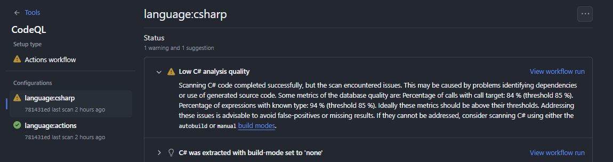
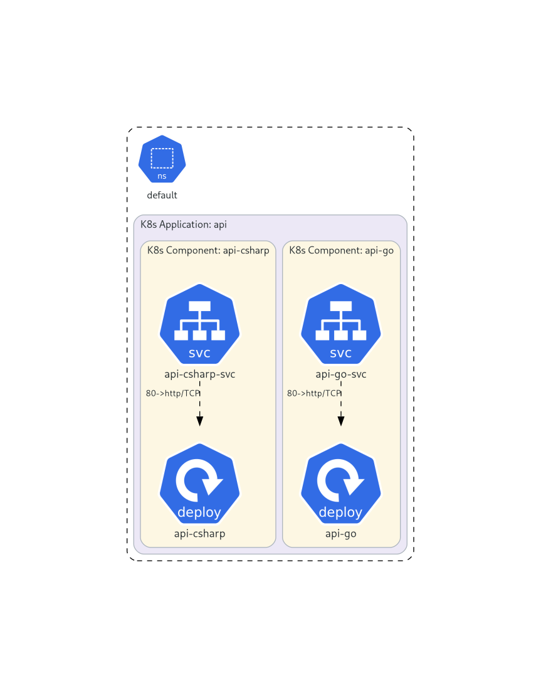
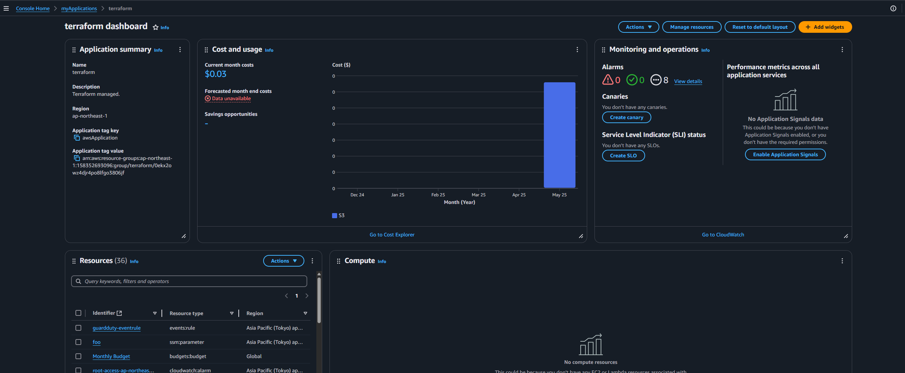

WSL2は長年メモリリークがありましたが`automemoryReclaim`[^1]を設定することでキャッシュされたメモリを自動解放できます。
ただ、`gradual`にしているとDocker DesktopのResource Saver(リソースセーバー)と併用できないようでトラブったのでメモ。

[:contents]

# Docker Desktopのリソースセーバーとは

Docker Desktopの[Resource Saver](https://docs.docker.com/desktop/use-desktop/resource-saver/)は、一定時間コンテナが実行されていない場合にDocker Desktop Linux VMを自動的に停止することで、ホスト上のDocker DesktopのCPUとメモリの使用量を2GB以上大幅に削減します。デフォルトは5分設定ですが、調整可能性割と便利です。



便利な機能ですが、WSL2で利用している場合は挙動が違います。具体的には、WSL VMを終了せず`docker-desktop`WSLの中で動くDocker Engineをポーズするだけです。WSLが全部のディストリビューションで共有される単一Linux VMを使用しているため、Docker DesktopのVMを終了できないのは納得感があります。Linux VMを終了できないため、リソースセーバーはCPU使用率を削減しますが**Dockerのメモリ使用料を削減しません**。そこで利用するのが、`autoMemoryReclaim`です。

# WSLの自動メモリ回収

WSL 1.3.100以降、WSL2は[automemoryReclaim](https://learn.microsoft.com/en-us/windows/wsl/wsl-config#experimental-settings)を試験的にサポートしています。
`automemoryReclaim`は、WindowsホストがWSL VMの使用していないメモリを取り戻すことを可能にします。つまり、Dockerコンテナイメージビルド中にWSL VMがLinuxカーネルのページキャッシュ中にGB単位でメモリを保持するのを防ぎメモリ解放を促せます。先ほどのWSL2バックエンドのDocker Desktopではリソースセーバーが機能しないことを踏まえると、まさにほしかった機能です。従来の`pageReporting`ではメモリがほぼ解放されなかったので。

`automemoryReclaim`は`off`、`gradual`、`aggressive`の3つのモードがあります。機能としてはCgroupsを使用しており、設定値によってCgroups V1、V2のどちらを使うか切り替わります。

- `off`: 自動メモリ回収を無効にする
- `gradual`: WSLが使用していないメモリを徐々に回収する
- `dropcache`: WSLが使用していないメモリをすぐに回収する

設定をざっと見てみましょう。

## off

これまでの動作です。`automemoryReclaim`を指定しない場合もこの動作になります。
WSL VMが使用していないメモリを回収しません。

Ubuntu 24.04ならCgroups V1/V2の両方が有効になっています。

```
$ grep cgroup /etc/mtab
tmpfs /sys/fs/cgroup tmpfs ro,nosuid,nodev,noexec,size=4096k,nr_inodes=1024,mode=755 0 0
cgroup2 /sys/fs/cgroup/unified cgroup2 rw,nosuid,nodev,noexec,relatime 0 0
cgroup /sys/fs/cgroup/cpuset cgroup rw,nosuid,nodev,noexec,relatime,cpuset 0 0
cgroup /sys/fs/cgroup/cpu cgroup rw,nosuid,nodev,noexec,relatime,cpu 0 0
cgroup /sys/fs/cgroup/cpuacct cgroup rw,nosuid,nodev,noexec,relatime,cpuacct 0 0
cgroup /sys/fs/cgroup/blkio cgroup rw,nosuid,nodev,noexec,relatime,blkio 0 0
cgroup /sys/fs/cgroup/memory cgroup rw,nosuid,nodev,noexec,relatime,memory 0 0
cgroup /sys/fs/cgroup/devices cgroup rw,nosuid,nodev,noexec,relatime,devices 0 0
cgroup /sys/fs/cgroup/freezer cgroup rw,nosuid,nodev,noexec,relatime,freezer 0 0
cgroup /sys/fs/cgroup/net_cls cgroup rw,nosuid,nodev,noexec,relatime,net_cls 0 0
cgroup /sys/fs/cgroup/perf_event cgroup rw,nosuid,nodev,noexec,relatime,perf_event 0 0
cgroup /sys/fs/cgroup/net_prio cgroup rw,nosuid,nodev,noexec,relatime,net_prio 0 0
cgroup /sys/fs/cgroup/hugetlb cgroup rw,nosuid,nodev,noexec,relatime,hugetlb 0 0
cgroup /sys/fs/cgroup/pids cgroup rw,nosuid,nodev,noexec,relatime,pids 0 0
cgroup /sys/fs/cgroup/rdma cgroup rw,nosuid,nodev,noexec,relatime,rdma 0 0
cgroup /sys/fs/cgroup/misc cgroup rw,nosuid,nodev,noexec,relatime,misc 0 0
cgroup /sys/fs/cgroup/systemd cgroup rw,nosuid,nodev,noexec,relatime,xattr,name=systemd 0
```

設定はMicrosoftの[Windows Command Lineブログ](https://devblogs.microsoft.com/commandline/windows-subsystem-for-linux-september-2023-update/)で紹介されていますが、軽く振り返っておきましょう。

## gradual

.wslconfigの設定例です。

```ini
[wsl2]
# 省略
[experimental]
autoMemoryReclaim=gradual
```


5分間のアイドル時間が検出されると段階的にキャッシュを減らしていきます。WSLがアイドルかどうかはCPU使用率が5分間継続して低いかどうかで検出します。
Cgroups V1が禁止されCgroups V2のみが有効になるようです。`gradual`が有効になったかは`/sys/fs/cgroup/memory.reclaim`があるかで判断できます。

```
$ grep cgroup /etc/mtab
cgroup2 /sys/fs/cgroup/unified cgroup2 rw,nosuid,nodev,noexec,relatime 0 0
```

動作をよりカスタマイズしたい場合は、スクリプトを[gist](https://gist.github.com/craigloewen-msft/496078591e0bbbfdec9f144c6b50a8cc)で公開しています。

なお、Microsoftの動作試験で、WSL2でDockerデーモンをサービス実行しているときに壊れるのを確認しているようです。また、Issueを見るとWSL2で[systemd](https://github.com/microsoft/WSL/issues/10675)を有効にしていてもトラブルが起きるようです。

## dropcache

.wslconfigの設定例です。

```ini
[wsl2]
# 省略
[experimental]
autoMemoryReclaim=gradual
```

5分間のアイドル時間が検出されると解放可能なキャッシュをすべて解消します。
Cgroups V2は使われず、`/proc/sys/vm/dgrop_caches`が利用されます。`gradual`より副作用ありそうですが、Cgroups V1の動作を禁止しないのでアプリケーションを問わなさそうですね。

```
$ grep cgroup /etc/mtab
tmpfs /sys/fs/cgroup tmpfs ro,nosuid,nodev,noexec,size=4096k,nr_inodes=1024,mode=755 0 0
cgroup2 /sys/fs/cgroup/unified cgroup2 rw,nosuid,nodev,noexec,relatime 0 0
cgroup /sys/fs/cgroup/cpuset cgroup rw,nosuid,nodev,noexec,relatime,cpuset 0 0
cgroup /sys/fs/cgroup/cpu cgroup rw,nosuid,nodev,noexec,relatime,cpu 0 0
cgroup /sys/fs/cgroup/cpuacct cgroup rw,nosuid,nodev,noexec,relatime,cpuacct 0 0
cgroup /sys/fs/cgroup/blkio cgroup rw,nosuid,nodev,noexec,relatime,blkio 0 0
cgroup /sys/fs/cgroup/memory cgroup rw,nosuid,nodev,noexec,relatime,memory 0 0
cgroup /sys/fs/cgroup/devices cgroup rw,nosuid,nodev,noexec,relatime,devices 0 0
cgroup /sys/fs/cgroup/freezer cgroup rw,nosuid,nodev,noexec,relatime,freezer 0 0
cgroup /sys/fs/cgroup/net_cls cgroup rw,nosuid,nodev,noexec,relatime,net_cls 0 0
cgroup /sys/fs/cgroup/perf_event cgroup rw,nosuid,nodev,noexec,relatime,perf_event 0 0
cgroup /sys/fs/cgroup/net_prio cgroup rw,nosuid,nodev,noexec,relatime,net_prio 0 0
cgroup /sys/fs/cgroup/hugetlb cgroup rw,nosuid,nodev,noexec,relatime,hugetlb 0 0
cgroup /sys/fs/cgroup/pids cgroup rw,nosuid,nodev,noexec,relatime,pids 0 0
cgroup /sys/fs/cgroup/rdma cgroup rw,nosuid,nodev,noexec,relatime,rdma 0 0
cgroup /sys/fs/cgroup/misc cgroup rw,nosuid,nodev,noexec,relatime,misc 0 0
cgroup /sys/fs/cgroup/systemd cgroup rw,nosuid,nodev,noexec,relatime,xattr,name=systemd 0
```

# Resource SaverとautomemoryReclaim=gradualを併用するとハングする

Windows 11 24H2におけるWSL環境において、Docker DestopでResource Saverを有効にして実行していると、ディスクから読み取る操作の途中でハングする症状が発生しました。

```sh
$ wsl -v
WSL version: 2.4.13.0
Kernel version: 5.15.167.4-1
WSLg version: 1.0.65
MSRDC version: 1.2.5716
Direct3D version: 1.611.1-81528511
DXCore version: 10.0.26100.1-240331-1435.ge-release
Windows version: 10.0.26100.3775
```

WSL2起動直後にどんなコマンドでも再現するわけではなく、WSL2である程度の時間実行していると急に発生します。私の場合、WSLのUbuntu環境構築で`apt`実行中にハングしました。

```yaml
# 新規WSL2 Ubuntu24.04でいつもハングする
# aptの実行中に突然止まるので原因が分からずとまどう
- name: "Install apt tools"
  become: true
  ansible.builtin.apt:
    pkg: "{{ apts }}"
    update_cache: true
  register: apt_result
```

タイミング的に、Docker Desktopでリソースセーバーモードが有効になった時ハングするようです。



リソースセーバーモードから再開すると、WSL2がハングしている状態から復帰します。



## 解消方法

本問題は[Issue](https://github.com/microsoft/WSL/issues/11066)が存在しています。

対策はいくつかあります。私は1の`automemoryReclaim=dropcache`にしてDocker Desktopのリソースセーバーは有効にしています。

* 恒久対策1: `automemoryReclaim=dropcache`か無効にする
* 恒久対策2: `automemoryReclaim=gradual`かつ、Docker Desktopのリソースセーバーモードを無効
* 恒久対策3: Docker Desktopのリソースセーバーモードを無効
* 一時対策: Docker Desktopのリソースセーバーモードを解除(Docker Desktopを再開)する

悪いお知らせですが、まだプレリリースなものの[WSL 2.5.1](https://github.com/microsoft/WSL/releases/tag/2.5.1)でCgroups V1のサポートが削除されるようです。
WSL 2.5.1で.wslconfigを調整していないのに症状が出たという[報告](https://github.com/docker/for-win/issues/14656)もあるので長期化するかも知れないです。その場合、Docker Desktopのリソースセーバーを無効にしましょう。

私もWSL 2.5.1でWSL2がハングするトラブルと出会ったので、ちょっとWSL 2.5.1は様子見しています。

# まとめ

Docker DesktopのリソースセーバーでWSL2の動作に影響できると考えていなかったので、出会ったときは手こずりました。
WSLの方向性としては、Cgroups V2とDocker Desktopの対応が進むか、Docker Desktopのリソースセーバーを無効にするしかなさそうで頭痛いです。

# 参考

* [Windows Subsystem for Linux September 2023 update | Windows Command Line](https://devblogs.microsoft.com/commandline/windows-subsystem-for-linux-september-2023-update/)
* [Docker Desktop's "resource saver mode" causes WSL to "lock" when AutoMemoryReclaim is set to gradual · Issue #11066 · microsoft/WSL](https://github.com/microsoft/WSL/issues/11066)
* [WSL での詳細設定の構成 | Microsoft Learn](https://learn.microsoft.com/ja-jp/windows/wsl/wsl-config)
* [Resource Saver mode | Docker Docs](https://docs.docker.com/desktop/use-desktop/resource-saver/)

Issue

* [Docker does not recover from resource saver mode · Issue #6933 · docker/for-mac](https://github.com/docker/for-mac/issues/6933)
* [Resource Saver mode / pausing causes WSL to freeze · Issue #14656 · docker/for-win](https://github.com/docker/for-win/issues/14656)
* [Command hangs when autoMemoryReclaim=gradual with distro systemd enabled · Issue #10675 · microsoft/WSL](https://github.com/microsoft/WSL/issues/10675)

automemoryReclaimの手動調整スクリプト

* [Auto memory reclaim shell script | gist](https://gist.github.com/craigloewen-msft/496078591e0bbbfdec9f144c6b50a8cc)

他

* [ASCII.jp：WSL Ver.2.0の新機能「自動メモリ回収」を実際に試す](https://ascii.jp/elem/000/004/165/4165771/)
* [Docker for Mac/Windowsが妙に遅い時はResource Saverをオフに | zenn](https://zenn.dev/moozaru/articles/f8632ad34feb79)


[^1]: 2025年現在は試験的な機能
