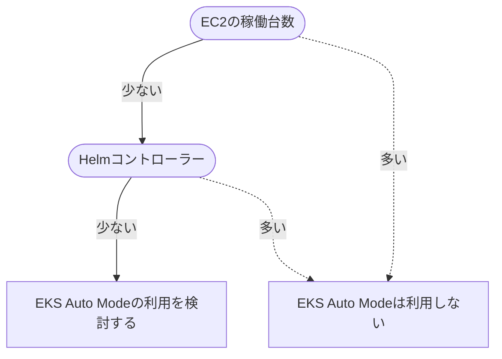

2024/12/1にre:InventでEKS Auto Modeが[発表](https://aws.amazon.com/jp/about-aws/whats-new/2024/12/amazon-eks-auto-mode/)されました。AWSとしては、EKS Auto Modeを今後EKSを構築する時のスタンダードにしていきたいんだろうなと感じます。ただ、Auto ModeはEKSアドオンやKarpenterをはじめ、組み込みコンポーネントが隠蔽されており違いを知っておかないと戸惑う感じがあります。

今回はEKS Auto Modeを構築しつつ、どのような挙動なのか見ていきます。

[:contents]

# EKS Auto Modeのコンセプト

EKS Auto Modeの[コンセプト](https://aws.amazon.com/jp/blogs/containers/getting-started-with-amazon-eks-auto-mode/)を見ると、クラスター管理をAWSにオフロードしてアプリケーション開発へフォーカスできることを狙っているようです。その例として、次の図が示されています。

これまでのEKSではアドオンやEC2インスタンスをユーザー管理していたのに対して、Auto Modeはストレージ/コンピュート/ロードバランサー管理をAWSが担保しEC2にも関与するようになっています。

Before Auto Mode

[f:id:guitarrapc_tech:20250328203455p:plain:alt=alt text]

After Auto Mode

[f:id:guitarrapc_tech:20250328203502p:plain:alt=alt text]

# コンセプトから受ける印象と実際

コンセプト図から、EKS Auto Modeに次のような印象を抱きます。実際使ってみると期待に近いものの、一部は従来のEKS管理から楽になったかは悩ましい側面もあります。

* EKSアドオンはAWSが管理するためユーザーは導入不要になった
* EC2のオートスケールはAWSに完全お任せできる
* IngressからLB作成や管理、TargetGroup紐づけも任せられる

また、以下はコンセプトから読み解けないので気になります。

* Auto Mode管理のALBやEBS、EC2は引き続きユーザーが関与できるのか
* Helmはどうなるのか
* Podの水平スケールはどうなるのか

それぞれ見ていきましょう。

## EKSアドオンはAWSが管理するためユーザーは導入不要になった

これは受けた印象に割と近いです。CoreDNSなど必須EKSアドオンを追加不要、Podも見えなくなったのでマネージドだなという印象と実感が揃っています。
一方で、ユーザーは必要なEKSアドオンを追加でき、そのPodはkubectlで確認、操作できます。

良いところです。

* これまでEKSクラスターで必須といってもよかったCoreDNS、kube-proxy、VPC CNIはAuto Modeでは導入不要
* Node LocalDNSも組み込みになった
* AWS EBS CSI Driverも組み込みになった
* EKSPod Identityt Agentも組み込みになった
* 組み込まれたコンポーネントのPod等はkubectlで見えずNodeも利用しない
* 組み込みにならなかったEKSアドオンはユーザーが任意で導入できる

微妙なところです。

* サードパーティEKSアドオンの新Kubernetesバージョン対応は引き続き待つ必要がある
* Mertics Serverは組み込まれておらず、組み込みじゃないEKSアドオンを追加するとPodが起動、Nodeも起動する

組み込みになったCoreDNS、kube-proxy、VPC CNIは事実上必須でしたが、これまでは全然手当なくてつらかったのが正直な感想です。Auto Modeで組み込まれたことは非常にうれしいです。
組み込みになったEKSアドオンのリソースはPodが見えないだけじゃなく、Nodeが存在しなくても動作するのが不思議な感覚ですが各Node上でsystemdサービスとして実行される[^1]ので納得です。

とはいえ、ユーザーが追加したEKSアドオンはPodなどリソースが見えますし、Nodeも必要です。贅沢をいうなら、Metrics ServerはHPAでもKEDAでも必須なので組み込みEKSアドオンとして管理してほしかったです。

ユーザーが追加できるEKSアドオンの注意点として、3rdパーティのEKSアドオンが利用できるかはEKSのKubernetesに依存します。例えば、現在EKS 1.32が最新ですが3rdパーティEKSアドオンの多くは対応していません。各アドオン提供者の意欲に依存しているので、EKSアップグレードの可否がEKSアドオンに左右されうるのは嫌だなと感じます。

## EC2のオートスケールはAWSに完全お任せできる

オートスケールがKarpenterに変わり、Karpenterコントローラーが完全お任せになりました。代わりにコストが上がってどっちかというと厳しい。

良いところです。

* EKS Auto ModeでKarpenterコントローラーが組み込みになった
* 組み込みノードグループ`general-purpose`は、SPOTを使わない・amd64でしかアプリケーションを動作しない・ストレージサイズは80GB固定・インスタンスタイプもある程度限定される
* 上を1つでも変えたい場合、自分でKarpenterのNodeClass[^2]、NodePool定義を書く必要がある

微妙なところです。

* AMIは常に最新が利用される(自動パッチ)

厳しいところです。

* Auto Mode管理のノードは最大21日寿命でPDBを使った制御が必須
* EKS Auto Mode管理のKarpenterで作られたEC2は追加料金がかかる(+11-12％程度)

EKS Auto Modeのノード水平スケールはKarpenterなので、Karpenter 1.2以上を使っている人なら戸惑うことなく自分のNodeClassやNodePool定義を書くことができます。Cluster AutoScalerを使っている人には大きな体験の変更になります。

Auto ModeのKarpenterはOSS版Karpenterからカスタマイズが入っており、EC2NodeClassの代わりにNodeClassへ変更・NodePoolのフィールドキーが一部さし変わっています。特にNodeClassから`amiSelector`がなくなったことでAMIを指定せずとも最新AMIが使われます。AMIを固定できないため、Linux系のセキュリティインシデント時の対応時に注意が必要そうです。

ノードの寿命はOSSでは無期限にできましたが、Auto Modeでは最大21日で入れ替わるのがユースケースによって厳しいです。また、寿命によるEC2の入替えタイミングはユーザーが制御できないため、PDBを使ってPodがどのように入れ替わるか制御する必要があります。PDBを指定しない場合、Podがいつの間にか0台という最悪のタイミングが起こりえます。

気になる点はコストです。EKS Auto Modeの組み込みKarpenterで起動したEC2インスタンスは追加料金が11-12％程度かかります。オンデマンド・スポットにかかわらず固定金額かかるので、単純にEKS Auto Modeにするとコストが12％程度上がると考えても差支えないでしょう[^3]。また、組み込みノードプールはSpotが利用されないので、どのみち自分で書くことになります。

**EC2の21日寿命の個人的所感**

ゲームサーバーでよくある「インメモリにデータを持つサーバー」は、時にワールドサーバーと呼ばれる大量常時接続をさばき、長時間起動しっぱなしなサーバーを使うことがあります。ワールドサーバーの停止はゲームの停止を意味するため、サーバーの入れ替えタイミングを選ぶことになります。そう、寿命日数がハードリミットされると、ゲーム中入れ替えができないサーバーと致命的に相性が悪いんですね。

EKS Auto Modeでも従来のマネージドノードグループは使え、従来のマネージドノードグループ管理のEC2に21日制限はありません。このため、21日寿命が困るPodは従来のマネージドノードグループを使って回避になります。そんなー。

**EC2コスト増加分の個人的所感**

Karpenterコントローラー・従来EKSアドオンのPodが見えないことから、EC2コスト追加料金はこれらの稼働分としてかかっているのかなと感じます。しかし、自前で動かしてもKarpenterコントローラーで2Pod動作、EKSアドオン各種で6-10pod程度増える程度です。これに対して、EC2ノードごとにコストが上乗せされるのは納得感ありません。SPやRI、スポットでも1台当たり追加料金は変わらないので、費用低減策をしているほど負担が重くなって受け入れ難い感情を感じます。

## IngressからLB作成や管理、TargetGroup紐づけも任せられる

LB管理をお任せできます。従来のAWS LoadBalancer Controller(ALBC)で作ったALBを、AutoModeにマイグレーションできないので高負荷環境なユーザーは注意が必要です。

良いところです。

* EKS Auto ModeはElastic Load Balancingを管理するコントローラーを組み込みで持っている
* ALBをIngressで管理できる
* NLBをServiceで管理できる
* TargetGroupだけ管理もできる

微妙なところです。

* ALBの挙動はAnnotationsからIngressClassParamsやIngressClassで設定に変わりnamespaceごとの違いを管理する方法が変わった
* 既存のALBをEKS Auto Modeに直接マイグレートできない
* 既存のTargetGroupBindingを利用するにはTargetGroupのタグを調整する

EKS Auto ModeではOSS版AWS LoadBalancer Controller(ALBC)がIngress Annotationsで設定したALB設定を、IngressClassParams・IngressClassで調整するように変わっています。もしもALBCを使っている既存EKSクラスターをAuto Modeに変更する場合、違いに気を付けましょう。

また、従来のEKSクラスターからAuto Modeに変更する場合、同一ALBにマイグレーションできません。[ドキュメント](https://docs.aws.amazon.com/eks/latest/userguide/migrate-auto.html)に、DNSベースのトラフィックシフト(Route53の加重ルーティング)を使ってALBを切り替えるといいでしょう。[^4]

ALBCでTargetGroupBindingを使っていてAuto Modeでも引き続き同じTargetGroupを用いるには、TargetGroupの[タグにクラスター名を入れる](https://github.com/aws/containers-roadmap/issues/2508)必要があります。

```
eks:eks-cluster-name: EKSクラスター名
```

## Auto Mode管理のALBやEBS、EC2は引き続きユーザーが関与できるのか

組み込みKarpenterで作られたEC2(Auto Mode管理ノード)へ、ユーザーはほぼ関与できなくなりました。EC2を直接消せなくなったのは安全ですが、一方で夜間停止時のアプローチ方法が1つ減りました。[^5]

良いところです。

* EKS Auto Modeで作成されたEC2、ALB、NLB、EBS等はAWSコンソールなど従来通り確認できる
* Auto Mode管理のALBはユーザーが消せる

微妙なところです。

* Auto Mode管理のノード(EC2)はユーザーが消せない、ソフトウェア追加できない、SSH・SSM SesisonManagerでアクセスできない

AWSコンソールでEC2の状態を確認できるので、負荷状況などの確認は従来通りです。

マネージドインスタンスの[ドキュメント](https://docs.aws.amazon.com/eks/latest/userguide/automode-learn-instances.html)にある通り、EKS Auto Modeで起動したEC2はEKS管理下になりユーザー操作ができなくなりました。SSM SessionManagerでアクセスできないの悲しいですね。

[f:id:guitarrapc_tech:20250328203511p:plain:alt=alt text]

## Helmはどうなるのか

Auto Modeになっても、Helmは引き続きユーザー管理です。それはそう。そして、EKSで一番つらいのはHelmによるコントローラー更新だと考えているので難しさは解消していないなと感じます。Helmアップグレードをもっと安全に楽にしたい。

微妙なところです。

* EKS Auto Modeでもユーザーが自分で導入したHelmは自分で管理が必要

利用するHelmをすべて3rdパーティEKSアドオンにすれば楽になる、と考えてしまいそうですが、EKSアドオンごとにKubernetesバージョン対応を待つ必要があります。Kubernetes 1.32への対応が3/15時点でもあまり進んでない現状からすると、引き続き自前Helmで導入を選ばざるを得ないケースが多いでしょう。がんばりましょう。

とはいえ、Karpenter、AWS LoadBalancer Controller、EBS CSI Driver、Pod Identity Agent、Node LocalDNSの導入が省けるので多少は楽になりますね。コスト増加と見合ってるとは言い難いですが。

## Podの水平スケールはどうなるのか

Auto ModeはNodeの水平スケールは管理しますが、Podの水平スケールは管理しません。

良いところです。

* EKS Auto ModeはKubernetes標準のHPAが利用できる

微妙なところです。

* HPAで必要なMetrics ServerはEKS Addonや自前Helmで追加が必要
* KEDAを使うなら自前Helm導入が必要

Metrics ServerはAuto Mode管理じゃありません。幸いEKSアドオンで導入できるのでインストールしましょう。

HPAはKubernetes標準提供のPod水平スケールリソースで、その単純さから負荷が低かったりスパイクしないなら悪くない選択肢です。しかし、実際のワークロードはCPU/Memoryではなくキュー残数やリクエスト処理時間などアプリケーションメトリクスをベースにスケール判定することが多く、加えて時間制御、一時的な0台制御を考えるとHPAは力不足と言わざるを得ません。KEDAは実運用に足る能力を持っていることから、結局のところKEDAを導入することになるでしょう。

管理する対象リソースの違いから、AWS統合が必要なノードレベルの水平スケールまではAuto Modeが管理するものの、Podはアプリケーションがやってねという切り分けなのかなぁと感じます。

# EKS Auto Modeは使えるのか

実際のところEKS Auto Modeは使えるのか考えてみましょう。

あまり手をかけることがない小規模な環境(開発や検証環境含む)でEKS Auto Modeは使いやすいと感じます。一方で、大規模な環境(本番環境など)でEKS Auto Modeはコスト面から説得力は持ちにくそうです。仮に開発でEKS Auto Mode、本番でEKS Auto Modeとしても、コントローラーや定義の管理が共通化できないのは開発でドッグフーディングできず不満があります。

良いところです。

* 小規模な環境 (追加Helmがない、EC2台数が少ない)

微妙なところです。

* 中～大規模な環境 (追加Helmが多い、EC2台数が多い)

EKS Auto ModeはEC2コストに説得力を持たせられればいいのですが、現時点の料金体系では大規模環境でEKS Auto Modeを採用する動機付けは難しいと感じます。また、小規模な環境ならECS FargateやLambdaで組んでしまえばよいケースは多く、Kubernetesを使う環境で小規模とはというのも難しいです。

個人的には、AWSコンテナ系アプリケーションで見たときに、クラスターバージョン含めた管理の楽さで見ると`ECS Fargate > ECS EC2 >> EKS Auto Mode > EKS`、コスト面で`ECS EC2 > EKS >> EKS Auto Mode > ECS Fargate`[^6]という感触です。

## EKS Auto Modeが実現していること

EKS Auto ModeはよりAWS統合が強くなっています。これまで必須だったEKSアドオンは考慮不要になりました。Node水平スケールアウトも組み込みKarpenterに任せることができEC2も自動更新してくれます。ALB/NLBとの統合も任せることができます。EBSマウントもサクッとできますし、Pod Identityもさくっと利用できます。お任せ度が高まっているのは事実です。

EKSはマネージドKubernetesと言いつつ、コントロールプレーン・AWS-Kubernetesアクセス管理・ログ回り程度しかマネージドではないのでは?という感触からすると、やっとマネージドな実感がわいてきます。

## EKS Auto Modeのペインポイント

コストとこれまでの運用との差異が見受けられるので、そこに合致するとつらさがあります。EKS Auto Mode管理のEC2は一台あたりコストが+11-12％上がります。EC2は最大21日寿命で入れ替えタイミングは制御困難です。Pod Security Identityは利用できません。

また、ユーザー自身がExternalDNSやExternalSecretsのような各種コントローラーをHelmで導入している場合、Helm更新時の手間は軽減していません。Podスケールアウトは面倒みないためHPAで力不足ならKEDAを入れざるを得ません。EKS Auto ModeといってもKubernetes運用が任せられるわけじゃないです。

## EKS Auto Modeの採用基準

大量のEC2が必要なワークロードではコスト増加が受け入れられるかはカギになるでしょう。また、従来KarpenterやAWS LoadBalancer Controller(ALBC)をはじめとして複数Helmコントローラーを利用していたチームにとっては、Karpenter/ALBCの管理が不要になっても他のHelm管理は残るため楽になったとは感じられない[^7]のが正直なところです。

導入を検討するフローはこういうかんじでしょうか。

<details><summary>フローチャート</summary>



</details>

[f:id:guitarrapc_tech:20250402102410p:plain:alt=alt text]

[Amazon EKS Auto Mode のノード自動更新を Deep Dive する](https://aws.amazon.com/jp/builders-flash/202504/dive-deep-eks-node-automated-update/)というAWSブログでも懸念に触れられているので参考になります。

# EKS Auto Modeを使いつつ違いを見る

実際に触ってEKS Auto Modeの挙動を確認しましょう。EKS Auto Modeを追加EKSアドオンがない状態で構築して、次の点を順番に見ていきましょう。

1. 組み込みコンポーネントがある
2. 組み込みノードグループがある
3. 組み込みKarpenterで動作させるEC2は追加料金がかかる
4. 求められるIAMポリシーが異なる
5. ネットワーク周りで制約がある
6. 組み込みでALBを作成できる

なお、Auto Modeでも接続やロギングは共通です。

* EKSの認証方法は変わらない
* EKSロギングは変わらない


## 組み込みコンポーネントがある

何もEKSアドオンを追加していない状態でも、EKS Auto Modeには組み込みコンポーネントがあります。

[f:id:guitarrapc_tech:20250328203526p:plain:alt=alt text]

組み込まれているのは従来EKSアドオンで入れていたものや、Karpenterを含めたAWS連携部分に関わるコントローラーです。EKS Auto Modeの組み込みコンポーネントは[次の通り](https://docs.aws.amazon.com/eks/latest/userguide/auto-upgrade.html)です。

* これまで必須EKSアドオンだったkube-proxy/CoreDNS/Amazon VPC CNIが組み込みインストールされ、Podは隠蔽されている
* Karpenterが組み込みインストールされいる
* AWS LoadBalancer Controller(ALBC)が組み込みインストールされている
* AWS EBS CSI Driverが組み込みインストールされている
* EKS Pod Identity Agentが各ノードでインストールされている

一方で、自分でインストールしたHelmやアプリケーションはこれまで通り自分で管理します。自分でEKSアドオンから追加したコントローラーも自分で管理します。

組み込みコンポーネントの面白いところは、EKS Auto Modeで起動してEKSアドオンやアプリケーションを何もデプロイしていない状態でPodを見ても何も見えないことです。セルフサービスEKSアドオンや自分のPodを起動していない状況だと、NodeClassやNodePoolも見えないのが興味深いです。[^8]

```sh
$ kubectl get po -A
No resources found
$ kubectl get nodeclass
No resources found
$ kubectl get nodepool
```

## 組み込みノードグループがある

EKS Auto Modeは`system`と`general-purpose`という組み込みノードグループがあります。従来のManaged NodeGroupとは異なり名前が決められており、使うかどうかは任意です。

[f:id:guitarrapc_tech:20250328203536p:plain:alt=alt text]

組み込みノードグループはKarpenterで動作しており、組み込みノードグループのKarpenter定義は変更できません。

組み込みノードグループは、NodeClass`default`を共通利用してしています。NodeClassは、Karpenterでいうところの[EC2NodeClass](https://karpenter.sh/v1.3/concepts/nodeclasses/)に相当し、NodePoolで起動するEC2のスペックを定義します。EC2のスペックはEKS Auto Modeで建てたクラスターと同じセキュリティグループ、サブネットグループになっているのが特徴的です。Karpenterではセキュリティグループ、サブネットグループともにタグで検索させるのが主流だったので、これは組み込みの性質を強く感じます。また、KarpenterのEC2NodeClassでは`amiSelector`でAMIバージョンを都度指定する必要がありましたが、NodeClassで指定はできず最新AMIが使われます。

組み込みノードグループの`NodePool`はKaprneterの[NodePool](https://karpenter.sh/v1.3/concepts/nodepools/)と同じスペックですが、`requirements`の一部フィールドがEKS [Auto Mode独自](https://docs.aws.amazon.com/ja_jp/eks/latest/userguide/create-node-pool.html)になっています。

[f:id:guitarrapc_tech:20250328203544p:plain:alt=alt text]

組み込みノードグループのKubernetes定義を見てみましょう。

<details><summary>NodeClass `default`</summary>

```sh
$ kubetl get nodeclass default -o yaml | kubetl neat
apiVersion: eks.amazonaws.com/v1
kind: NodeClass
metadata:
  annotations:
    eks.amazonaws.com/nodeclass-hash: "3399735243323253970"
    eks.amazonaws.com/nodeclass-hash-version: v1
  labels:
    app.kubernetes.io/managed-by: eks
  name: default
spec:
  ephemeralStorage:
    iops: 3000
    size: 80Gi
    throughput: 125
  networkPolicy: DefaultAllow
  networkPolicyEventLogs: Disabled
  role: automode-eks-AmazonEKSAutoNodeRole
  securityGroupSelectorTerms:
  - id: sg-1234567890
  snatPolicy: Random
  subnetSelectorTerms:
  - id: subnet-1234567890123
  - id: subnet-1234567890234
```

</details>

<details><summary>NodePool `system`</summary>

`general-purpose`と違い、traintsに`CriticalAddonsOnly`があり、arm64アーキテクチャにも対応しています。CoreDNSなど多くのEKSアドオンがこのtaintsをもっているので、EKSアドオン専用のNodePoolを指向していることがわかります。

```sh
$ kubectl get nodepool system -o yaml | kubectl neat
apiVersion: karpenter.sh/v1
kind: NodePool
metadata:
  annotations:
    karpenter.sh/nodepool-hash: "4982684901400657622"
    karpenter.sh/nodepool-hash-version: v3
  labels:
    app.kubernetes.io/managed-by: eks
  name: system
spec:
  disruption:
    budgets:
    - nodes: 10%
    consolidateAfter: 30s
    consolidationPolicy: WhenEmptyOrUnderutilized
  template:
    spec:
      expireAfter: 336h
      nodeClassRef:
        group: eks.amazonaws.com
        kind: NodeClass
        name: default
      requirements:
      - key: karpenter.sh/capacity-type
        operator: In
        values:
        - on-demand
      - key: eks.amazonaws.com/instance-category
        operator: In
        values:
        - c
        - m
        - r
      - key: eks.amazonaws.com/instance-generation
        operator: Gt
        values:
        - "4"
      - key: kubernetes.io/arch
        operator: In
        values:
        - amd64
        - arm64
      - key: kubernetes.io/os
        operator: In
        values:
        - linux
      taints:
      - effect: NoSchedule
        key: CriticalAddonsOnly
      terminationGracePeriod: 24h0m0s
```

</details>

<details><summary>NodePool `general-purpose`</summary>

systemと異なりtaintsはなく、amd64アーキテクチャのみ対応しています。オンデマンドでしか起動しません。

特に制約がないため、Auto Modeで適当にPodを起動すると、`general-purpose`NodePoolでノードが作成されます。

```sh
$ kubectl get nodepool general-purpose -o yaml | kubectl neat
apiVersion: karpenter.sh/v1
kind: NodePool
metadata:
  annotations:
    karpenter.sh/nodepool-hash: "4012513481623584108"
    karpenter.sh/nodepool-hash-version: v3
  labels:
    app.kubernetes.io/managed-by: eks
  name: general-purpose
spec:
  disruption:
    budgets:
    - nodes: 10%
    consolidateAfter: 30s
    consolidationPolicy: WhenEmptyOrUnderutilized
  template:
    spec:
      expireAfter: 336h
      nodeClassRef:
        group: eks.amazonaws.com
        kind: NodeClass
        name: default
      requirements:
      - key: karpenter.sh/capacity-type
        operator: In
        values:
        - on-demand
      - key: eks.amazonaws.com/instance-category
        operator: In
        values:
        - c
        - m
        - r
      - key: eks.amazonaws.com/instance-generation
        operator: Gt
        values:
        - "4"
      - key: kubernetes.io/arch
        operator: In
        values:
        - amd64
      - key: kubernetes.io/os
        operator: In
        values:
        - linux
      terminationGracePeriod: 24h0m0s
```

</details>

## 組み込みKarpenterで動作させるEC2は追加料金がかかる

EKS Auto Modeは、管理するNode(=EC2)に対して追加料金がかかります。

> Amazon EKS Auto Mode の料金は、EKS Auto Mode によって起動および管理される Amazon EC2 インスタンスの期間とタイプに基づいてお支払いいただきます。以下の Amazon EKS Auto Mode の料金は、EC2 インスタンス自体を対象とする Amazon EC2 インスタンス料金に加えて請求されます。EC2 インスタンス料金と同様に、EKS Auto Mode の料金は 1 秒単位で課金され、1 分間分の最低料金がかかります。オンデマンド、1 年および 3 年のリザーブドインスタンス、Compute Savings Plans、スポットインスタンスなど、EKS Auto Mode では Amazon EC2 インスタンス購入オプションをすべて利用できますが、EKS Auto Mode の料金は EC2 インスタンス購入オプションとは無関係です。
>
> 引用: https://aws.amazon.com/jp/eks/pricing/

まとめると次のようになります。

| 起動タイプ | 追加コストが必要 |
| --- | --- |
| EKS Auto ModeのBuilt-in node poolsで起動したEC2 | 必要 |
| EKS Auto Modeで自前Node ClassとNodePoolで起動したEC2 | 必要 |
| EKS Auto ModeにOSS Karpenterを入れてEC2NodeClassとNodePoolで起動したEC2 | 不要 |

EKS Auto Mode管理のNodeClass`default`を避けて独自NodeClassを作ってもAuto Mode管理のノードとカウントされるので抜け穴はなさそうです。なお、追加分のコストはCost Explorer > API operationでEKSAutoUsageとして表示されます。(Service分類は`Elastic Container Service for Kubernetes`)

**Auto Mode管理のノードか判別する**

EKS Auto Modeが管理しているNodeどうかを識別するには、EC2インスタンスなら`Managed`にTrueがついているか、Nodeなら`eks.amazonaws.com/compute-type: auto`ラベルがあるかで判別できます。

[f:id:guitarrapc_tech:20250328203552p:plain:alt=alt text]

Nodeにラベルがあるので、nodeSelectorで制御もできますね。

```yaml
nodeSelectcor:
  eks.amazonaws.com/compute-type: auto
```

**追加料金の試算**

例えばEKS Auto ModeのBuilt-in node pools`system`が有効な状態で、EKSアドオンの`Metrics Server`をインストールすると`c6g.large`が2台[^9]起動します。東京リージョンで起動した場合、EKS Auto Modeで起動した`c6g.large`のコストは元の価格から見て119.9％です。

```
$0.0856 (EC2オンデマンド料金) + $0.01027 (EKS Auto Mode追加分) = $0.09587/h
$0.09587 / $0.0856 * 100 = 111.99%
```

AWSの例示する[料金例](https://aws.amazon.com/jp/eks/pricing/)を見ても、おおむね+11-12％程度の追加EC2料金になると見込むことになりそうです。

[f:id:guitarrapc_tech:20250328203558p:plain:alt=alt text]

[f:id:guitarrapc_tech:20250328203606p:plain:alt=alt text]

## 求められるIAMポリシーが異なる

通常のEKSクラスターとAuto Mode EKSクラスターで「EKSクラスター用IAMロール」「ノード用IAMロール」の必要ポリシーが異なります。詳細は[ドキュメント](https://docs.aws.amazon.com/ja_jp/eks/latest/userguide/auto-learn-iam.html#tag-prop)を見るといいのですが、組み込みコンポーネントで必要なIAMポリシーが追加された感じです。

| IAM Role | 通常のEKSクラスター | Auto Mode EKSクラスター |
| --- | --- | --- |
| EKSクラスター用IAMロール | `arn:aws:iam::aws:policy/AmazonEKSClusterPolicy`<br/>`arn:aws:iam::aws:policy/AmazonEKSVPCResourceController` | `arn:aws:iam::aws:policy/AmazonEKSClusterPolicy`<br/>`arn:aws:iam::aws:policy/AmazonEKSComputePolicy`<br/>`arn:aws:iam::aws:policy/AmazonEKSBlockStoragePolicy`<br/>`arn:aws:iam::aws:policy/AmazonEKSLoadBalancingPolicy`<br/>`arn:aws:iam::aws:policy/AmazonEKSNetworkingPolicy`<br/>`arn:aws:iam::aws:policy/AmazonEKSVPCResourceController`<br/> + 下記のタグ用追加カスタムポリシー |
| ノード用IAMロール | `arn:aws:iam::aws:policy/AmazonEKSWorkerNodePolicy`<br/>`arn:aws:iam::aws:policy/AmazonEC2ContainerRegistryPullOnly` | `arn:aws:iam::aws:policy/AmazonEKSWorkerNodeMinimalPolicy`<br/>`arn:aws:iam::aws:policy/AmazonEC2ContainerRegistryPullOnly` |

EKS Auto ModeのNodeClassで追加タグを設定する場合、Auto ModeのEKSクラスター用IAM Roleに以下のカスタムポリシーが必要です。このポリシーは、KarpenterであればKarpenterコントローラー用のポリシーに[相当](https://karpenter.sh/docs/reference/cloudformation/#karpenternoderole)しています。

```json
{
    "Version": "2012-10-17",
    "Statement": [
        {
            "Sid": "Compute",
            "Effect": "Allow",
            "Action": [
                "ec2:CreateFleet",
                "ec2:RunInstances",
                "ec2:CreateLaunchTemplate"
            ],
            "Resource": "*",
            "Condition": {
                "StringEquals": {
                    "aws:RequestTag/eks:eks-cluster-name": "{{ClusterName}}"
                },
                "StringLike": {
                    "aws:RequestTag/eks:kubernetes-node-class-name": "*",
                    "aws:RequestTag/eks:kubernetes-node-pool-name": "*"
                }
            }
        },
        {
            "Sid": "Storage",
            "Effect": "Allow",
            "Action": [
                "ec2:CreateVolume",
                "ec2:CreateSnapshot"
            ],
            "Resource": [
                "arn:aws:ec2:*:*:volume/*",
                "arn:aws:ec2:*:*:snapshot/*"
            ],
            "Condition": {
                "StringEquals": {
                    "aws:RequestTag/eks:eks-cluster-name": "{{ClusterName}}"
                }
            }
        },
        {
            "Sid": "Networking",
            "Effect": "Allow",
            "Action": "ec2:CreateNetworkInterface",
            "Resource": "*",
            "Condition": {
                "StringEquals": {
                    "aws:RequestTag/eks:eks-cluster-name": "{{ClusterName}}"
                },
                "StringLike": {
                    "aws:RequestTag/eks:kubernetes-cni-node-name": "*"
                }
            }
        },
        {
            "Sid": "LoadBalancer",
            "Effect": "Allow",
            "Action": [
                "elasticloadbalancing:CreateLoadBalancer",
                "elasticloadbalancing:CreateTargetGroup",
                "elasticloadbalancing:CreateListener",
                "elasticloadbalancing:CreateRule",
                "ec2:CreateSecurityGroup"
            ],
            "Resource": "*",
            "Condition": {
                "StringEquals": {
                    "aws:RequestTag/eks:eks-cluster-name": "{{ClusterName}}"
                }
            }
        },
        {
            "Sid": "ShieldProtection",
            "Effect": "Allow",
            "Action": [
                "shield:CreateProtection"
            ],
            "Resource": "*",
            "Condition": {
                "StringEquals": {
                    "aws:RequestTag/eks:eks-cluster-name": "{{ClusterName}}"
                }
            }
        },
        {
            "Sid": "ShieldTagResource",
            "Effect": "Allow",
            "Action": [
                "shield:TagResource"
            ],
            "Resource": "arn:aws:shield::*:protection/*",
            "Condition": {
                "StringEquals": {
                    "aws:RequestTag/eks:eks-cluster-name": "{{ClusterName}}"
                }
            }
        }
    ]
}
```


## ネットワーク周りで制約がある

EKS Auto Modeは以下をサポートしています。

* EKSネットワークポリシー
* KubernetesポッドのHostPortおよびHostNetworkオプション
* パブリックサブネットまたはプライベートサブネットのポッド

一方で、以下をサポートしていないためネットワーク周りの制約があります。

* ポッドあたりのセキュリティグループ (SGPP)
* カスタムネットワーキング。ポッドとノードのIPアドレスは同じCIDRブロックからのものである必要がある
* ウォームIP、ウォームプレフィックス、ウォームENI設定
* 最小IPターゲット設定
* プレフィックス委任の有効化または無効化
* オープンソースAWS CNIでサポートされているその他の設定
* conntrackタイマーのカスタマイズなどのネットワークポリシー設定 (デフォルトは300秒)
* クラウドWatchへのネットワークイベントログのエクスポート

**運用中にサブネットのIPが足りなくなった時の追加VPC CIDR対応**

EKS Auto ModeのポッドとノードのIPアドレスは「同じCIDRブロックからのもの」である必要があります。[カスタムネットワーキング](https://docs.aws.amazon.com/ja_jp/eks/latest/userguide/cni-custom-network.html)をサポートしていないので、「運用中にVPCへ追加CIDRを設定、サブネットを切ってPodを起動させる」ときに注意が必要です。

NodeClass`default`はEKSクラスターと同じサブネットをIdで参照しており追加サブネットに対応できません。これに対応するには、独自C2NodeClassを作成して`タグでサブネットを探索`させましょう。

**EKS Nodeの最大Pod数が110に制限されている**

Auto ModeはEKSの最大Pod数が[「ハードリミットの110」か「ノードの最大ポッド数」の低い方に制限](https://docs.aws.amazon.com/ja_jp/eks/latest/userguide/choosing-instance-type.html)されています。

従来、VPC CNIを用いたEKSにおいてNodeごとに起動できるPodの数はENIに依存していました。この時、インスタンスファミリーごとの起動可能なPod数一覧は[GitHubで公開](https://github.com/aws/amazon-vpc-cni-k8s/blob/master/misc/eni-max-pods.txt)されています。このため、インスタンスタイプによっては110を超えて起動できたのですが、Auto Modeでは110というハードリミットが設けられていることに注意が必要です。

## 組み込みでALBを作成できる

EKS Auto Modeは組み込みでALBを作成して構成できるため、AWS LoadBalancer Controller(ALBC)を別途インストールする必要がありません。ALBの作成はIngressリソースを使って行い、NLBの作成はServiceリソースを使って行います。

ALBを作成する手順は[ドキュメント](https://docs.aws.amazon.com/eks/latest/userguide/auto-configure-alb.html)に沿って、IngressClassParams、IngressClass、Ingressの3リソースを作成します。次の例は`Nginx`をALBで公開するリソースを作成します。

```yaml
# IngressClassParamsとIngressClassは非Namespaceリソース
apiVersion: eks.amazonaws.com/v1
kind: IngressClassParams
metadata:
  name: alb
spec:
  scheme: internet-facing
---
apiVersion: networking.k8s.io/v1
kind: IngressClass
metadata:
  name: alb
  annotations:
    # Use this annotation to set an IngressClass as Default
    ingressclass.kubernetes.io/is-default-class: "true"
spec:
  # Configures the IngressClass to use EKS Auto Mode
  controller: eks.amazonaws.com/alb
  parameters:
    apiGroup: eks.amazonaws.com
    kind: IngressClassParams
    name: alb # IngressClassParams name
---
apiVersion: networking.k8s.io/v1
kind: Ingress
metadata:
  name: test-ingress
  namespace: default
spec:
  ingressClassName: alb # match IngressClass
  rules:
    - http:
        paths:
          - path: /
            pathType: ImplementationSpecific
            backend:
              service:
                name: nginx-svc
                port:
                  number: 8080
---
apiVersion: v1
kind: Service
metadata:
  name: nginx-svc
  namespace: default
spec:
  selector:
    app: nginx
  ports:
  - port: 8080
    targetPort: http
---
apiVersion: apps/v1
kind: Deployment
metadata:
  name: nginx
  namespace: default
spec:
  selector:
    matchLabels:
      app: nginx
  template:
    metadata:
      labels:
        app: nginx
    spec:
      containers:
      - name: nginx
        image: public.ecr.aws/nginx/nginx:1.27
        resources:
          limits:
            memory: "128Mi"
            cpu: "256m"
        ports:
        - name: http
          containerPort: 80
```

ALBCではingressの`metadata.annotations`にALB向けのパラメーターを設定できましたが、EKS Auto ModeではIngressClassParamsやIngressClassで設定します。ALBCとはフィールドキーが変わっているものもあるので注意しましょう。

[f:id:guitarrapc_tech:20250402102626p:plain:alt=alt text]

[f:id:guitarrapc_tech:20250402102635p:plain:alt=alt text]

# 気になる挙動を試す

触っててどうなるのか気になることを色々触ってみます。

## EKS作成直後のPod状態

EKSアドオンを何も導入していない状態だとPodが存在しません。ユーザー側のアプリケーションや追加EKSアドオンがなければ常時必要なノードがないのはコスト的に嬉しいことです。納得いってなかったですよね?

```sh
$ kubectl get po -A
No resources found
$ kubectl get node
No resources found
$ kubectl get nodeclass
No resources found
$ kubectl get nodepool
```

## 追加EKSアドオンをインストールする

追加EKSアドオンをインストールすると、組み込みノードグループの`system`が利用されます。例えばMetrics Serverを追加すると、NodePool`system`でPodが起動します。

```sh
$ kubectl get po -A -o wide
NAMESPACE     NAME                             READY   STATUS    RESTARTS   AGE
kube-system   metrics-server-746f5dc94-rdlzd   1/1     Running   0          64s
kube-system   metrics-server-746f5dc94-vl4wr   1/1     Running   0          3m15s

$ kubectl get node
NAME                  STATUS   ROLES    AGE   VERSION
i-095d98cf6f997a6a6   Ready    <none>   52s   v1.32.0-eks-2e66e76
i-09eabe62ba3931e7d   Ready    <none>   50s   v1.32.0-eks-2e66e76

$ kubectl get nodeclaim
NAME                TYPE        CAPACITY    ZONE              NODE                  READY     AGE
system-bcsln        c6g.large   on-demand   ap-northeast-1a   i-095d98cf6f997a6a6   True      77s
system-z7ppv        c6g.large   on-demand   ap-northeast-1c   i-09eabe62ba3931e7d   True      77s
```

## カスタムNodePoolはweightやtaintsをつけると組み込みノードグループと混じらない

組み込みNodePool`system`や`general-purpose`には優先度`spec.weight`が設定されていません。このため、カスタムNodePoolに優先度を指定しないと組み込みNodePoolとカスタムNodePoolでPodの起動ノードが混在します。

これを避けるためには、カスタムNodePoolに「優先度をつける」「taintsをつける」のどちらかを検討するといいでしょう。そのNodePoolに他のPodを起動させたくないなら「taints」がいいでしょうし、そのPodをそのNodePoolで起動できればいいなら「NodePoolの優先度」か「nodeSelectorでNodePool名を指定」などでもいいでしょう。

```yaml
# 優先度をつける例
apiVersion: karpenter.sh/v1
kind: NodePool
metadata:
  name: custom-pool
spec:
  # ... 省略
  weight: 10
```

```yaml
# taintsをつける例
apiVersion: karpenter.sh/v1
kind: NodePool
metadata:
  name: custom-pool
spec:
  template:
    spec:
      # ... 省略
      taints:
      - effect: NoSchedule
        key: AppOnly
---
apiVersion: apps/v1
kind: Deployment
metadata:
  name: nginx
spec:
  selector:
    matchLabels:
      app: nginx
  template:
    metadata:
      labels:
        app: nginx
    spec:
      # taintsに合わせる
      tolerations:
      - key: AppOnly
        operator: Exists
      containers:
      - name: nginx
        image: public.ecr.aws/nginx/nginx:1.27
        resources:
          limits:
            memory: "128Mi"
            cpu: "256m"
        ports:
        - name: http
          containerPort: 80
```

## Auto Modeが管理するEC2はコンソールから消せない

従来のEKSでは、NodeGroupやKarpenterで起動したEC2はAWSコンソールから消せました。しかしEKS Auto Modeで起動したNode(EC2)をAWSコンソールからTerminate Instanceしようとしても実行失敗します。


```
Failed to terminate (delete) an instance: You are not authorized to perform this operation. User: arn:aws:sts::1234567801234:assumed-role/foo-role/bar is not authorized to perform: ec2:TerminateInstances on resource: arn:aws:ec2:ap-northeast-1:1234567801234:instance/i-04df53f6f7a5bc3d0 with an explicit deny in a resource-based policy. Encoded authorization failure message: ppuIku-省略...
```

kubectlからnodeを消すとEC2も連動して消えます。

```sh
$ kubectl delete node i-04df53f6f7a5bc3d0
node "i-04df53f6f7a5bc3d0" deleted
```

[f:id:guitarrapc_tech:20250402102815p:plain:alt=alt text]

## Auto Modeが管理するALBはコンソールから消せる

EKS Auto Modeが管理するALBはAWSコンソールから消せます。ここはEC2と挙動が違いますね。

> Successfully deleted load balancer: arn:aws:elasticloadbalancing:ap-northeast-1:1234567801234:loadbalancer/app/k8s-default-testingr-1234567801/abcdefghijklmnop.

従来通り、kubectlからingressを消すとALBも連動して消えます。

```sh
$ kubectl delete ingress test-ingress
ingress.networking.k8s.io "test-ingress" deleted
```

## Auto ModeのEKSクラスター削除時にEC2とALBはどうなるのか

通常のEKSでは、Karpenterで管理しているNodeを残したままEKSクラスターを消すとEC2が残り、ALBCで管理しているingressリソースを残したままEKSクラスターを削除するとALBが残りました。
一方、EKS Auto Modeで作ったEC2/ALBはEKSクラスター削除に連動して消えます。後始末まで見てくれるマネージド具合はうれしいですね。

表にまとめると次の通りです。

| EKSの動作モード | EKSクラスター削除時のEC2挙動 | EKSクラスター削除時のALB挙動 |
| --- | --- | --- |
| 通常のEKS+Karpenter+ALBC | EC2が残る | ALBが残る |
| EKS Auto Mode | EC2が消える | ALBが消える |

## KarpenterとEKS Auto Modeで起動したEC2の違い

次の違いがあります。

| 項目 | Karpenter | EKS Auto Mode |
| --- | --- | --- |
| EC2のManaged状態 | false | true |
| Nameタグ | Nameタグがつく | Nameタグがつかない |
| EC2のボリューム | `/dev/xvda`のサイズ変更 | `/dev/xvdb`のサイズ変更 |

先に紹介した通り、EKS Auto Modeで起動したEC2をAWSコンソールから見ると`Managed: true`になっています。Karpenterで起動したEC2は`Managed: false`です。

[f:id:guitarrapc_tech:20250402102822p:plain:alt=alt text]

EKS Auto Modeで起動したEC2にNameタグがつきません。不便。Karpenterは`Name`タグにインスタンスの`IP name` (この例なら`ip-10-100-21-142.ap-northeast-1.compute.internal`)を設定します。(1段目の図)しかしEKS Auto Modeは`Name`タグ自体が設定されません。(2段目の図)

[f:id:guitarrapc_tech:20250402102829p:plain:alt=alt text]

[f:id:guitarrapc_tech:20250402102837p:plain:alt=alt text]

設定次第ではありますが、EC2のボリュームも違います。KarpenterではEC2NodeClassでボリュームサイズを指定すると`/dev/xvda`のサイズが変わりました。しかしEKS Auto Modeでは、EC2へストレージ`/dev/xvda`と`/dev/xvdb`の2つアタッチされ、NodeClassでボリュームサイズを指定すると`/dev/xvdb`のサイズが変わります。例えばカスタムNodeClassで20GiBを指定すると、`/dev/xvdb`EBSのサイズが20GiBになっていますね。

[f:id:guitarrapc_tech:20250402102845p:plain:alt=alt text]

```yaml
apiVersion: eks.amazonaws.com/v1
kind: NodeClass
metadata:
  name: custom-class
spec:
  # 省略
  ephemeralStorage:
    size: "20Gi" # <-- ここでサイズ指定
```

[f:id:guitarrapc_tech:20250402102853p:plain:alt=alt text]

## EKS AccessEntryの注意

組み込みノードグループを作っていると、IAM access entriesにノードグループで指定したNode用のIAM RoleArn(通常はAmazonEKSAutoNodeRole)が追加されます。

[f:id:guitarrapc_tech:20250402102901p:plain:alt=alt text]

しかし組み込みノードグループを作らない場合、カスタムNodeClassを展開するまではIAM access entriesにAmazonEKSAutoNodeRoleが追加されません。
一見自分で追加しないといけないのか!? となりますが、カスタムNodePoolを展開すると10-15分程度で自動追加されます。
早まってIaCで追加しないようにしましょう。

## NodeClassの注意

**spec.roleにはIAM Role名を指定する**

spec.roleのIAM Role名は64文字未満である必要があります。[ドキュメント](https://docs.aws.amazon.com/eks/latest/userguide/create-node-class.html)がIAM Role ARNになっているので64文字に収まらずびっくりしますが、実際はIAM Role Name指定です。

```yaml
# ×: ドキュメントはIAM Role ARN表記になっているがダメ
spec:
  role: arn:aws:iam::123456789012:role/MyNodeRole
```

```sh
$ kubectl apply -f ./k8s/test/automode_nodepool.yaml
The NodeClass "custom-class" is invalid:
* spec.role: Too long: may not be more than 64 bytes
* <nil>: Invalid value: "null": some validation rules were not checked because the object was invalid; correct the existing errors to complete validation
```

```yaml
# 〇: 実際はIAM Role NameでOK。OSS Karpenterと同じ
spec:
  role: MyNodeRole
```

**Auto Mode管理のEC2に追加タグを設定するにはEKS Cluster Roleに追加権限が必要**

EKSクラスターIAM Roleに追加ポリシーを設定しないと、Auto Modeで起動するノードに追加タグを設定した際に、NodeClaimが展開出来ず、`kubectl describe`すると`Error getting launch template configs: User is not authorized to perform this operation because no identity-based policy allows it`と表示されます。この場合、IAM Roleに[追加権限](https://docs.aws.amazon.com/eks/latest/userguide/auto-learn-iam.html#tag-prop)を設定すれば、無事にNodeClaimが展開されEC2起動・Podスケジュールされます。

```yaml
apiVersion: eks.amazonaws.com/v1
kind: NodeClass
metadata:
  name: custom-class
spec:
  # 省略
  tags:
    environment: custom
```

```sh
$ kubectl describe nodeclaim xxxxx

Status:
  Conditions:
    Last Transition Time:  2025-03-12T09:48:38Z
    Message:               object is awaiting reconciliation
    Observed Generation:   1
    Reason:                AwaitingReconciliation
    Status:                Unknown
    Type:                  Initialized
    Last Transition Time:  2025-03-12T09:48:38Z
    Message:               Error getting launch template configs: User is not authorized to perform this operation because no identity-based policy allows it
    Observed Generation:   1
    Reason:                Unauthorized
    Status:                Unknown
    Type:                  Launched
    Last Transition Time:  2025-03-12T09:48:38Z
    Message:               Node not registered with cluster
    Observed Generation:   1
    Reason:                NodeNotFound
    Status:                Unknown
    Type:                  Registered
    Last Transition Time:  2025-03-12T09:48:38Z
    Message:               Initialized=Unknown, Launched=Unknown, Registered=Unknown
    Observed Generation:   1
    Reason:                ReconcilingDependents
    Status:                Unknown
    Type:                  Ready
Events:                    <none>
```

## NodePoolの注意

Karpenterでは、expireAfterにNeverを設定して寿命で入れ替わらないように出来ました。EKS Auto Modeで`spec.template.spec.expireAfter`を`Never`に設定するとエラーになります。これは先に説明した最大21日という制限に引っかかるためです。

```sh
$ kubectl apply -f ./k8s/test/automode_nodepool.yaml
Error from server (Invalid): error when creating "./k8s/test/automode_nodepool.yaml": NodePool.karpenter.sh "custom-pool" is invalid: [spec.template.spec: Invalid value: "object": type conversion error from 'string' to 'google.protobuf.Duration' evaluating rule: the sum of expireAfter and terminationGracePeriod may not exceed 21 days, spec.template.spec: Invalid value: "object": expireAfter may not be set to Never]
```

# まとめ

EKS Auto Mode理解した。実際使ってみると色々そこ違うんだという点があるので、引き続き更新していきたいです。

繰り返しになりますが、EKS Auto Modeはコスト面、Node(EC2)寿命が最大21日、という2点がネックに感じます。ステートレスなワークロードなら寿命が短いのはどうでもいいのですが、ステートフルワークフロードでは採用できないレベルでつらいでしょう。EKS Auto Modeを使うぐらいなら、ECSでいいケースもあるので悩ましさが増した感じもしますがどうでしょうか。

# 参考

AWSドキュメント

* [Amazon EKS Auto Mode の発表 | AWS](https://aws.amazon.com/jp/about-aws/whats-new/2024/12/amazon-eks-auto-mode/)
* [Getting started with Amazon EKS Auto Mode | Containers](https://aws.amazon.com/jp/blogs/containers/getting-started-with-amazon-eks-auto-mode/)
* [Create a Node Pool for EKS Auto Mode - Amazon EKS](https://docs.aws.amazon.com/eks/latest/userguide/create-node-pool.html)
* [Create an EKS Auto Mode Cluster with the AWS Management Console - Amazon EKS](https://docs.aws.amazon.com/eks/latest/userguide/automode-get-started-console.html)
* [Learn about Amazon EKS Auto Mode Managed instances - Amazon EKS](https://docs.aws.amazon.com/eks/latest/userguide/automode-learn-instances.html)
* [Learn about identity and access in EKS Auto Mode - Amazon EKS](https://docs.aws.amazon.com/eks/latest/userguide/auto-learn-iam.html)
* [Learn about VPC Networking and Load Balancing in EKS Auto Mode - Amazon EKS](https://docs.aws.amazon.com/eks/latest/userguide/auto-networking.html)
* [Deploy a sample inflate workload to an Amazon EKS Auto Mode cluster - Amazon EKS](https://docs.aws.amazon.com/eks/latest/userguide/automode-workload.html)
* [Choose an optimal Amazon EC2 node instance type - Amazon EKS](https://docs.aws.amazon.com/eks/latest/userguide/choosing-instance-type.html)
* [Community add-ons - Amazon EKS](https://docs.aws.amazon.com/eks/latest/userguide/community-addons.html)
* [Amazon EKS Auto Mode のノード自動更新を Deep Dive する ~ 長期実行ワークロードを正しく取り扱う - builders.flash☆ - 変化を求めるデベロッパーを応援するウェブマガジン | AWS](https://aws.amazon.com/jp/builders-flash/202504/dive-deep-eks-node-automated-update/)


AWSスライド

* [Amazon EKS Auto ModeでKubernetesの運用をシンプルにする - Speaker Deck](https://speakerdeck.com/sshota0809/amazon-eks-auto-modetekubernetesnoyun-yong-wosinhurunisuru)
* [EKS Auto Mode | Spearker Deck](https://speakerdeck.com/kashinoki38/eks-auto-mode)
* [AWS Blackbelt Online Seminarre:Invent 2024 アップデート速報](https://pages.awscloud.com/rs/112-TZM-766/images/AWS-Black-Belt_2024_AWS-reInvent_1206_v1.pdf)

その他

* [Karpenter NodeClaim has error "Error getting launch template configs" in Amazon EKS Auto Mode | by Hiroaki Kaji | Medium](https://medium.com/@kazioyazi/nodeclaim-has-error-error-getting-launch-template-configs-in-eks-auto-mode-46edca067fba)
* [Terraform で Auto Mode の EKS クラスターを作成して、Pod Identity で AWS 権限を与えたアプリケーションをデプロイしてみた | DevelopersIO](https://dev.classmethod.jp/articles/create-eks-auto-mode-cluster-by-terraform/)
* [EKS Auto Mode で独自の NodePool を作成して利用してみた | DevelopersIO](https://dev.classmethod.jp/articles/eks-auto-mode-custom-node-pool/)
* [EKS Auto Modeで既存のTarget GroupをTargetGroupBindingで使う方法 | DevelopersIO](https://dev.classmethod.jp/articles/use-existing-target-group-with-target-group-binding-in-eks-auto-mode/)
* [[メモ]Amazon EKS Auto Modeの所感](https://zenn.dev/fy0323/articles/4d64ebd5195cdd)
* [NodeClasses | Karpenter](https://karpenter.sh/docs/concepts/nodeclasses/)
* [NodePools | Karpenter](https://karpenter.sh/docs/concepts/nodepools/)
* [[EKS] [request]: Support custom TargetGroupBinding resources in auto-mode - Issue #2508 | aws/containers-roadmap](https://github.com/aws/containers-roadmap/issues/2508)
* [Do you know that EKS Auto Mode enforces a 21-day maximum node lifetime? - DEV Community](https://dev.to/vijaykodam/do-you-know-that-eks-auto-mode-enforces-a-21-day-maximum-node-lifetime-5gm3)

[^1]: ドキュメントに記載がないですが[AWS スライド](https://files.speakerdeck.com/presentations/e1bdc02fbadc4f2096ef4283c1595d86/slide_32.jpg)に記載あります
[^2]: KarpenterのEC2NodeClassに相当しますが、EKS Auto Modeでは設定できるフィールドに制限があります
[^3]: ECSもFargateだとお高くなりがちなのと似ていますが、ECS EC2では追加コストないので非対称な価格設定です
[^4]: 自分で[LCUを設定できる](https://docs.aws.amazon.com/elasticloadbalancing/latest/application/capacity-unit-reservation.html)ようになってよかったよかった。
[^5]: Managed NodeGroupを0台にして、Karpenterで起動したEC2を強制的にTerminateすることで簡単に夜間停止を用意できたのが不可能になった
[^6]: EKS with Fargateはコスト面で最も悪いですが同軸には適さないので除外
[^7]: そもそもHelmコントローラーの更新がつらいので0にしたい
[^8]: Karpenterコントローラーを自分で使う場合、先にEC2NodeClass、NodePoolリソースを展開しておくのでPodがいなくても見えるはず。ないということは、Pod作成をトリガーにNodeClassやNodePoolを作っていると推察される。
[^9]: 2台起動するのは、Metrics ServerのpodAntiAffinityで`affinity.podAntiAffinity.preferredDuringSchedulingIgnoredDuringExecution`にて`"topologyKey": "kubernetes.io/hostname"`が設定されているため同一Nodeでスケジュールされないため
