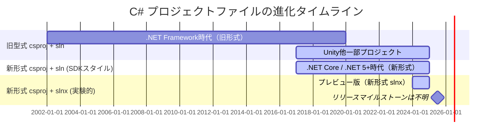

C#のプロジェクト構成といえば、プロジェクトファイル(.csrpoj)とそれを束ねるソリューションファイル(.sln)が定番です。
現在プレビュー提供されているSLNX形式と呼ばれる新しいソリューションファイルが、.NET SDK 9.0.200から利用しやすくなりました。

いい機会なのでSLNX形式について、どのような課題を解決し、どう利用できるのか見ていきましょう。

[:contents]

# C#のプロジェクト構成の変遷

はじめにC#のプロジェクト構成は何があるか復習です。

C#のプロジェクト構成は3パターンに大別できます。2025年3月現在、最新のSLNX形式はプレビュー版として提供されています。

* 旧型式csproj+sln: .NET Framework～.NET Core 3.1、Unityや一部プロジェクトタイプで現在も利用
* SDK-Style新形式csproj+sln: .NET Core (2017年)～現在まで主流
* SDK-Style新形式csproj+新形式slnx: 2024年～プレビュー提供中

それぞれのタイムラインを以下のように大別してみます。

<details><summary>Mermaid定義</summary>



</details>

[f:id:guitarrapc_tech:20250328200324p:plain:alt=alt text]

## プロジェクトファイルとソリューションファイル

C#のプロジェクト構成は、プロジェクトファイルとソリューションファイルの2つで構成されています。
プロジェクトファイルは、プロジェクトの設定やビルド設定を記述します。ソリューションファイルは、複数のプロジェクトファイルを束ねるファイルです。Visual Studioで開くと、ソリューションエクスプローラーに登録したプロジェクトが表示されます。

C#プロジェクトは両者を用いることで、複数のプロジェクトの依存関係を管理し、ビルドやデバッグを効率的に行うことができます。

## プロジェクトファイル

C#プロジェクトファイルは、プロジェクトの設定やビルド設定を記述します。拡張子`.csproj`、中身はXMLで定義されます。.NET Coreで[SDK Style](https://learn.microsoft.com/en-us/dotnet/core/project-sdk/overview)と呼ばれるフォーマットが導入されて、.NET Frameworkのころ使われていた旧型式に比べてシンプルかつ扱いやすくなりました。

SDK Styleプロジェクトは、プロジェクトタイプごとにSdkを変えることで、一見同じようなcsprojでもプロジェクトに応じた構成の変更・ライブラリの自動ロードを提供できます。例えばクラスライプラリプロジェクトなら、以下のように`Microsoft.NET.Sdk`を参照しています。

```xml
<Project Sdk="Microsoft.NET.Sdk">

  <PropertyGroup>
    <TargetFramework>net9.0</TargetFramework>
    <ImplicitUsings>enable</ImplicitUsings>
    <Nullable>enable</Nullable>
  </PropertyGroup>

</Project>
```

ASP.NET Coreのプロジェクトなら以下のように`Microsoft.NET.Sdk.Web`を参照しています。ASP.NET CoreでUserSecretsやcsproj Docker定義が使えるのは、このSdkの違いにあります。

```xml
<Project Sdk="Microsoft.NET.Sdk.Web">

  <PropertyGroup>
    <TargetFramework>net9.0</TargetFramework>
    <Nullable>enable</Nullable>
    <ImplicitUsings>enable</ImplicitUsings>
  </PropertyGroup>

</Project>
```

旧型式のプロジェクトファイルは.NET Frameworkで利用されており、現在でもVS拡張など一部のプロジェクトタイプで利用されています。比較するとSDK Styleはシンプルな定義だとよくわかります。

```xml
<?xml version="1.0" encoding="utf-8"?>
<Project ToolsVersion="15.0" DefaultTargets="Build" xmlns="http://schemas.microsoft.com/developer/msbuild/2003">
  <PropertyGroup>
    <MinimumVisualStudioVersion>17.0</MinimumVisualStudioVersion>
    <VSToolsPath Condition="'$(VSToolsPath)' == ''">$(MSBuildExtensionsPath32)\Microsoft\VisualStudio\v$(VisualStudioVersion)</VSToolsPath>
  </PropertyGroup>
  <Import Project="$(MSBuildExtensionsPath)\$(MSBuildToolsVersion)\Microsoft.Common.props" Condition="Exists('$(MSBuildExtensionsPath)\$(MSBuildToolsVersion)\Microsoft.Common.props')" />
  <PropertyGroup>
    <Configuration Condition=" '$(Configuration)' == '' ">Debug</Configuration>
    <Platform Condition=" '$(Platform)' == '' ">AnyCPU</Platform>
    <SchemaVersion>2.0</SchemaVersion>
    <ProjectTypeGuids>{82b43b9b-a64c-4715-b499-d71e9ca2bd60};{FAE04EC0-301F-11D3-BF4B-00C04F79EFBC}</ProjectTypeGuids>
    <ProjectGuid>{7B19A132-E890-4BEF-864B-30C1E968D6EE}</ProjectGuid>
    <OutputType>Library</OutputType>
    <AppDesignerFolder>Properties</AppDesignerFolder>
    <RootNamespace>VSIXProject1</RootNamespace>
    <AssemblyName>VSIXProject1</AssemblyName>
    <TargetFrameworkVersion>v4.7.2</TargetFrameworkVersion>
    <GeneratePkgDefFile>false</GeneratePkgDefFile>
    <IncludeAssemblyInVSIXContainer>false</IncludeAssemblyInVSIXContainer>
    <IncludeDebugSymbolsInVSIXContainer>false</IncludeDebugSymbolsInVSIXContainer>
    <IncludeDebugSymbolsInLocalVSIXDeployment>false</IncludeDebugSymbolsInLocalVSIXDeployment>
    <CopyBuildOutputToOutputDirectory>false</CopyBuildOutputToOutputDirectory>
    <CopyOutputSymbolsToOutputDirectory>false</CopyOutputSymbolsToOutputDirectory>
    <StartAction>Program</StartAction>
    <StartProgram Condition="'$(DevEnvDir)' != ''">$(DevEnvDir)devenv.exe</StartProgram>
    <StartArguments>/rootsuffix Exp</StartArguments>
  </PropertyGroup>
  <PropertyGroup Condition=" '$(Configuration)|$(Platform)' == 'Debug|AnyCPU' ">
    <DebugSymbols>true</DebugSymbols>
    <DebugType>full</DebugType>
    <Optimize>false</Optimize>
    <OutputPath>bin\Debug\</OutputPath>
    <DefineConstants>DEBUG;TRACE</DefineConstants>
    <ErrorReport>prompt</ErrorReport>
    <WarningLevel>4</WarningLevel>
  </PropertyGroup>
  <PropertyGroup Condition=" '$(Configuration)|$(Platform)' == 'Release|AnyCPU' ">
    <DebugType>pdbonly</DebugType>
    <Optimize>true</Optimize>
    <OutputPath>bin\Release\</OutputPath>
    <DefineConstants>TRACE</DefineConstants>
    <ErrorReport>prompt</ErrorReport>
    <WarningLevel>4</WarningLevel>
  </PropertyGroup>
  <ItemGroup>
    <Compile Include="Properties\AssemblyInfo.cs" />
  </ItemGroup>
  <ItemGroup>
    <None Include="source.extension.vsixmanifest">
      <SubType>Designer</SubType>
    </None>
  </ItemGroup>
  <ItemGroup>
    <PackageReference Include="Microsoft.VisualStudio.SDK" Version="17.0.32112.339" ExcludeAssets="runtime" NoWarn="NU1604" />
    <PackageReference Include="Microsoft.VSSDK.BuildTools" Version="17.13.2127" NoWarn="NU1604" />
  </ItemGroup>
  <Import Project="$(MSBuildToolsPath)\Microsoft.CSharp.targets" />
  <Import Project="$(VSToolsPath)\VSSDK\Microsoft.VsSDK.targets" Condition="'$(VSToolsPath)' != ''" />
  <!-- To modify your build process, add your task inside one of the targets below and uncomment it.
       Other similar extension points exist, see Microsoft.Common.targets.
  <Target Name="BeforeBuild">
  </Target>
  <Target Name="AfterBuild">
  </Target>
  -->
</Project>
```

ちなみに.NET Frameworkプロジェクトは、.NET Upgrade Assistantを使うとSDK Styleに変換できるのでSDK Styleを使っていくことを検討してみてください。

[f:id:guitarrapc_tech:20250328200332p:plain:alt=alt text]

| プロジェクト | 旧csproj | SDK Style csproj |
| --- | --- | --- |
| .NET Framework WebProject | [f:id:guitarrapc_tech:20250328200340p:plain:alt=alt text] | [f:id:guitarrapc_tech:20250328200351p:plain:alt=alt text] |

## ソリューションファイル

[ソリューションファイル](https://learn.microsoft.com/ja-jp/visualstudio/extensibility/internals/solution-dot-sln-file?view=vs-2022)はプロジェクトファイルのパスやビルド構成を記述します。拡張子`.sln`、中身は独自形式で定義されます。.NET Coreになっても.slnが利用されてきましたが、2024年から新形式となるSLNX形式(拡張子`.slnx`)がプレビュー提供されています。

従来のソリューションファイル`.sln`の中身は、次のように独自形式で定義されています。.slnの特徴として、プロジェクトごとにGUIDが振られているのがわかります。

```txt
Microsoft Visual Studio Solution File, Format Version 12.00
# Visual Studio Version 17
VisualStudioVersion = 17.13.35806.99 d17.13
MinimumVisualStudioVersion = 10.0.40219.1
Project("{FAE04EC0-301F-11D3-BF4B-00C04F79EFBC}") = "ConsoleApp19", "ConsoleApp19\ConsoleApp19.csproj", "{91E444A7-2EEF-444F-BBD9-99AC3B6B5B53}"
EndProject
Global
	GlobalSection(SolutionConfigurationPlatforms) = preSolution
		Debug|Any CPU = Debug|Any CPU
		Release|Any CPU = Release|Any CPU
	EndGlobalSection
	GlobalSection(ProjectConfigurationPlatforms) = postSolution
		{91E444A7-2EEF-444F-BBD9-99AC3B6B5B53}.Debug|Any CPU.ActiveCfg = Debug|Any CPU
		{91E444A7-2EEF-444F-BBD9-99AC3B6B5B53}.Debug|Any CPU.Build.0 = Debug|Any CPU
		{91E444A7-2EEF-444F-BBD9-99AC3B6B5B53}.Release|Any CPU.ActiveCfg = Release|Any CPU
		{91E444A7-2EEF-444F-BBD9-99AC3B6B5B53}.Release|Any CPU.Build.0 = Release|Any CPU
	EndGlobalSection
	GlobalSection(SolutionProperties) = preSolution
		HideSolutionNode = FALSE
	EndGlobalSection
	GlobalSection(ExtensibilityGlobals) = postSolution
		SolutionGuid = {5D0C8E4A-0FEF-4308-A373-A6A0FB62C57E}
	EndGlobalSection
EndGlobal
```

## .slnの課題

.slnはプロジェクト構成に変更がない限りほとんど編集の機会がないファイルです。しかし、ひとたび変更があると扱いの難しさが表面化します。
例えば、ソリューションにプロジェクトを追加するとツール側でGUIDが振られるため、手動編集するにも予測できず面倒でした。またファイルヘッダー部分に「最後に.slnを開いた人のVisual Studioのバージョン」が記載されており、.slnとずれていると更新されていました。

* プロジェクトGUID: プロジェクトの追加時にツールがGUIDを振るため、元ブランチでcsprojを追加したところにPRでcsprojを追加されるとGit競合が確定で発生する
* Visual Studioバージョン: 開いたVisual Studioのバージョンで勝手に書き換わるため、不用意に書き換わる可能性がある

結果、.slnファイルはGit差分競合を起こしやすく、バージョン管理の面でも可読性の面でも問題がありました。

「せっかくcsprojがシンプルになったので同様にslnxもシンプルになってほしい」という[要望](https://github.com/dotnet/msbuild/issues/1730#issuecomment-281446717)が出るのは自然な流れで、課題を解決すべく2024年から満を持して登場したのがSLNX形式です。

# SLNX形式

SLNX形式は次のようなフォーマットです。csproj同様にXMLで定義され、重複していた定義が排除された結果、割と人間も理解しやすい定義になっています。

```xml
<Solution>
  <Configurations>
    <Platform Name="Any CPU" />
    <Platform Name="x64" />
    <Platform Name="x86" />
  </Configurations>
  <Project Path="MyApp/MyApp.csproj" />
</Solution>
```

SLNX形式は以下のような特徴でシンプルになっています。特にコメントを残すこともできるようになったことと、Git差分競合が起こりにくくなっていて実用的だと感じます。

| 要素 | .sln | .slnx |
| --- | --- | --- |
| ヘッダーセクション | あり | なし |
| プロジェクト | GUIDで管理 | パスで管理 |
| プラットフォーム | `SolutionConfigurationPlatforms` | `<Configurations.Platform>` |
| プロジェクトごとのプラットフォーム| GUID+プラットフォーム文字列のパターン数記述 | プロジェクトで共通なら指定なし |
| コメントを入れられるか | 不可 | 空白、コメントが保持される |

## .NET SDK 9.0.200+からSLNX形式を実用的に試せる

これまでもVisual StuioでSLNX形式を作ったり開くことはできたものの、dotnet buildコマンドが対応しておらず試す意味がありませんでした。しかし、.NET SDK 9.0.200で以下の対応が入り「SLNX形式は使いものになるのか」を試す土台が整いました。

* MSBuildがSLNX形式に対応
* dotnet cliがSLNX形式をサポート
* `dotnet sln migrate`コマンドで.slnから.slnxに変換

## 新規.slnxを作成する

`dotnet new sln`コマンドでSLNX形式を作成するには、`--format slnx`オプションを指定します。SLNXがデフォルトになったら、`--format slnx`が不要になるんですかね。

```sh
dotnet new sln --format slnx
```

## 既存.slnをSLNX形式にマイグレートする

試しに`dotnet sln migrate`コマンドを使って、.slnから.slnx形式へソリューションファイルを変換してみましょう。`dotnet sln migrate`コマンドを実行しても、slnファイルは残るので安心して実行できます。

```sh
$ mkdir SampleApp
$ cd SampleApp
$ dotnet new sln
$ dotnet new console -n MyApp
$ dotnet sln add ./MyApp/
$ cat SampleApp.sln
Microsoft Visual Studio Solution File, Format Version 12.00
# Visual Studio Version 17
VisualStudioVersion = 17.0.31903.59
MinimumVisualStudioVersion = 10.0.40219.1
Project("{FAE04EC0-301F-11D3-BF4B-00C04F79EFBC}") = "MyApp", "MyApp\MyApp.csproj", "{EFE9DBB5-08D8-426B-8A46-8AF4F811F671}"
EndProject
Global
        GlobalSection(SolutionConfigurationPlatforms) = preSolution
                Debug|Any CPU = Debug|Any CPU
                Debug|x64 = Debug|x64
                Debug|x86 = Debug|x86
                Release|Any CPU = Release|Any CPU
                Release|x64 = Release|x64
                Release|x86 = Release|x86
        EndGlobalSection
        GlobalSection(ProjectConfigurationPlatforms) = postSolution
                {EFE9DBB5-08D8-426B-8A46-8AF4F811F671}.Debug|Any CPU.ActiveCfg = Debug|Any CPU
                {EFE9DBB5-08D8-426B-8A46-8AF4F811F671}.Debug|Any CPU.Build.0 = Debug|Any CPU
                {EFE9DBB5-08D8-426B-8A46-8AF4F811F671}.Debug|x64.ActiveCfg = Debug|Any CPU
                {EFE9DBB5-08D8-426B-8A46-8AF4F811F671}.Debug|x64.Build.0 = Debug|Any CPU
                {EFE9DBB5-08D8-426B-8A46-8AF4F811F671}.Debug|x86.ActiveCfg = Debug|Any CPU
                {EFE9DBB5-08D8-426B-8A46-8AF4F811F671}.Debug|x86.Build.0 = Debug|Any CPU
                {EFE9DBB5-08D8-426B-8A46-8AF4F811F671}.Release|Any CPU.ActiveCfg = Release|Any CPU
                {EFE9DBB5-08D8-426B-8A46-8AF4F811F671}.Release|Any CPU.Build.0 = Release|Any CPU
                {EFE9DBB5-08D8-426B-8A46-8AF4F811F671}.Release|x64.ActiveCfg = Release|Any CPU
                {EFE9DBB5-08D8-426B-8A46-8AF4F811F671}.Release|x64.Build.0 = Release|Any CPU
                {EFE9DBB5-08D8-426B-8A46-8AF4F811F671}.Release|x86.ActiveCfg = Release|Any CPU
                {EFE9DBB5-08D8-426B-8A46-8AF4F811F671}.Release|x86.Build.0 = Release|Any CPU
        EndGlobalSection
        GlobalSection(SolutionProperties) = preSolution
                HideSolutionNode = FALSE
        EndGlobalSection
EndGlobal

$ dotnet sln migrate
.slnx file C:\Users\guitarrapc\source\repos\SampleApp\SampleApp.slnx generated.
$ cat SampleApp.slnx
<Solution>
  <Configurations>
    <Platform Name="Any CPU" />
    <Platform Name="x64" />
    <Platform Name="x86" />
  </Configurations>
  <Project Path="MyApp/MyApp.csproj" />
</Solution>

$ ls -l *.sln*
-rw-rw-r--    1 guitarrapc guitarrapc      1731 Mar 23 01:55 SampleApp.sln
-rw-rw-r--    1 guitarrapc guitarrapc       198 Mar 23 01:58 SampleApp.slnx
```

## SLNX形式を開く

**Visual Studioで開く**

Visual Studioで開くには、`Settings > Options > Environment > Preview Features > Use Solution File Persistence Model`オプションを有効にします。

[f:id:guitarrapc_tech:20250328200400p:plain:alt=alt text]

.slnxファイルは、Visual Studio Selectorで認識していない拡張子ですが、Visual Studio 2022以降[^1]で扱うことができます。(拡張子紐づけがはじめはないので、Visual Studio Selectorを選んでおきます)

[f:id:guitarrapc_tech:20250328200408p:plain:alt=alt text]

[f:id:guitarrapc_tech:20250328200415p:plain:alt=alt text]

オプションが有効になっていれば、`Visual Studio Selector`や`Visual Studio 2022`でSLNX形式のソリューションファイルを開くことができます。

[f:id:guitarrapc_tech:20250328200421p:plain:alt=alt text]

[f:id:guitarrapc_tech:20250328200428p:plain:alt=alt text]

オプションが有効になっていない場合、.slnxを開くときにエラーが出ます。

[f:id:guitarrapc_tech:20250328200435p:plain:alt=alt text]

[f:id:guitarrapc_tech:20250328200441p:plain:alt=alt text]

> The selected file is not a valiud solution file
>
> Error HRESULT E_FAIL has been returned from a call to a COM component.

**VS Codeで開く**

VSCodeに[C# Dev Kit](https://marketplace.visualstudio.com/items?itemName=ms-dotnettools.csharp)を導入すると、ワークスペースの.slnを認識してSolution Explorerでプロジェクトを表示できます。

デフォルトでは.slnxは認識されないのですが、ワークスペースの.vscode/settings.jsonに以下の設定を追加することで.slnxを認識できるようになります。

```json
{
  "dotnet.defaultSolution": "ConsoleApp19.slnx"
}
```

[f:id:guitarrapc_tech:20250328200448p:plain:alt=alt text]


**JetBrains Riderで開く**

RiderはすでにSLNX形式を認識しているため、特に設定は不要です。
https://youtrack.jetbrains.com/issue/RIDER-110777

## dotnet buildでビルドする

MSBuildがSLNX形式に対応したため、dotnet buildでビルド可能になっています。早速変換したソリューションファイルをビルドしてみましょう。以前のプロジェクトと同様にビルドできているのがわかります。

```sh
$ dotnet build SampleApp.slnx
Restore complete (0.3s)
  MyApp succeeded (2.6s) → MyApp\bin\Debug\net9.0\MyApp.dll

Build succeeded in 3.0s

$ dotnet build SampleApp.sln
Restore complete (0.3s)
  MyApp succeeded (0.1s) → MyApp\bin\Debug\net9.0\MyApp.dll

Build succeeded in 0.5s
```

## slnxとslnの併用

併用する場合、「ソリューションファイルを前提とした無指定の`dotnet build`」と「.sln/.slnx同期」が課題です。

例えばCIでソリューションファイルをターゲットにビルドする場合、.slnと.slnxが両方あるとビルドできません。

```sh
$ ls -l *.sln*
-rw-rw-r--    1 guitarrapc guitarrapc      1731 Mar 23 01:55 SampleApp.sln
-rw-rw-r--    1 guitarrapc guitarrapc       198 Mar 23 01:58 SampleApp.slnx

# どちらもある時にソリューションファイルが指定されないとエラー
$ dotnet build
MSBUILD : error MSB1011: Specify which project or solution file to use because this folder contains more than one project or solution file.

# ソリューションファイルを指定すればOK
$ dotnet build SampleApp.slnx
Restore complete (0.3s)
  MyApp succeeded (2.6s) → MyApp\bin\Debug\net9.0\MyApp.dll

Build succeeded in 3.0s
```

.slnと.slnxの両方を同期するのは人間がやるには厳しいのため「どちらかに絞る」のが推奨です。仮に両方併用するなら、[dotnet-sln-sync](https://github.com/edvilme/dotnet-sln-sync)で同期をとる[^2]ことできます。

```sh
dotnet tool install --global dotnet-sln-sync
```

私はしばらくSLNX形式に絞ってみようと考えています。

## ファイルグロブでパス指定には対応していない

[Issue](https://github.com/microsoft/vs-solutionpersistence/issues/61)を見る限り、サポートする気がないらしいです。[ブログ](https://devblogs.microsoft.com/visualstudio/new-simpler-solution-file-format/)でも同様の記載があるのでそういうことみたい。

> Supporting globbing, would require scanning the file system and evaluating potentially complex patterns to identify matching projects. Especially for larger repositories, this additional step can significantly slow down the loading process which is why globbing is not currently supported.

でも、csprojのパス参照でファイルグロブが使えるので言ってることに一貫性がない気もします。個人的にはファイルグロブをサポートしたほうが圧倒的に管理しやすく、扱いやすくなると考えるので将来に注目です。[^3]

## slnとslnxの解析

dotnet sln migrateは、内部で[microsoft/vs-solutionpersistence](https://github.com/microsoft/vs-solutionpersistence)を用いて解析しています。
もし自前ライブラリでsln/slnxを解析したくなったら、これを利用するのもよさそうです。

## GAはいつ?

不明です。早くGAできるように、フィードバックを送っていきましょう。プレビュー中の提案は割と通りやすいので、いうなら今です。

* 問題: [Develop Community](https://developercommunity.visualstudio.com/)へ
* 提案: [microsoft/vs-solutionpersistence](https://github.com/microsoft/vs-solutionpersistence/issues)リポジトリのIssueを確認

# まとめ

SLNX楽しみですね。私も扱っているプロジェクトをSLNXにしていこうと考えています。

# 参考

Microsoft公式ブログ

* [Introducing support for SLNX, a new, simpler solution file format in the .NET CLI - .NET Blog](https://devblogs.microsoft.com/dotnet/introducing-slnx-support-dotnet-cli/)
* [New, Simpler Solution File Format - Visual Studio Blog](https://devblogs.microsoft.com/visualstudio/new-simpler-solution-file-format/)

GitHub Issue

* [[Discussion] Clean up sln (VisualStudio solution) files · Issue #1730 · dotnet/msbuild](https://github.com/dotnet/msbuild/issues/1730#issuecomment-281446717)
* [[Feature Request]: Support building the new Visual Studio solution file format (.slnx) · Issue #10266 · dotnet/msbuild](https://github.com/dotnet/msbuild/issues/10266)
* [Feature Request: Add Globbing Pattern Support for Files in .slnx · Issue #61 · microsoft/vs-solutionpersistence](https://github.com/microsoft/vs-solutionpersistence/issues/61)

ツール

* [microsoft/vs-solutionpersistence: Shared serializers and models for Visual Studio solution files. Handles traditional .sln file and new .slnx file.](https://github.com/microsoft/vs-solutionpersistence)
* [edvilme/dotnet-sln-sync: A .NET Tool to sync sln/slnx files inside a repo (WIP)](https://github.com/edvilme/dotnet-sln-sync)

そのほか

* [.NETの新たなソリューションファイル形式(.slnx)](https://zenn.dev/nuskey/articles/e07f70b62105d5)
* [C# Dev Kit - Visual Studio Marketplace](https://marketplace.visualstudio.com/items?itemName=ms-dotnettools.csdevkit)


[^1]: 内部バージョン17.14～から対応
[^2]: プロンプト必須で使いにくいツールに感じるが...
[^3]: .suoにファイルグロブ結果をバイナリキャッシュして、手動・定期的に更新とかでもよさそうですが
