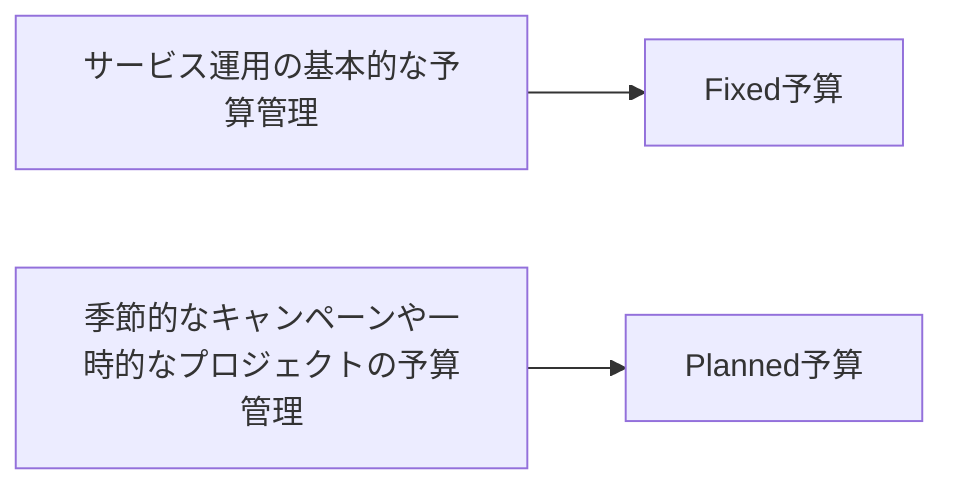

AWSの予算管理といえばAWS Budgetですが、予算作成方法にAuto-adjustingがあります。これを用いると、過去の利用実績やトレンドを考慮して予算を自動調整してくれます。

今回はそんなAuto-adjustingが便利という話です。

[:contents]

# AWS Budgetの予算タイプ

AWS Budgetには以下の[予算タイプ](https://docs.aws.amazon.com/ja_jp/cost-management/latest/userguide/create-cost-budget.html)があります。

* **Fixed** (固定): 各予算期間でモニタリングする金額を1つ設定
* **Planned** (計画): 各予算期間でモニタリングする金額を複数設定
* **Auto-adjusting** (自動調整): 指定した期間における支出パターンに基づいて自動的に調整するための、予算額を設定

例えば、Fixed予算を使ってサービス運用の基本的な予算を管理し、一方でPlanned予算を使って季節的なキャンペーンや一時的なプロジェクトなど、計画的に増える予算を管理するという使い方ができます。

<details><summary>mermaidコード</summary>



</details>

[f:id:guitarrapc_tech:20250328203638p:plain:alt=alt text]

# Fixed予算の課題とAuto-adjusting

Fixed予算は、予算期間ごとに設定した金額を超えるとアラートが発生します。このため、予算上限として利用するとアラートが来たらアウトと判断できて便利です。しかし、コストを徐々に減らしている時は、別途予算を設定しないとうまく減らせているか気づきにくいでしょう。また、コストが微妙に上振れ・下振れすると固定アラートはノイジーアラートになりやすいです。

そんなときにAuto-adjusting予算が便利です。Auto-adjusting予算は、過去の利用実績(あるいはトレンド)を考慮して予算を自動調整してくれます。コストの変動に対して柔軟に対応できるので、Fixed予算より現実の利用に近い予算設定が簡単に組めます。

* 利用パターンの変化に応じて予算が自動調整されるので、実際の運用で予算管理を意識しなくても機能する
* 一時的な利用増加があっても、過去の利用実績を考慮して予算を調整するのでノイジーアラートが発生しにくい
* 基本的に予算調整が不要

一方で実利用に対して予算を設定するので、上限として予算を設定するFixed予算とは異なり予期せぬ利用があっても、正確な予測になる保障はありません。また、予算が厳格なのに自動調整される予算をつかうと予算管理が難しいので、Fixed予算を使ったほうがいいでしょう。

* データの信頼性は高くない
* 厳密な予算管理向けではない

| 用途 | Fixed予算 | Auto-adjusting予算 | 備考
| --- | --- | --- | --- |
| 上限として予算設定 | 〇 | △ | 上限がぶれるのはつかいにくい |
| コストの変動に対応 | × | 〇 | 過去の利用状況に応じて予算を自動調整 |

過去の利用以外に予測も使えるのですが、予測はBudgetのEstimated Costを使えばいいと考えている派です。

[f:id:guitarrapc_tech:20250328203645p:plain:alt=alt text]

# Auto-adjustingのおすすめ設定

私はFixed予算とAuto-adjusting予算を併用しています。月ごとの上限予算はFixed予算で設定、月ごとの実利用に近い予算参考としてAuto-adjusting予算を設定しています。

例えば月$100の予算があったとして、おおむね$90～$95/monthな利用があったとしましょう。この場合次の予算を設定します。

* Fixed予算: $100
* Auto-adjusting予算: 過去3ヶ月を参考に`HISTORICAL`

```terraform
resource "aws_sns_topic" "main" {
  name                                     = "budget-topic"
  display_name                             = "budget-topic"
  # 省略
}

resource "aws_budgets_budget" "fixed" {
  name              = "budget-limit"
  budget_type       = "COST"
  limit_amount      = 100
  limit_unit        = "USD"
  time_period_start = "2025-03-01_00:00"
  time_unit         = "MONTHLY"

  notification {
    comparison_operator        = "GREATER_THAN"
    threshold                  = 100
    threshold_type             = "PERCENTAGE"
    notification_type          = "ACTUAL"
    subscriber_sns_topic_arns = [
      aws_sns_topic.main.arn
    ]
  }

  lifecycle {
    # do not delete. old data will be lost.
    prevent_destroy = true
  }
}

resource "aws_budgets_budget" "auto_adjust" {
  name              = "budget-auto-adjust"
  budget_type       = "COST"
  limit_unit        = "USD"
  time_period_start = "2025-03-01_00:00"
  time_unit         = "MONTHLY"

  auto_adjust_data {
    auto_adjust_type = "HISTORICAL"
    historical_options {
      budget_adjustment_period = 3 # 参考にする過去nカ月の移動平均
    }
  }

  notification {
    comparison_operator        = "GREATER_THAN"
    threshold                  = each.value.alert_threshold
    threshold_type             = "PERCENTAGE"
    notification_type          = "ACTUAL"
    subscriber_sns_topic_arns = [
      aws_sns_topic.main.arn
    ]
  }

  lifecycle {
    # do not delete. old data will be lost.
    prevent_destroy = true
  }
}
```

こうしておくと、徐々にコストを下げている時にAuto-adjusting予算が徐々に下がっていくので、Datadogなどでコストを監視しているときに予算を意識しなくてもいいです。実利用に沿って予算を都度修正するのは割とめんどくさいので、Auto-adjusting予算を使って思考負荷を減らす感じですね。

# まとめ

Fixed予算がつい便利なので使うのですが、同時にAuto-adjusting予算も使うとより現実に近い予算管理ができます。Auto-adjusting予算は過去の利用実績を参考にして予算を自動調整してくれるので、コストの変動に対して柔軟に対応できます。

ぜひ一度使ってみると便利さに感動です。

ちなみに異常値を検出するなら、Cost Anomaly Detectionを使うといいです。

# 参考

* [コスト予算の作成 - AWS コスト管理](https://docs.aws.amazon.com/ja_jp/cost-management/latest/userguide/create-cost-budget.html)
* [aws_budgets_budget | Resources | hashicorp/aws | Terraform | Terraform Registry](https://registry.terraform.io/providers/hashicorp/aws/latest/docs/resources/budgets_budget#auto_adjust_data-1)
