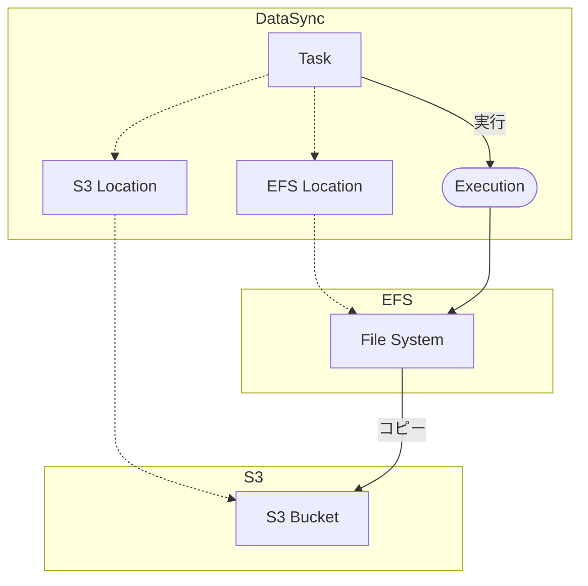

[Amazon EFS](https://aws.amazon.com/jp/efs/)といえば、ECS/EKS/EC2問わず複数マシンで単一ボリュームを参照できて非常に便利です。
EFS自身は[AWS Backup](https://aws.amazon.com/jp/backup/)でバックアップできるのですが、EFSの中身を直接見ることは出来ず不便なことも多いでしょう。
今回は、EFSの中身をS3にバックアップする方法です。

[:contents]

# AWS DataSync

[AWS DataSync](https://aws.amazon.com/jp/datasync/)は、AWSが提供するマネージドなデータ移行サービスです。データ移行と謳っていますが実際はかなり柔軟です。定期実行を使ってカスタマイズしたバックアップ用途、単発実行を使ってEFSから空EFSにデータをコピーなど多くのユースケースで利用できます。

AWS DataSyncはデータの送信元/送信先をロケーションとして管理しており、以下のようなロケーションをサポートしています。AWSサービスであれば転送設定だけで実行出来て非常に便利です。エージェントというのは、ロケーションの転送に用いるAWS DataSyncエージェントのことで、VMware ESXi、Microsoft Hyper-V、Linuxなどの仮想化環境で実行できるのですが、気軽にDataSyncを使うならエージェントなしが圧倒的に簡便です[^1]。

| サービス | エージェント要否 |
| --- | --- |
| Amazon EFS | 不要 |
| Amazon FSx | 不要 |
| Amazon S3 | 不要 |
| Hadoop Distributed File System (HDFS) | 必要 |
| Microsoft Azure Blob Storage | 必要 |
| Network File System (NFS) | 必要 |
| Object storage | 必要 |
| Server Message Block (SMB) | 必要 |

転送元ロケーションにEFS、転送先ロケーションにS3を指定することで、EFSの中身をS3にバックアップできます。
EFSの転送元パスを指定したり、S3バケットのプレフィックスも細かく指定できるので、EFSのごく一部だけS3にバックアップも可能です。

## 構成図

EFSからS3にバックアップする場合、以下のような構成になります。

<details><summary>Mermaidコード</summary>



</details>

[f:id:guitarrapc_tech:20250416184852p:plain:alt=EFSからS3へのDataSync構成図]

# DataSyncをPulumiで構成する

DataSyncでEFSからS3にバックアップする構成をPulumiで作成しましょう。
例えば単発実行でEFSの中身をS3にバックアップする場合、以下のような構成になります。
スケジュール実行するなら`Pulumi.Aws.DataSync.Task`で`Schedule`を指定すればOKです。

```cs
using Pulumi;
using Pulumi.Aws.Ec2;
using Pulumi.Aws.Efs;
using Pulumi.Aws.Iam;
using Pulumi.Aws.Iam.Inputs;
using Pulumi.Aws.S3;

return await Pulumi.Deployment.RunAsync(() =>
{
    var opt = new CustomResourceOptions();
    var name = "test";
    var bucketName = $"{name}-bucket";
    var datasyncTaskName = $"{name}-datasync-task";
    Subnet[] subnetGroups = []; // 適当に作成したサブネットグループを指定
    SecurityGroup[] securityGroups = []; // 適当に作成したセキュリティグループを指定

    // s3
    var bucket = new BucketV2($"{name}-bucket", new()
    {
        Bucket = bucketName,
        ForceDestroy = true,
    }, opt);

    // efs
    var fs = new FileSystem($"{name}-filesystem", new()
    {
        CreationToken = name,
        Tags = new InputMap<string>
        {
            { "Name", $"{name}-filesystem" },
            { "aws:elasticfilesystem:default-backup", Output.Create("enabled") },
        },
    }, opt);

    for (var i = 0; i < subnetGroups.Length; i++)
    {
        _ = new MountTarget($"{name}-mounttarget-{i}", new()
        {
            FileSystemId = fs.Id,
            SubnetId = subnetGroups[i].Id,
            SecurityGroups = securityGroups.Select(x => x.Id).ToList(),
        }, opt);
    }

    // iam role
    var role = new Role($"{name}-s3backup-role", new()
    {
        Name = $"{name}-datasync-s3bucket-role",
        AssumeRolePolicy = """
        {
            "Version": "2012-10-17",
            "Statement": [
                {
                    "Effect": "Allow",
                    "Principal": {
                        "Service": "datasync.amazonaws.com"
                    },
                    "Action": "sts:AssumeRole"
                }
            ]
        }
        """,
        InlinePolicies = [
            new RoleInlinePolicyArgs
            {
                Name = $"{name}-inline-policy",
                Policy = $$"""
                {
                    "Statement": [
                        {
                            "Action": [
                                "s3:GetBucketLocation",
                                "s3:ListBucket",
                                "s3:ListBucketMultipartUploads"
                            ],
                            "Effect": "Allow",
                            "Resource": "arn:aws:s3:::{{bucketName}}",
                            "Sid": "AWSDataSyncS3BucketPermissions"
                        },
                        {
                            "Action": [
                                "s3:AbortMultipartUpload",
                                "s3:DeleteObject",
                                "s3:GetObject",
                                "s3:GetObjectTagging",
                                "s3:GetObjectVersion",
                                "s3:GetObjectVersionTagging",
                                "s3:ListMultipartUploadParts",
                                "s3:PutObject",
                                "s3:PutObjectTagging"
                            ],
                            "Effect": "Allow",
                            "Resource": "arn:aws:s3:::{{bucketName}}/*",
                            "Sid": "AWSDataSyncS3ObjectPermissions"
                        }
                    ],
                    "Version": "2012-10-17"
                }
                """,
            }
        ],
    }, opt);

    // loggroup
    var logGroup = new Pulumi.Aws.CloudWatch.LogGroup($"{name}-s3backup-loggroup", new()
    {
        Name = $"/aws/datasync/{datasyncTaskName}",
        RetentionInDays = 14,
    }, opt);

    // datasync
    var sourceEfs = new Pulumi.Aws.DataSync.EfsLocation($"{name}-s3backup-datasync-efslocation", new()
    {
        EfsFileSystemArn = fs.Arn,
        Subdirectory = "/", // ここでEFSのパスを指定できる
        Ec2Config = new Pulumi.Aws.DataSync.Inputs.EfsLocationEc2ConfigArgs
        {
            SecurityGroupArns = securityGroups.Select(x => x.Arn).ToList(),
            SubnetArn = subnetGroups[0].Arn,
        },
        InTransitEncryption = "NONE", // 転送中の暗号化を指定するなら変える
    }, opt);
    var destinationS3 = new Pulumi.Aws.DataSync.S3Location($"{name}-s3backup-datasync-s3location", new()
    {
        S3BucketArn = $"arn:aws:s3:::{bucketName}",
        Subdirectory = fs.Name.Apply(x => $"/{x}"), // efsの名前をプレフィックスに指定
        S3StorageClass = "STANDARD", // ストレージクラスを指定
        S3Config = new Pulumi.Aws.DataSync.Inputs.S3LocationS3ConfigArgs
        {
            BucketAccessRoleArn = role.Arn,
        },
    }, opt);
    var datasyncTask = new Pulumi.Aws.DataSync.Task($"{name}-s3backup-datasync-task", new()
    {
        Name = datasyncTaskName,
        SourceLocationArn = sourceEfs.Arn,
        DestinationLocationArn = destinationS3.Arn,
        TaskMode = "BASIC",
        Options = new Pulumi.Aws.DataSync.Inputs.TaskOptionsArgs
        {
            TransferMode = "ALL", // 全部転送するなら。CHANGEDにすると変更されたファイルだけ転送する
            VerifyMode = "ONLY_FILES_TRANSFERRED",
            LogLevel = "BASIC", // CloudWatch Logsにエラーを出力する
        },
        CloudwatchLogGroupArn = logGroup.Arn,
    }, opt);
});
```

実行後タスクが作成されます。後はこれを実行すればS3バケットにEFSの中身がバックアップされます。

[f:id:guitarrapc_tech:20250416184859p:plain:alt=DataSyncのタスク作成結果]

タスク画面から任意のタイミングで実行できるのは神です。AWSにしては珍しい。

[f:id:guitarrapc_tech:20250416184908p:plain:alt=単発実行も可能]

# まとめ

DataSync便利。EFSとS3をつなぐ方法として大変良いですね。
Step FunctionsやEventBridge Schedulerと組み合わせずともスケジュール実行できるのもいいポイントです。

[^1]: Azure Blogにエージェントレスで行けるなら熱かったんですが、そうはいきませんでした
