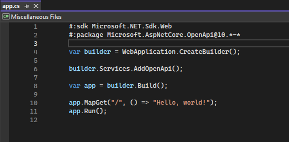

現在プレビュー提供中の.NET 10から、`dotnet run`コマンドでファイルベースのプログラムを実行できるようになりました。これにより、`dotnet run app.cs`のように、C#ファイルを直接実行できるようになります。
本日発表されたファイルベースプログラムの実行方法について紹介します。

なお本記事は、2025/5/29時点の[ブログ](https://devblogs.microsoft.com/dotnet/announcing-dotnet-run-app/)と[GitHub ドキュメント](https://github.com/dotnet/sdk/blob/main/documentation/general/dotnet-run-file.md#multiple-c-files)に基づいています。

[:contents]

# はじめに

これまでのC#でも.csファイルとプロジェクトファイル(.csproj)を組み合わせてあれば、`dotnet run Foo.csproj`のようにdotnet runコマンドで実行できました。今回.NET 10で追加されるのは、プロジェクトファイルなしに単一のC#ファイルを`dotnet run app.cs`のように直接実行する機能です。

前者はproject-based program(プロジェクトベースプログラム)と呼ばれ、後者はfile-based program(ファイルベースプログラム)と呼ばれるようです。

# 従来のプロジェクトファイルなしのC#実行方法

dotnet標準コマンドはサポートしていませんでしたが、コミュニティには単一.csファイルで実行するものがあります。[CS-Script](https://github.com/oleg-shilo/cs-script)や[dotnet-script](https://github.com/dotnet-script/dotnet-script)は使っている人もいるのではないでしょうか。

例えば、C#スクリプトファイル(.csx)は、dotnet-scriptコマンドで実行できます[^1]。

```sh
$ dotnet tool install -g dotnet-script

$ cat app.csx
#r "sdk:Microsoft.NET.Sdk.Web"

using Microsoft.AspNetCore.Builder;

var a = WebApplication.Create();
a.MapGet("/", () => "Hello world");
a.Run();
EOF

$ dotnet script app.csx
info: Microsoft.Hosting.Lifetime[14]
      Now listening on: http://localhost:5000
info: Microsoft.Hosting.Lifetime[0]
      Application started. Press Ctrl+C to shut down.
info: Microsoft.Hosting.Lifetime[0]
      Hosting environment: Production
info: Microsoft.Hosting.Lifetime[0]
      Content root path: D:\github\test\dotnet-csx
```

コミュニティにあるとはいえ、広く使われているかというと微妙なところです。理由はいくつもあるでしょうが、例えば`dotnet`標準コマンドでないためotnetツールを追加インストールが必要だったり、ツール毎のメタデータ表現も方言があって覚えるのが億劫です。また、インテリセンスやデバッグサポートが弱いなどの問題がありました。

そんなこんなで、dotnetコマンド標準のプロジェクトベースの実行方法`dotnet run app.csproj`に慣れるに従って、dotnetコマンド標準で単一.csファイルを実行できないかと考えていました。

# dotnet run app.csを実行してみよう

今回追加されたファイルベースプログラムは、.NET SDKが入っていれば利用できます。早速簡単なC#ファイル`app.cs`を作成して、`dotnet run app.cs`で実行してみましょう。

```cs
foreach (var item in Enumerable.Range(1, 10).Where(x => x % 2 == 0).Select(x => x * x))
{
    Console.WriteLine(item);
}
```

いつものように`dotnet run`コマンドで実行すると、割と期待通りな動作じゃないでしょうか。

```sh
$ dotnet run app.cs
4
16
36
64
100
```

## csprojで指定していたことを.csファイルで指定する

現在のC#はNuGetパッケージなしにプログラムを効率的に書くのは難しく、またWebアプリケーションとコンソールアプリケーションの違いはSDKの違いです。

こうったパッケージやプロジェクト設定は従来.csprojファイルで指定していましたが、ファイルベースプログラム用に.csファイルにメタデータとして指定しても実行できるようになりました。

```cs
// #:package パッケージ名@バージョン : NuGetパッケージの導入
#:package Humanizer@2.14.1

// #:sdk SDK名 : SDKの指定
#:sdk Microsoft.NET.Sdk.Web

// #:property MSBuildプロパティ名 値
#:property Nullable enable
```

例えばNuGetパッケージのZLinqを利用する場合、以下のように記述できます。

```cs
#:package ZLinq@1.4.9
using ZLinq;

IReadOnlyList<int> numbers = [1, 2, 3, 4, 5];
foreach (var item in numbers.AsValueEnumerable().Where(x => x % 2 == 0).Select(x => x * x))
{
    Console.WriteLine(item);
}
```

実行してみましょう。

```sh
$ dotnet run app.cs
4
16
```

---

WebアプリケーションはSDKを`Microsoft.NET.Sdk.Web`に指定するだけで、ほんの数行書けば動作します。[^2]

```cs
#:sdk Microsoft.NET.Sdk.Web
#:package Microsoft.AspNetCore.OpenApi@10.*-*

var builder = WebApplication.CreateBuilder();

builder.Services.AddOpenApi();

var app = builder.Build();

app.MapGet("/", () => "Hello, world!");
app.Run();
```

[f:id:guitarrapc_tech:20250529080027p:plain:alt=Webアプリケーションを実行]

---

これまで.csprojに指定するしかなかったMSBuildのプロパティを.csファイルで指定できるのが画期的です。
csprojの設定による挙動を検証するため.csprojを用意して.csprojのXXXXプロパティだけいじって実行してを繰り返していたのが、.csファイル単独で書けるようになりました。控えめに言って神です。

単純な例でNullableEnableを有効にして、null許容型の文字列の警告がでるか見てみましょう。

```cs
#:property Nullable enable
string? nullableString = null;
foreach (var item in nullableString.ToString())
{
    Console.WriteLine(item);
}
```

ばっちり警告が出ていますね。

```sh
$ dotnet run app.cs
__________________________________________________
Project "D:\github\test\dotnet-run-cs\app.csproj" (Build target(s)):

D:\github\test\dotnet-run-cs\app.cs(3,22): warning CS8602: Dereference of a possibly null reference.
Done building project "app.csproj".
Unhandled exception. System.NullReferenceException: Object reference not set to an instance of an object.
   at Program.<Main>$(String[] args) in D:\github\test\dotnet-run-cs\app.cs:line 3
```

## LinuxやmacOSで.csファイルを直接実行する

shebangが指定できるので、Pythonやシェルスクリプト(.sh)のようにLinuxやmacOSでも直接実行できます。

```cs
#!/usr/bin/dotnet run
Console.WriteLine("Hello from a C# script!");
```

実行権限をつけて、直接実行してみましょう。

```sh
$ chmod +x app.cs
$ ./app.cs
Hello from a C# script!
```

Zxを組み合わせれば、シェルスクリプトのようにC#でシェルスクリプトが書けます。

```cs
#!/usr/bin/dotnet run
#:package ProcessX@1.5.6

using Zx;
await "ls -l";
```

ばっちりですね。

```sh
$ chmod +x app.cs
$ ./app.cs
total 4
-rw-rw-r--    1 guitarrapc guitarrapc       244 May 29 02:32 app.cs
drwxrwxr-x    2 guitarrapc guitarrapc         0 May 29 04:41 nest
```

### シェルスクリプトの代替として利用できるのか

shebangをつかうことでシェルスクリプトを同じ感覚でスクリプトを実行しつつ、C#で書いて実行できるのは代えがたいメリットです。
シェルスクリプト代替としてはZxを使って雑にC#スクリプトを書いて、dotnet run app.csで実行するのは罠が少なく直線でたどりつけるでしょう。
さらに、後述する`dotnet project convert app.cs`でプロジェクト化して、大規模になったスクリプトをConsoleAppFrameworkで管理する未来まで見据えられます。

ConsoleAppFrameworkとファイルベースプログラム実行は一見すると競合しますが、実際には補完関係にあると感じます。これまでも、ConsoleAppFrameworkを使うことでC#プロジェクトとして管理しつつZxでシェルスクリプトっぽくかくことができました。ユニットテストで挙動担保しつつ、ちゃんと管理できるのがいい点です。csprojで多くのバッチをまとめて管理もチーム管理するのは、ファイルベースプログラムでは難しいです。

Zx + ConsoleAppFrameworkの組み合わせは始めるのがどうしても億劫でしたが、ファイルベースプログラムはもっとすんなり使える期待があります。シェルスクリプトではなく.csでもいい選択が現実になったのは嬉しいです。

## プロジェクト化する

.csxファイルで困ったのが、規模が大きくなってきてプロジェクト化したいときにcsprojファイルを用意してMSBuildプロパティを設定して、拡張子を.csに変えて、ビルドしてうまくいかなくて直して...を繰り返すことでした。ファイルベースプログラムは、これを一発で行う`dotnet project convert app.cs`コマンドを提供します。おー。

実行してみると、ファイル名と同じ名前のディレクトリが作成され、その中に.csファイルと.csprojファイルが作成されます。

```sh
$ ls
app.cs
$ dotnet project convert app.cs
$ ls -l app
total 8
-rw-rw-r--    1 guitarrapc guitarrapc       171 May 29 05:18 app.cs
-rw-rw-r--    1 guitarrapc guitarrapc       372 May 29 05:18 app.csproj
```

元の.csに書かれていたメタデータから.csprojファイルがいい感じに生成されます。

```cs
var builder = WebApplication.CreateBuilder();

builder.Services.AddOpenApi();

var app = builder.Build();

app.MapGet("/", () => "Hello, world!");
app.Run();
```

```xml
<Project Sdk="Microsoft.NET.Sdk.Web">

  <PropertyGroup>
    <OutputType>Exe</OutputType>
    <TargetFramework>net10.0</TargetFramework>
    <ImplicitUsings>enable</ImplicitUsings>
    <Nullable>enable</Nullable>
  </PropertyGroup>

  <ItemGroup>
    <PackageReference Include="Microsoft.AspNetCore.OpenApi" Version="10.*-*" />
  </ItemGroup>

</Project>
```

## いろいろ制約

今のところVisual Studio 2022 Previewe(17.14.2 Preview 1.0)はファイルベースプログラムをサポートしていないようです。構文エラーは出ていませんが、インテリセンスが一切効かずビルド可否も判断ができません。しょうがない。



[ドキュメント](https://github.com/dotnet/sdk/blob/main/documentation/general/dotnet-run-file.md#multiple-c-files)にはいくつか制約について書かれています。きになったのを抜粋します。

* ファイルベースプログラムは、`.cs`のみサポート (`.vb`や`.fs`はサポートされていないんですね)
* 暗黙的プロジェクトファイル[^3]が作られて実行されるという挙動
* フォルダに複数C#ファイルがある場合、暗黙的プロジェクトファイルの都合がありすべてビルドされる

```
$ ls
app.cs # ビルドされる
foo.cs # ビルドされる
bar.cs # ビルドされる
$ dotnet run app.cs
```

* エントリーポイントは、トップレベルステートメントである必要がある。Mainメソッドはセマンティック分析が必要になるため、現時点ではサポートされていない
* ネストされた構造のファイルも、

```
$ ls -R
app.cs                   # ビルドされる
app/File.cs              # ビルドされる
app/Nested/Nested.csproj # エラーは出ない
app/Nested/File.cs       # ビルドされる
$ dotnet run app.cs      # ビルドされる
```

# 挙動から動作をのぞく

触っている感じから、ファイルベースプログラムはプロジェクトベースプログラムと同じように動作しているようです。
これはトラブルシューティングに従来の知見がそのまま使えるので、非常にありがたいです。

少し見てみましょう。

## NuGetパッケージのリストア

リストアされたパッケージは、引き続き`$HOME/.nuget/packages`に展開されていました。スタンダードなNuGetの挙動で素晴らしい。

```sh
$ Get-ChildItem $env:UserProfile\.nuget\packages\microsoft.*

    Directory: C:\Users\guitarrapc\.nuget\packages

Mode                 LastWriteTime         Length Name
----                 -------------         ------ ----
d----          29/05/2025    02:40                microsoft.aspnetcore.app.ref
d----          29/05/2025    02:30                microsoft.aspnetcore.openapi
d----          29/05/2025    02:35                microsoft.bcl.asyncinterfaces
d----          29/05/2025    02:35                microsoft.codeanalysis.analyzers
d----          29/05/2025    02:35                microsoft.codeanalysis.common
d----          29/05/2025    02:35                microsoft.codeanalysis.csharp
d----          29/05/2025    02:35                microsoft.diagnostics.netcore.client
d----          29/05/2025    02:35                microsoft.diagnostics.runtime
d----          29/05/2025    02:35                microsoft.diagnostics.tracing.traceevent
d----          29/05/2025    02:35                microsoft.dotnet.platformabstractions
d----          29/05/2025    02:35                microsoft.extensions.configuration
d----          29/05/2025    02:35                microsoft.extensions.configuration.abstractions
d----          29/05/2025    02:35                microsoft.extensions.configuration.binder
d----          29/05/2025    02:35                microsoft.extensions.dependencyinjection.abstractions
d----          29/05/2025    02:35                microsoft.extensions.logging
d----          29/05/2025    02:35                microsoft.extensions.logging.abstractions
d----          29/05/2025    02:35                microsoft.extensions.options
d----          29/05/2025    02:35                microsoft.extensions.primitives
d----          29/05/2025    02:40                microsoft.netcore.app.host.win-x64
d----          29/05/2025    02:40                microsoft.netcore.app.ref
d----          29/05/2025    02:35                microsoft.netcore.platforms
d----          29/05/2025    02:30                microsoft.openapi
```

[f:id:guitarrapc_tech:20250529080037p:plain:alt=リストアされたNuGetファイルのパス]

## ビルドと実行ファイル

C#のビルドは、/objディレクトリにビルド中間生成物が生成され、/binディレクトリに実行ファイルが生成されます。
ファイルベースプログラムも同様の流れなら、いわゆる今までの知見がそのまま使えます。

### 中間ファイルの作業ディレクトリ

ビルド時の中間ファイル、というか実体としてSDKが扱っているパスは`$HOME/AppData/Local/Temp/dotnet/runfile`のようです。
いくつかのファイルベースプログラムを実行してみると、以下のようにエントリーポイントファイル`XXX.cs`のパスごとにディレクトリが作成されています。

```sh
$ ls $HOME\AppData\Local\Temp\dotnet\runfile\


    Directory: C:\Users\guitarrapc\AppData\Local\Temp\dotnet\runfile


Mode                 LastWriteTime         Length Name
----                 -------------         ------ ----
d-----        29/05/2025     04:54                app-3f99f7618276dfaf94ced2c1ed2fe79d5f8745064563530315302e3eb255c3a5
d-----        29/05/2025     04:41                file-b6d193daca316c514c0590bfaea265526d10861efddde43d88f5c43de182587f
d-----        29/05/2025     02:53                Program-4f3ab1b43520478cb7187dff170a883e48eaf32d03d5cf9f1f84c40063b5dca9
```

ドキュメントを見るとサブディレクトリ名は「エントリーポイントファイルパスのハッシュ値を使っている」と記載があります。簡単に検証したところ、ファイル名までのフルパスを`ToUpper()`(`OrdinalIgnoreCase`かな)してSHA256を計算した値がディレクトリ名になっていることが確認できました。

例えば`D:\github\test\dotnet-run-cs\app.cs`をエントリーポイントとして`dotnet run app.cs`を実行すると、サブディレクトリが`app-3f99f7618276dfaf94ced2c1ed2fe79d5f8745064563530315302e3eb255c3a5`になります。

```cs
var path = @"D:\github\test\dotnet-run-cs\app.cs";
var value = UTF8Encoding.UTF8.GetBytes(path.ToUpper());

using var sha256 = System.Security.Cryptography.SHA256.Create();
var hash = Convert.ToHexStringLower(sha256.ComputeHash(value));

var fileName = Path.GetFileNameWithoutExtension(path);
Console.WriteLine($"{fileName}-{hash}");
// 出力: app-3f99f7618276dfaf94ced2c1ed2fe79d5f8745064563530315302e3eb255c3a5
```

### 作業フォルダの中身

サブディレクトリの中をみると、よく見かける`bin/`と`obj/`ディレクトリがあり、binディレクトリの中に実行ファイルが生成されているのが確認できます。

[f:id:guitarrapc_tech:20250529080044p:plain:alt=TMPに作業フォルダが切られる]

`dotnet run`はデバッグビルドなので、`bin/debug`ディレクトリになっています。

```sh
$ ls $HOME\AppData\Local\Temp\dotnet\runfile\app-3f99f7618276dfaf94ced2c1ed2fe79d5f8745064563530315302e3eb255c3a5\bin\debug\


    Directory: C:\Users\guitarrapc\AppData\Local\Temp\dotnet\runfile\app-3f99f7618276dfaf94ced2c1ed2fe79d5f874506456353
    0315302e3eb255c3a5\bin\debug


Mode                 LastWriteTime         Length Name
----                 -------------         ------ ----
-a----        29/05/2025     05:30           1863 app.deps.json
-a----        29/05/2025     05:30          23552 app.dll
-a----        29/05/2025     05:30         160256 app.exe
-a----        29/05/2025     05:30          30160 app.pdb
-a----        29/05/2025     05:30            459 app.runtimeconfig.json
-a----        29/05/2025     05:30             51 app.staticwebassets.endpoints.json
-a----        09/05/2025     09:48         185144 Microsoft.AspNetCore.OpenApi.dll
-a----        17/04/2025     00:17         465952 Microsoft.OpenApi.dll
```

ということは、リリースビルドで実行すれば`bin/release`ディレクトリに実行ファイルが生成されるはずです。やってみましょう。

```sh
$ dotnet run app.cs -c Release
# 出力は省略
$ ls $HOME\AppData\Local\Temp\dotnet\runfile\app-3f99f7618276dfaf94ced2c1ed2fe79d5f8745064563530315302e3eb255c3a5\bin\release\


    Directory: C:\Users\guitarrapc\AppData\Local\Temp\dotnet\runfile\app-3f99f7618276dfaf94ced2c1ed2fe79d5f874506456353
    0315302e3eb255c3a5\bin\release


Mode                 LastWriteTime         Length Name
----                 -------------         ------ ----
-a----        29/05/2025     05:55           1863 app.deps.json
-a----        29/05/2025     05:55          23040 app.dll
-a----        29/05/2025     05:55         160256 app.exe
-a----        29/05/2025     05:55          28960 app.pdb
-a----        29/05/2025     05:55            531 app.runtimeconfig.json
-a----        29/05/2025     05:55             51 app.staticwebassets.endpoints.json
-a----        09/05/2025     09:48         185144 Microsoft.AspNetCore.OpenApi.dll
-a----        17/04/2025     00:17         465952 Microsoft.OpenApi.dll
```

期待通りですね。

### 観測から予想される挙動

挙動を見る限り、以下のような流れで動作していると思われます。[^4]

1. dotnet run app.csを実行
2. .NET SDKがOSのTMPフォルダに作業フォルダを切る

  ```
  $HOME\AppData\Local\Temp\dotnet\runfile\エントリーポイントのcsファイル名-{エントリーポイントパスをToUpperしたSHA256ハッシュ値}
  ```

3. `.cs`ファイルのメタデータに指定されたmsbuildプロパティを元にインメモリでcsproj構築
4. `dotnet run プロジェクト.csproj`と同様に、dotnet restore/build
5. `dotnet エントリーポイント.dll`を呼び出して実行

# ファイルベースプログラムのソースコードを読む

実際のソースコードを見てみましょう。幸い、dotnet/sdkのソースコードはオープンソースで公開されており、GitHubで確認できます。

## エントリーポイント検出からビルドまでの流れ

具体的なコードで推測があっているか見てみましょう。ファイルベースプログラムは、主に2つのクラスで実装されています。

1. [RunCommand.cs](https://github.com/dotnet/sdk/blob/1dd8c27e8a5bcdebe57517c5ed042645afe25692/src/Cli/dotnet/Commands/Run/RunCommand.cs) - メインのコマンド処理
2. [VirtualProjectBuildingCommand.cs](https://github.com/dotnet/sdk/blob/1dd8c27e8a5bcdebe57517c5ed042645afe25692/src/Cli/dotnet/Commands/Run/VirtualProjectBuildingCommand.cs) - ファイルベースプログラムの仮想プロジェクト作成・ビルド

コードを抜粋してコメントをつけます。

### 1. エントリーポイントの検出

まずは、`dotnet run app.cs`のように実行したときに、エントリーポイントのファイルパスを検出します。

```cs
// RunCommand.cs: 442-496行目
// https://github.com/dotnet/sdk/blob/1dd8c27e8a5bcdebe57517c5ed042645afe25692/src/Cli/dotnet/Commands/Run/RunCommand.cs#L442
private static string? DiscoverProjectFilePath(string? projectFileOrDirectoryPath, ref string[] args, out string? entryPointFilePath)
{
    // projectFileOrDirectoryPathは、--projectオプションで指定されたプロジェクトファイルパス

    // プロジェクトファイルが見つからない場合、エントリーポイントファイルを探す
    entryPointFilePath = projectFilePath is null && emptyProjectOption
        ? TryFindEntryPointFilePath(ref args)
        : null;

    // args配列の最初の引数が.csファイルかチェック
    static string? TryFindEntryPointFilePath(ref string[] args)
    {
        if (args is not [{ } arg, ..] ||
            !VirtualProjectBuildingCommand.IsValidEntryPointPath(arg))
        {
            return null;
        }

        args = args[1..]; // 引数配列から.csファイルパスを除去
        return Path.GetFullPath(arg);
    }
}
```

### 2. ファイルベースプログラムの判定

先のコードで、次の条件を満たす場合にファイルベースプログラムとして処理されています。

1. プロジェクトファイルが見つからない（現在ディレクトリまたは --projectオプション経由）
2. 引数で指定されたファイルが存在し、.cs拡張子を持つ
3. そのファイルがエントリーポイントファイル（top-level statementsを含む）である

注目すべきは、csprojの有無でプロジェクトベースプログラムかファイルベースプログラムかを判定し、プロジェクトファイルがなければファイルベースパスとしています。
実際、`.csproj`があると`dotnet run app.cs`を指定しても、プロジェクトベースプログラムとして実行しようとしているのが分かります。

```sh
$ touch app.csproj
$ ls
app.cs    app.csproj
$ dotnet run app.cs
    D:\github\test\dotnet-run-cs\app.csproj : error MSB4025: The project file could not be loaded. Root element is missing.

Restore failed with 1 error(s) in 0.0s

The build failed. Fix the build errors and run again.
```

仮にcsprojに適切な内容をいれても、今度は.csのメタデータ部分`#:sdk Microsoft.NET.Sdk.Web`や`#:package Microsoft.AspNetCore.OpenApi@10.*-*`が解釈できずエラーになります。

```sh
$ dotnet run app.cs
Restore complete (0.4s)
You are using a preview version of .NET. See: https://aka.ms/dotnet-support-policy
  app failed with 3 error(s) (0.7s)
    D:\github\test\dotnet-run-cs\app.cs(1,2): error CS9298: '#:' directives can be only used in file-based programs ('-features:FileBasedProgram')
    D:\github\test\dotnet-run-cs\nest\file.cs(2,2): error CS9298: '#:' directives can be only used in file-based programs ('-features:FileBasedProgram')
    D:\github\test\dotnet-run-cs\app.cs(2,2): error CS9298: '#:' directives can be only used in file-based programs ('-features:FileBasedProgram')

Build failed with 3 error(s) in 1.5s

The build failed. Fix the build errors and run again.
```

`VirtualProjectBuildingCommand.IsValidEntryPointPath`メソッドで、ファイルベースプログラムは`.cs`ファイルに限定されていることが確認できます。

```cs
// VirtualProjectBuildingCommand.cs: 848-851行目
// https://github.com/dotnet/sdk/blob/1dd8c27e8a5bcdebe57517c5ed042645afe25692/src/Cli/dotnet/Commands/Run/VirtualProjectBuildingCommand.cs#L848
public static bool IsValidEntryPointPath(string entryPointFilePath)
{
    return entryPointFilePath.EndsWith(".cs", StringComparison.OrdinalIgnoreCase) && File.Exists(entryPointFilePath);
}
```

### 3. 仮想プロジェクトの作成

ここで、インメモリにプロジェクトファイル(.csproj)を作成してビルドするための`VirtualProjectBuildingCommand`が呼び出されます。

```cs
// RunCommand.cs: 249-275行目
// https://github.com/dotnet/sdk/blob/1dd8c27e8a5bcdebe57517c5ed042645afe25692/src/Cli/dotnet/Commands/Run/RunCommand.cs#L249
private void EnsureProjectIsBuilt(out Func<ProjectCollection, ProjectInstance>? projectFactory)
{
    if (EntryPointFileFullPath is not null)
    {
        // ファイルベースプログラムの場合、VirtualProjectBuildingCommandを使用
        var command = CreateVirtualCommand();
        projectFactory = command.CreateProjectInstance;
        buildResult = command.Execute();
    }
    else
    {
        // 通常のプロジェクトベースの場合
        buildResult = new RestoringCommand(...).Execute();
    }
}

// RunCommand.cs: 277-290行目
// https://github.com/dotnet/sdk/blob/1dd8c27e8a5bcdebe57517c5ed042645afe25692/src/Cli/dotnet/Commands/Run/RunCommand.cs#L277
private VirtualProjectBuildingCommand CreateVirtualCommand()
{
    return new(
        entryPointFileFullPath: EntryPointFileFullPath,
        msbuildArgs: RestoreArgs,
        verbosity: Verbosity,
        interactive: Interactive)
    {
        NoRestore = NoRestore,
        NoCache = NoCache,
    };
}
```

気になる.csproj作成は`VirtualProjectBuildingCommand`クラスの`CreateProjectInstance`メソッドで行われています。

```cs
// VirtualProjectBuildingCommand.cs: 406-44行目
// https://github.com/dotnet/sdk/blob/1dd8c27e8a5bcdebe57517c5ed042645afe25692/src/Cli/dotnet/Commands/Run/VirtualProjectBuildingCommand.cs#L406
private ProjectInstance CreateProjectInstance(
    ProjectCollection projectCollection,
    Action<IDictionary<string, string>>? addGlobalProperties)
{
    // SDKのプロジェクトルート要素を作成
    var projectRoot = CreateProjectRootElement(projectCollection);

    // MSBuildプロパティを追加
    var globalProperties = projectCollection.GlobalProperties;
    if (addGlobalProperties is not null)
    {
        globalProperties = new Dictionary<string, string>(projectCollection.GlobalProperties, StringComparer.OrdinalIgnoreCase);
        addGlobalProperties(globalProperties);
    }

    return ProjectInstance.FromProjectRootElement(projectRoot, new ProjectOptions
    {
        GlobalProperties = globalProperties,
    });

    // .csprojを作成するメソッド
    ProjectRootElement CreateProjectRootElement(ProjectCollection projectCollection)
    {
        Debug.Assert(!_directives.IsDefault, $"{nameof(PrepareProjectInstance)} should have been called first.");

        var projectFileFullPath = Path.ChangeExtension(EntryPointFileFullPath, ".csproj");
        var projectFileWriter = new StringWriter();
        // .csファイルのメタデータを使ってプロジェクトファイルを生成
        WriteProjectFile(
            projectFileWriter,
            _directives,
            isVirtualProject: true,
            targetFilePath: EntryPointFileFullPath,
            artifactsPath: GetArtifactsPath());
        var projectFileText = projectFileWriter.ToString();

        using var reader = new StringReader(projectFileText);
        using var xmlReader = XmlReader.Create(reader);
        var projectRoot = ProjectRootElement.Create(xmlReader, projectCollection);
        projectRoot.FullPath = projectFileFullPath;
        return projectRoot;
    }
}
```

csprojの中身は`WriteProjectFile`メソッドで作っています。入れるべきMSBuildのプロパティは、後述するAST解析で.csファイルのメタデータから取得しています。

```cs
// VirtualProjectBuildingCommand.cs: 464-694行目
// https://github.com/dotnet/sdk/blob/1dd8c27e8a5bcdebe57517c5ed042645afe25692/src/Cli/dotnet/Commands/Run/VirtualProjectBuildingCommand.cs#L464
public static void WriteProjectFile(
    TextWriter writer,
    ImmutableArray<CSharpDirective> directives,
    bool isVirtualProject,
    string? targetFilePath = null,
    string? artifactsPath = null)
{
    var sdkDirectives = directives.OfType<CSharpDirective.Sdk>();
    var propertyDirectives = directives.OfType<CSharpDirective.Property>();
    var packageDirectives = directives.OfType<CSharpDirective.Package>();

    // SDKディレクティブの処理
    string sdkValue = "Microsoft.NET.Sdk";
    if (sdkDirectives.FirstOrDefault() is { } firstSdk)
    {
        sdkValue = firstSdk.ToSlashDelimitedString();
    }

    // プロパティディレクティブの処理
    if (propertyDirectives.Any())
    {
        writer.WriteLine("""
            <PropertyGroup>
            """);

        foreach (var property in propertyDirectives)
        {
            writer.WriteLine($"""
                    <{property.Name}>{EscapeValue(property.Value)}</{property.Name}>
                """);
        }

        writer.WriteLine("  </PropertyGroup>");
    }

    // パッケージディレクティブの処理
    if (packageDirectives.Any())
    {
        writer.WriteLine("""
            <ItemGroup>
            """);

        foreach (var package in packageDirectives)
        {
            if (package.Version is null)
            {
                writer.WriteLine($"""
                        <PackageReference Include="{EscapeValue(package.Name)}" />
                    """);
            }
            else
            {
                writer.WriteLine($"""
                        <PackageReference Include="{EscapeValue(package.Name)}" Version="{EscapeValue(package.Version)}" />
                    """);
            }
        }

        writer.WriteLine("  </ItemGroup>");
    }

    // 省略
}
```

出力先の作業ディレクトリは、先ほど挙動から推測した通り`EntryPointFileFullPath`のパスを元に.csprojファイルを生成しています。

```cs
// VirtualProjectBuildingCommand.cs: 448-462行目
// https://github.com/dotnet/sdk/blob/1dd8c27e8a5bcdebe57517c5ed042645afe25692/src/Cli/dotnet/Commands/Run/VirtualProjectBuildingCommand.cs#L449
internal static string GetArtifactsPath(string entryPointFileFullPath)
{
    // ユーザー固有の一時ディレクトリを使用
    string directory = RuntimeInformation.IsOSPlatform(OSPlatform.Windows)
        ? Path.GetTempPath()
        : Environment.GetFolderPath(Environment.SpecialFolder.LocalApplicationData);

    // ファイルパスのハッシュ値を使用してディレクトリ名を生成
    string fileName = Path.GetFileNameWithoutExtension(entryPointFileFullPath);
    string hash = Sha256Hasher.HashWithNormalizedCasing(entryPointFileFullPath);
    string directoryName = $"{fileName}-{hash}";

    return Path.Join(directory, "dotnet", "runfile", directoryName);
}
```

### 4. ビルド

ビルドは、`VirtualProjectBuildingCommand.Execute()`メソッドで行われます。長いので変形して重要な部分だけ抜粋しますが、リストア、ビルドと想定通り順番に実行されています。

```cs
// VirtualProjectBuildingCommand.cs: 87-223行目
//https://github.com/dotnet/sdk/blob/1dd8c27e8a5bcdebe57517c5ed042645afe25692/src/Cli/dotnet/Commands/Run/VirtualProjectBuildingCommand.cs#L87
public override int Execute()
{
    // MSBuildのバイナリロガーを用意
    var binaryLogger = GetBinaryLogger(BinaryLoggerArgs);

    if (!NoBuild)
    {
        // ビルドが必要な場合、キャッシュを確認
        if (NoCache)
        {
            cacheEntry = ComputeCacheEntry(out _);
        }

        // ArtifactPathのディレクトリやファイルを作成
        MarkBuildStart();
    }

    try
    {
        // ビルド用の環境変数を設定
        foreach (var (key, value) in MSBuildForwardingAppWithoutLogging.GetMSBuildRequiredEnvironmentVariables())
        {
            savedEnvironmentVariables[key] = Environment.GetEnvironmentVariable(key);
            Environment.SetEnvironmentVariable(key, value);
        }

        // MSBuildを用意
        BuildManager.DefaultBuildManager.BeginBuild(parameters);

        // リストア
        if (!NoRestore)
        {
            var restoreResult = BuildManager.DefaultBuildManager.BuildRequest(restoreRequest);
            if (restoreResult.OverallResult != BuildResultCode.Success)
            {
                return 1;
            }
        }

        // ビルド
        if (!NoBuild)
        {
            var buildRequest = new BuildRequestData(
                CreateProjectInstance(projectCollection),
                targetsToBuild: [NoIncremental ? "Rebuild" : "Build"]);
            var buildResult = BuildManager.DefaultBuildManager.BuildRequest(buildRequest);
        }

        BuildManager.DefaultBuildManager.EndBuild();

        return 0;
    }
    catch (Exception e)
    {
    }
    finally
    {
        // ビルド終了後のクリーンアップ
    }
}
```

## メタデータディレクティブの解析部分

.csファイル内のメタデータディレクティブ`#:....`は、`VirtualProjectBuildingCommand.FindDirectives()`メソッドで抽出されます。
個別のディレクティブは、`CSharpDirective`クラスで表現され、`Sdk`, `Property`, `Package`などの種類があります。


```cs
// VirtualProjectBuildingCommand.cs: 708-812行目
// https://github.com/dotnet/sdk/blob/1dd8c27e8a5bcdebe57517c5ed042645afe25692/src/Cli/dotnet/Commands/Run/VirtualProjectBuildingCommand.cs#L708
public static ImmutableArray<CSharpDirective> FindDirectives(SourceFile sourceFile, bool reportAllErrors, ImmutableArray<SimpleDiagnostic>.Builder? errors)
{
    var builder = ImmutableArray.CreateBuilder<CSharpDirective>();

    // Roslynの実験的なSyntaxTokenParserを使用
    SyntaxTokenParser tokenizer = SyntaxFactory.CreateTokenParser(sourceFile.Text,
        CSharpParseOptions.Default.WithFeatures([new("FileBasedProgram", "true")]));

    // ParseLeadingTrivia = 最初のC#トークンの前にあるトリビア = コメントやプリプロセッサディレクティブだけ解析 = このメソッドで解析するのは最初のC#トークンの前までという制約になる
    var result = tokenizer.ParseLeadingTrivia();
    TextSpan previousWhiteSpaceSpan = default;

    foreach (var trivia in result.Token.LeadingTrivia)
    {
        // エラーを含むトリビアで停止（#ifの後など）
        if (trivia.ContainsDiagnostics)
        {
            break;
        }

        // 空白文字の処理
        if (trivia.IsKind(SyntaxKind.WhitespaceTrivia))
        {
            previousWhiteSpaceSpan = trivia.FullSpan;
            continue;
        }

        // Shebang (#!) の処理
        if (trivia.IsKind(SyntaxKind.ShebangDirectiveTrivia))
        {
            TextSpan span = getFullSpan(previousWhiteSpaceSpan, trivia);
            builder.Add(new CSharpDirective.Shebang { Span = span });
        }
        // 無視されるディレクティブ (#:) の処理
        else if (trivia.IsKind(SyntaxKind.IgnoredDirectiveTrivia))
        {
            TextSpan span = getFullSpan(previousWhiteSpaceSpan, trivia);

            // ディレクティブの内容を抽出
            var message = trivia.GetStructure() is IgnoredDirectiveTriviaSyntax { Content: { RawKind: (int)SyntaxKind.StringLiteralToken } content }
                ? content.Text.AsSpan().Trim()
                : "";

            // 空白文字で分割（最大2つの部分）
            var parts = Patterns.Whitespace.EnumerateSplits(message, 2);
            var name = parts.MoveNext() ? message[parts.Current] : default;
            var value = parts.MoveNext() ? message[parts.Current] : default;

            // ディレクティブを解析
            if (CSharpDirective.Parse(errors, sourceFile, span, name.ToString(), value.ToString()) is { } directive)
            {
                builder.Add(directive);
            }
        }

        previousWhiteSpaceSpan = default;
    }

    return builder.ToImmutable();
}

// 利用できるディレクティブの定義
// 886-895行目
public static CSharpDirective? Parse(ImmutableArray<SimpleDiagnostic>.Builder? errors, SourceFile sourceFile, TextSpan span, string directiveKind, string directiveText)
{
    return directiveKind switch
    {
        "sdk" => Sdk.Parse(errors, sourceFile, span, directiveKind, directiveText),
        "property" => Property.Parse(errors, sourceFile, span, directiveKind, directiveText),
        "package" => Package.Parse(errors, sourceFile, span, directiveKind, directiveText),
        _ => ReportError<CSharpDirective>(errors, sourceFile, span, string.Format(CliCommandStrings.UnrecognizedDirective, directiveKind, sourceFile.GetLocationString(span))),
    };
}
```

コメントにある通り、ディレクティブはファイルの先頭かつ最初のC#トークンの前にのみ配置可能という制限があります。

```cs
/// <param name="reportAllErrors">
/// If <see langword="true"/>, the whole <paramref name="sourceFile"/> is parsed to find diagnostics about every app directive.
/// Otherwise, only directives up to the first C# token is checked.
/// The former is useful for <c>dotnet project convert</c> where we want to report all errors because it would be difficult to fix them up after the conversion.
/// The latter is useful for <c>dotnet run file.cs</c> where if there are app directives after the first token,
/// compiler reports <see cref="ErrorCode.ERR_PPIgnoredFollowsToken"/> anyway, so we speed up success scenarios by not parsing the whole file up front in the SDK CLI.
/// </param>
```

なので、次のように`using`ディレクティブの後にメタデータディレクティブを置くことはできません。なるほど、.csxも同じ制限があるのを思い出しました。

```cs
// ✅ OK: ファイルの先頭
#:package System.CommandLine
// ✅ OK: コメントの後でも最初のトークンの前なら OK
// これはコメント
#:property TargetFramework net10.0

using System; // ← ここが最初のC#トークン

// ❌ NG: 最初のC#トークンの後
#:package Newtonsoft.Json // この位置では無効

Console.WriteLine("Hello");
```

ソースコード通り、エラーになりますね。

```shell
dotnet run app.cs
__________________________________________________
Project "D:\github\test\dotnet-run-cs\app.csproj" (Restore target(s)):

D:\github\test\dotnet-run-cs\app.csproj : warning NU1604: Project dependency System.CommandLine does not contain an inclusive lower bound. Include a lower bound in the dependency version to ensure consistent restore results.
D:\github\test\dotnet-run-cs\app.csproj : warning NU1701: Package 'System.CommandLine 1.0.0.1' was restored using '.NETFramework,Version=v4.6.1, .NETFramework,Version=v4.6.2, .NETFramework,Version=v4.7, .NETFramework,Version=v4.7.1, .NETFramework,Version=v4.7.2, .NETFramework,Version=v4.8, .NETFramework,Version=v4.8.1' instead of the project target framework 'net10.0'. This package may not be fully compatible with your project.
D:\github\test\dotnet-run-cs\app.csproj : warning NU1701: Package 'TypeUtils 1.0.0.2' was restored using '.NETFramework,Version=v4.6.1, .NETFramework,Version=v4.6.2, .NETFramework,Version=v4.7, .NETFramework,Version=v4.7.1, .NETFramework,Version=v4.7.2, .NETFramework,Version=v4.8, .NETFramework,Version=v4.8.1' instead of the project target framework 'net10.0'. This package may not be fully compatible with your project.
Done building project "app.csproj".
__________________________________________________
Project "D:\github\test\dotnet-run-cs\app.csproj" (Build target(s)):

D:\github\test\dotnet-run-cs\app.csproj : warning NU1604: Project dependency System.CommandLine does not contain an inclusive lower bound. Include a lower bound in the dependency version to ensure consistent restore results.
D:\github\test\dotnet-run-cs\app.csproj : warning NU1701: Package 'System.CommandLine 1.0.0.1' was restored using '.NETFramework,Version=v4.6.1, .NETFramework,Version=v4.6.2, .NETFramework,Version=v4.7, .NETFramework,Version=v4.7.1, .NETFramework,Version=v4.7.2, .NETFramework,Version=v4.8, .NETFramework,Version=v4.8.1' instead of the project target framework 'net10.0'. This package may not be fully compatible with your project.
D:\github\test\dotnet-run-cs\app.csproj : warning NU1701: Package 'TypeUtils 1.0.0.2' was restored using '.NETFramework,Version=v4.6.1, .NETFramework,Version=v4.6.2, .NETFramework,Version=v4.7, .NETFramework,Version=v4.7.1, .NETFramework,Version=v4.7.2, .NETFramework,Version=v4.8, .NETFramework,Version=v4.8.1' instead of the project target framework 'net10.0'. This package may not be fully compatible with your project.
D:\github\test\dotnet-run-cs\app.cs(10,2): error CS9297: '#:' directives cannot be after first token in file
Done building project "app.csproj" -- FAILED.

The build failed. Fix the build errors and run again.
```

### ディレクティブの種類ごとの処理

サポートされるディレクティブは、ディレクティブ種別ごとに処理が分かれています。

#### `#:sdk`ディレクティブ

`#:sdk Microsoft.NET.Sdk.Web`のようなSDKディレクティブは、以下のように処理されます。

```cs
// 939-965行目
// https://github.com/dotnet/sdk/blob/1dd8c27e8a5bcdebe57517c5ed042645afe25692/src/Cli/dotnet/Commands/Run/VirtualProjectBuildingCommand.cs#L939
public sealed class Sdk : CSharpDirective
{
    public required string Name { get; init; }
    public string? Version { get; init; }

    public static new Sdk? Parse(ImmutableArray<SimpleDiagnostic>.Builder? errors, SourceFile sourceFile, TextSpan span, string directiveKind, string directiveText)
    {
        if (ParseOptionalTwoParts(errors, sourceFile, span, directiveKind, directiveText) is not var (sdkName, sdkVersion))
        {
            return null;
        }

        return new Sdk
        {
            Span = span,
            Name = sdkName,
            Version = sdkVersion,
        };
    }

    public string ToSlashDelimitedString()
    {
        return Version is null ? Name : $"{Name}/{Version}";
    }
}
```

利用例

```cs
#:sdk Microsoft.NET.Sdk.Web
#:sdk Microsoft.NET.Sdk.Worker 1.0.0
```

#### `#:property`ディレクティブ

`#:property Nullable enable`のようなプロパティディレクティブは、以下のように処理されます。

```cs
// 970-1005行目
// https://github.com/dotnet/sdk/blob/1dd8c27e8a5bcdebe57517c5ed042645afe25692/src/Cli/dotnet/Commands/Run/VirtualProjectBuildingCommand.cs#L970
public sealed class Property : CSharpDirective
{
    public required string Name { get; init; }
    public required string Value { get; init; }

    public static new Property? Parse(ImmutableArray<SimpleDiagnostic>.Builder? errors, SourceFile sourceFile, TextSpan span, string directiveKind, string directiveText)
    {
        if (ParseOptionalTwoParts(errors, sourceFile, span, directiveKind, directiveText) is not var (propertyName, propertyValue))
        {
            return null;
        }

        if (propertyValue is null)
        {
            return ReportError<Property?>(errors, sourceFile, span, string.Format(CliCommandStrings.PropertyDirectiveMissingParts, sourceFile.GetLocationString(span)));
        }

        try
        {
            // XML要素名として有効かチェック
            propertyName = XmlConvert.VerifyName(propertyName);
        }
        catch (XmlException ex)
        {
            return ReportError<Property?>(errors, sourceFile, span, string.Format(CliCommandStrings.PropertyDirectiveInvalidName, sourceFile.GetLocationString(span), ex.Message), ex);
        }

        return new Property
        {
            Span = span,
            Name = propertyName,
            Value = propertyValue,
        };
    }
}
```

利用例

```cs
#:property LangVersion preview
#:property Nullable enable
```

#### `#:package`ディレクティブ

`#:package Microsoft.AspNetCore.OpenApi@10.*-*`のようなパッケージディレクティブは、以下のように処理されます。バージョン省略できるんですね。

```cs
// 1010-1033行目
// https://github.com/dotnet/sdk/blob/1dd8c27e8a5bcdebe57517c5ed042645afe25692/src/Cli/dotnet/Commands/Run/VirtualProjectBuildingCommand.cs#L1010
public sealed class Package : CSharpDirective
{
    private static readonly SearchValues<char> s_separators = SearchValues.Create(' ', '@');

    public required string Name { get; init; }
    public string? Version { get; init; }

    public static new Package? Parse(ImmutableArray<SimpleDiagnostic>.Builder? errors, SourceFile sourceFile, TextSpan span, string directiveKind, string directiveText)
    {
        if (ParseOptionalTwoParts(errors, sourceFile, span, directiveKind, directiveText, s_separators) is not var (packageName, packageVersion))
        {
            return null;
        }

        return new Package
        {
            Span = span,
            Name = packageName,
            Version = packageVersion,
        };
    }
}
```

利用例

```cs
#:package System.CommandLine@2.0.0-*
#:package Newtonsoft.Json 13.0.1
#:package Microsoft.Extensions.Hosting  // バージョン省略できるっぽい
```

#### ディレクティブを.csから削除

メタデータのディレクティブはC#的には不正なコードなので、ビルド前に削除されます。
なるほど後ろから削除。

```cs
// 820-836行目
// https://github.com/dotnet/sdk/blob/1dd8c27e8a5bcdebe57517c5ed042645afe25692/src/Cli/dotnet/Commands/Run/VirtualProjectBuildingCommand.cs#L820
public static SourceText? RemoveDirectivesFromFile(ImmutableArray<CSharpDirective> directives, SourceText text)
{
    if (directives.Length == 0)
    {
        return null;
    }

    // ディレクティブを後ろから順に削除（位置がずれないように）
    for (int i = directives.Length - 1; i >= 0; i--)
    {
        var directive = directives[i];
        text = text.Replace(directive.Span, string.Empty);
    }

    return text;
}
```

# まとめ

待望の機能ですし、割とスタンダードなMSBuildの流れに乗っているので使い方も分かりやすいですね。
将来は、`dotnet run ./foo/`のようにディレクトリを指定してその中の`*.cs`ファイルを実行する機能も考えられているようです。標準入力を受け取る`dotnet run --cs-from-stdin`も検討されているようで、実際ほしくなりそうです。`dotnet run --cs-code 'Console.WriteLine("Hi")'`にも触れられていますが、これが入るといよいよREPLっぽさが出てきますね。

将来どうなるかは分かりませんが、割と楽しみな機能です。長年の要望に応えて、C#ファイルを直接実行できるようになったのは素晴らしいことです。

`dotnet build app.cs`や`dotnet restore app.cs`はIDEの要望からできる、と書かれていますができないのはきのせいじゃろうか。

```sh
$ dotnet build app.cs
    D:\github\test\dotnet-run-cs\app.cs(1,1): error MSB4025: The project file could not be loaded. Data at the root level is invalid. Line 1, position 1.

Restore failed with 1 error(s) in 0.0s

$ dotnet restore app.cs
    D:\github\test\dotnet-run-cs\app.cs(1,1): error MSB4025: The project file could not be loaded. Data at the root level is invalid. Line 1, position 1.

Restore failed with 1 error(s) in 0.0s
```

# 参考

* [Announcing dotnet run app.cs - A simpler way to start with C# and .NET 10 | .NET Blog](https://devblogs.microsoft.com/dotnet/announcing-dotnet-run-app/)
* [sdk/documentation/general/dotnet-run-file.md at main · dotnet/sdk | GitHub](https://github.com/dotnet/sdk/blob/main/documentation/general/dotnet-run-file.md#multiple-c-files)
* [sdk/src/Cli/dotnet/Commands/Run/RunCommand.cs · dotnet/sdk | GitHub](https://github.com/dotnet/sdk/blob/1dd8c27e8a5bcdebe57517c5ed042645afe25692/src/Cli/dotnet/Commands/Run/RunCommand.cs)
* [sdk/src/Cli/dotnet/Commands/Run/VirtualProjectBuildingCommand.cs · dotnet/sdk | GitHub](https://github.com/dotnet/sdk/blob/1dd8c27e8a5bcdebe57517c5ed042645afe25692/src/Cli/dotnet/Commands/Run/VirtualProjectBuildingCommand.cs)


[^1]: [Azure Functionsでも利用](https://learn.microsoft.com/en-us/azure/azure-functions/functions-reference-csharp)されています。
[^2]: ブログのコードは`builder.AddOpenApi();`となっていてビルドエラーになるので、`builder.Services.AddOpenApi();`に修正すればOKです。
[^3]: インメモリのcsproj、仮想プロジェクトファイルともいう
[^4]: straceしたり該当部分のソースコードを読めば確定できるでしょう。
