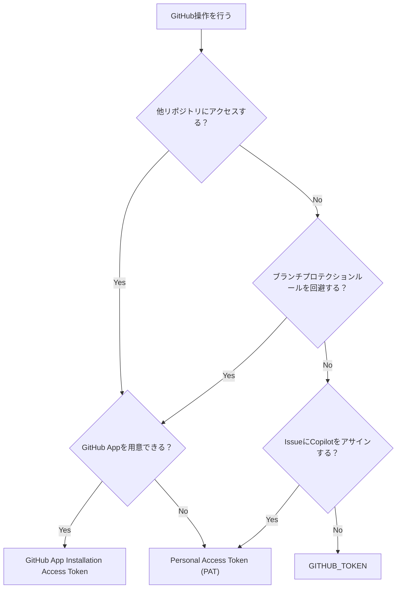

GitHub ActionsでPATを絶対使いたくないマンです。GitHub Appのインストールアクセストークンも使いたくなかったのですが、PATより100倍マシなので最近はこれを使うようにしています。
今回は、GitHub Actionsにおけるアクセストークンを整理し、GitHub Appのインストールアクセストークンを使う方法を説明します。

[:contents]

## PATの問題

GitHub ActionsからGitHub APIを叩くときに使うアクセストークンには、3つの選択肢があります。

- [GITHUB_TOKEN](https://docs.github.com/en/actions/tutorials/authenticate-with-github_token)
  - アクションごとに自動生成されるアクセストークン
- [PAT (Personal Access Token)](https://docs.github.com/en/authentication/keeping-your-account-and-data-secure/managing-your-personal-access-tokens)
  - ユーザー単位で手動生成するアクセストークン。Fine-grainedとClassicの2種類がある
  - `Fine-grained personal access token`
  - `Personal access token (classic)`[^1]
- [GitHub App Installation Access Token](https://docs.github.com/en/apps/creating-github-apps/authenticating-with-a-github-app/authenticating-as-a-github-app-installation)
  - GitHub Appを使って適宜生成するアクセストークン

通常は`GITHUB_TOKEN`を使うのがベストプラクティスですが、これには次の制約があります。

- 他のリポジトリにアクセスできない
- PRやPushに用いたとき、ワークフローをトリガーできない
- ブランチプロティションルールの除外ルールに設定できない
- Issueに`@Copilot`をアサインできない[^2]

上記制約はPATかGitHub App Installation Access Tokenで回避できますが、PATには次のような問題があり扱いに困ります。個人リポジトリならともかく、組織リポジトリでPATを使うのは避けたいところです。

- トークン発行が個人単位[^3]
- ブランチプロテクションの除外ルールが発行者を対象
- トークン発行者として処理が実行される[^4]
- トークンの期限が長く漏洩時のリスクが高い
- トークンの対象リポジトリ・権限が発行/編集時に固定される

## GitHub Appによる解決と使い分け

GitHub AppのインストールアクセストークンはPATの問題を解決します。

| PAT | GitHub App |
| --- | --- |
| トークン発行が個人単位 | トークン発行がGitHub App単位で個人に依存しない |
| ブランチプロテクションの除外ルールが発行者を対象 | ブランチプロテクションの除外ルールにGitHub Appを指定できる |
| トークン発行者として処理が実行される | GitHub Appとして処理が実行できる |
| トークンの期限が長く漏洩時のリスクが高い | トークンがアクションの実行事に発行、アクション終了で無効化される |
| トークンの対象リポジトリ・権限が発行/編集時に固定される | トークンの対象リポジトリ・権限をGitHub App、組織承認の2段階で管理できる |

GitHub Appの用意とアクセストークン発行処理は面倒ですが、PATを使うよりは遥かにマシです。以上を踏まえて、私はGitHub ActionsでGitHub APIを叩くときは次の基準で使い分けています。

- 他リポジトリにアクセスしたいなら`GitHub App`
- ブランチプロテクションルールを回避したいなら`GitHub App`
- IssueにCopilotをアサインしたいなら`PAT`
- 上記に該当しないケースは`GITHUB_TOKEN`
  - `GitHub App`を用意できない場合は`PAT`

フローチャートにすると以下のようになります。

<details><summary>クリックでmermaidを表示</summary>



</details>

[f:id:guitarrapc_tech:20251220043021p:plain:alt=GitHub Actionsにおけるアクセストークンの選択方針フローチャート]<!--image.png-->

それでは、GitHub Appのインストールアクセストークンを使う方法を見てみましょう。

## GitHub Appを使う

GitHub Appを使うには、以下の手順を踏みます。

- GitHub Appを用意する
- GitHub Appをインストールする
- GitHub Appの情報をSecretsに登録する
- GitHub Actionsでインストールアクセストークンを取得する

### GitHub Appを用意する

GitHub Appを用意します。Organization単位で作成する場合は、Organization > Settings > Developer settings > GitHub Apps > `New GitHub App` から作成します。個人で作成する場合は、個人アカウントのSettings > Developer settings > GitHub Apps > `New GitHub App`から作成します。

GitHub Appの名前、説明、Webhook URLなどを設定します。Webhookは不要なのでチェックを外します。
URLはアプリページに表示されるので、localhostやHP、GitHubプロフィールURLなどが安全でしょう。Where can this GitHub App be installed?は、外部に利用させたくないなら`Only on this account`や`Only on this organization`にします。

[f:id:guitarrapc_tech:20251220043030p:plain:alt=設定全般]<!--image-1.png-->

重要なのがPermissionsです。ここでGitHub Appに与える権限を設定します。必要最低限の権限だけ与えつつ、Actionsで必要になる権限は付与しておく必要があります。たとえば、PRの情報を取得したいなら`Pull requests: Read-only`が必要ですが、PRの作成や更新をしたいなら`Pull requests: Read and write`が必要です。また、`git clone`したいなら`Contents: Read-only`、`git push`したいなら`Contents: Read and write`が必要です。

[f:id:guitarrapc_tech:20251220043038p:plain:alt=権限設定]<!--image-2.png-->

### GitHub Appをインストールする

GitHub Appを対象のリポジトリや組織にインストールします。Organization単位でインストールする場合は、Organizationのオーナー権限が必要です。

インストールすると対象のリポジトリを選択できるので、ここで必要なリポジトリに絞り込むとよいでしょう。全部のリポジトリ、あるいはパブリックリポジトリ全部にしていると影響範囲を把握しづらくなります。

[f:id:guitarrapc_tech:20251220043111p:plain:alt=GitHub Actions Appをインストールするとリポジトリアクセスを指定できる]<!--image-8.png-->

インストール後にGitHub Appの権限を変更した場合、組織のオーナーは変更を承認するか選択できます。

インストールしたアプリを削除もできます。

[f:id:guitarrapc_tech:20251220043119p:plain:alt=アプリの削除]<!--image-9.png-->

### GitHub Appの情報をSecretsに登録する

GitHub Appの`App ID`、`Private Key`を、Organization SecretsやリポジトリSecretsに登録します。

以下はダミーのGitHub App情報[^5]ですが、ここにある`App ID`を控えます。

[f:id:guitarrapc_tech:20251220043045p:plain:alt=GitHub Appの概要]<!--image-3.png-->

Private KeyはGitHub App作成時点ではまだありません。GitHub App作成後、下にスクロールするとPrivate Keyがあるので、`Generate a private key`ボタンを押して秘密鍵を生成します。

[f:id:guitarrapc_tech:20251220043051p:plain:alt=Private Keyが空とわかる]<!--image-4.png-->

Private Keyを生成すると自動的にダウンロードされます。秘密鍵の中身をSecretsに登録したらpemファイルは消しましょう。秘密鍵はすぐ消すに限ります。

[f:id:guitarrapc_tech:20251220043057p:plain:alt=Private Keyが生成される]<!--image-5.png-->

[f:id:guitarrapc_tech:20251220043104p:plain:alt=ダウンロードされた秘密鍵の例]<!--image-6.png-->

これらを、GitHub Secretsに登録します。

```
ACTIONS_BOT_APPID: 上のAPP ID
ACTIONS_BOT_PRIVATE_KEY: 上のPrivate Keyの中身
```

### GitHub Actionsでインストールアクセストークンを取得する

GitHub ActionsのワークフローでGitHub Appのインストールアクセストークンを取得しましょう。幸い、GitHub公式のアクション[actions/create-github-app-token](https://github.com/actions/create-github-app-token)があります。以前はサードパーティ製アクションを使う必要がありましたが、公式アクションができたのでこれを使いましょう。

以下はサンプルワークフローです。GitHub Appのトークンを使ったか検証するため、ジョブにはpull requestの権限を与えず、GitHub Appのインストールアクセストークンを取得するときにpull-requestのread権限を与えています。PR一覧が取得できれば成功です。

`actions/create-github-app-token`で取得したトークンは、ステップアウトプット`steps.{id}.outputs.token`で参照できます。例では`actions/create-github-app-token`のidを`app-token`にしているので、`steps.app-token.outputs.token`です。

```yaml
name: github app token
on:
  pull_request:
    branches: [main]
  push:
    branches: [main]
  workflow_dispatch:

jobs:
  app-token:
    permissions:
      contents: read # no pull request permission
    runs-on: ubuntu-24.04
    timeout-minutes: 3
    steps:
      - uses: actions/create-github-app-token@29824e69f54612133e76f7eaac726eef6c875baf # v2.2.1
        id: app-token
        with:
          app-id: ${{ secrets.ACTIONS_BOT_APPID }}
          private-key: ${{ secrets.ACTIONS_BOT_PRIVATE_KEY }}
          permission-pull-requests: read # grant read access to pull requests
      - uses: actions/checkout@08c6903cd8c0fde910a37f88322edcfb5dd907a8 # v5.0.0
        with:
          persist-credentials: false
      - name: List open PRs
        run: gh pr list --state open --limit 5
        env:
          GH_TOKEN: ${{ steps.app-token.outputs.token }} # GitHub App token permission to read pull requests
          GH_REPO: ${{ github.repository }}
```

ワークフローを実行すると、GitHub Appのインストールアクセストークンが発行され、`gh`コマンドでPR一覧を取得できます。

[f:id:guitarrapc_tech:20251220043127p:plain:alt=ワークフローの実行結果]<!--image-7.png-->

## TIPS: create-GitHub-app-tokenのコツ

GitHub Appのインストールアクセストークンを取得するコツです。

- permissions-`<resource>`で必要な権限だけ与える

この時取得できる権限は、GitHub Appへ与えられた権限に限られます。Appに与えられていない権限は取得できません。

```yaml
# pushが必要ならpermission-contents: writeを与える
- uses: actions/create-github-app-token@v2
  id: app-token
  with:
    app-id: ${{ secrets.ACTIONS_BOT_APPID }}
    private-key: ${{ secrets.ACTIONS_BOT_PRIVATE_KEY }}
    permission-contents: write
```

- 他のリポジトリにアクセスする場合は`owner`と`repositories`を指定する

```yaml
# ownerとrepositoriesを指定して他リポジトリにアクセスする
- uses: actions/create-github-app-token@v2
  id: app-token
  with:
    app-id: ${{ vars.APP_ID }}
    private-key: ${{ secrets.PRIVATE_KEY }}
    owner: ${{ github.repository_owner }}
    repositories: |
      repo1
      repo2
```

## まとめ

GitHub Appを用いると、ごく限定的なケースを除いてPATを排除できます。たとえマシンユーザーがあったとしても、PATよりはGitHub Appのほうが細かく管理できるので好ましいでしょう。

まずは`GITHUB_TOKEN`でできるか検討して、どうしても無理な場合にGitHub Appを用意するのがおすすめです。
やってみると簡単です。ただ、GitHub App用のアクセストークンを取得するのに1ステップ増えるのは度々面倒に感じます。PATのリスクを軽減できている、と考えて我慢です。

## 参考

- [actions/create-github-app-token | GitHub](https://github.com/actions/create-github-app-token)
- [Making authenticated API requests with a GitHub App in a GitHub Actions workflow - GitHub Docs](https://docs.github.com/en/apps/creating-github-apps/authenticating-with-a-github-app/making-authenticated-api-requests-with-a-github-app-in-a-github-actions-workflow)
- [Managing your personal access tokens - GitHub Docs](https://docs.github.com/en/authentication/keeping-your-account-and-data-secure/managing-your-personal-access-tokens)
- [Use GITHUB_TOKEN for authentication in workflows - GitHub Docs](https://docs.github.com/en/actions/tutorials/authenticate-with-github_token)
- [Authenticating as a GitHub App installation - GitHub Docs](https://docs.github.com/en/apps/creating-github-apps/authenticating-with-a-github-app/authenticating-as-a-github-app-installation)


[^1]: コラボレーターとしてリポジトリにアクセスする場合は、`Fine-grained access token`ではなく`Personal access token (classic)`を使う必要がある
[^2]: CopilotのアサインにはCopilotライセンスが必要なため、ライセンスを付与したユーザーのPATが必要です。
[^3]: 組織単位で発行ができず、個人が退職した場合にトークン管理が困難になる。その割にマシンユーザーも非推奨
[^4]: ghコマンドでPRを作ると、トークン発行者がPR作成者になるなど
[^5]: すでに消しているので使おうとしても無駄です。
