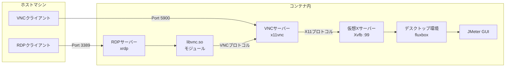

[JMeter](https://jmeter.apache.org/index.html)はJavaで動作する負荷試験ツールです。その特徴はGUIでシナリオを作成できることです。しかし、JMeter GUIを動作させるためにはJava環境が必要であり、セットアップが面倒ですしインストールも避けたいものがあります。

これを解決するため、Dockerコンテナ上でJMeter GUIを動作させるコンテナイメージ[guitarrapc/docker-jmeter-gui](https://github.com/guitarrapc/docker-jmeter-gui)を公開しています。このコンテナイメージを作成する過程で、コンテナのGUIをホストから操作する方法をいくつか試してみました。

今回はGUI込みのコンテナにホストから接続する方法を紹介します。次回はブラウザ経由で接続する方法を紹介します。

[:contents]

## はじめに

コンテナのGUIをホストから操作する方法はいくつかあります。

| 方法 | クロスプラットフォーム | GPU不要 | 概要 |
| --- | --- | --- | --- |
| X11転送 | X | O | ホストにXサーバーをインストールし、コンテナからX11プロトコルで接続する[^1] |
| VNC | O | O | コンテナ内にVNCサーバーをインストールし、ホストからVNCクライアントで接続する |
| RDP | O | O | コンテナ内にRDPサーバーをインストールし、ホストからRDPクライアントで接続する |
| ブラウザ経由 | O| O | コンテナのVNCをWebSocket化して差分ビットマップを送信、ホストからブラウザで接続する |
| WebRTC経由 | O | X | コンテナをWebRTC化して動画ストリーム配信、ホストからブラウザで接続する |

コンテナでどう構成するにしても、ホストからなるべく使いやすいのは絶対条件です。このため、X11転送は候補になりえません。VNCやRDPはクライアントソフトが必要ですが、Windows(RDP)やmacOS(VNC)には標準でクライアントが付属しているため、比較的使いやすいです。ブラウザ経由・WebRTC経由はブラウザさえあればよいため、最も使いやすい方法です。

WebRTCはGPUがないと体験が悪く、GPUがない環境でもコンテナは使われえるのでWebRTCは除外します。

このため、クロスプラットフォームでの利用を考えると、VNC/RDPやブラウザアクセスできるようにするのがいい感じです。

すべてを書いていると記事が長くなるので、この記事ではVNC/RDPで接続する方法を紹介します。

## コンテナにVNC/RDPでアクセスできるようにする

まず、ホストマシンからRDP・VNCクライアントで接続する様子を示します。ホストマシンからRDPで接続するとX Serverログイン画面が表示されるのでパスワードを入力します。ホストマシンからVNCで接続するとVNCパスワード入力画面が表示されます。

パスワードを`root`に固定しています。今回はローカルコンテナであるという割り切りです。ご了承ください。

| 状態 | RDPクライアント | VNCクライアント |
| ---| --- | --- |
| 接続画面 | [f:id:guitarrapc_tech:20260112052615p:plain:alt=WindowsからRemote Desktop Connectionで接続する] <!--image.png--> | [f:id:guitarrapc_tech:20260112052622p:plain:alt=VNCで接続する] |
| ログイン画面 | [f:id:guitarrapc_tech:20260112052629p:plain:alt=XServerログイン画面] <!--image-1.png--> | [f:id:guitarrapc_tech:20260112052637p:plain:alt=VNCパスワードの入力] <!--image-3.png--> |

接続に成功するとJMeter GUIが表示されます。

[f:id:guitarrapc_tech:20260112052644p:plain:alt=JMeterの画面]<!--image-4.png-->

## コンテナ構成

VNC/RDPでアクセスできるようにするには、コンテナ内にデスクトップ環境とVNCサーバーまたはRDPサーバーをインストールします。ファイル配置は次の通りです。

```shell
$ tree
.
├── Dockerfile
└── xrdp.ini
```

以下はdocker-jmeter-guiで構成していたDockerfile[^2]です。

```dockerfile
FROM ubuntu:24.04

LABEL version="5.6.3"
LABEL description="An Ubuntu based docker image contains Apache JMeter GUI to configure scenario. Enable connect container with VNC and RDP."
LABEL maintainer="3856350+guitarrapc@users.noreply.github.com"

ENV DEBIAN_FRONTEND=noninteractive
ENV JMETER_VERSION="5.6.3"
ENV JMETER_HOME=/opt/apache-jmeter-${JMETER_VERSION}
ENV JMETER_BIN=${JMETER_HOME}/bin
ENV JMETER_PLUGINS_MANAGER_VERSION="1.10"
ENV PATH=${JMETER_BIN}:$PATH
ENV DISPLAY=":99" \
    RESOLUTION="1366x768x24" \
    PASS="root"

# Install minimal packages
RUN apt-get update \
    && apt-get install -y --no-install-recommends \
    wget ca-certificates \
    xvfb x11vnc \
    xrdp xorgxrdp \
    fluxbox xterm \
    openjdk-11-jre \
    && apt-get clean \
    && rm -rf /var/lib/apt/lists/*

# Download JMeter
RUN wget https://archive.apache.org/dist/jmeter/binaries/apache-jmeter-${JMETER_VERSION}.tgz -O /tmp/jmeter.tgz \
    && tar -xzf /tmp/jmeter.tgz -C /opt \
    && rm /tmp/jmeter.tgz \
    && rm -rf ${JMETER_HOME}/docs ${JMETER_HOME}/printable_docs
RUN wget https://repo1.maven.org/maven2/kg/apc/jmeter-plugins-manager/${JMETER_PLUGINS_MANAGER_VERSION}/jmeter-plugins-manager-${JMETER_PLUGINS_MANAGER_VERSION}.jar -O ${JMETER_HOME}/lib/ext/jmeter-plugins-manager.jar

# Configure VNC
RUN x11vnc -storepasswd ${PASS} /etc/x11vnc.pass

# Set root password for RDP login
RUN echo "root:${PASS}" | chpasswd

# Configure RDP
COPY xrdp.ini /etc/xrdp/xrdp.ini

EXPOSE 5900 3389

WORKDIR /root

CMD ["bash", "-c", "rm -f /tmp/.X99-lock /var/run/xrdp.pid /var/run/xrdp-sesman.pid \
    && /usr/bin/Xvfb ${DISPLAY} -screen 0 ${RESOLUTION} -ac +extension GLX +render -noreset & \
    sleep 3 \
    && fluxbox & \
    sleep 2 \
    && jmeter -Jjmeter.laf=CrossPlatform & \
    sleep 3 \
    && x11vnc -xkb -noxrecord -noxfixes -noxdamage -display ${DISPLAY} -forever -rfbport 5900 -rfbauth /etc/x11vnc.pass -shared & \
    sleep 2 \
    && xrdp-sesman & \
    sleep 1 \
    && xrdp --nodaemon"]
```

xrdp.iniは以下の通りです。

```ini
[Globals]
bitmap_cache=true
bitmap_compression=true
autorun=jmeter
port=3389

[jmeter]
name=jmeter
lib=libvnc.so
ip=127.0.0.1
port=5900
username=na
password=ask
```

以下のコマンドでdockerイメージをビルドします。イメージサイズは約1.1GBです。Docker Hubでは300MB程度です。JavaランタイムとJMeter本体が大きいことに加え、GUIライブラリも入れているのである程度のサイズになるのは仕方ないです。

```bash
$ docker build -t docker-jmeter-gui .
$ docker image ls
docker image ls
REPOSITORY         TAG       IMAGE ID       CREATED              SIZE
docker-jmeter-gui  latest    cd1a471f7207   About a minute ago   1.13GB
ubuntu             24.04     c35e29c94501   2 months ago         117MB
```

以下のコマンドでコンテナを起動します。

```shell
docker run -it --rm -v ${PWD}/scenarios:/root/jmeter/ -p 5900:5900 -p 3389:3389 docker-jmeter-gui
```

> 注意: この例では開発・検証用途を想定しており、パスワードをrootに固定しています。本番環境や公開ネットワークでの使用は避けてください。

## コンテナへの接続フロー

ホストからコンテナへの接続フローを示します。

本Dockerfileでは、RDPクライアントから接続してもVNCで接続したときと同じJMeter GUIを表示させたいため、xrdp.iniで`libvnc.so`モジュールを利用しています。[libvnc.so](https://github.com/LibVNC/libvncserver)を指定することで、RDPクライアントから接続してもx11vncサーバーが提供するXvfbの仮想ディスプレイにアクセスします。libvnc.soモジュールを使わずにxorgxrdpで直接Xvfbに接続すると、RDP接続時に別のセッションが作成され、VNC接続時とは異なるデスクトップ環境が表示されます。[^3]

<details><summary>クリックでコンテナのVNC/RDP接続フローのMermaidを開く</summary>



</details>

[f:id:guitarrapc_tech:20260112213710p:plain:alt=VNC/RDP接続フロー]<!--image-5.png-->

## パッケージ一覧

Dockerfileで使用しているパッケージ一覧を説明します。これらを使い、GUI環境を持たないDockerコンテナ内でJMeterのGUIを実行し、外部から接続を受け付けています。

**[xvfb](https://www.x.org/archive/X11R7.7/doc/man/man1/Xvfb.1.xhtml) (X Virtual FrameBuffer)**

仮想ディスプレイを提供するXサーバーです。物理的なモニターがなくてもGUIアプリケーション(JMeter GUI)を動作させます。`DISPLAY=:99`で仮想ディスプレイを作成していますが、他の番号でも構いません。

**[x11vnc](https://github.com/LibVNC/x11vnc)**

Xサーバーの画面を外部に公開する、VNCサーバーです。VNCクライアントからの接続を受け付け、Xvfbの仮想ディスプレイをVNCプロトコルで提供します。
ポート5900で待ち受け、パスワード認証を設定しています。

**[xrdp](https://github.com/neutrinolabs/xrdp) + [xorgxrdp](https://github.com/neutrinolabs/xorgxrdp)**

Xサーバーの画面を外部に公開する、RDP(Remote Desktop Protocol)サーバーです。RDPクライアントからの接続を受け付け、Xvfbの仮想ディスプレイをRDPプロトコルで提供します。xorgxrdpはXサーバーとxrdpを接続するドライバです。

ポート3389で待ち受け、ログイン時にユーザー認証します。

**[fluxbox](https://fluxbox.org/)**

軽量なウィンドウマネージャーです。JMeterのウィンドウを管理・表示するために必要です。これがないとGUIウィンドウが正しく表示されません。

ウィンドウマネージャーはxfce4、lxde、mateなどがあり、好きなものを選択できます。以前は[xfce4](https://www.xfce.org/)を使っていましたが、fluxboxのほうが軽量なので変更しました。

**[xterm](https://invisible-island.net/xterm/)**

端末エミュレータです。RDPやVNC接続時にコマンドラインを使えるようにします。

端末エミュレータは他にもgnome-terminal、lxterminal、xfce4-terminalなどがあります。以前は、[xfce4-terminal](https://gitlab.xfce.org/apps/xfce4-terminal)を使っていましたが、fluxboxに合わせて軽量なxtermに変更しました。

## まとめ

コンテナのGUIをホストから操作する方法として、VNC/RDPで接続する方法を紹介しました。この方法には、クロスプラットフォームで動作する、GPU不要である、既存のVNC/RDPクライアントをそのまま使えるといったメリットがあります。一方、VNCやRDPが必要になるのが明確な欠点です。

しばらく公開して自分でも使っていて感じるのですが、2026年現在、ブラウザ経由でないアクセスは使い勝手がいまいちです。ブラウザ経由であれば、ホストに特別なクライアントソフトをインストールする必要がなく、接続も簡単です。現代においてほとんどの操作はブラウザで完結するため、ブラウザ経由での接続を提供するほうがいいなぁというのが正直な感想です。

ということで、次回はブラウザ経由で接続する方法を紹介します。

## 参考

- [guitarrapc/docker-jmeter-gui | GitHub](https://github.com/guitarrapc/docker-jmeter-gui)
- [LibVNC/x11vnc | GitHub](https://github.com/LibVNC/x11vnc)
- [LibVNC/libvncserver | GitHub](https://github.com/LibVNC/libvncserver)
- [neutrinolabs/xrdp | GitHub](https://github.com/neutrinolabs/xrdp)
- [neutrinolabs/xorgxrdp | GitHub](https://github.com/neutrinolabs/xorgxrdp)
- [XVFB](https://www.x.org/archive/X11R7.7/doc/man/man1/Xvfb.1.xhtml)
- [fluxbox](https://fluxbox.org/)
- [XTERM – Terminal emulator for the X Window System](https://invisible-island.net/xterm/)
- [Xfce Desktop Environment](https://www.xfce.org/?lang=en)
- [xfce4-terminal | GitLab](https://gitlab.xfce.org/apps/xfce4-terminal)


[^1]: LinuxホストであればXサーバーは構成しやすいですが、WindowsやMac OSではXサーバーのセットアップが必要です。
[^2]: 現在はブラウザベースに移行しているため、構成が変わっています。
[^3]: 5年前はAlpineで構成していたのですが、現在のAlpine Linuxのxrdpではlibvnc.soモジュールがうまく動作しなかったため、Ubuntuベースに変更しました。
